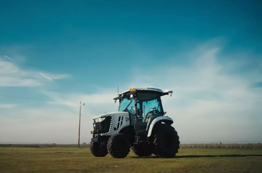
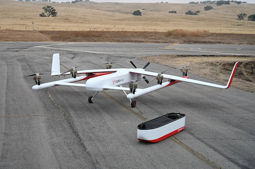
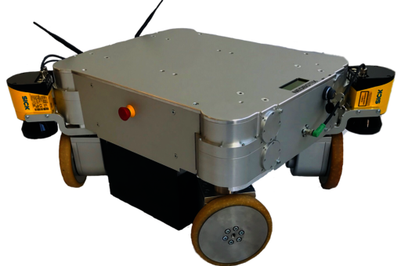

.. _robots:

Robots Using
############

It's always helpful (and fun!) to have a list of robots using or ship with our work.
Below is a very early list of robots we have encountered using our software as examples.

Click on the images below for a link to the drivers or navigation configurations.

..
  To add robot to the table, the dimensions MUST be either 512x340 or 340x512

+------------------------+------------------------+------------------------+
|          |dex|         +          |poly|        +          |ses|         |
+------------------------+------------------------+------------------------+
|          |ang|         +          |fire|        +          |mpo_700|     |
+------------------------+------------------------+------------------------+
|         |rosie|        +         |karl|         +           |birds|      |
+------------------------+------------------------+------------------------+
|           |pxl|        +         |brisa|        +        |tri|           |
+------------------------+------------------------+------------------------+
|         |wyca|         +         |elroy|        +           |data|       |
+------------------------+------------------------+------------------------+
|         |ubr1|         +         |Tiago|        +       |tb2|            |
+------------------------+------------------------+------------------------+
|         |rover|        +         |yunji|        +           |kar2|       |
+------------------------+------------------------+------------------------+
|         |tb4|          +         |tb3|          +           |RB1|        |
+------------------------+------------------------+------------------------+

.. |yunji| image:: images/yunji.png
    :width: 100%
    :align: middle
    :alt: Yunji Robot
    :target: https://en.yunjichina.com.cn/a/53.html

