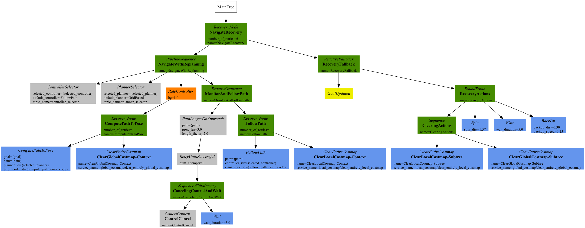

Navigate To Pose and Pause Near Goal-Obstacle
#############################################

This behavior tree is a soft extension to the :ref:`behavior_tree_nav_to_pose`. 
Apart from the functionalities of :ref:`behavior_tree_nav_to_pose`, this behavior tree allows the robot to efficiently handle an obstacle (e.g. forklift, person, or other temporary obstacle) close to the goal by pausing the robot's navigation and wait for a user specified time to check if the obstacle has cleared.
If the obstacle has moved during the waiting time, the robot will continue to the goal taking the shorter path. If the obstacle has not moved during the waiting time or the waiting time expires, then the robot will use the longer path around to reach the final goal location.
Ultimately, for a given task, this behavior tree aids in solving the problem of long cycle time, which is caused because of the long path generated due to the temporary obstacles present close to the goal location. 

The behavior tree is depicted in the image below. 
From the image, it can be noted that, there is an additional branch known as ``MonitorAndFollowPath``, this branch is created with an intention for the users to perform any kind of monitoring behavior that their robot should exhibit. 
In this particular BT, the monitoring branch is exclusively utilized by ``PathLongerOnApproach`` BT node for checking if the global planner has decided to plan a significantly longer path for the robot on approaching the user-specified goal proximity. 
If there is no significantly longer path, the monitor node goes into the ``FollowPath`` recovery node, which then generates the necessary control commands. 

Once there is a significantly longer path, the child node for the ``PathLongerOnApproach`` node ticks.
The child node is a sequence node, that cancels the controller server employing the ``CancelControl`` node, followed by the ``Wait`` node, that enables the robot to wait for the given user specified time. 
Here we need to note that, the ``MonitorAndFollowPath`` is a ``ReactiveSequence`` node, therefore the ``PathLongerOnApproach`` node needs to return SUCCESS, before the ``FollowPath`` node can be ticked once again. 

In the below GIF, it can be seen that, the robot is approaching the goal location, but it found an obstacle in the goal proximity, because of which the the global planner, plans a longer path around. 
This is the point where the ``PathLongerOnApproach`` ticks and ticks it's children, consequently cancelling the ``controller_server`` and wait to see if the obstacle clears up. 
In the below scenario, the obstacles does not clear, causing the robot to take the longer path. 

.. image:: ../../migration/images/nav2_patience_near_goal_and_go_around.gif

Alternatively if the obstacles are cleared, then there is a shorter path generated by the global planner. 
Now, the ``PathLongerOnApproach`` returns SUCCESS, that cause the ``FollowPath`` to continue with the robot navigation.

.. image:: ../../migration/images/nav2_patience_near_goal_and_clear_obstacle.gif

Apart from the above scenarios, we also need to note that, the robot will take the longer path to the goal location, if the obstacle does not clears up in the given user-specific wait time. 

As a conclusion, this particular BT would serve, both as an example and ready-to-use BT for an organizational specific application, who wishes to optimize their process cycle time.

.. code-block:: xml

    <root main_tree_to_execute="MainTree">
      <BehaviorTree ID="MainTree">
        <RecoveryNode number_of_retries="6" name="NavigateRecovery">
          <PipelineSequence name="NavigateWithReplanning">
            <RateController hz="1.0">
              <RecoveryNode number_of_retries="1" name="ComputePathToPose">
                <ComputePathToPose goal="{goal}" path="{path}" planner_id="GridBased"/>
                <ClearEntireCostmap name="ClearGlobalCostmap-Context" service_name="global_costmap/clear_entirely_global_costmap"/>
              </RecoveryNode>
            </RateController>
            <ReactiveSequence name="MonitorAndFollowPath">
              <PathLongerOnApproach path="{path}" prox_len="3.0" length_factor="2.0">
                <RetryUntilSuccessful num_attempts="1">
                  <SequenceStar name="CancelingControlAndWait">
                    <CancelControl name="ControlCancel"/>
                    <Wait wait_duration="5"/>
                  </SequenceStar>
                </RetryUntilSuccessful>
              </PathLongerOnApproach>
              <RecoveryNode number_of_retries="1" name="FollowPath">
                <FollowPath path="{path}" controller_id="FollowPath"/>
                <ClearEntireCostmap name="ClearLocalCostmap-Context" service_name="local_costmap/clear_entirely_local_costmap"/>
              </RecoveryNode>
            </ReactiveSequence>
          </PipelineSequence>
          <ReactiveFallback name="RecoveryFallback">
            <GoalUpdated/>
            <RoundRobin name="RecoveryActions">
              <Sequence name="ClearingActions">
                <ClearEntireCostmap name="ClearLocalCostmap-Subtree" service_name="local_costmap/clear_entirely_local_costmap"/>
                <ClearEntireCostmap name="ClearGlobalCostmap-Subtree" service_name="global_costmap/clear_entirely_global_costmap"/>
              </Sequence>
              <Spin spin_dist="1.57"/>
              <Wait wait_duration="5"/>
              <BackUp backup_dist="0.30" backup_speed="0.05"/>
            </RoundRobin>
          </ReactiveFallback>
        </RecoveryNode>
      </BehaviorTree>
    </root>

A complete demo of this BT can be seen in the video below:

.. raw:: html

    <iframe width="560" height="315" src="https://www.youtube-nocookie.com/embed/7AkZiH2Cf_I" title="YouTube video player" frameborder="0" allow="accelerometer; autoplay; clipboard-write; encrypted-media; gyroscope; picture-in-picture" allowfullscreen></iframe>
