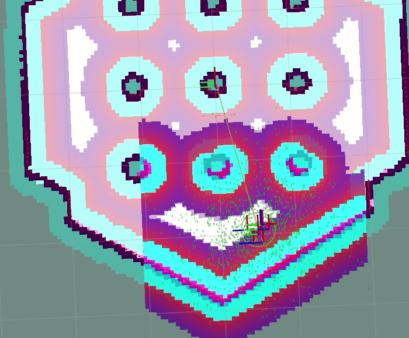

.. _behavior_tree_odometry_calibration:

Odometry Calibration
####################

This behavior tree drives the robot in a CCW square three times using the DriveOnHeading and Spin behaviors.
The robot will traverse each side of the square at 0.2 (m/s) for 2 meters before making a 90 degree turn.
This is a primitive experiment to measure odometric accuracy and can be used and repeated to tune parameters related to odometry to improve quality.

.. tabs::

  .. group-tab:: Lyrical and newer

    .. code-block:: xml

      <root BTCPP_format="4" main_tree_to_execute="OdometryCalibration">
        <BehaviorTree ID="OdometryCalibration">
          <Repeat num_cycles="3">
            <Sequence name="Drive in a square">
              <DriveOnHeading dist_to_travel="2.0" speed="0.2" time_allowance="12" error_code_id="{drive_on_heading_error_code}" error_msg="{drive_on_heading_error_msg}"/>
              <Spin spin_dist="1.570796" is_recovery="false" error_code_id="{spin_error_code}" error_msg="{spin_error_msg}"/>
              <DriveOnHeading dist_to_travel="2.0" speed="0.2" time_allowance="12" error_code_id="{drive_on_heading_error_code}" error_msg="{drive_on_heading_error_msg}"/>
              <Spin spin_dist="1.570796" is_recovery="false" error_code_id="{spin_error_code}" error_msg="{spin_error_msg}"/>
              <DriveOnHeading dist_to_travel="2.0" speed="0.2" time_allowance="12" error_code_id="{drive_on_heading_error_code}" error_msg="{drive_on_heading_error_msg}"/>
              <Spin spin_dist="1.570796" is_recovery="false" error_code_id="{spin_error_code}" error_msg="{spin_error_msg}"/>
              <DriveOnHeading dist_to_travel="2.0" speed="0.2" time_allowance="12" error_code_id="{drive_on_heading_error_code}" error_msg="{drive_on_heading_error_msg}"/>
              <Spin spin_dist="1.570796" is_recovery="false" error_code_id="{spin_error_code}" error_msg="{spin_error_msg}"/>
            </Sequence>
          </Repeat>
        </BehaviorTree>
      </root>

  .. group-tab:: Kilted and older

    .. code-block:: xml

      <root BTCPP_format="4" main_tree_to_execute="MainTree">
        <BehaviorTree ID="MainTree">
          <Repeat num_cycles="3">
            <Sequence name="Drive in a square">
              <DriveOnHeading dist_to_travel="2.0" speed="0.2" time_allowance="12" error_code_id="{drive_on_heading_error_code}" error_msg="{drive_on_heading_error_msg}"/>
              <Spin spin_dist="1.570796" is_recovery="false" error_code_id="{spin_error_code}" error_msg="{spin_error_msg}"/>
              <DriveOnHeading dist_to_travel="2.0" speed="0.2" time_allowance="12" error_code_id="{drive_on_heading_error_code}" error_msg="{drive_on_heading_error_msg}"/>
              <Spin spin_dist="1.570796" is_recovery="false" error_code_id="{spin_error_code}" error_msg="{spin_error_msg}"/>
              <DriveOnHeading dist_to_travel="2.0" speed="0.2" time_allowance="12" error_code_id="{drive_on_heading_error_code}" error_msg="{drive_on_heading_error_msg}"/>
              <Spin spin_dist="1.570796" is_recovery="false" error_code_id="{spin_error_code}" error_msg="{spin_error_msg}"/>
              <DriveOnHeading dist_to_travel="2.0" speed="0.2" time_allowance="12" error_code_id="{drive_on_heading_error_code}" error_msg="{drive_on_heading_error_msg}"/>
              <Spin spin_dist="1.570796" is_recovery="false" error_code_id="{spin_error_code}" error_msg="{spin_error_msg}"/>
            </Sequence>
          </Repeat>
        </BehaviorTree>
      </root>
