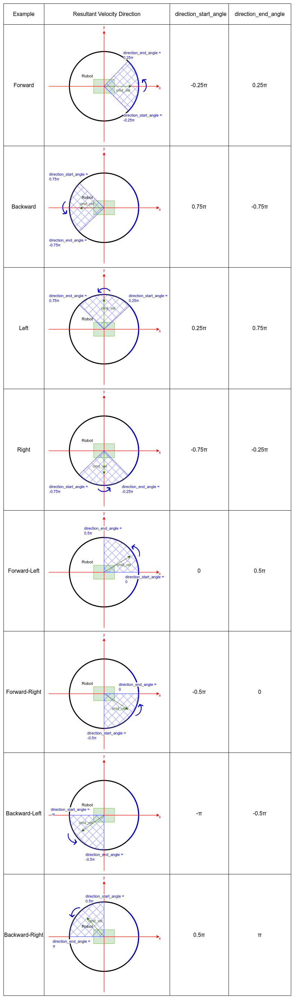

.. _configuring_collision_monitor_node:

Collision Monitor Node
######################

The Collision Monitor is a node providing an additional level of robot safety.
It performs several collision avoidance related tasks using incoming data from the sensors, bypassing the costmap and trajectory planners, to monitor for and prevent potential collisions at the emergency-stop level.

This is analogous to safety sensor and hardware features; take in laser scans from a real-time certified safety scanner, detect if there is to be an imminent collision in a configurable bounding box, and either emergency-stop the certified robot controller or slow the robot to avoid such collision.
However, this node is done at the CPU level with any form of sensor.
As such, this does not provide hard real-time safety certifications, but uses the same types of techniques with the same types of data for users that do not have safety-rated laser sensors, safety-rated controllers, or wish to use any type of data input (e.g. pointclouds from depth or stereo or range sensors).

This is a useful and integral part of large heavy industrial robots, or robots moving with high velocities, around people or other dynamic agents (e.g. other robots) as a safety mechanism for high-response emergency stopping.
The costmaps / trajectory planners will handle most situations, but this is to handle obstacles that virtually appear out of no where (from the robot's perspective) or approach the robot at such high speed it needs to immediately stop to prevent collision.

See the package's ``README`` for more complete information. For more information how to bring-up your own Collision Monitor node, please refer to the :ref:`collision_monitor_tutorial` tutorial.

Also, the practical demonstration of Collision Monitor abilities presented at 6th ROS Developers Day 2023, could be found below:

.. raw:: html

    <h1 align="center">
      

        

          <iframe width="700" height="394" src="https://www.youtube.com/embed/bWliK0PC5Ms?autoplay=1&mute=1" frameborder="1" allowfullscreen></iframe>
        

      

    </h1>

Features
********

The Collision Monitor uses polygons relative the robot's base frame origin to define "zones".
Data that fall into these zones trigger an operation depending on the model being used.
A given instance of the Collision Monitor can have many zones with different models at the same time.
When multiple zones trigger at once, the most aggressive one is used (e.g. stop > slow 50% > slow 10%).

The following models of safety behaviors are employed by Collision Monitor:

- **Stop model**: Define a zone and a point threshold. If ``min_points`` or more obstacle points appear inside this area, stop the robot until the obstacles will disappear.
- **Slowdown model**: Define a zone around the robot and slow the maximum speed for a ``slowdown_ratio``, if ``min_points`` or more points will appear inside the area.
- **Limit model**: Define a zone around the robot and restricts the maximum linear and angular velocities to ``linear_limit`` and ``angular_limit`` values accordingly, if ``min_points`` or more points will appear inside the area.
- **Approach model**: Using the current robot speed, estimate the time to collision to sensor data. If the time is less than ``time_before_collision`` seconds (0.5, 2, 5, etc...), the robot will slow such that it is now at least ``time_before_collision`` seconds to collision. The effect here would be to keep the robot always ``time_before_collision`` seconds from any collision.

The zones around the robot can take the following shapes:

- Arbitrary user-defined polygon relative to the robot base frame, which can be static in a configuration file or dynamically changing via a topic interface.
- Robot footprint polygon, which is used in the approach behavior model only. Will use the static user-defined polygon or the footprint topic to allow it to be dynamically adjusted over time.
- Circle: is made for the best performance and could be used in the cases where the zone or robot footprint could be approximated by round shape.
- VelocityPolygon: allow switching of polygons based on the command velocity. This is useful for robots to set different safety zones based on their velocity (e.g. a robot that has a larger safety zone when moving at 1.0 m/s than when moving at 0.5 m/s). 

All shapes (``Polygon``, ``Circle`` and ``VelocityPolygon``) are derived from base ``Polygon`` class, so without loss of generality they would be called as "polygons".
Subscribed footprint is also having the same properties as other polygons, but it is being obtained a footprint topic for the Approach Model.

The data may be obtained from different data sources:

- Laser scanners (``sensor_msgs::msg::LaserScan`` messages)
- PointClouds (``sensor_msgs::msg::PointCloud2`` messages)
- IR/Sonars (``sensor_msgs::msg::Range`` messages)

Parameters
**********

:base_frame_id:

  ============== =============================
  Type           Default
  -------------- -----------------------------
  string         "base_footprint"
  ============== =============================

  Description:
    Robot base frame.

:odom_frame_id:

  ============== =============================
  Type           Default
  -------------- -----------------------------
  string         "odom"
  ============== =============================

  Description:
    Which frame to use for odometry.

:cmd_vel_in_topic:

  ============== =============================
  Type           Default
  -------------- -----------------------------
  string         "cmd_vel_smoothed"
  ============== =============================

  Description:
    Input ``cmd_vel`` topic with desired robot velocity.
    Please note, pre-``Jazzy`` this was set to ``cmd_vel_raw`` by default.

:cmd_vel_out_topic:

  ============== =============================
  Type           Default
  -------------- -----------------------------
  string         "cmd_vel"
  ============== =============================

  Description:
    Output ``cmd_vel`` topic with output produced by Collision Monitor velocities.

:state_topic:

  ============== =============================
  Type           Default
  -------------- -----------------------------
  string         ""
  ============== =============================

  Description:
    Output the currently activated polygon action type and name. Optional parameter. No publisher will be created if it is unspecified.

:transform_tolerance:

  ============== =============================
  Type           Default
  -------------- -----------------------------
  double         0.1
  ============== =============================

  Description
    Time with which to post-date the transform that is published, to indicate that this transform is valid into the future.

:source_timeout:

  ============== =============================
  Type           Default
  -------------- -----------------------------
  double         2.0
  ============== =============================

  Description:
    Maximum time interval in which source data is considered as valid. If no new data is received within this interval, the robot will be stopped. Setting ``source_timeout: 0.0`` disables this blocking mechanism. This parameter can be overridden per observation source.

:base_shift_correction:

  ============== =============================
  Type           Default
  -------------- -----------------------------
  bool           True
  ============== =============================

  Description:
    Whether to correct source data towards to base frame movement, considering the difference between current time and latest source time. If enabled, produces more accurate sources positioning in the robot base frame, at the cost of slower performance. This will cause average delays for ``~1/(2*odom_rate)`` per each ``cmd_vel`` calculation cycle. However, disabling this option for better performance is not recommended for the fast moving robots, where during the typical rate of data sources, robot could move unacceptably far. Thus reasonable odometry rates are recommended (~100 hz).

:stop_pub_timeout:

  ============== =============================
  Type           Default
  -------------- -----------------------------
  double         1.0
  ============== =============================

  Description:
    Timeout, after which zero-velocity ceases to be published. It could be used for other overrode systems outside Nav2 are trying to bring the robot out of a state close to a collision, or to allow a standing robot to go into sleep mode.

:polygons:

  ============== =============================
  Type           Default
  -------------- -----------------------------
  vector<string> N/A
  ============== =============================

  Description:
    List of zones (stop/slowdown/limit bounding boxes, footprint, approach circle, etc...). Causes an error, if not specialized.

:observation_sources:

  ============== =============================
  Type           Default
  -------------- -----------------------------
  vector<string> N/A
  ============== =============================

  Description:
    List of data sources (laser scanners, pointclouds, etc...). Causes an error, if not specialized.

:use_realtime_priority:

  ============== =======
  Type           Default
  -------------- -------
  bool           false   
  ============== =======

  Description
    Adds soft real-time prioritization to the controller server to better ensure resources to time sensitive portions of the codebase. This will set the controller's execution thread to a higher priority than the rest of the system (``90``) to meet scheduling deadlines to have less missed loop rates. To use this feature, you use set the following inside of ``/etc/security/limits.conf`` to give userspace access to elevated prioritization permissions: ``<username> soft rtprio 99 <username> hard rtprio 99``

:enable_stamped_cmd_vel:

  ============== =============================
  Type           Default
  -------------- -----------------------------
  bool           false
  ============== =============================

  Description
    Whether to use geometry_msgs::msg::Twist or geometry_msgs::msg::TwistStamped velocity data.
    True uses TwistStamped, false uses Twist.

Polygons parameters
===================

``<polygon name>`` is the corresponding polygon name ID selected for this type.

:``<polygon_name>``.type:

  ============== =============================
  Type           Default
  -------------- -----------------------------
  string         N/A
  ============== =============================

  Description:
    Type of polygon shape. Available values are ``polygon``, ``circle``. Causes an error, if not specialized.

:``<polygon_name>``.points:

  ============== =============================
  Type           Default
  -------------- -----------------------------
  string         N/A
  ============== =============================

  Description:
    Polygon vertices, listed in ``"[[p1.x, p1.y], [p2.x, p2.y], [p3.x, p3.y], ...]"`` format (e.g. ``"[[0.5, 0.25], [0.5, -0.25], [0.0, -0.25], [0.0, 0.25]]"`` for the square in the front). Used for ``polygon`` type. Minimum 3 points for a triangle polygon. If not specified, the collision monitor will use dynamic polygon subscription to ``polygon_sub_topic`` for points in the ``stop``/``slowdown``/``limit`` action types, or footprint subscriber to ``footprint_topic`` for ``approach`` action type.

:``<polygon_name>``.polygon_sub_topic:

  ============== =============================
  Type           Default
  -------------- -----------------------------
  string         N/A
  ============== =============================

  Description:
    For ``polygon`` type, topic to listen the polygon points from. For ``circle`` type, topic to listen the circle radius from. Applicable for ``stop``/``slowdown``/``limit`` action types. Causes an error if not specified **and** static polygon geometry (using parameter ``points`` for ``polygon`` type or ``radius`` for ``circle`` type) is also not specified. If both static polygon geometry and ``polygon_sub_topic`` are specified, the static parameter takes priority.

:``<polygon_name>``.footprint_topic:

  ============== ===================================
  Type           Default
  -------------- -----------------------------------
  string         "local_costmap/published_footprint"
  ============== ===================================

  Description:
    Topic to listen the robot footprint from. Applicable only for ``polygon`` type and ``approach`` action type. If both ``points`` and ``footprint_topic`` are specified, the static ``points`` takes priority.

:``<polygon_name>``.polygon_subscribe_transient_local:

  ============== ===================================
  Type           Default
  -------------- -----------------------------------
  bool           False
  ============== ===================================

  Description:
    QoS durability setting for the incoming polygon or footprint topic subscription.

:``<polygon_name>``.radius:

  ============== =============================
  Type           Default
  -------------- -----------------------------
  double         N/A
  ============== =============================

  Description:
    Circle radius. Used for ``circle`` type. If not specified, the collision monitor will use dynamic polygon subscription to ``polygon_sub_topic`` for circle radius in the ``stop``/``slowdown``/``limit`` action types.

:``<polygon_name>``.action_type:

  ============== =============================
  Type           Default
  -------------- -----------------------------
  string         N/A
  ============== =============================

  Description:
    Zone behavior model. Available values are ``stop``, ``slowdown``, ``limit``, ``approach``. Causes an error, if not specialized.

:``<polygon_name>``.min_points:

  ============== =============================
  Type           Default
  -------------- -----------------------------
  int            4
  ============== =============================

  Description:
    Minimum number of data readings within a zone to trigger the action. Former ``max_points`` parameter for Humble, that meant the maximum number of data readings within a zone to not trigger the action). ``min_points`` is equal to ``max_points + 1`` value.

:``<polygon_name>``.slowdown_ratio:

  ============== =============================
  Type           Default
  -------------- -----------------------------
  double         0.5
  ============== =============================

  Description:
    Robot slowdown (share of its actual speed). Applicable for ``slowdown`` action type.

:``<polygon_name>``.linear_limit:

  ============== =============================
  Type           Default
  -------------- -----------------------------
  double         0.5
  ============== =============================

  Description:
    Robot linear speed limit. Applicable for ``limit`` action type.

:``<polygon_name>``.angular_limit:

  ============== =============================
  Type           Default
  -------------- -----------------------------
  double         0.5
  ============== =============================

  Description:
    Robot angular speed limit. Applicable for ``limit`` action type.

:``<polygon_name>``.time_before_collision:

  ============== =============================
  Type           Default
  -------------- -----------------------------
  double         2.0
  ============== =============================

  Description:
    Time before collision in seconds. Maximum simulation time used in collision prediction. Higher values mean lower performance. Applicable for ``approach`` action type.

:``<polygon_name>``.simulation_time_step:

  ============== =============================
  Type           Default
  -------------- -----------------------------
  double         0.1
  ============== =============================

  Description:
    Time iteration step for robot movement simulation during collision prediction. Higher values mean lower prediction accuracy but better performance. Applicable for ``approach`` action type.

:``<polygon_name>``.visualize:

  ============== =============================
  Type           Default
  -------------- -----------------------------
  bool           False
  ============== =============================

  Description:
    Whether to publish the polygon in a separate topic.

:``<polygon_name>``.polygon_pub_topic:

  ============== =============================
  Type           Default
  -------------- -----------------------------
  string         <polygon_name>
  ============== =============================

  Description:
    Topic name to publish a polygon to. Used only if ``visualize`` is true.

:``<polygon_name name>``.enabled:

  ============== =============================
  Type           Default
  -------------- -----------------------------
  bool           True
  ============== =============================

  Description:
    Whether to use this polygon for collision monitoring. (Can be dynamically set)

VelocityPolygon parameters
==========================

All previous Polygon parameters apply, in addition to the following unique parameters for VelocityPolygon.

:``<vel_poly>``.holonomic:

  ============== =============================
  Type           Default
  -------------- -----------------------------
  bool           False
  ============== =============================

  Description:
    Whether to use holonomic or non-holonomic robot model for collision prediction. For holonomic robot model, the resultant velocity will be used to compare the linear velocity range. Additionally, there will be 2 more parameters, ``direction_start_angle`` and ``direction_end_angle``, to specify the resultant velocity direction.

:``<vel_poly>``.velocity_polygons:

  ============== =============================
  Type           Default
  -------------- -----------------------------
  vector<string> N/A
  ============== =============================

  Description:
    List of sub polygons for switching based on the robot's current velocity. When velocity is covered by multiple sub polygons, the first sub polygon in the list will be used. Causes an error, if not specified.

:``<vel_poly>.<subpoly>``.points:

  ============== =============================
  Type           Default
  -------------- -----------------------------
  vector<string> N/A
  ============== =============================

  Description:
    Polygon vertices, listed in ``"[[p1.x, p1.y], [p2.x, p2.y], [p3.x, p3.y], ...]"`` format (e.g. ``"[[0.5, 0.25], [0.5, -0.25], [0.0, -0.25], [0.0, 0.25]]"`` for the square in the front). Used for ``polygon`` type. Minimum 3 points for a triangle polygon. Causes an error, if not specified.

:``<vel_poly>.<subpoly>``.linear_min:

    ============== =============================
    Type           Default
    -------------- -----------------------------
    double         N/A
    ============== =============================

    Description:
      Minimum linear velocity for the sub polygon. In holonomic mode, this is the minimum resultant velocity. Causes an error, if not specified.

:``<vel_poly>.<subpoly>``.linear_max:

    ============== =============================
    Type           Default
    -------------- -----------------------------
    double         N/A
    ============== =============================

    Description:
      Maximum linear velocity for the sub polygon. In holonomic mode, this is the maximum resultant velocity. Causes an error, if not specified.

:``<vel_poly>.<subpoly>``.theta_min:
  
    ============== =============================
    Type           Default
    -------------- -----------------------------
    double         N/A
    ============== =============================

    Description:
      Minimum angular velocity for the sub polygon. Causes an error, if not specified.

:``<vel_poly>.<subpoly>``.theta_max:

    ============== =============================
    Type           Default
    -------------- -----------------------------
    double         N/A
    ============== =============================
  
    Description:
      Maximum angular velocity for the sub polygon. Causes an error, if not specified.

:``<vel_poly>.<subpoly>``.direction_start_angle:

    ============== =============================
    Type           Default
    -------------- -----------------------------
    double         -PI
    ============== =============================

    Description:
      Start angle of the movement direction(for holomic robot only). Refer to the `Example`_ section for the common configurations. Applicable for `holonomic` mode only.

:``<vel_poly>.<subpoly>``.direction_end_angle:

    ============== =============================
    Type           Default
    -------------- -----------------------------
    double         PI
    ============== =============================

    Description:
      End angle of the movement direction(for holomic robot only). Refer to the `Example`_ section for the common configurations. Applicable for `holonomic` mode only.

Observation sources parameters
==============================

``<source name>`` is the corresponding data source name ID selected for this type.

:``<source name>``.type:

  ============== =============================
  Type           Default
  -------------- -----------------------------
  string         "scan"
  ============== =============================

  Description:
    Type of polygon shape. Could be ``scan``, ``pointcloud`` or ``range``.

:``<source name>``.topic:

  ============== =============================
  Type           Default
  -------------- -----------------------------
  string         "scan"
  ============== =============================

  Description:
    Topic to listen the source data from.

:``<source name>``.min_height:

  ============== =============================
  Type           Default
  -------------- -----------------------------
  double         0.05
  ============== =============================

  Description:
    Minimum height the PointCloud projection to 2D space started from. Applicable for ``pointcloud`` type.

:``<source name>``.max_height:

  ============== =============================
  Type           Default
  -------------- -----------------------------
  double         0.5
  ============== =============================

  Description:
    Maximum height the PointCloud projection to 2D space ended with. Applicable for ``pointcloud`` type.

:``<source name>``.obstacles_angle:

  ============== =============================
  Type           Default
  -------------- -----------------------------
  double         PI / 180 (1 degree)
  ============== =============================

  Description:
    Angle increment (in radians) between nearby obstacle points at the range arc. Two outermost points from the field of view are not taken into account (they will always exist regardless of this value). Applicable for ``range`` type.

:``<source name>``.enabled:

  ============== =============================
  Type           Default
  -------------- -----------------------------
  bool           True
  ============== =============================

  Description:
    Whether to use this source for collision monitoring. (Can be dynamically set)
    
:``<source name>``.source_timeout:

  ============== =============================
  Type           Default
  -------------- -----------------------------
  double         (node parameter ``source_timeout`` value)
  ============== =============================

  Description:
    Maximum time interval in which source data is considered as valid. If no new data is received within this interval, the robot will be stopped. Setting ``source_timeout: 0.0`` disables this blocking mechanism. Overrides node parameter for each source individually, if desired.

:bond_heartbeat_period:

  ============== =============================
  Type           Default
  -------------- -----------------------------
  double         0.1
  ============== =============================

  Description
    The lifecycle node bond mechanism publishing period (on the /bond topic). Disabled if inferior or equal to 0.0.

Example
*******

Here is an example illustrating the common configurations for holonomic robots that cover multiple directions of the resultant velocity:

Here is an example of configuration YAML for the Collision Monitor.

.. code-block:: yaml

    collision_monitor:
      ros__parameters:
        base_frame_id: "base_footprint"
        odom_frame_id: "odom"
        cmd_vel_in_topic: "cmd_vel_smoothed"
        cmd_vel_out_topic: "cmd_vel"
        state_topic: "collision_monitor_state"
        transform_tolerance: 0.5
        source_timeout: 5.0
        base_shift_correction: True
        stop_pub_timeout: 2.0
        enable_stamped_cmd_vel: False
        use_realtime_priority: false
        polygons: ["PolygonStop", "PolygonSlow", "FootprintApproach"]
        PolygonStop:
          type: "circle"
          radius: 0.3
          action_type: "stop"
          min_points: 4  # max_points: 3 for Humble
          visualize: True
          polygon_pub_topic: "polygon_stop"
          enabled: True
        PolygonSlow:
          type: "polygon"
          points: "[[1.0, 1.0], [1.0, -1.0], [-0.5, -1.0], [-0.5, 1.0]]"
          action_type: "slowdown"
          min_points: 4  # max_points: 3 for Humble
          slowdown_ratio: 0.3
          visualize: True
          polygon_pub_topic: "polygon_slowdown"
          enabled: True
        PolygonLimit:
          type: "polygon"
          points: "[[0.5, 0.5], [0.5, -0.5], [-0.5, -0.5], [-0.5, 0.5]]"
          action_type: "limit"
          min_points: 4  # max_points: 3 for Humble
          linear_limit: 0.4
          angular_limit: 0.5
          visualize: True
          polygon_pub_topic: "polygon_limit"
          enabled: True
        FootprintApproach:
          type: "polygon"
          action_type: "approach"
          footprint_topic: "/local_costmap/published_footprint"
          time_before_collision: 2.0
          simulation_time_step: 0.02
          min_points: 6  # max_points: 5 for Humble
          visualize: False
          enabled: True
        VelocityPolygonStop:
          type: "velocity_polygon"
          action_type: "stop"
          min_points: 6
          visualize: True
          enabled: True
          polygon_pub_topic: "velocity_polygon_stop"
          velocity_polygons: ["rotation", "translation_forward", "translation_backward", "stopped"]
          holonomic: false
          rotation:
            points: "[[0.3, 0.3], [0.3, -0.3], [-0.3, -0.3], [-0.3, 0.3]]"
            linear_min: 0.0
            linear_max: 0.05
            theta_min: -1.0
            theta_max: 1.0
          translation_forward:
            points: "[[0.35, 0.3], [0.35, -0.3], [-0.2, -0.3], [-0.2, 0.3]]"
            linear_min: 0.0
            linear_max: 1.0
            theta_min: -1.0
            theta_max: 1.0
          translation_backward:
            points: "[[0.2, 0.3], [0.2, -0.3], [-0.35, -0.3], [-0.35, 0.3]]"
            linear_min: -1.0
            linear_max: 0.0
            theta_min: -1.0
            theta_max: 1.0
          # This is the last polygon to be checked, it should cover the entire range of robot's velocities
          # It is used as the stopped polygon when the robot is not moving and as a fallback if the velocity
          # is not covered by any of the other sub-polygons 
          stopped:
            points: "[[0.25, 0.25], [0.25, -0.25], [-0.25, -0.25], [-0.25, 0.25]]"
            linear_min: -1.0
            linear_max: 1.0
            theta_min: -1.0
            theta_max: 1.0
        observation_sources: ["scan", "pointcloud"]
        scan:
          source_timeout: 0.2
          type: "scan"
          topic: "/scan"
          enabled: True
        pointcloud:
          type: "pointcloud"
          topic: "/intel_realsense_r200_depth/points"
          min_height: 0.1
          max_height: 0.5
          enabled: True
