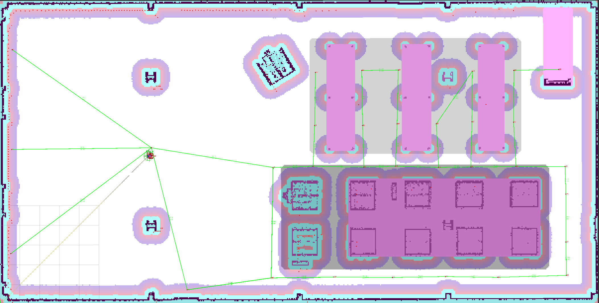
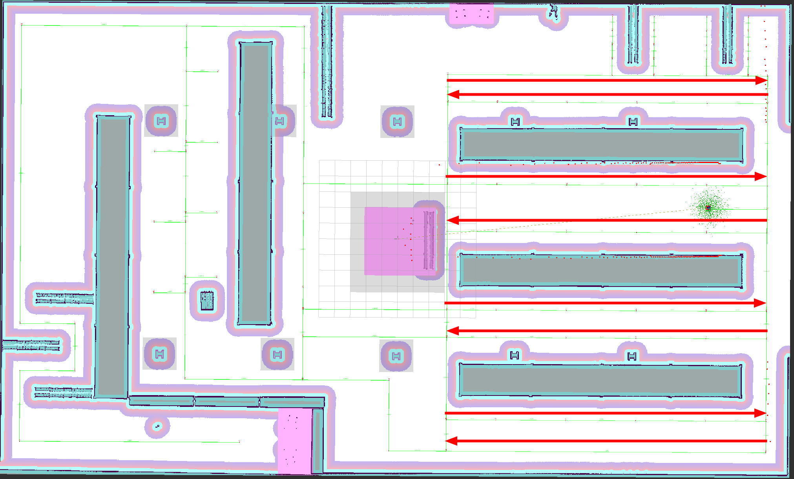

.. _configuring_croute_server:

Route Server
############

Source code on Github_.

.. _Github: https://github.com/ros-navigation/navigation2/tree/main/nav2_route

The Route Server in ``nav2_route`` implements the server for computing routes through a predefined navigation graph rather than using freespace planning like the Planner Server.
It may be used to fully replace freespace planning when following a particular route closely or to augment the global planner with long-distance routing to a goal.
In this case, the planner will generate feasible paths with localized environmental information for only the future part of the route necessary.

The graph itself has very few rules associated with it, but may be generated manually or automatically via AI, geometric, or probabilistic techniques.
See :ref:`route_graph_generation` and :ref:`route_graph_generation_lif_editor` for a tutorial about how to generate a graph using QGIS, Rviz2 and/or LIF for structured environment applications.
You can also use sampling or procedural generation techniques to create a graph for less structured environments, for example using `NVIDIA's SWAGGER project <https://github.com/nvidia-isaac/SWAGGER>`_ which can generate a graph from a map image and provides utilities to convert into geojson for easy integration with Nav2 Route.
There's also a tutorial :ref:`route_graph_generation_swagger` to help with that process as well.

There are also several locations for customization using plugins:
* Edge Scorer: Enables custom scoring functions for edges based on arbitrary user-defined semantic information and the chosen optimization criteria(s).
* Route Operation: Execute a user-defined action when entering or leaving a route edge or achieving a node, including use of node and edge semantic information,
* Route Graph Parser: Parse graph files using the chosen format (e.g. geoJSON, OpenStreetMap, etc.) and convert them into the internal graph representation.

See the package's README file for additional information such as performance metrics, design, advice, and graph formatting.

.. raw:: html

    <h1 align="center">
      

        <iframe width="700" height="450" src="https://www.youtube.com/embed/VtIYE8WAZ4o?autoplay=1" frameborder="1" allow="accelerometer; autoplay; encrypted-media; gyroscope; picture-in-picture" allowfullscreen></iframe>
      

    </h1>

Server Parameters
*****************

.. tabs::

  .. group-tab:: Lyrical and newer

    :base_frame:

      ============== ==============
      Type           Default
      -------------- --------------
      string         "base_link"
      ============== ==============

      Description
        The base frame of the robot to use to obtain the robot's pose from when not using the ``use_start`` request parameter.

    :route_frame:

      ============== ==============
      Type           Default
      -------------- --------------
      string         "map"
      ============== ==============

      Description
        The frame of the route graph to plan within. If values in the graph file are not w.r.t. this frame, they will be automatically transformed.

    :path_density:

      ============== ========
      Type           Default
      -------------- --------
      double         0.05
      ============== ========

      Description
        The density of path-points in the output route, if using the ``nav_msgs/Path`` route rather than the collection of nodes and edges. This is used to upsample the route into a path that may be followed.

    :max_iterations:

      ============== ========
      Type           Default
      -------------- --------
      int            0
      ============== ========

      Description
        The maximum number of planning iterations to perform. If 0, the maximum number of iterations is used.

    :max_planning_time:

      ============== ========
      Type           Default
      -------------- --------
      double          2.0
      ============== ========

      Description
        The maximum planning time to use.

    :smooth_corners:

      ============== ========
      Type           Default
      -------------- --------
      bool           false
      ============== ========

      Description
        Whether to smooth corners formed between subsequent edges after a route has been found

    :smoothing_radius:

      ============== ========
      Type           Default
      -------------- --------
      double          1.0
      ============== ========

      Description
        Radius to fit to corners formed by edges if corner smoothing is enabled

    :costmap_topic:

      ============== ============================
      Type           Default
      -------------- ----------------------------
      string         'global_costmap/costmap_raw'
      ============== ============================

      Description
        The costmap to use for the server-level costmap subscriber. This is created to aid the goal intent extractor (if BFS-based terminal route node finding is enabled) and also shared with the Collision Monitor Operation and Costmap Edge Scorer if set to the same topic. Otherwise, those plugins will create their own subscribers to their respective costmap topics.

    :tracker_update_rate:

      ============== ========
      Type           Default
      -------------- --------
      double         50.0
      ============== ========

      Description
        The update rate of the tracker (when using ``ComputeAndTrackRoute`` action) to check the status of path tracking and execute route operations.

    :aggregate_blocked_ids:

      ============== ========
      Type           Default
      -------------- --------
      bool           false
      ============== ========

      Description
        Whether to aggregate the blocked IDs reported by route operations over the lifespan of the navigation request or only use the currently marked blocked IDs.

    :boundary_radius_to_achieve_node:

      ============== ========
      Type           Default
      -------------- --------
      double         1.0
      ============== ========

      Description
        The radius at a boundary condition (start, goal) to mark the node achieved by the tracker when using ``ComputeAndTrackRoute``. Note that this is not the same as the goal tolerance, as the route or path follower (controller) will continue to run until its goal tolerance is met.

    :radius_to_achieve_node:

      ============== ==========
      Type           Default
      -------------- ----------
      double         1.0
      ============== ==========

      Description
        The radius for non-boundary conditions to mark the node as achieved once within tolerance of, when using ``ComputeAndTrackRoute``. Note that this is a radius to consider achievable, however a refinement process takes place to most accurately identify when a node is reached. The radius is the trigger to start this process. Set this generously based on path tracking tolerances.

    :max_prune_dist_from_edge:

      ============== ==========
      Type           Default
      -------------- ----------
      double         8.0
      ============== ==========

      Description
        Maximum distance from an edge to consider pruning it as in-progress (i.e. if we're to far away from an edge, it is nonsensical to prune it).

    :min_prune_dist_from_goal:

      ============== ===============
      Type           Default
      -------------- ---------------
      double         0.15
      ============== ===============

      Description
        Minimum distance from the goal node away from the request's goal pose (if using ``use_poses``) to consider pruning as being passed, in case the goal pose is very close to the goal node, but is not exact.

    :min_prune_dist_from_start:

      ============== ===============
      Type           Default
      -------------- ---------------
      double         0.1
      ============== ===============

      Description
        Minimum distance from the start node away from the start pose (if using ``use_poses``) to consider pruning as being passed, in case the start pose is very close to the start node, but is not exact. Setting this to be ~3-5x the goal tolerance may be a good choice when doing largely on-graph navigation to connect from the start node near the robot to the route fully without pruning.

    :prune_goal:

      ============== ===============
      Type           Default
      -------------- ---------------
      bool           true
      ============== ===============

      Description
        Whether pruning the goal node from the route due to it being spatially past the goal pose requested (pose requests only ``use_poses``).

    :enable_nn_search:

      ============== ===============
      Type           Default
      -------------- ---------------
      bool           true
      ============== ===============

      Description
        Whether to use Breadth-first search to find the nearest traversable node (true) or simply the nearest node (false) for the start and goal when using pose requests.

    :max_nn_search_iterations:

      ============== ===============
      Type           Default
      -------------- ---------------
      int            10000
      ============== ===============

      Description
        The maximum number of iterations to perform Breadth-first search to find the start and goal closest traversable nodes.

    :num_nearest_nodes:

      ============== ===============
      Type           Default
      -------------- ---------------
      int            5
      ============== ===============

      Description
        The number of nearest-neighbors to extract from a Kd-tree in order to check against in the Breadth-first search.

    :graph_filepath:

      ============== ===============
      Type           Default
      -------------- ---------------
      string         ""
      ============== ===============

      Description
        The filepath to the graph file for loading. It may be empty on initialization, but then the graph must be set from the server's set graph service later.

    :graph_file_loader:

      ============== ========================
      Type           Default
      -------------- ------------------------
      string         "geo_json_graph_file_loader"
      ============== ========================

      Description
        The name of the graph file loader plugin to use.

    :graph_file_loader.plugin:

      ============== ====================================
      Type           Default
      -------------- ------------------------------------
      string         "nav2_route::GeoJsonGraphFileLoader"
      ============== ====================================

      Description
        The graph loading plugin to use. By default, we use ``geojson``.

    :edge_cost_functions:

      ============== ========================================
      Type           Default
      -------------- ----------------------------------------
      vector<string> ["distance_scorer", "dynamic_edges_scorer"]
      ============== ========================================

      Description
        Which edge cost functions should be used for planning purposes to score the edges. By default, we optimize for minimum distance while providing a service cost function to set arbitrary costs or mark edge as closed from a service.

    :operations:

      ============== ========================================
      Type           Default
      -------------- ----------------------------------------
      vector<string> ["adjust_speed_limit", "rerouting_service"]
      ============== ========================================

      Description
        The route operation plugins to use for ``ComputeAndTrackRoute``. By default, we have a speed limit adjuster and a ROS service request rerouting operation.

    :<name>.plugin:

      ============== ============
      Type           Default
      -------------- ------------
      string         ""
      ============== ============

      Description
        The plugin to load under that name. The ``edge_cost_functions.<name>`` namespaces is also where plugin-specific parameters are defined.

    :introspection_mode:

      ============== =============================
      Type           Default
      -------------- -----------------------------
      string         "disabled"
      ============== =============================

      Description
        The introspection mode for services and actions. Options are "disabled", "metadata", "contents".

    :allow_parameter_qos_overrides:

      ============== =============================
      Type           Default
      -------------- -----------------------------
      bool           true
      ============== =============================

      Description
        Whether to allow QoS profiles to be overwritten with parameterized values.

  .. group-tab:: Kilted and older

    :base_frame:

      ============== ==============
      Type           Default
      -------------- --------------
      string         "base_link"
      ============== ==============

      Description
        The base frame of the robot to use to obtain the robot's pose from when not using the ``use_start`` request parameter.

    :route_frame:

      ============== ==============
      Type           Default
      -------------- --------------
      string         "map"
      ============== ==============

      Description
        The frame of the route graph to plan within. If values in the graph file are not w.r.t. this frame, they will be automatically transformed.

    :path_density:

      ============== ========
      Type           Default
      -------------- --------
      double         0.05
      ============== ========

      Description
        The density of path-points in the output route, if using the ``nav_msgs/Path`` route rather than the collection of nodes and edges. This is used to upsample the route into a path that may be followed.

    :max_iterations:

      ============== ========
      Type           Default
      -------------- --------
      int            0
      ============== ========

      Description
        The maximum number of planning iterations to perform. If 0, the maximum number of iterations is used.

    :max_planning_time:

      ============== ========
      Type           Default
      -------------- --------
      double          2.0
      ============== ========

      Description
        The maximum planning time to use.

    :smooth_corners:

      ============== ========
      Type           Default
      -------------- --------
      bool           false
      ============== ========

      Description
        Whether to smooth corners formed between subsequent edges after a route has been found

    :smoothing_radius:

      ============== ========
      Type           Default
      -------------- --------
      double          1.0
      ============== ========

      Description
        Radius to fit to corners formed by edges if corner smoothing is enabled

    :costmap_topic:

      ============== ============================
      Type           Default
      -------------- ----------------------------
      string         'global_costmap/costmap_raw'
      ============== ============================

      Description
        The costmap to use for the server-level costmap subscriber. This is created to aid the goal intent extractor (if BFS-based terminal route node finding is enabled) and also shared with the Collision Monitor Operation and Costmap Edge Scorer if set to the same topic. Otherwise, those plugins will create their own subscribers to their respective costmap topics.

    :tracker_update_rate:

      ============== ========
      Type           Default
      -------------- --------
      double         50.0
      ============== ========

      Description
        The update rate of the tracker (when using ``ComputeAndTrackRoute`` action) to check the status of path tracking and execute route operations.

    :aggregate_blocked_ids:

      ============== ========
      Type           Default
      -------------- --------
      bool           false
      ============== ========

      Description
        Whether to aggregate the blocked IDs reported by route operations over the lifespan of the navigation request or only use the currently marked blocked IDs.

    :boundary_radius_to_achieve_node:

      ============== ========
      Type           Default
      -------------- --------
      double         1.0
      ============== ========

      Description
        The radius at a boundary condition (start, goal) to mark the node achieved by the tracker when using ``ComputeAndTrackRoute``. Note that this is not the same as the goal tolerance, as the route or path follower (controller) will continue to run until its goal tolerance is met.

    :radius_to_achieve_node:

      ============== ==========
      Type           Default
      -------------- ----------
      double         1.0
      ============== ==========

      Description
        The radius for non-boundary conditions to mark the node as achieved once within tolerance of, when using ``ComputeAndTrackRoute``. Note that this is a radius to consider achievable, however a refinement process takes place to most accurately identify when a node is reached. The radius is the trigger to start this process. Set this generously based on path tracking tolerances.

    :max_prune_dist_from_edge:

      ============== ==========
      Type           Default
      -------------- ----------
      double         8.0
      ============== ==========

      Description
        Maximum distance from an edge to consider pruning it as in-progress (i.e. if we're to far away from an edge, it is nonsensical to prune it).

    :min_prune_dist_from_goal:

      ============== ===============
      Type           Default
      -------------- ---------------
      double         0.15
      ============== ===============

      Description
        Minimum distance from the goal node away from the request's goal pose (if using ``use_poses``) to consider pruning as being passed, in case the goal pose is very close to the goal node, but is not exact.

    :min_prune_dist_from_start:

      ============== ===============
      Type           Default
      -------------- ---------------
      double         0.1
      ============== ===============

      Description
        Minimum distance from the start node away from the start pose (if using ``use_poses``) to consider pruning as being passed, in case the start pose is very close to the start node, but is not exact. Setting this to be ~3-5x the goal tolerance may be a good choice when doing largely on-graph navigation to connect from the start node near the robot to the route fully without pruning.

    :prune_goal:

      ============== ===============
      Type           Default
      -------------- ---------------
      bool           true
      ============== ===============

      Description
        Whether pruning the goal node from the route due to it being spatially past the goal pose requested (pose requests only ``use_poses``).

    :enable_nn_search:

      ============== ===============
      Type           Default
      -------------- ---------------
      bool           true
      ============== ===============

      Description
        Whether to use Breadth-first search to find the nearest traversable node (true) or simply the nearest node (false) for the start and goal when using pose requests.

    :max_nn_search_iterations:

      ============== ===============
      Type           Default
      -------------- ---------------
      int            10000
      ============== ===============

      Description
        The maximum number of iterations to perform Breadth-first search to find the start and goal closest traversable nodes.

    :num_nearest_nodes:

      ============== ===============
      Type           Default
      -------------- ---------------
      int            5
      ============== ===============

      Description
        The number of nearest-neighbors to extract from a Kd-tree in order to check against in the Breadth-first search.

    :graph_filepath:

      ============== ===============
      Type           Default
      -------------- ---------------
      string         ""
      ============== ===============

      Description
        The filepath to the graph file for loading. It may be empty on initialization, but then the graph must be set from the server's set graph service later.

    :graph_file_loader:

      ============== ========================
      Type           Default
      -------------- ------------------------
      string         "GeoJsonGraphFileLoader"
      ============== ========================

      Description
        The name of the graph file loader plugin to use.

    :graph_file_loader.plugin:

      ============== ====================================
      Type           Default
      -------------- ------------------------------------
      string         "nav2_route::GeoJsonGraphFileLoader"
      ============== ====================================

      Description
        The graph loading plugin to use. By default, we use ``geojson``.

    :edge_cost_functions:

      ============== ========================================
      Type           Default
      -------------- ----------------------------------------
      vector<string> ["DistanceScorer", "DynamicEdgesScorer"]
      ============== ========================================

      Description
        Which edge cost functions should be used for planning purposes to score the edges. By default, we optimize for minimum distance while providing a service cost function to set arbitrary costs or mark edge as closed from a service.

    :operations:

      ============== ========================================
      Type           Default
      -------------- ----------------------------------------
      vector<string> ["AdjustSpeedLimit", "ReroutingService"]
      ============== ========================================

      Description
        The route operation plugins to use for ``ComputeAndTrackRoute``. By default, we have a speed limit adjuster and a ROS service request rerouting operation.

    :<name>.plugin:

      ============== ============
      Type           Default
      -------------- ------------
      string         ""
      ============== ============

      Description
        The plugin to load under that name. The ``edge_cost_functions.<name>`` namespaces is also where plugin-specific parameters are defined.

    :introspection_mode:

      ============== =============================
      Type           Default
      -------------- -----------------------------
      string         "disabled"
      ============== =============================

      Description
        The introspection mode for services and actions. Options are "disabled", "metadata", "contents".

    :allow_parameter_qos_overrides:

      ============== =============================
      Type           Default
      -------------- -----------------------------
      bool           true
      ============== =============================

      Description
        Whether to allow QoS profiles to be overwritten with parameterized values.

Edge Scorer Parameters
**********************

CostmapScorer
-------------

This edge scoring plugin will score based on the cost of the costmap over the edge.

:weight:

  ============== ============
  Type           Default
  -------------- ------------
  double         1.0
  ============== ============

  Description
    Relative edge scoring weighting.

:costmap_topic:

  ============== ==========================
  Type           Default
  -------------- --------------------------
  string         global_costmap/costmap_raw
  ============== ==========================

  Description
    Costmap topic to use for scoring.

:max_cost:

  ============== ============
  Type           Default
  -------------- ------------
  double         253.0
  ============== ============

  Description
    Maximum cost to consider an route blocked (253.0)

:use_maximum:

  ============== ============
  Type           Default
  -------------- ------------
  bool           true
  ============== ============

  Description
    Whether to score based on single maximum or average

:invalid_on_collision:

  ============== ============
  Type           Default
  -------------- ------------
  bool           true
  ============== ============

  Description
    Whether to consider collision status as a terminal condition

:invalid_off_map:

  ============== ============
  Type           Default
  -------------- ------------
  bool           true
  ============== ============

  Description
    Whether to consider route going off the map invalid

:check_resolution:

  ============== ============
  Type           Default
  -------------- ------------
  int            1
  ============== ============

  Description
    Resolution to check costs at (1 = costmap resolution, 2 = 2x costmap resolution, etc)

DistanceScorer
--------------

This edge scoring plugin will score based on the length of the edge.
If a ``speed_tag`` is provided, that is used to scale by the time to traverse.
This must be a percentage, if using absolute speed limits, see the ``TimeScorer`` plugin below.

:weight:

  ============== ============
  Type           Default
  -------------- ------------
  double         1.0
  ============== ============

  Description
    Relative edge scoring weighting.

:speed_tag:

  ============== ============
  Type           Default
  -------------- ------------
  string         "speed_limit"
  ============== ============

  Description
    Graph metadata key to look for percentage speed limits (speed_limit).

TimeScorer
----------

This edge scoring plugin will score based on the time to traverse the length of the edge.
This will use the distance of the edge weighted in proportion to the absolute speed limits of the robot over an edge.
If none is set in the graph, a parameterized maximum speed will be used.
If an actual, measured time of a previous traversal is in the edge's metadata, this will be used.

:weight:

  ============== ============
  Type           Default
  -------------- ------------
  double         1.0
  ============== ============

  Description
    Relative edge scoring weighting.

:speed_tag:

  ============== =================
  Type           Default
  -------------- -----------------
  string         "abs_speed_limit"
  ============== =================

  Description
    Graph metadata key to look for absolute speed limits.

:time_tag:

  ============== ================
  Type           Default
  -------------- ----------------
  string         "abs_time_taken"
  ============== ================

  Description
    Graph metadata key to look for abs traversal times.

:max_vel:

  ============== ================
  Type           Default
  -------------- ----------------
  double         0.5
  ============== ================

  Description
    Maximum velocity to use if speed limit or time taken is not set.

PenaltyScorer
-------------

This edge scoring plugin will score based on a statically set penalty in the graph file for a particular edge.
This can be based on application known logic to weight preferences of navigation tactics in a space.

:weight:

  ============== ============
  Type           Default
  -------------- ------------
  double         1.0
  ============== ============

  Description
    Relative edge scoring weighting.

:penalty_tag:

  ============== ================
  Type           Default
  -------------- ----------------
  string         "penalty"
  ============== ================

  Description
    Graph metadata key to look for penalty value.

SemanticScorer
--------------

This edge scoring plugin will score based on semantic information provided in the graph file.
It can either check for the edge's semantic class via a parameterized key's value **or** search all key names to match known semantic classes to apply weight (e.g. `class: highway` or `highway: <some other application info>`).

:weight:

  ============== ============
  Type           Default
  -------------- ------------
  double         1.0
  ============== ============

  Description
    Relative edge scoring weighting.

:semantic_classes:

  ============== ============
  Type           Default
  -------------- ------------
  vector<string> []
  ============== ============

  Description
    The list of semantic classes in your graph that you would like to score based off of.

:<for each class>:

  ============== ============
  Type           Default
  -------------- ------------
  double         N/A
  ============== ============

  Description
    The cost to assign to this semantic class. For example: ``highway: 8.4``.

:semantic_key:

  ============== ============
  Type           Default
  -------------- ------------
  string         class
  ============== ============

  Description
    The key to search for edge's semantic data with the edge's metadata. If empty string, will look at key names instead.

StartPoseOrientationScorer
--------------------------

This edge scoring plugin will score an edge starting at the start node (vector from start->goal) based on its angular proximity to the starting pose's orientation.
This will either score a weighted-angular distance or reject traversals that are outside of a set threshold to force the route to go down a particular direction (i.e. direction robot is already facing).

:orientation_weight:

  ============== ============
  Type           Default
  -------------- ------------
  double         1.0
  ============== ============

  Description
    Relative edge scoring weighting.

:use_orientation_threshold:

  ============== ============
  Type           Default
  -------------- ------------
  bool           false
  ============== ============

  Description
    Whether to use the orientation threshold for binary validity of traversal or weighted-angular distance scoring.

:orientation_tolerance:

  ============== ============
  Type           Default
  -------------- ------------
  double         PI/2
  ============== ============

  Description
    The angular threshold to reject edges' angles if greater than this w.r.t. starting pose, when ``use_orientation_threshold: true``.

GoalPoseOrientationScorer
-------------------------

This edge scoring plugin will score a an edge with terminus of the goal node (vector from start->goal) based on its angular proximity to the goal pose's orientation.
This will either score a weighted-angular distance or reject traversals that are outside of a set threshold to force the route to go down a particular direction (i.e. direction robot wants to be facing).

:orientation_weight:

  ============== ============
  Type           Default
  -------------- ------------
  double         1.0
  ============== ============

  Description
    Relative edge scoring weighting.

:use_orientation_threshold:

  ============== ============
  Type           Default
  -------------- ------------
  bool           false
  ============== ============

  Description
    Whether to use the orientation threshold for binary validity of traversal or weighted-angular distance scoring.

:orientation_tolerance:

  ============== ============
  Type           Default
  -------------- ------------
  double         PI/2
  ============== ============

  Description
    The angular threshold to reject edges' angles if greater than this w.r.t. goal pose, when ``use_orientation_threshold: true``.

DynamicEdgesScorer
------------------

This edge scoring plugin will score based on the requested values from a 3rd party application via a service interface.
It can set dynamically any cost for any edge and also be used to close and reopen particular edges if they are blocked, in use by other robots locking out its shared use by other robots, higher cost due to overlap with other platforms in service, increased cost due to fleet manager analytics that this space is underperforming throughput, or otherwise temporarily non-traversable.
For example, if other robots report an edge to be blocked, all robots can avoid this edge/aisle/etc.

It has no parameters.

Route Operations Parameters
***************************

AdjustSpeedLimit
----------------

This route operation will check the graph at each state change (e.g. node passed) if the new edge entered contains speed limit restrictions. If so, it will publish those to the speed limit topic to be received by the controller server.

:speed_limit_topic:

  ============== ============
  Type           Default
  -------------- ------------
  string         speed_limit
  ============== ============

  Description
    The topic to publish new speed limits to.

:speed_tag:

  ============== ============
  Type           Default
  -------------- ------------
  string         speed_limit
  ============== ============

  Description
    The graph's semantic metadata key to look for speed limits under.

CollisionMonitor
----------------

This route operation will evaluate a future-looking portion of the route for validity w.r.t. collision in the costmap.
If it is blocked, it sets the edge blocked as blocked for rerouting around the blocked edge or fail the action based on ``reroute_on_collision``.

:costmap_topic:

  ============== ============================
  Type           Default
  -------------- ----------------------------
  string         "global_costmap/costmap_raw"
  ============== ============================

  Description
    The costmap topic to use for collision checking. May be local or global costmap depending on the desired collision checking horizon. If set to the same as the server's costmap topic, then it will be shared here as well without duplicate subscriptions.

:rate:

  ============== ============================
  Type           Default
  -------------- ----------------------------
  double         1.0
  ============== ============================

  Description
    The rate to collision at, rather than the tracker's update rate since this is an expensive operation.

:max_cost:

  ============== ============================
  Type           Default
  -------------- ----------------------------
  double         253.0
  ============== ============================

  Description
    The cost at or above which is considered invalid.

:max_collision_dist:

  ============== ============================
  Type           Default
  -------------- ----------------------------
  double         5.0
  ============== ============================

  Description
    The distance (meters) ahead of the robot's position on the route to collision check during.

:check_resolution:

  ============== ============================
  Type           Default
  -------------- ----------------------------
  int            1
  ============== ============================

  Description
    The resolution to check at in terms of multiples of the costmap's resolution (1 = 1 cell, 2 = every 2 cells, and so on). This reduces the computational complexity for long-range routes.

:reroute_on_collision:

  ============== ============================
  Type           Default
  -------------- ----------------------------
  bool           true
  ============== ============================

  Description
    Whether to reroute on collision or exit the tracking task as a failure when future collision is detected.

TimeMarker
----------

This route operation will track times taken to traverse particular edges to write times to for later improved navigation time estimation in edge scoring.

:time_tag:

  ============== ============================
  Type           Default
  -------------- ----------------------------
  string         abs_time_taken
  ============== ============================

  Description
    Metadata tag to write the time taken to within an edge. Is used with the ``TimeScorer`` to give an improved experiential estimate of traversal times.

ReroutingService
----------------

This route operation will receive service requests from a 3rd party application to cause a rerouting request.

TriggerEvent
------------

This route operation will trigger an external service when a graph node or edge contains a route operation of this name.
It uses a `std_srvs/Trigger` interface and is a demonstration of the `RouteOperationClient<SrvT>` base class which can be used to trigger other events of other types of other names as desired (opening doors, calling elevators, etc).

Example
*******

.. tabs::

  .. group-tab:: Lyrical and newer

    .. code-block:: yaml

      route_server:
        ros__parameters:

          base_frame: "base_link"                       # Robot's base frame
          route_frame: "map"                            # Global reference frame
          path_density: 0.05                            # Density of points for generating the dense nav_msgs/Path from route (m)
          max_iterations: 0                             # Maximum number of search iterations, if 0, uses maximum possible
          max_planning_time: 2.0                        # Maximum planning time (seconds)
          smoothing_corners: true                       # Whether to smooth corners formed by adjacent edges or not
          smoothing_radius: 1.0                         # Radius of corner to fit into the corner

          graph_file_loader: "geo_json_graph_file_loader"   # Name of default file loader
            plugin: nav2_route::GeoJsonGraphFileLoader  # file loader plugin to use
          graph_filepath: ""                            # file path to graph to use

          edge_cost_functions: ["distance_scorer", "dynamic_edges_scorer"]  # Edge scoring cost functions to use
          distance_scorer:
            plugin: "nav2_route::DistanceScorer"
          dynamic_edges_scorer:
            plugin: "nav2_route::DynamicEdgesScorer"

          operations: ["adjust_speed_limit", "rerouting_service"] # Route operations plugins to use
          adjust_speed_limit:
            plugin: "nav2_route::AdjustSpeedLimit"
          rerouting_service:
            plugin: "nav2_route::ReroutingService"

          tracker_update_rate: 50.0                     # Rate at which to check the status of path tracking
          aggregate_blocked_ids: false                  # Whether to aggregate the blocked IDs reported by route operations over the lifespan of the navigation request or only use the currently blocked IDs.
          boundary_radius_to_achieve_node: 1.0          # Radius (m) near boundary nodes (e.g. start/end) to enable evaluation of achievement metric
          radius_to_achieve_node: 2.0                   # Radius (m) near route nodes as preliminary condition for evaluation of achievement metric

          max_prune_dist_from_edge: 8.0                       # Max distance from an edge to consider pruning it as in-progress (e.g. if we're too far away from the edge, its nonsensical to prune it)
          min_prune_dist_from_goal: 0.15                      # Min distance from goal node away from goal pose to consider goal node pruning as considering it as being passed (in case goal pose is very close to a goal node, but not exact)
          min_prune_dist_from_start: 0.10                     # Min distance from start node away from start pose to consider start node pruning as considering it as being passed (in case start pose is very close to a start node, but not exact)
          prune_goal: true                              # Whether pruning the goal nodes from the route due to being past the goal pose requested is possible (pose requests only)

  .. group-tab:: Kilted and older

    .. code-block:: yaml

      route_server:
        ros__parameters:

          base_frame: "base_link"                       # Robot's base frame
          route_frame: "map"                            # Global reference frame
          path_density: 0.05                            # Density of points for generating the dense nav_msgs/Path from route (m)
          max_iterations: 0                             # Maximum number of search iterations, if 0, uses maximum possible
          max_planning_time: 2.0                        # Maximum planning time (seconds)
          smoothing_corners: true                       # Whether to smooth corners formed by adjacent edges or not
          smoothing_radius: 1.0                         # Radius of corner to fit into the corner

          graph_file_loader: "GeoJsonGraphFileLoader"   # Name of default file loader
            plugin: nav2_route::GeoJsonGraphFileLoader  # file loader plugin to use
          graph_filepath: ""                            # file path to graph to use

          edge_cost_functions: ["DistanceScorer", "DynamicEdgesScorer"]  # Edge scoring cost functions to use
          DistanceScorer:
            plugin: "nav2_route::DistanceScorer"
          DynamicEdgesScorer:
            plugin: "nav2_route::DynamicEdgesScorer"

          operations: ["AdjustSpeedLimit", "ReroutingService"] # Route operations plugins to use
          AdjustSpeedLimit:
            plugin: "nav2_route::AdjustSpeedLimit"
          ReroutingService:
            plugin: "nav2_route::ReroutingService"

          tracker_update_rate: 50.0                     # Rate at which to check the status of path tracking
          aggregate_blocked_ids: false                  # Whether to aggregate the blocked IDs reported by route operations over the lifespan of the navigation request or only use the currently blocked IDs.
          boundary_radius_to_achieve_node: 1.0          # Radius (m) near boundary nodes (e.g. start/end) to enable evaluation of achievement metric
          radius_to_achieve_node: 2.0                   # Radius (m) near route nodes as preliminary condition for evaluation of achievement metric

          max_prune_dist_from_edge: 8.0                       # Max distance from an edge to consider pruning it as in-progress (e.g. if we're too far away from the edge, its nonsensical to prune it)
          min_prune_dist_from_goal: 0.15                      # Min distance from goal node away from goal pose to consider goal node pruning as considering it as being passed (in case goal pose is very close to a goal node, but not exact)
          min_prune_dist_from_start: 0.10                     # Min distance from start node away from start pose to consider start node pruning as considering it as being passed (in case start pose is very close to a start node, but not exact)
          prune_goal: true                              # Whether pruning the goal nodes from the route due to being past the goal pose requested is possible (pose requests only)

Configuring the Nav2 Route Server Demo
**************************************

The Nav2 Route Server demo is a simulation of a Turtlebot4 robot navigating through a depot or a warehouse environment using the Nav2 Route Server.
The `route_example_launch.py <https://github.com/ros-navigation/navigation2/blob/main/nav2_simple_commander/launch/route_example_launch.py>`_  file is used to launch the demo, and can be configured in place with the following parameters:

- ``MAP_TYPE``:
   - Set to either ``depot`` or ``warehouse`` to choose the environment.

- ``MAP_POSES_DICT``:
   - A dictionary containing the Gazebo spawn poses for the robot in the depot and warehouse environments.

- ``ROUTE_POSES_DICT``:
   - A dictionary containing the start and goal poses for the robot in the depot and warehouse environments.

All the graphs files for the depot and warehouse environments are located in the `graphs <https://github.com/ros-navigation/navigation2/tree/main/nav2_bringup/graphs>`_ directory under the ``nav2_bringup`` package.
These are the current visualizations of the route graphs for the depot and warehouse environments:

.. centered:: *RViz visualization of the bidirectional route graph for the depot environment.*

.. centered:: *RViz visualization of the route graph for the warehouse environment. All nodes are bidirectional, except the ones that are annotated.*
