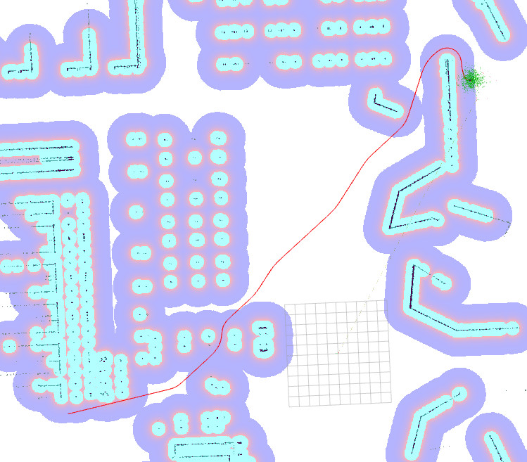

.. _configuring_smac_planner:

Smac Planner
############

Source code and README with design, explanations, and metrics can be found on Github_.

.. _Github: https://github.com/ros-planning/navigation2/tree/main/nav2_smac_planner

The Smac Planner plugin implements a 2D A* and Hybrid-A* path planners.
An example of the Hyrid-A* planner can be seen below, planning a 85 meter path in 33ms.

``<name>`` is the corresponding planner plugin ID selected for this type.

Parameters
**********

:``<name>``.tolerance:

  ============== =======
  Type           Default
  -------------- -------
  double         0.5  
  ============== =======

  Description
    Tolerance in meters between requested goal pose and end of path.

:``<name>``.downsample_costmap:

  ==== =======
  Type Default                                                   
  ---- -------
  bool False            
  ==== =======

  Description
    Whether to downsample costmap to another resolution for search.

:``<name>``.downsampling_factor:

  ==== =======
  Type Default                                                   
  ---- -------
  int  1            
  ==== =======

  Description
    Multiplier factor to downsample costmap by (e.g. if 5cm costmap at 2 ``downsample_factor``, 10cm output).

:``<name>``.allow_unknown:

  ==== =======
  Type Default                                                   
  ---- -------
  bool True            
  ==== =======

  Description
    Whether to allow traversing/search in unknown space.

:``<name>``.max_iterations:

  ==== =======
  Type Default                                                   
  ---- -------
  int  -1            
  ==== =======

  Description
    Maximum number of search iterations before failing to limit compute time, disabled by -1.

:``<name>``.max_on_approach_iterations:

  ==== =======
  Type Default                                                   
  ---- -------
  int  1000            
  ==== =======

  Description
    Maximum number of iterations after the search is within tolerance before returning approximate path with best heuristic if exact path not found.

:``<name>``.max_planning_time:

  ====== =======
  Type   Default                                                   
  ------ -------
  double  5.0            
  ====== =======

  Description
    Maximum planning time in seconds.

:``<name>``.analytic_expansion_ratio:

  ====== =======
  Type   Default                                                   
  ------ -------
  double  2.0            
  ====== =======

  Description
    SE2 node will attempt to complete an analytic expansions proportional to this value and the minimum heuristic.

:``<name>``.smooth_path:

  ==== =======
  Type Default                                                   
  ---- -------
  bool False            
  ==== =======

  Description
    Whether to smooth path with CG smoother.

:``<name>``.motion_model_for_search:

  ====== =======
  Type   Default                                                   
  ------ -------
  string "DUBIN"            
  ====== =======

  Description
    Motion model enum string to search with. For SE2 node, default is "DUBIN". For 2D it is "MOORE". Options for SE2 are DUBIN or REEDS_SHEPP. Options for 2D is MOORE and VON_NEUMANN.

:``<name>``.angle_quantization_bins:

  ==== =======
  Type Default                                                   
  ---- -------
  int  1            
  ==== =======

  Description
    Number of angular bins to use for SE2 search. For 2D this must be 1, for SE2 it can be any number, but a good baseline is 72 (for 5 degree increments).

:``<name>``.minimum_turning_radius:

  ====== =======
  Type   Default                                                   
  ------ -------
  double 0.2          
  ====== =======

  Description
    Minimum turning radius in meters of vehicle. Also used in the smoother to compute maximum curvature.

:``<name>``.reverse_penalty:

  ====== =======
  Type   Default                                                   
  ------ -------
  double 2.0          
  ====== =======

  Description
    Heuristic penalty to apply to SE2 node if searching in reverse direction. Only used in ``REEDS_SHEPP`` motion model.

:``<name>``.change_penalty:

  ====== =======
  Type   Default                                                   
  ------ -------
  double 0.5          
  ====== =======

  Description
    Heuristic penalty to apply to SE2 node if changing direction in search.

:``<name>``.non_straight_penalty:

  ====== =======
  Type   Default                                                   
  ------ -------
  double 1.05         
  ====== =======

  Description
    Heuristic penalty to apply to SE2 node if searching in non-straight direction.

:``<name>``.cost_penalty:

  ====== =======
  Type   Default                                                   
  ------ -------
  double 1.2         
  ====== =======

  Description
    Heuristic penalty to apply to SE2 node for cost at pose. Allows Hybrid-A* to be cost aware.

:``<name>``.smoother.smoother.w_curve:

  ====== =======
  Type   Default                                                   
  ------ -------
  double 1.5         
  ====== =======

  Description
    CG smoother cost function weight on  the curvature of path.

:``<name>``.smoother.smoother.w_dist:

  ====== =======
  Type   Default                                                   
  ------ -------
  double 0.0         
  ====== =======

  Description
    CG smoother cost function weight on the distance from the original path. Disabled by default.

:``<name>``.smoother.smoother.w_smooth:

  ====== =======
  Type   Default                                                   
  ------ -------
  double 15000.0         
  ====== =======

  Description
    CG smoother cost function weight on the distance between nodes.

:``<name>``.smoother.smoother.w_cost:

  ====== =======
  Type   Default                                                   
  ------ -------
  double 1.5         
  ====== =======

  Description
    CG smoother cost function weight on the costmap's cost.

:``<name>``.smoother.smoother.cost_scaling_factor:

  ====== =======
  Type   Default                                                   
  ------ -------
  double 10.0        
  ====== =======

  Description
    Scale factor for the inflation layer. Must be the same as your inflation layer's value. Used to approximate a Voronoi field.

:``<name>``.smoother.optimizer.max_time:

  ====== =======
  Type   Default                                                   
  ------ -------
  double 0.10        
  ====== =======

  Description
    Maximum time spent smoothing, in seconds. If planning takes too long, this can be dynamically adjusted to ensure the planner meets ``max_planning_time``.

:``<name>``.smoother.optimizer.max_iterations:

  ====== =======
  Type   Default                                                   
  ------ -------
  int    500        
  ====== =======

  Description
    Maximum number of iterations we can run the CG smoother.

:``<name>``.smoother.optimizer.debug_optimizer:

  ====== =======
  Type   Default                                                   
  ------ -------
  bool   False        
  ====== =======

  Description
    Whether to print debug info from Ceres.

:``<name>``.smoother.optimizer.gradient_tol:

  ====== =======
  Type   Default                                                   
  ------ -------
  double 1e-10      
  ====== =======

  Description
    Minimum change in gradient to terminate smoothing.

:``<name>``.smoother.optimizer.fn_tol:

  ====== =======
  Type   Default                                                   
  ------ -------
  double 1e-7      
  ====== =======

  Description
    Minimum change in function to terminate smoothing.

:``<name>``.smoother.optimizer.param_tol:

  ====== =======
  Type   Default                                                   
  ------ -------
  double 1e-15      
  ====== =======

  Description
    Minimum change in parameter blocks to terminate smoothing.

:``<name>``.smoother.optimizer.advanced.min_line_search_step_size:

  ====== =======
  Type   Default                                                   
  ------ -------
  double 1e-20      
  ====== =======

  Description
    Terminate smoothing iteration if change in parameter block less than this.

:``<name>``.smoother.optimizer.advanced.max_num_line_search_step_size_iterations:

  ====== =======
  Type   Default                                                   
  ------ -------
  int    50    
  ====== =======

  Description
    Maximum iterations for line search in CG smoother.

:``<name>``.smoother.optimizer.advanced.line_search_sufficient_function_decrease:

  ====== =======
  Type   Default                                                   
  ------ -------
  double 1e-20      
  ====== =======

  Description
    Function decrease amount to terminate current line search iteration.

:``<name>``.smoother.optimizer.advanced.max_num_line_search_direction_restarts:

  ====== =======
  Type   Default                                                   
  ------ -------
  int    10    
  ====== =======

  Description
    Maximum umber of restarts of line search when over-shoots.

:``<name>``.smoother.optimizer.advanced.max_line_search_step_expansion:

  ====== =======
  Type   Default                                                   
  ------ -------
  int    50    
  ====== =======

  Description
    Step size multiplier at each iteration of line search.

Example
*******
.. code-block:: yaml

    planner_server:
      ros__parameters:
        planner_plugins: ["GridBased"]
        use_sim_time: True

        GridBased:
          plugin: "smac_planner/SmacPlanner"
          tolerance: 0.5                    # tolerance for planning if unable to reach exact pose, in meters, for 2D node
          downsample_costmap: false         # whether or not to downsample the map
          downsampling_factor: 1            # multiplier for the resolution of the costmap layer (e.g. 2 on a 5cm costmap would be 10cm)
          allow_unknown: false              # allow traveling in unknown space
          max_iterations: -1                # maximum total iterations to search for before failing
          max_on_approach_iterations: 1000  # maximum number of iterations to attempt to reach goal once in tolerance, 2D only
          max_planning_time: 2.0            # max time in seconds for planner to plan, smooth, and upsample. Will scale maximum smoothing and upsampling times based on remaining time after planning.
          smooth_path: false                # Whether to smooth searched path
          motion_model_for_search: "DUBIN"  # 2D Moore, Von Neumann; SE2 Dubin, Redds-Shepp
          angle_quantization_bins: 72       # For SE2 node: Number of angle bins for search, must be 1 for 2D node (no angle search)
          minimum_turning_radius: 0.20      # For SE2 node & smoother: minimum turning radius in m of path / vehicle
          reverse_penalty: 2.1              # For Reeds-Shepp model: penalty to apply if motion is reversing, must be => 1
          change_penalty: 0.20              # For SE2 node: penalty to apply if motion is changing directions, must be >= 0
          non_straight_penalty: 1.05        # For SE2 node: penalty to apply if motion is non-straight, must be => 1
          cost_penalty: 1.3                 # For SE2 node: penalty to apply to higher cost zones

          smoother:
            smoother:
              w_curve: 30.0                 # weight to minimize curvature of path
              w_dist: 0.0                   # weight to bind path to original as optional replacement for cost weight
              w_smooth: 30000.0             # weight to maximize smoothness of path
              w_cost: 0.025                 # weight to steer robot away from collision and cost
              cost_scaling_factor: 10.0     # this should match the inflation layer's parameter

            # I do not recommend users mess with this unless they're doing production tuning
            optimizer:
              max_time: 0.10                # maximum compute time for smoother
              max_iterations: 500           # max iterations of smoother
              debug_optimizer: false        # print debug info
              gradient_tol: 1.0e-10
              fn_tol: 1.0e-20
              param_tol: 1.0e-15
              advanced:
                min_line_search_step_size: 1.0e-20
                max_num_line_search_step_size_iterations: 50
                line_search_sufficient_function_decrease: 1.0e-20
                max_num_line_search_direction_restarts: 10
                max_line_search_step_expansion: 50
