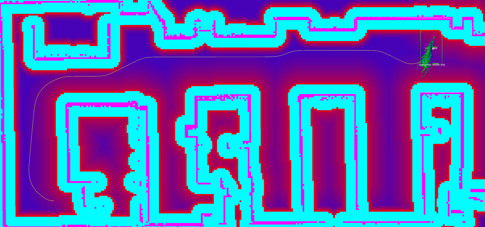

.. asymmetric_inflation:

Asymmetric Inflation Layer Parameters
======================================

This layer implements an asymmetric variant of the inflation layer, biasing the robot's path toward one side of the corridor by raising obstacle costs asymmetrically around the planned path.

``<asymmetric inflation layer>`` is the corresponding plugin name selected for this type.

:``<asymmetric inflation layer>``.enabled:

  ==== =======
  Type Default
  ---- -------
  bool True
  ==== =======

  Description
    Whether it is enabled.

:``<asymmetric inflation layer>``.inflation_radius:

  ====== =======
  Type   Default
  ------ -------
  double 2.0
  ====== =======

  Description
    Radius to inflate costmap around lethal obstacles.

:``<asymmetric inflation layer>``.cost_scaling_factor:

  ====== =======
  Type   Default
  ------ -------
  double 4.0
  ====== =======

  Description
    Exponential decay factor across inflation radius.

:``<asymmetric inflation layer>``.asymmetry_factor:

  ====== =======
  Type   Default
  ------ -------
  double 0.75
  ====== =======

  Description
    Signed bias in to influence asymmetry. Must be in the range (-1, 1).

    a value > 0 biases to the right of the path, < 0 to the left

:``<asymmetric inflation layer>``.inflate_around_unknown:

  ==== =======
  Type Default
  ---- -------
  bool False
  ==== =======

  Description
    Whether to treat unknown cells as lethal for inflation purposes.

:``<asymmetric inflation layer>``.plan_topic:

  ====== =======
  Type   Default
  ------ -------
  string "plan"
  ====== =======

  Description
    Topic on which to receive the global path (``nav_msgs/msg/Path``).

:``<asymmetric inflation layer>``.goal_distance_threshold:

  ====== =======
  Type   Default
  ------ -------
  double 1.5
  ====== =======

  Description
    Distance to the goal (m) below which asymmetric inflation is disabled.

    This prevents oscillations when the robot is approaching the target pose.

:``<asymmetric inflation layer>``.neutral_threshold:

  ====== =======
  Type   Default
  ------ -------
  double 2.0
  ====== =======

  Description
    Maximum perpendicular distance (m) from the path centreline.

    Obstacles farther than this distance are ignored.

Usage Note
----------

``AsymmetricInflationLayer`` reads the symmetric cost baseline written by
``nav2_costmap_2d::InflationLayer``.
It must appear **after** ``InflationLayer`` in the ``plugins`` list:

Example
----------

.. code-block:: yaml

  global_costmap:
    ros__parameters:
      update_frequency: 10.0
      publish_frequency: 10.0
      global_frame: map
      robot_base_frame: base_link
      footprint: "[ [0.525, 0.325], [0.525, -0.325], [-0.525, -0.325], [-0.525, 0.325] ]"
      width: 10
      height: 10
      origin_x: -5.0
      origin_y: -5.0
      resolution: 0.05
      track_unknown_space: false
      plugins: ["static_layer", "inflation_layer", "asymmetric_inflation_layer"]
      static_layer:
        plugin: "nav2_costmap_2d::StaticLayer"
        map_subscribe_transient_local: True
      inflation_layer:
        plugin: "nav2_costmap_2d::InflationLayer"
        cost_scaling_factor: 5.0
        inflation_radius: 1.0
      asymmetric_inflation_layer:
        plugin: "nav2_costmap_2d::AsymmetricInflationLayer"
        enabled: True
        inflation_radius: 3.0
        cost_scaling_factor: 4.0
        asymmetry_factor: 0.75
        inflate_around_unknown: False
        plan_topic: "plan"
        goal_distance_threshold: 1.5
        neutral_threshold: 3.0
