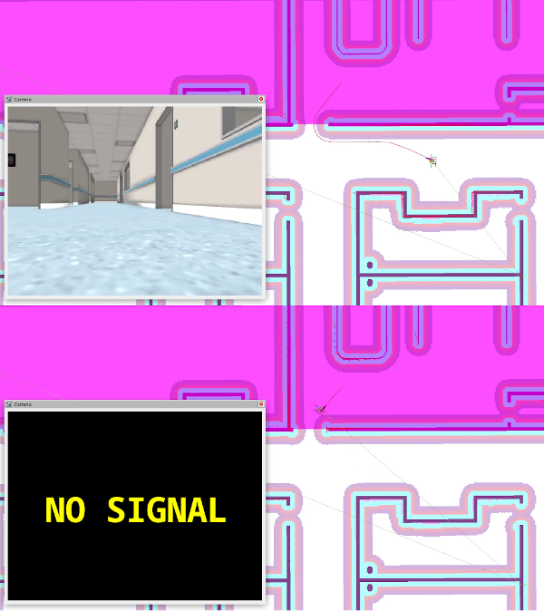

.. _binary_filter:

Binary Filter Parameters
========================

Binary Filter - is a Costmap Filter that publishes a boolean topic, flipping binary state when the encoded filter space value (corresponding to the filter mask point where the robot is) is higher than given threshold. It then flips back when lower or equal.

Filter space value is being calculated as: ``Fv = base + multiplier * mask_value``, where ``base`` and ``multiplier`` are being published in a filter info by Costmap Filter Info Server. The example of usage are include: camera operating on/off to turn off cameras in sensitive areas, headlights switch on/off for moving indoors to outdoors, smart house light triggering, etc.

`<filter name>`: is the corresponding plugin name selected for this type.

:``<filter name>``.enabled:

  ====== =======
  Type   Default
  ------ -------
  bool   True
  ====== =======

  Description
    Whether it is enabled.

:``<filter name>``.filter_info_topic:

  ====== =======
  Type   Default
  ------ -------
  string N/A
  ====== =======

  Description
    Name of the incoming `CostmapFilterInfo <https://github.com/ros-planning/navigation2/blob/main/nav2_msgs/msg/CostmapFilterInfo.msg>`_ topic having filter-related information. Published by Costmap Filter Info Server along with filter mask topic. For more details about Map and Costmap Filter Info servers configuration please refer to the :ref:`configuring_map_server` configuration page.

:``<filter name>``.transform_tolerance:

  ====== =======
  Type   Default
  ------ -------
  double 0.1
  ====== =======

  Description
    Time with which to post-date the transform that is published, to indicate that this transform is valid into the future. Used when filter mask and current costmap layer are in different frames.

:``<filter name>``.default_state:

  ==== =======
  Type Default
  ---- -------
  bool false
  ==== =======

  Description
    Default state of binary filter.

:``<filter name>``.binary_state_topic:

  ====== ==============
  Type   Default
  ------ --------------
  string "binary_state"
  ====== ==============

  Description
    Topic of ``std_msgs::msg::Bool`` type to publish binary filter state to.

:``<filter name>``.flip_threshold:

  ====== =======
  Type   Default
  ------ -------
  double 50.0
  ====== =======

  Descrioption
    Threshold for binary state flipping. Filter values higher than this threshold, will set binary state to non-default.

Example
*******
.. code-block:: yaml

    global_costmap:
      global_costmap:
        ros__parameters:
        ...
        plugins: ["static_layer", "obstacle_layer", "inflation_layer"]
        filters: ["binary_filter"]
        ...
        binary_filter:
          plugin: "nav2_costmap_2d::BinaryFilter"
          enabled: True
          filter_info_topic: "/costmap_filter_info"
          transform_tolerance: 0.1
          default_state: False
          binary_state_topic: "/binary_state"
          flip_threshold: 50.0
