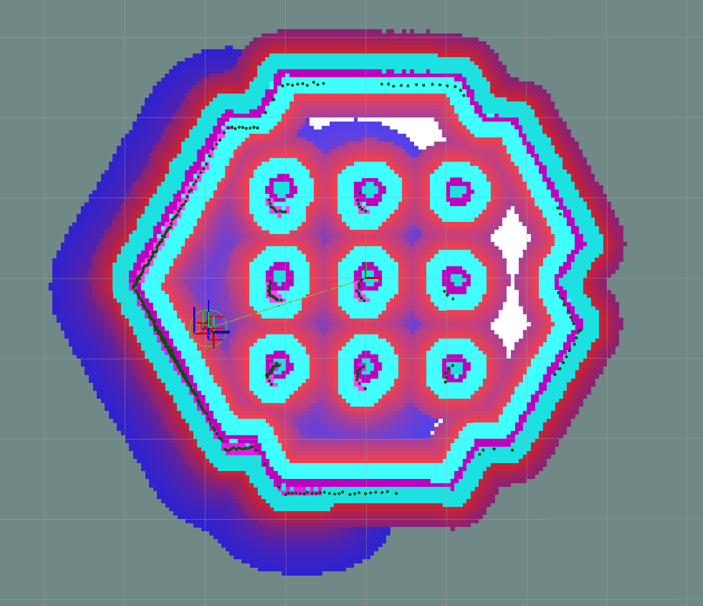

.. plugin_container:

Plugin Container Layer Parameters
=================================

This implements a costmap layer which combines costmap layers within a submap, which can then be integrated with other submaps in the same parent costmap. An example would be the use of different inflation layers for different sensors, objects, or static layers  

``<plugin container layer>`` is the corresponding plugin name selected for this type.

:``<plugin container layer>``.enabled:

  ==== =======
  Type Default                                                   
  ---- -------
  bool True            
  ==== =======

  Description
    Whether it is enabled.

:``<plugin container layer>``.plugins:

  ============== =======
  Type           Default
  -------------- -------
  vector<string> {}
  ============== =======

  Description
    List of mapped costmap layer names for parameter namespaces and names.

  Note
    Costmap filters are presently unsupported

Example
*******
.. code-block:: yaml

  global_costmap:
    ros__parameters:
      update_frequency: 1.0
      publish_frequency: 1.0
      global_frame: map
      robot_base_frame: base_link
      robot_radius: 0.22
      resolution: 0.05
      track_unknown_space: true

      plugins: ["plugin_container_static_layer", "plugin_container_obstacle_layer"]

      plugin_container_static_layer:
        plugin: "nav2_costmap_2d::PluginContainerLayer"
        enabled: True
        combination_method: 1
        plugins: ["static_layer", "inflation_layer"]
        static_layer:
          plugin: "nav2_costmap_2d::StaticLayer"
          map_subscribe_transient_local: True
        inflation_layer:
          plugin: "nav2_costmap_2d::InflationLayer"
          cost_scaling_factor: 2.0
          inflation_radius: 0.5

      plugin_container_obstacle_layer:
        plugin: "nav2_costmap_2d::PluginContainerLayer"
        enabled: True
        combination_method: 1
        plugins: ["obstacle_layer", "inflation_layer"]
        obstacle_layer:
          plugin: "nav2_costmap_2d::ObstacleLayer"
          enabled: True
          observation_sources: scan
          scan:
            topic: /scan
            max_obstacle_height: 2.0
            clearing: True
            marking: True
            data_type: "LaserScan"
            raytrace_max_range: 3.0
            raytrace_min_range: 0.0
            obstacle_max_range: 2.5
            obstacle_min_range: 0.0
        inflation_layer:
          plugin: "nav2_costmap_2d::InflationLayer"
          cost_scaling_factor: 3.0
          inflation_radius: 1.0

The above example settings, when applied to the Nav2 turtlebot simulation would give the following costmap on startup

    Costmap generated by turtlebot using example plugin container layer settings

