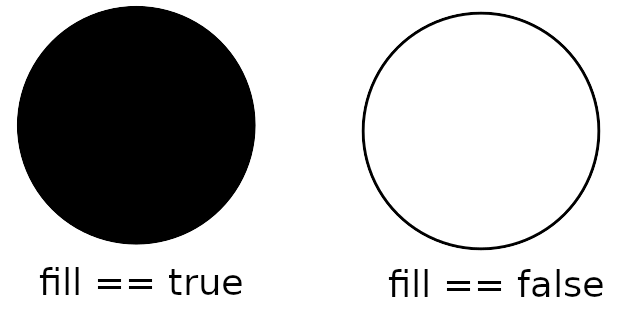

.. _configuring_vector_object_server:

Vector Object Server
####################

The Vector Object Server implements a server that puts vector objects (such as polygons and circles) on OccupancyGrid raster map. The output raster map is being published by Vector Object server, and it could be used anywhere in the Nav2 stack or outside it.

The main application of Vector Object server is to output raster maps of polygon objects or regions with existing costmaps of environment, targeting for robot navigation purposes (for example for dynamic obstacles simulation/highlighting, sensors noise removal, black-out areas on maps, synthetic testing purposes, and much more).
Rather than rastering vector objects each iteration or at run-time, it is done one-time on startup, and served to costmap layers or other consumers improving performance.
A typical setup model for this is a Nav2 stack with Costmap Filters enabled, running in conjunction with a Vector Object server, which produces vectorised OccupancyGrid maps as input masks for the Costmap Filters:

These vector shapes could be added by using ROS input parameters as well as being handled by the following service calls: ``AddShapes.srv`` which adds new shapes or modifies existing ones, ``RemoveShapes.srv`` which removes any or all shapes from the map ``GetShapes.srv`` which returns all shapes on the map.

Each vector shape is being handled by its ``unique_identifier_msgs/UUID``. Developers can choose whether to specify it manually for a new shape, or have it generated automatically by the Vector Object server. The UUID can always be obtained by making a ``GetShapes.srv`` request and getting the response with all shapes' UUIDs and their properties.

The Vector Object server places shapes on the map. Each vector object has its own value in the range from ``{-1}, [0..100]``, which matches the OccupancyGrid values. Vector objects can be overlapped with each other by using one of the global overlapping rules: (a) **sequential overlapping** in the same order as vector objects arrived on the server, or (b) taking the **maximum / minimum value** from all vector objects and the map background (if it is known).

This page describes all the configuration parameters of the Vector Object server. For more information on how to navigate with your own Vector Object server, please refer to the :ref:`navigation2_with_vector_objects` tutorial.

Features
========

- The following vector shapes are currently supported for placing on a map:

  - Polygons
  - Circles

- Polygons can be filled with any value or drawn as a polygonal chain, if it is not supposed to be a closed shape:

- Circles can be filled with any value or drawn without any fill (only the circle boundary is placed on the map):

- Vector shapes could be set once during the Vector Object server startup as ROS-parameters, and added/modified/removed over the time using the following service calls:

  - ``AddShapes.srv``: adds new shapes or modifies existing ones
  - ``RemoveShapes.srv``: removes any or all shapes from the map
  - ``GetShapes.srv``: gets all shapes and their properties

- Vector shapes are being identified by their UUID (``unique_identifier_msgs/UUID``), which is generated automatically for a new shape, or could be given manually by the developer.

- Vector shapes can be placed in any frame:

  - If at least one of the shapes is set in a different frame than the map, a dynamic update model will be enabled: this shape can move over the time, output map will be published dynamically with a given rate.
  - If all shapes are set in the same frame as map, map will be published/updated once: at startup of Vector Object server and on each call of ``AddShapes.srv`` or ``RemoveShapes.srv`` to change the shape.

Covered use-cases
=================

Using Vector Object server publishing an output map as input mask to :ref:`Costmap Filters <costmap_filters>` allows the following example use-cases using polygon, vector representations of areas rather than rastered masks:

- No-access zone
- Speed-restriction areas
- Virtual obstacles on costmap
- Geofence / outer boundary and inner virtual obstacles
- Robot footprint (or any other moving objects) replacement
- Hiding some areas from costmap
- Sensors noise removal
- Dynamic objects simulation/highlighting
- Other testing purposes

Parameters
==========

:map_topic:

  ============== =============================
  Type           Default
  -------------- -----------------------------
  string         "vo_map"
  ============== =============================

  Description:
    Output topic, publishing an OccupancyGrid map with vector objects put on it.

:global_frame_id:

  ============== =============================
  Type           Default
  -------------- -----------------------------
  string         "map"
  ============== =============================

  Description:
    The name of the coordinate frame where the map is being published at.

:resolution:

  ============== =============================
  Type           Default
  -------------- -----------------------------
  double         0.05
  ============== =============================

  Description:
    Output map resolution in meters.

:default_value:

  ============== =============================
  Type           Default
  -------------- -----------------------------
  int            -1 (unknown)
  ============== =============================

  Description:
    Default OccupancyGrid value to fill the background of output map with.

:overlay_type:

  ============== =============================
  Type           Default
  -------------- -----------------------------
  int            0
  ============== =============================

  Description:
    How one vector object to be overlaid with other and the map.
    The following values are supported:

     - 0 (``OVERLAY_SEQ``): Vector objects are superimposed in the order in which they have arrived.
     - 1 (``OVERLAY_MAX``): Maximum value from vector objects and map is being chosen.
     - 2 (``OVERLAY_MIN``): Minimum value from vector objects and map is being chosen. Unknown OccupancyGrid value is always being overrode, when it is possible.

:update_frequency:

  ============== =============================
  Type           Default
  -------------- -----------------------------
  double         1.0
  ============== =============================

  Description:
    Output map update frequency (when dynamic update model is switched-on).

:transform_tolerance:

  ============== =============================
  Type           Default
  -------------- -----------------------------
  double         0.1
  ============== =============================

  Description:
    Transform tolerance for the case when any of the shapes are placed in different than map's frame.

:shapes:

  ============== =============================
  Type           Default
  -------------- -----------------------------
  vector<string> {}
  ============== =============================

  Description:
    List of vector objects (polygons and circles). Empty by-default.

Shapes parameters
-----------------

``<shape_name>`` - is the corresponding shape name string selected for this vector object.

:``<shape_name>``.type:

  ============== =============================
  Type           Default
  -------------- -----------------------------
  string         N/A
  ============== =============================

  Description:
    Type of vector object shape. Available values are ``polygon`` and ``circle``. Causes an error, if not specialized.

:``<shape_name>``.uuid:

  ============== =============================
  Type           Default
  -------------- -----------------------------
  string         N/A
  ============== =============================

  Description:
    UUID of the shape specified in ``12345678-9abc-def0-1234-56789abcdef0`` format. Parameter is optional and could be skipped: if not specialized, Vector Object server will automatically generate a new one for the shape.

:``<shape_name>``.frame_id:

  ============== =============================
  Type           Default
  -------------- -----------------------------
  string         ""
  ============== =============================

  Description:
    Frame ID of the given shape. Empty value is being treated as map's global frame.

:``<shape_name>``.value:

  ============== =============================
  Type           Default
  -------------- -----------------------------
  int            100 (occupied)
  ============== =============================

  Description:
    Shape's value to be put on map with.

Parameters applicable for polygons only
^^^^^^^^^^^^^^^^^^^^^^^^^^^^^^^^^^^^^^^

:``<shape_name>``.points:

  ============== =============================
  Type           Default
  -------------- -----------------------------
  vector<double> N/A
  ============== =============================

  Description:
    Polygon vertices, listed in ``[p1.x, p1.y, p2.x, p2.y, p3.x, p3.y, ...]`` format (e.g. ``[0.5, 0.5, 0.5, -0.5, -0.5, -0.5, -0.5, 0.5]`` for the square). Minimum 3 points for a triangle polygon. Causes an error, if not specialized incorrectly (less than 6 or odd number of items in the vector) or not specialized.

:``<shape_name>``.closed:

  ============== =============================
  Type           Default
  -------------- -----------------------------
  bool           true
  ============== =============================

  Description:
    Whether the polygon is closed (and filled), or drawn as polygonal chain otherwise.

Parameters applicable for circles only
^^^^^^^^^^^^^^^^^^^^^^^^^^^^^^^^^^^^^^^^

:``<shape_name>``.center:

  ============== =============================
  Type           Default
  -------------- -----------------------------
  vector<double> N/A
  ============== =============================

  Description:
    Center of the circle, listed in ``{center.x, center.y}`` format (e.g. ``{0.2, 0.3}``). Should contain exactly 2 items: X and Y coordinate of the circle's center in a given frame. Otherwise, causes an error.

:``<shape_name>``.radius:

  ============== =============================
  Type           Default
  -------------- -----------------------------
  double         N/A
  ============== =============================

  Description:
    Circle radius. Causes an error, if less than zero or not specialized.

:``<shape_name>``.fill:

  ============== =============================
  Type           Default
  -------------- -----------------------------
  bool           true
  ============== =============================

  Description:
    Whether the circle to be filled with a given value, or drawn only circle's border otherwise.

Example
=======

Here is an example of configuration YAML for the Vector Object server:

.. tabs::

  .. group-tab:: Lyrical and newer

    .. code-block:: yaml

      vector_object_server:
        ros__parameters:
          map_topic: "vo_map"
          global_frame_id: "map"
          resolution: 0.05
          default_value: -1
          overlay_type: 0
          update_frequency: 1.0
          transform_tolerance: 0.1
          shapes: ["poly", "circle_a", "circle_b"]
          poly:
            type: "polygon"
            frame_id: "map"
            closed: True
            value: 100
            points: [0.3, 0.3, 0.3, -0.3, 0.0, -0.3, 0.0, 0.3]
          circle_a:
            type: "circle"
            frame_id: "map"
            fill: True
            value: 10
            center: [3.0, 3.0]
            radius: 0.5
            uuid: "7b3f3d7d-135c-4b6c-aca1-7a84d1050505"
          circle_b:
            type: "circle"
            frame_id: "map"
            fill: False
            value: 90
            center: [3.5, 3.5]
            radius: 1.5

  .. group-tab:: Kilted and older

    .. code-block:: yaml

      vector_object_server:
        ros__parameters:
          map_topic: "vo_map"
          global_frame_id: "map"
          resolution: 0.05
          default_value: -1
          overlay_type: 0
          update_frequency: 1.0
          transform_tolerance: 0.1
          shapes: ["Poly", "CircleA", "CircleB"]
          Poly:
            type: "polygon"
            frame_id: "map"
            closed: True
            value: 100
            points: [0.3, 0.3, 0.3, -0.3, 0.0, -0.3, 0.0, 0.3]
          CircleA:
            type: "circle"
            frame_id: "map"
            fill: True
            value: 10
            center: [3.0, 3.0]
            radius: 0.5
            uuid: "7b3f3d7d-135c-4b6c-aca1-7a84d1050505"
          CircleB:
            type: "circle"
            frame_id: "map"
            fill: False
            value: 90
            center: [3.5, 3.5]
            radius: 1.5

For this, Vector Object server will produce the following map:

