# Robots Using

It’s always helpful (and fun!) to have a list of robots using or ship with our work.
Below is a very early list of robots we have encountered using our software as examples.

Click on the images below for a link to the drivers or navigation configurations.

<figure markdown="span">
  [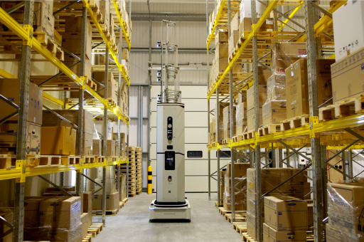](https://www.dexory.com/)
</figure>
<figure markdown="span">
  
</figure>
<figure markdown="span">
  
</figure>
<figure markdown="span">
  [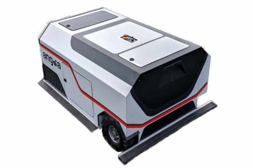](https://angsa-robotics.com/en-de/roboter/)
</figure>
<figure markdown="span">
  [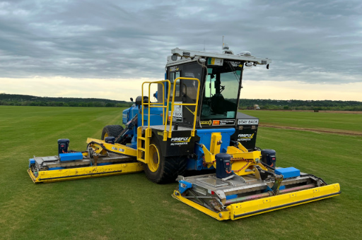](https://fireflyautomatix.com/m220/)
</figure>
<figure markdown="span">
  [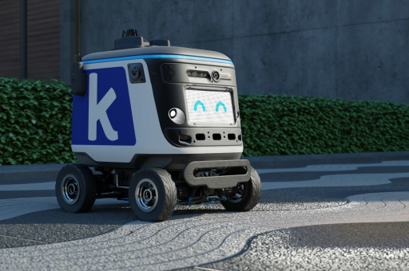](https://www.kiwibot.com/)
</figure>
<figure markdown="span">
  
</figure>
<figure markdown="span">
  [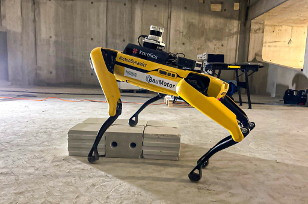](https://karelics.fi/)
</figure>
<figure markdown="span">
  [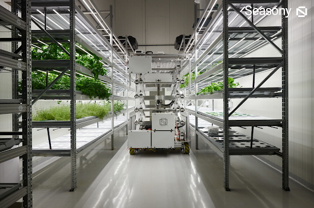](https://www.seasony.io/)
</figure>
<figure markdown="span">
  
</figure>
<figure markdown="span">
  
</figure>
<figure markdown="span">
  
</figure>
<figure markdown="span">
  
</figure>
<figure markdown="span">
  
</figure>
<figure markdown="span">
  [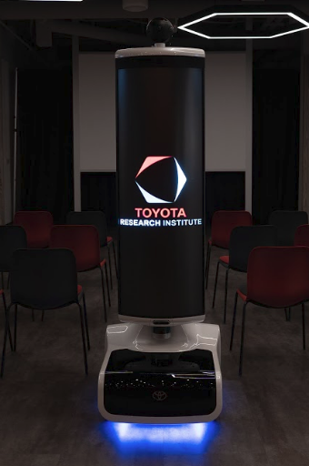](https://www.tri.global/news/toyota-introduces-tris-t-tr1-a-virtual-mobility-2019-7-22/)
</figure>
<figure markdown="span">
  
</figure>
<figure markdown="span">
  
</figure>
<figure markdown="span">
  
</figure>
<figure markdown="span">
  
</figure>
<figure markdown="span">
  
</figure>
<figure markdown="span">
  
</figure>
<figure markdown="span">
  
</figure>
<figure markdown="span">
  
</figure>
<figure markdown="span">
  [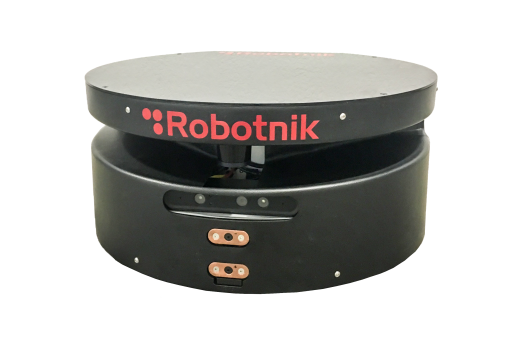](https://github.com/IntelligentRoboticsLabs/marathon_ros2)
</figure>
<figure markdown="span">
  [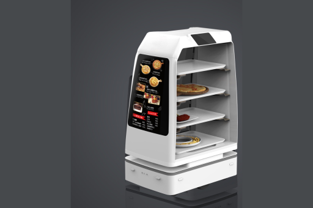](https://en.yunjichina.com.cn/a/53.html)
</figure>
<figure markdown="span">
  [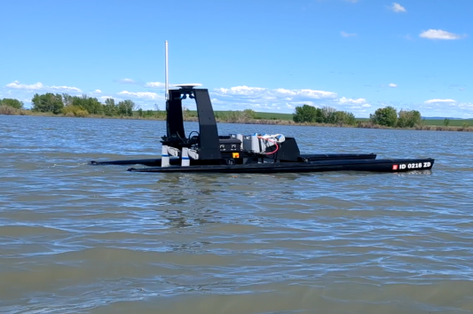](https://www.polymathrobotics.com/)
</figure>
<figure markdown="span">
  [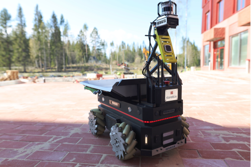](https://karelics.fi/)
</figure>
<figure markdown="span">
  
</figure>
<figure markdown="span">
  [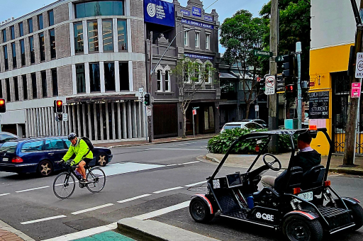](https://robotics.sydney.edu.au/)
</figure>
<figure markdown="span">
  
</figure>
<figure markdown="span">
  
</figure>
<figure markdown="span">
  
</figure>
<figure markdown="span">
  
</figure>
<figure markdown="span">
  
</figure>
<figure markdown="span">
  
</figure>
<figure markdown="span">
  
</figure>

## Research Robots

<figure markdown="span">
  
</figure>
<figure markdown="span">
  
</figure>
<figure markdown="span">
  
</figure>

