# ROSCon Talks { #roscon-talks }

Below is a list of ROSCon talks that have been given by the Nav2 team and the community which describe important features, tuning and configuration advice, and how to work with them in your applications.

## Nav2 Developer Talks

| Talk | Thumbnail | Description |
|------|-----------|-------------|
| [On Use of Nav2 Route Server][route-server] | 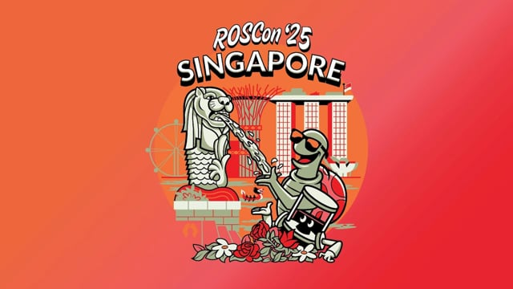 | ROSCon 2025 |
| [On Use of Nav2 Docking][docking] | 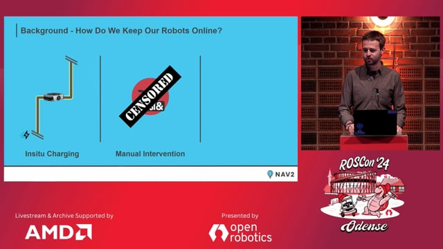 | ROSCon 2024 |
| [Nav2 Whys over What's: Navigating the Philosophies Behind the Features][whys-over-whats] | 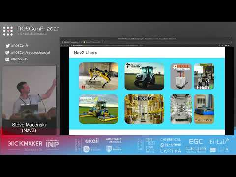 | ROSCon FR 2023 |
| [On Use of Nav2 MPPI Controller][mppi] | 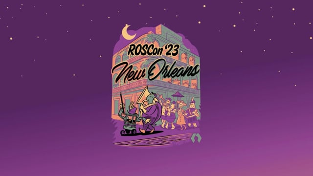 | ROSCon 2023 |
| [Bidirectional navigation with Nav2][bidirectional] | 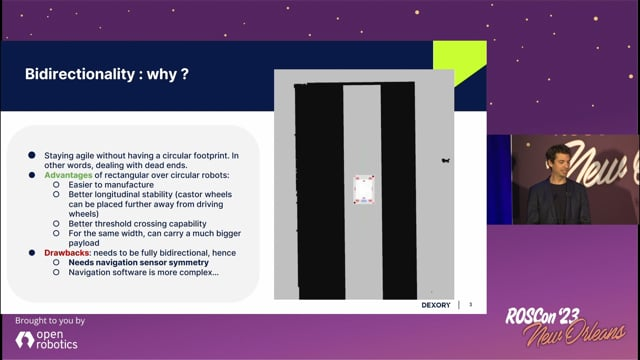 | ROSCon 2023 |
| [On Use of Nav2 Smac Planners][smac] | 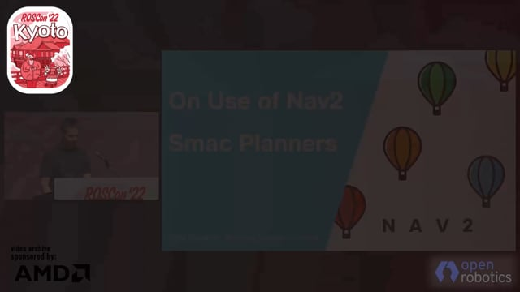 | ROSCon 2022 |
| [The Past, Present, and Future of Navigation][past-present-future] |  | ROSCon JP 2021 |
| [Chronicles of Caching and Containerising CI for Nav2][ci-chronicles] | 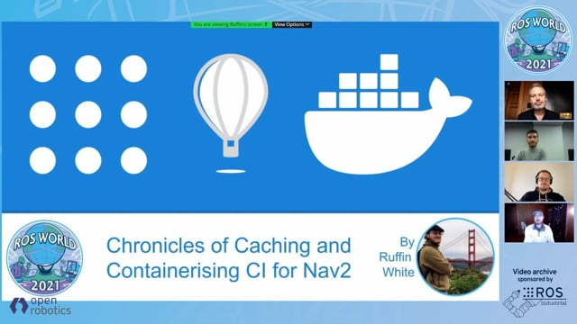 | ROSCon 2021 |
| [Navigation2: The Next Generation Navigation System][next-gen] | 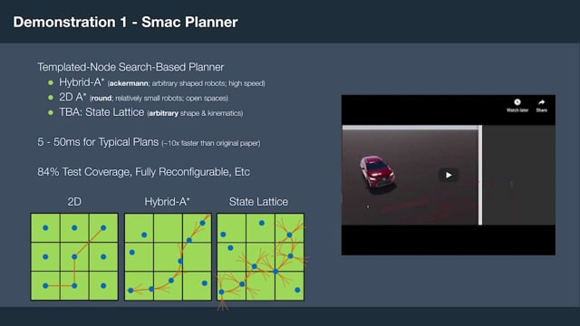 | ROSCon 2020 |
| [On Use of SLAM Toolbox][slam-toolbox] | 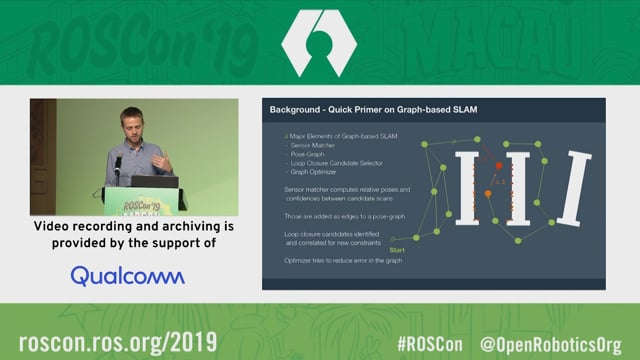 | ROSCon 2019 |
| [Navigation 2 Overview][nav2-overview] | 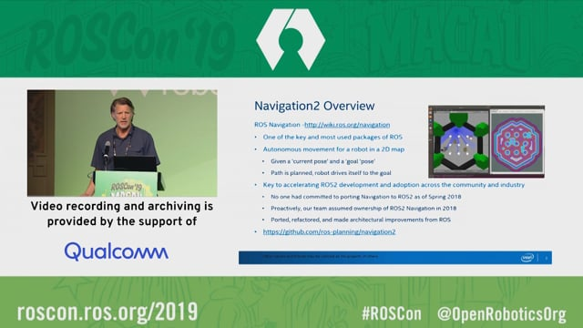 | ROSCon 2019 |
| [On Use of the Spatio-Temporal Voxel Layer][stvl] | 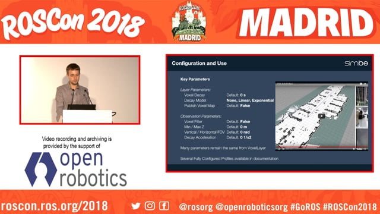 | ROSCon 2018 |

[route-server]: https://vimeo.com/1136164030
[docking]: https://vimeo.com/1024971348
[whys-over-whats]: https://www.youtube.com/watch?v=2W3zWO-msEo
[mppi]: https://vimeo.com/879001391
[bidirectional]: https://vimeo.com/879000809
[smac]: https://vimeo.com/showcase/9954564/video/767157646
[past-present-future]: https://vimeo.com/638041661/a5306a02ab
[ci-chronicles]: https://vimeo.com/649647161
[next-gen]: https://vimeo.com/showcase/7812155/video/480604621
[slam-toolbox]: https://vimeo.com/378682207
[nav2-overview]: https://vimeo.com/378682188
[stvl]: https://vimeo.com/292699571

## Community's Talks

| Talk | Thumbnail | Description |
|------|-----------|-------------|
| [Navegación robusta en ROS2][navegacion-robusta] | 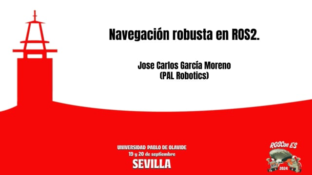 | ROSCon ES 2024 |
| [BehaviorTree.CPP 4.0. What is new and roadmap][bt-cpp] | 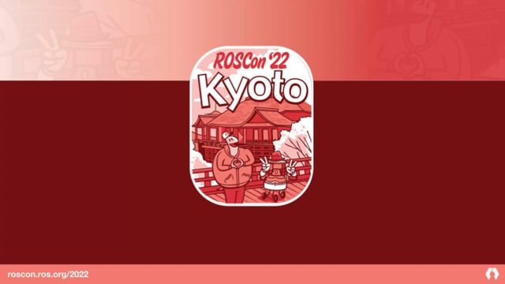 | ROSCon 2022 |
| [Mobile Robotics Scale-up Leveraging ROS][mobile-scaleup] | 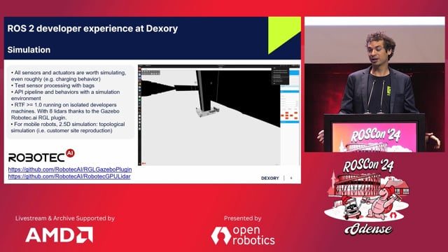 | ROSCon 2024 |
| [Radar Tracks for Path Planning in the presence of Dynamic Obstacles][radar-tracks] | 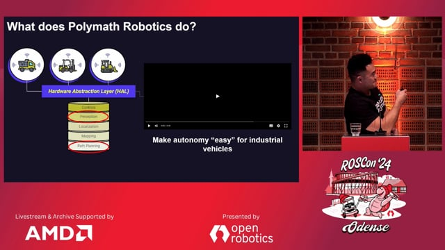 | ROSCon 2024 |

[navegacion-robusta]: https://vimeo.com/showcase/11453818/video/1029492785
[bt-cpp]: https://vimeo.com/showcase/9954564/video/767160437
[mobile-scaleup]: https://vimeo.com/1024971160
[radar-tracks]: https://vimeo.com/1024971565
