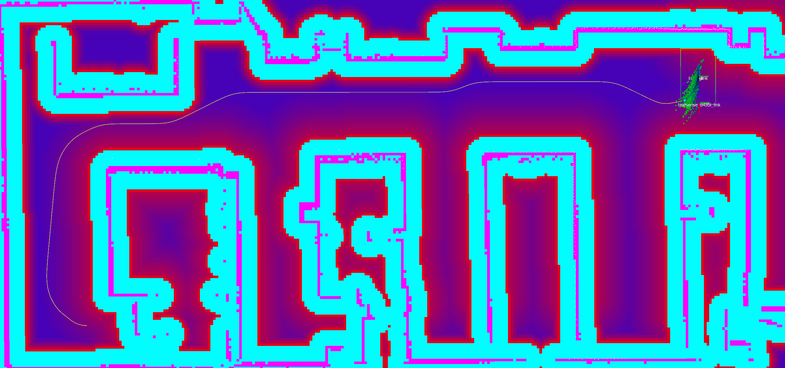

# Asymmetric Inflation Layer Parameters { #asymmetric-inflation-layer-parameters }

This layer implements an asymmetric variant of the inflation layer, by scaling inflation costs based on the planned path to incentivize left- or right-hand navigation.

<figure markdown="span">
  { title="Costmap with asymmetric inflation layer" }
</figure>

`<asymmetric inflation layer>` is the corresponding plugin name selected for this type.

### **`<asymmetric inflation layer>.enabled`**

Type: `bool` Default: `true`

:   Whether it is enabled.

### **`<asymmetric inflation layer>.inflation_radius`**

Type: `double` Default: `2.0`

:   Radius to inflate costmap around lethal obstacles.

### **`<asymmetric inflation layer>.cost_scaling_factor_left`**

Type: `double` Default: `4.0`

:   Decay factor across inflation radius for obstacles on the left side of the path.

### **`<asymmetric inflation layer>.cost_scaling_factor_right`**

Type: `double` Default: `4.0`

:   Decay factor across inflation radius for obstacles on the right side of the path.

### **`<asymmetric inflation layer>.inflate_around_unknown`**

Type: `bool` Default: `false`

:   Whether to treat unknown cells as lethal for inflation purposes.

### **`<asymmetric inflation layer>.plan_topic`**

Type: `string` Default: `"plan"`

:   Topic on which to receive the global path (`nav_msgs/msg/Path`).

### **`<asymmetric inflation layer>.goal_distance_threshold`**

Type: `double` Default: `1.5`

:   Distance to the goal (m) below which asymmetric inflation is disabled.

    This prevents oscillations when the robot is approaching the target pose.

## Example

```yaml
global_costmap:
  ros__parameters:
    update_frequency: 10.0
    publish_frequency: 10.0
    global_frame: map
    robot_base_frame: base_link
    footprint: "[ [0.525, 0.325], [0.525, -0.325], [-0.525, -0.325], [-0.525, 0.325] ]"
    width: 10
    height: 10
    origin_x: -5.0
    origin_y: -5.0
    resolution: 0.05
    track_unknown_space: false
    plugins: ["static_layer", "asymmetric_inflation_layer"]
    static_layer:
      plugin: "nav2_costmap_2d::StaticLayer"
      map_subscribe_transient_local: True
    asymmetric_inflation_layer:
      plugin: "nav2_costmap_2d::AsymmetricInflationLayer"
      enabled: True
      inflation_radius: 3.0
      cost_scaling_factor_left: 1.0
      cost_scaling_factor_right: 4.0
      inflate_around_unknown: False
      plan_topic: "plan"
      goal_distance_threshold: 1.5
```
