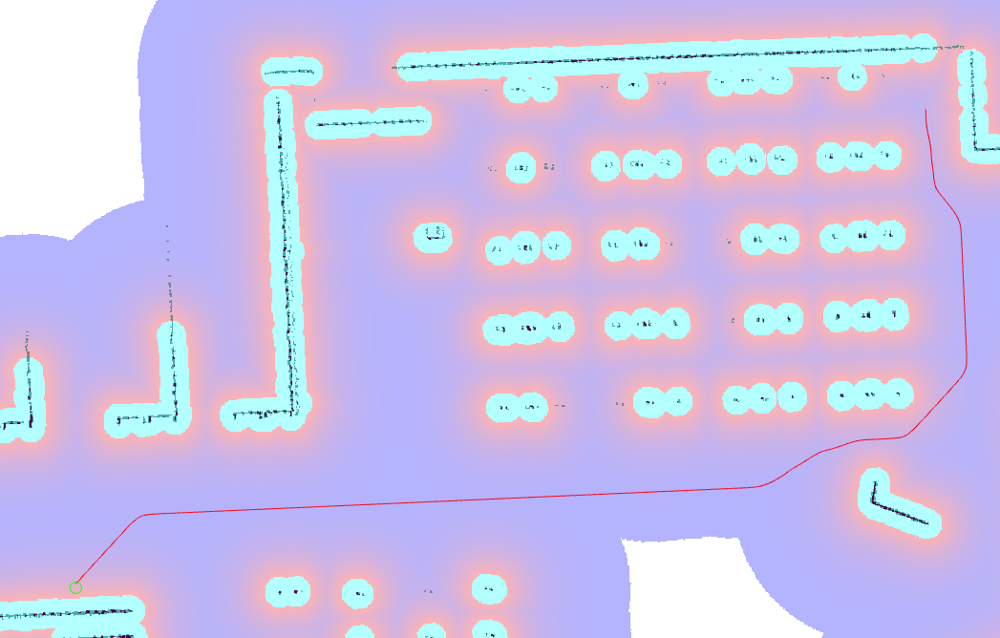

# Smac 2D Planner { #smac-2d-planner }

<figure markdown="span">
  { width="640" title="Paths generated by the Smac 2D-A*" }
</figure>

This planner implements a cost-aware holonomic A\* algorithm within the Smac Planner framework sharing the same code and behaviors as the Hybrid-A\* and State Lattice planners.

`<name>` is the corresponding planner plugin ID selected for this type.

## Parameters

### **`<name>.tolerance`**

Type: `double` Default: `0.125`

:   Tolerance in meters between requested goal pose and end of path.

### **`<name>.downsample_costmap`**

Type: `bool` Default: `false`

:   Whether to downsample costmap to another resolution for search.

### **`<name>.downsampling_factor`**

Type: `int` Default: `1`

:   Multiplier factor to downsample costmap by (e.g. if 5cm costmap at 2 `downsample_factor`, 10cm output).

### **`<name>.allow_unknown`**

Type: `bool` Default: `true`

:   Whether to allow traversing/search in unknown space.

### **`<name>.max_iterations`**

Type: `int` Default: `1000000`

:   Maximum number of search iterations before failing to limit compute time, disabled by -1.

### **`<name>.max_on_approach_iterations`**

Type: `int` Default: `1000`

:   Maximum number of iterations after the search is within `tolerance` before returning approximate path with best heuristic if exact path is not found.

### **`<name>.terminal_checking_interval`**

Type: `int` Default: `5000`

:   Number of iterations between checking if the goal has been cancelled or planner timed out

### **`<name>.max_planning_time`**

Type: `double` Default: `2.0`

:   Maximum planning time in seconds.

### **`<name>.cost_travel_multiplier`**

Type: `double` Default: `2.0`

:   Cost multiplier to apply to search to steer away from high cost areas. Larger values will place in the center of aisles more exactly (if non-*FREE* cost potential field exists) but take slightly longer to compute. To optimize for speed, a value of 1.0 is reasonable. A reasonable tradeoff value is 2.0. A value of 0.0 effective disables steering away from obstacles and acts like a naive binary search A\*.

### **`<name>.use_final_approach_orientation`**

Type: `bool` Default: `false`

:   If true, the last pose of the path generated by the planner will have its orientation set to the approach orientation, i.e. the orientation of the vector connecting the last two points of the path

### **`<name>.smoother.max_iterations`**

Type: `int` Default: `1000`

:   The maximum number of iterations the smoother has to smooth the path, to bound potential computation.

### **`<name>.smoother.w_smooth`**

Type: `double` Default: `0.3`

:   Weight for smoother to apply to smooth out the data points

### **`<name>.smoother.w_data`**

Type: `double` Default: `0.2`

:   Weight for smoother to apply to retain original data information

### **`<name>.smoother.tolerance`**

Type: `double` Default: `1e-10`

:   Parameter tolerance change amount to terminate smoothing session

### **`<name>.smoother.do_refinement`**

Type: `bool` Default: `true`

:   Performs extra refinement smoothing runs. Essentially, this recursively calls the smoother using the output from the last smoothing cycle to further smooth the path for macro-trends.

### **`<name>.smoother.refinement_num`**

Type: `int` Default: `2`

:   Number of times to recursively attempt to smooth, must be `>= 1`.

### **`allow_parameter_qos_overrides`**

Type: `bool` Default: `true`

:   Whether to allow QoS profiles to be overwritten with parameterized values.

## Example

```yaml
planner_server:
  ros__parameters:
    planner_plugins: ["GridBased"]

    GridBased:
      plugin: "nav2_smac_planner::SmacPlanner2D"
      tolerance: 0.125                      # tolerance for planning if unable to reach exact pose, in meters
      downsample_costmap: false             # whether or not to downsample the map
      downsampling_factor: 1                # multiplier for the resolution of the costmap layer (e.g. 2 on a 5cm costmap would be 10cm)
      allow_unknown: true                   # allow traveling in unknown space
      max_iterations: 1000000               # maximum total iterations to search for before failing (in case unreachable), set to -1 to disable
      max_on_approach_iterations: 1000      # maximum number of iterations to attempt to reach goal once in tolerance
      max_planning_time: 2.0                # max time in s for planner to plan, smooth
      cost_travel_multiplier: 2.0           # Cost multiplier to apply to search to steer away from high cost areas. Larger values will place in the center of aisles more exactly (if non-`FREE` cost potential field exists) but take slightly longer to compute. To optimize for speed, a value of 1.0 is reasonable. A reasonable tradeoff value is 2.0. A value of 0.0 effective disables steering away from obstacles and acts like a naive binary search A*.
      use_final_approach_orientation: false # Whether to set the final path pose at the goal's orientation to the requested orientation (false) or in line with the approach angle so the robot doesn't rotate to heading (true)
      smoother:
        max_iterations: 1000
        w_smooth: 0.3
        w_data: 0.2
        tolerance: 1.0e-10
```
