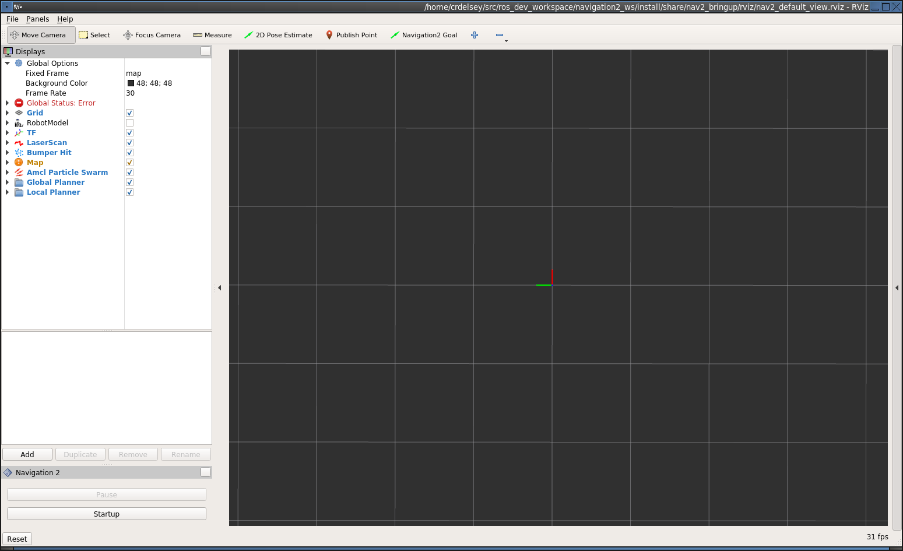
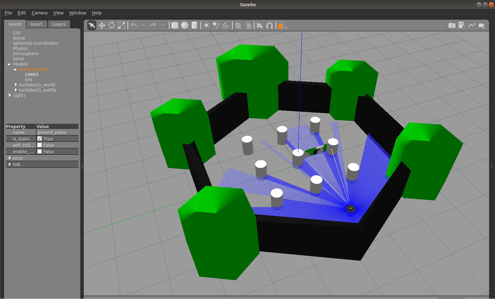
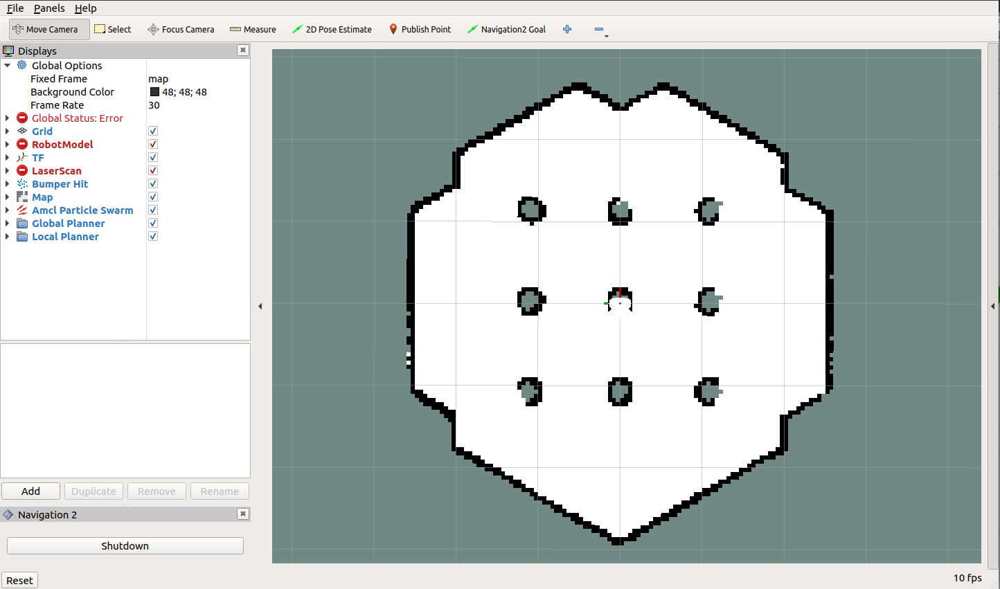
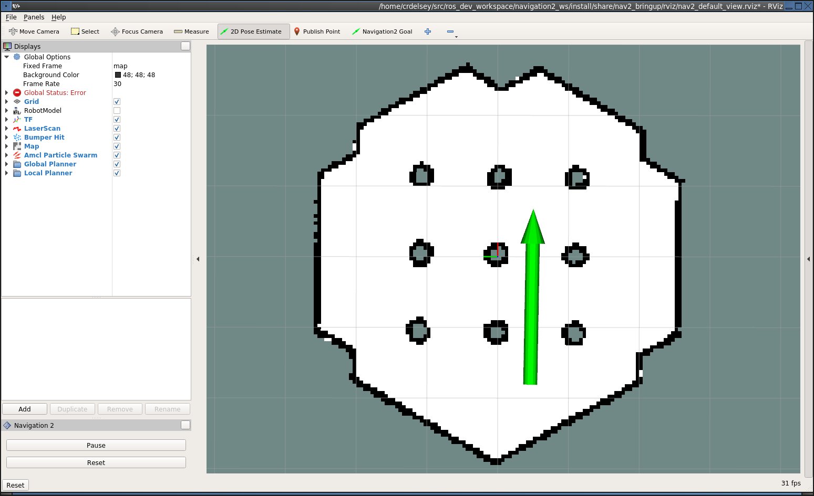
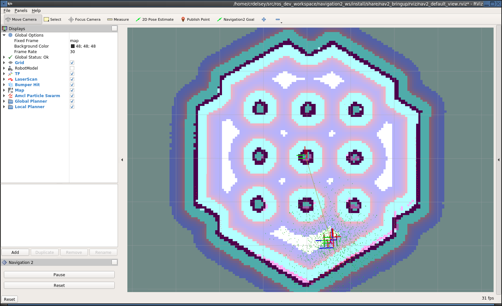
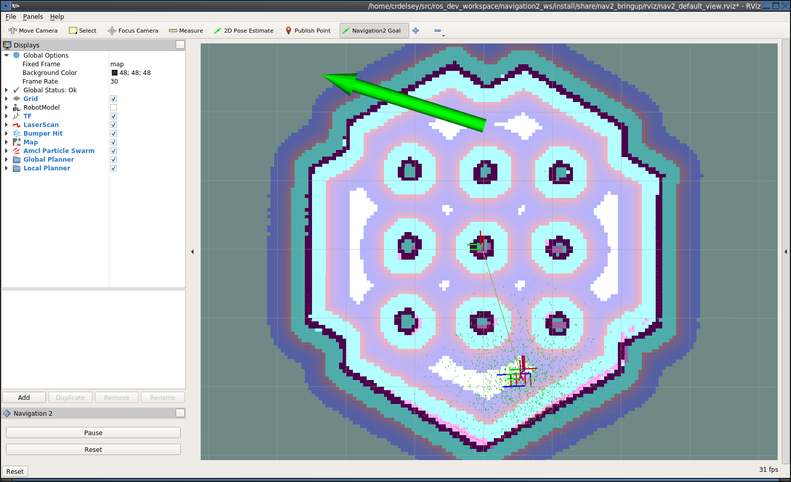
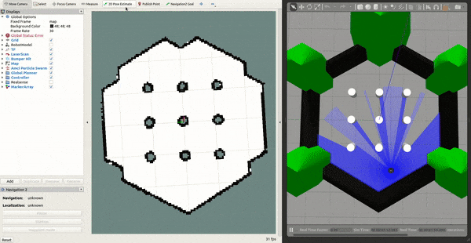

# Quickstart { #quickstart }

This document will take you through the process of installing the Nav2 binaries
and navigating a simulated Turtlebot 3 in the Gazebo simulator. See the [Build and Install][build-and-install]
for instructions how to build Nav2 from source.

!!! warning

    This is a simplified version of the Turtlebot 3 instructions. We highly recommend you follow the [official Turtlebot 3 manual](https://emanual.robotis.com/docs/en/platform/turtlebot3/quick-start/) if you intend to continue working with this robot beyond the minimal example provided here.

## Installation

1. Install the [ROS 2 binary packages](https://docs.ros.org/en/lyrical/Installation/Ubuntu-Install-Debs.html) as described in the official docs

2. Source your ROS 2 installation to set up the environment:
    ```bash
    source /opt/ros/{{ ros2_distro }}/setup.bash
    ```

3. Install the Nav2 packages using your operating system's package manager:

    !!! warning

        Nav2 does not currently release binaries on rolling, so it must be [build from source](../build_and_install/local_installation.md#__tabbed_2_2).

    ```bash
    sudo apt update
    sudo apt install \
        ros-$ROS_DISTRO-navigation2 \
        ros-$ROS_DISTRO-nav2-bringup
    ```

4. (Optional) Install the Turtlebot 3 & 4 packages for Gazebo.
   It should be automatically installed with `nav2_bringup`:

    ```bash
    sudo apt install ros-$ROS_DISTRO-nav2-minimal-tb\*
    ```

## Running the Example

1. Start a terminal in your GUI

2. In the same terminal, run:
    ```bash
    source /opt/ros/{{ ros2_distro }}/setup.bash
    ros2 launch nav2_bringup tb3_simulation_launch.py headless:=False
    ```

    !!! note

        `headless` defaults to true; if not set to false, gzclient (the 3d view) is not started.

    This launch file will launch Nav2 with the AMCL localizer in the
    simulation world.
    It will also launch the robot state publisher to provide transforms,
    a Gazebo instance with the Turtlebot3 URDF, and RVIZ.

    If everything has started correctly, you will see the RViz and Gazebo GUIs like
    this (this is Gazebo Classic, but what you see with modern Gazebo is virtually identical):

    <div markdown="span" class="flex-images">
      
      
    </div>

3. If not autostarting, click the "Startup" button in the bottom left corner of RViz.
    This will cause Nav2 to change to the Active state. It should change appearance to show the map.
    <figure markdown="span">
      { width="700" title="Initial appearance of RViz transitioning to the Active state" }
    </figure>

## Navigating

After starting, the robot initially has no idea where it is. By default,
Nav2 waits for you to give it an approximate starting position. Take a look
at where the robot is in the Gazebo world, and find that spot on the map. Set
the initial pose by clicking the "2D Pose Estimate" button in RViz, and then
down clicking on the map in that location. You set the orientation by dragging
forward from the down click.

If you are using the defaults so far, the robot should look roughly like this.

<figure markdown="span">
  { width="700" title="Approximate starting location of Turtlebot" }
</figure>

If you don't get the location exactly right, that's fine. Nav2 will refine
the position as it navigates. You can also, click the "2D Pose
Estimate" button and try again, if you prefer.

Once you've set the initial pose, the transform tree will be complete and
Nav2 will be fully active and ready to go. You should see the robot and particle
cloud now.

<figure markdown="span">
  { width="700" title="Nav2 is ready. Transforms and Costmap show in RViz." }
</figure>

Next, click the "Navigaton2 Goal" button and choose a destination.
This will call the BT navigator to go to that goal through an action server.
You can pause (cancel) or reset the action through the Nav2 rviz plugin shown.

<figure markdown="span">
  { width="700" title="Setting the goal pose in RViz." }
</figure>

Now watch the robot go!

<figure markdown="span">
  { width="700" title="Navigation2 with Turtlebot 3 Demo" }
</figure>
