# **NAV2** { #nav2 }

## Your Autonomous Navigation Framework

An open-source, production-grade autonomy framework trusted by 300+ companies worldwide. Building on 15 years of heritage to accelerate the robotics industry.

  <video autoplay muted loop playsinline>
    <source src="assets/hero_video.mp4" type="video/mp4">
  </video>

[Get Started :octicons-arrow-right-16:][getting-started]{ .md-button .md-button--primary }
[Concepts :octicons-light-bulb-16:][navigation-concepts]{ .md-button }
[First-Time Setup :octicons-tools-16:][first-time-robot-setup-guide]{ .md-button }

## **Our Sponsors**

<figure markdown="span">
  { width="700px" title="Our Sponsors"}
</figure>

## **Services**

If you need professional services related to Nav2, please contact Open Navigation at [info@opennav.org](mailto:info@opennav.org).

## **Overview**

Nav2 is the professionally-supported successor of the ROS Navigation Stack deploying the same kinds of technology powering Autonomous Vehicles brought down, optimized, and reworked for mobile and surface robotics.
This project allows for mobile robots to navigate through complex environments to complete user-defined application tasks with nearly any class of robot kinematics and dynamics; shape size; indoor or outdoor, or sensor configuration.
Not only can it move from Point A to Point B, but it can have intermediary poses, and represent other types of tasks like object following, complete coverage navigation, and more.
Nav2 is a production-grade and high-quality navigation framework trusted by 300+ companies worldwide.

It provides perception, planning, control, localization, visualization, behaviors, and much more to build highly reliable autonomous systems.
This will compute an environmental model from sensor and semantic data, dynamically route a path through the environment, compute feasible motor commands, avoid obstacles, and structures higher-level robot behaviors.

Nav2 uses behavior trees to create customized and intelligent navigation behavior via orchestrating many independent modular servers.
A task server can be used to compute a path, control effort, behavior, or any other navigation
related task. These separate servers communicate with the behavior tree (BT)
over a ROS interface such as an action server or service.
A robot may utilize potentially many different behavior trees to allow a robot to perform many types of unique and complex tasks.
A task server may have multiple plugins for controllers, planners, and behaviors to create contextual navigation behaviors.

<!-- It has tools to:

- Load, serve, and store maps
- Localize the robot on a provided map (SLAM provides the initial map)
- Plan a complete path through the environment, even kinematically feasibly for large robots
- Control the robot to follows the path and dynamically adjust to avoid collision
- Smooth plans to be more continuous, smooth, and/or feasible
- Convert sensor data into an environmental model of the world
- Build complicated and highly-customizable robot behaviors using behavior trees
- Conduct pre-defined behaviors in case of failure, human intervention, or other
- Follow sequential waypoints comprising a mission
- Manage the system's program lifecycle and watchdog for the servers
- Easy dynamically loaded plugins for creating customized algorithms, behaviors and so on
- Monitor raw sensor data for imminent collision or dangerous situation
- Python3 API to interact with Nav2 and its internal task servers in a pythonic manner
- A smoother on output velocities to guarantee dynamic feasibility of commands
- ... and more! -->

<figure markdown="span">
  { width="700px" title="Navigation2 Block Diagram"}
</figure>

We also provide a set of starting plugins to get you going.
A list of all plugins can be found on [Navigation Plugins][navigation-plugins] - but they include algorithms for the spanning cross section of common behaviors and robot platform types.

- :octicons-book-16: [Citations][citations] - If you use the navigation framework, an algorithm from this repository, or ideas from it please cite this work in your papers!

<!-- CSS located in overrides/assets/stylesheets/robots_marquee.css -->

  

    
    <a href="robots_using/">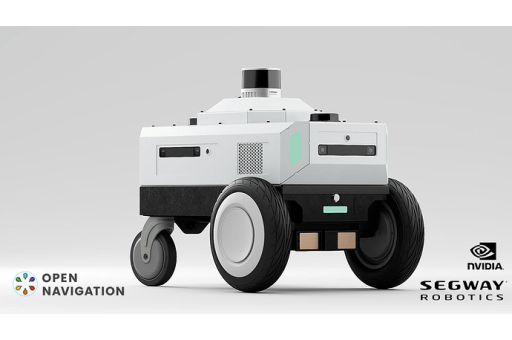</a>
    
    
    
    <a href="robots_using/">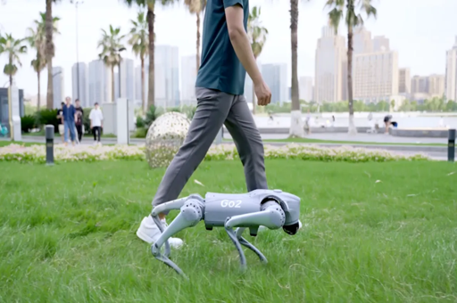</a>
    
    <a href="robots_using/">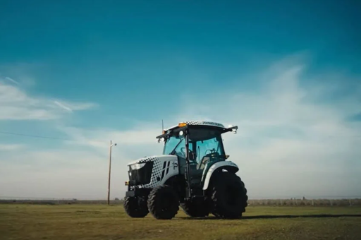</a>
    
    <a href="robots_using/">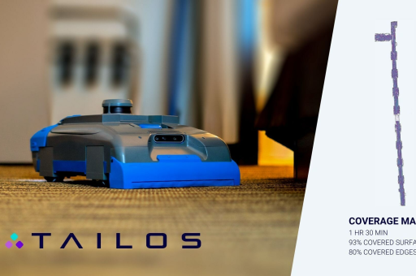</a>
    
    <a href="robots_using/">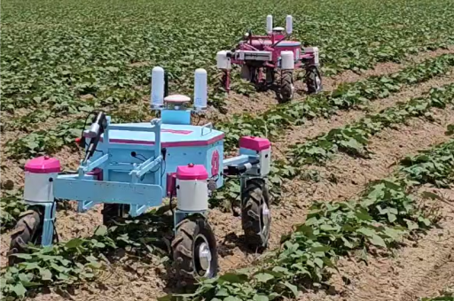</a>
    <a href="robots_using/">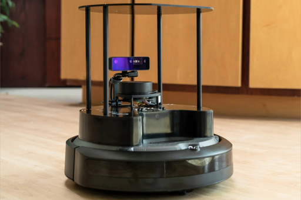</a>
    
    <a href="robots_using/">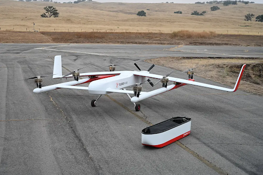</a>
    <a href="robots_using/">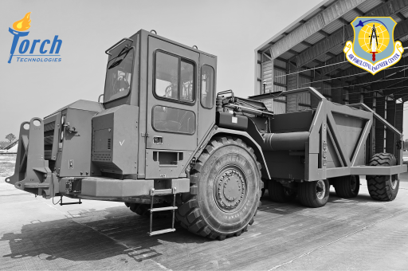</a>
    <a href="robots_using/">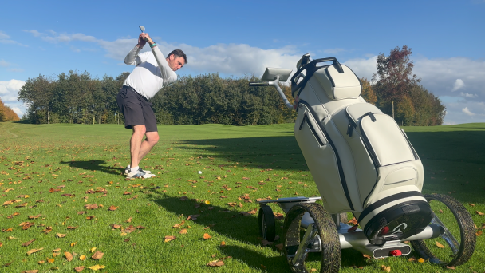</a>
    <!-- Duplicate for seamless loop -->
    
    
    
    
    
    
    
    
    
    
    
    
    
    
    
    
    
  

## **Distributions**

Nav2 is available across multiple ROS 2 distributions with varying levels of support:

<!-- CSS files located in overrides/assets/stylesheets/distro_grid.css -->

  

    
Rolling Ridley

    
Development

    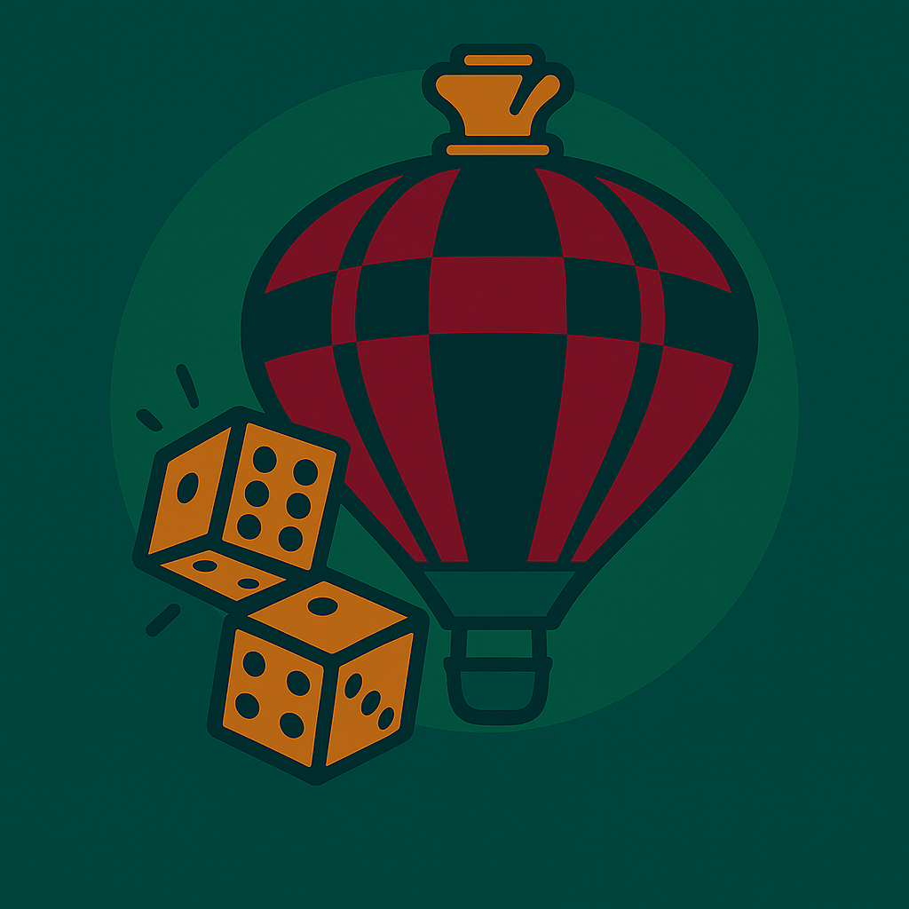
  

  

    
Lyrical Lynx

    
Active Support

    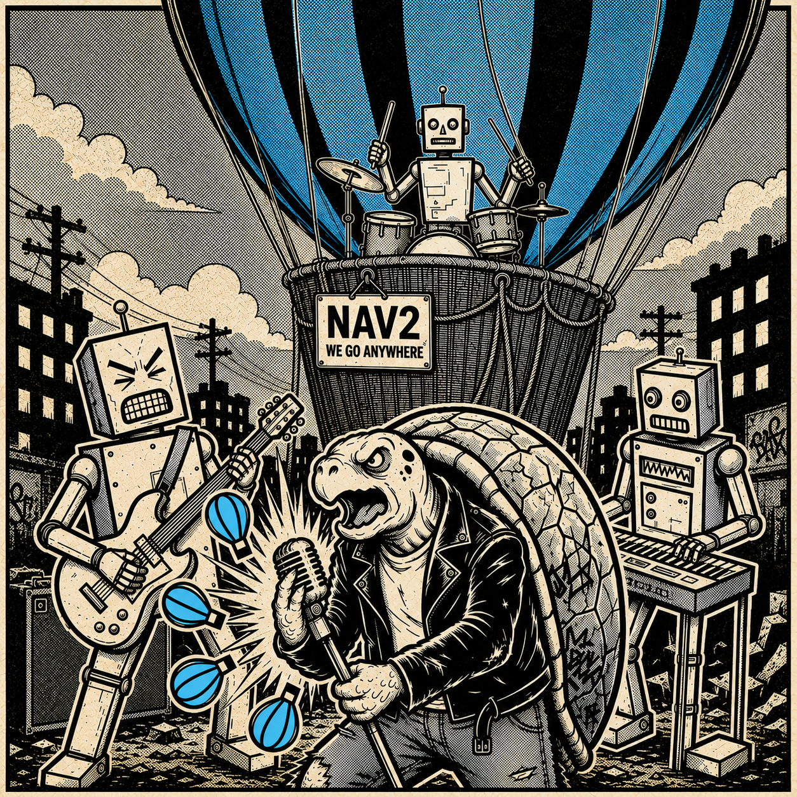
  

  

    
Kilted Kaiju

    
Maintained

    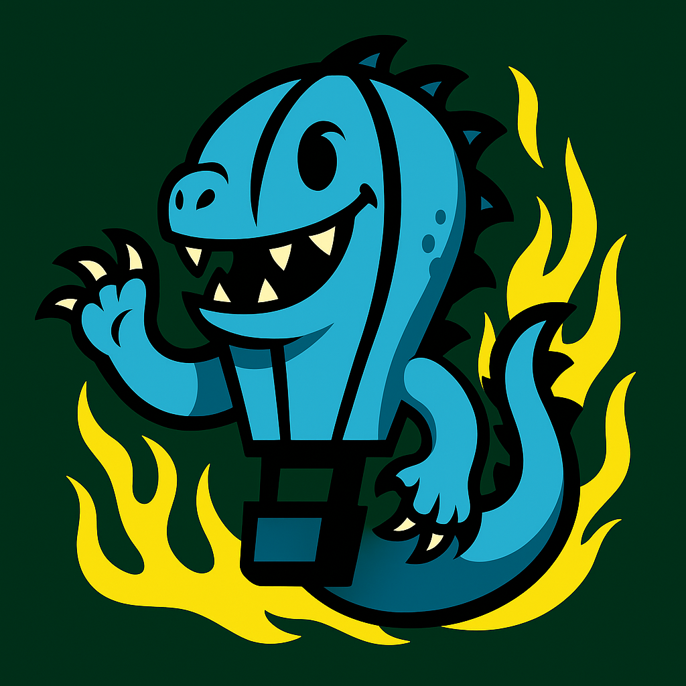
  

  

    
Jazzy Jalisco

    
Active Support

    
  

  

    
Iron Irwini

    
End of Life

    
  

  

    
Humble Hawksbill

    
Maintained

    
  

  

    
Galactic Geochelone

    
End of Life

    
  

