# Robots Using { #robots-using }

It's always helpful (and fun!) to have a list of robots using or ship with our work.
Below is a very early list of robots we have encountered using our software as examples.

Click on the images below for a link to the drivers or navigation configurations.

<!-- CSS located in overrides/assets/stylesheets/robots_grid.css -->

<figure markdown="span">
  
</figure>
<figure markdown="span">
  
</figure>
<figure markdown="span">
  
</figure>
<figure markdown="span">
  
</figure>
<figure markdown="span">
  
</figure>
<figure markdown="span">
  
</figure>
<figure markdown="span">
  
</figure>
<figure markdown="span">
  
</figure>
<figure markdown="span">
  
</figure>
<figure markdown="span">
  
</figure>
<figure markdown="span">
  
</figure>
<figure markdown="span">
  
</figure>
<figure markdown="span">
  [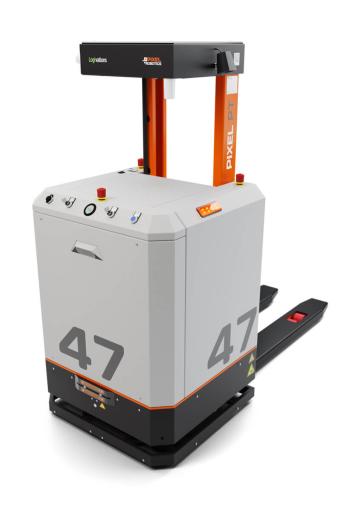](https://pixel-robotics.eu/)
</figure>
<figure markdown="span">
  [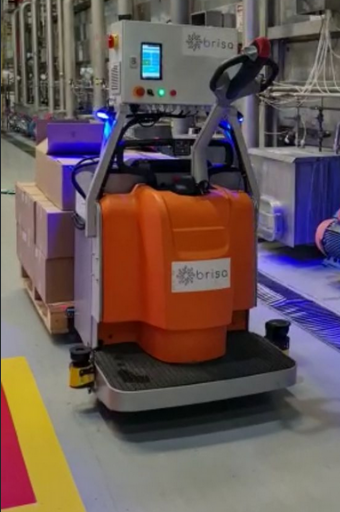](https://www.brisa.tech/)
</figure>
<figure markdown="span">
  
</figure>
<figure markdown="span">
  [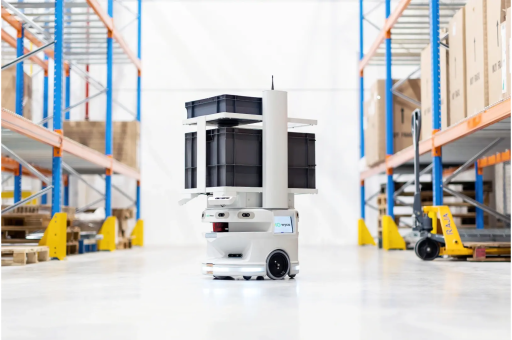](https://www.wyca-robotics.fr/)
</figure>
<figure markdown="span">
  
</figure>
<figure markdown="span">
  [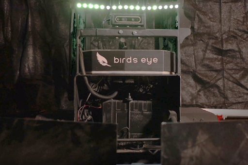](https://www.birdseyerobotics.com/)
</figure>
<figure markdown="span">
  [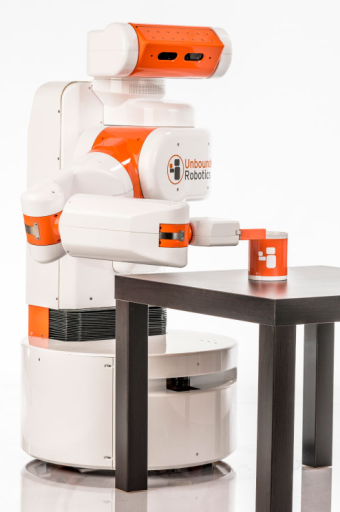](https://www.robotandchisel.com/2020/09/01/navigation2)
</figure>
<figure markdown="span">
  [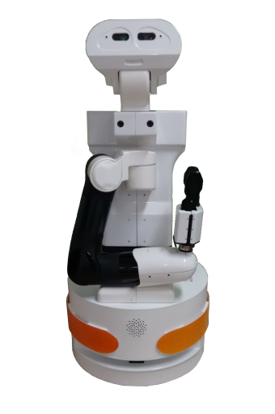](https://github.com/IntelligentRoboticsLabs/marathon_ros2)
</figure>
<figure markdown="span">
  [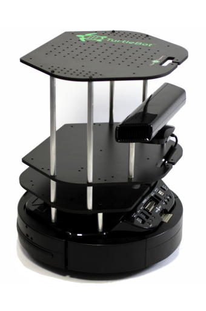](https://github.com/kobuki-base/kobuki_ros)
</figure>
<figure markdown="span">
  [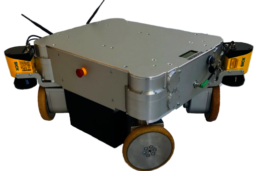](https://github.com/neobotix/neo_mpo_700-2)
</figure>
<figure markdown="span">
  [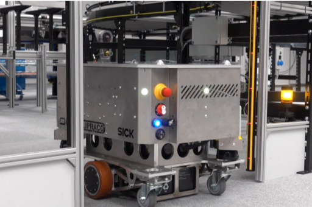](https://rex.software)
</figure>
<figure markdown="span">
  
</figure>
<figure markdown="span">
  
</figure>
<figure markdown="span">
  
</figure>
<figure markdown="span">
  
</figure>
<figure markdown="span">
  
</figure>
<figure markdown="span">
  
</figure>
<figure markdown="span">
  [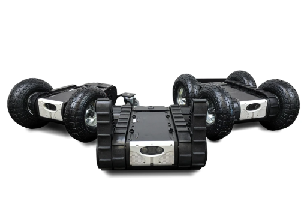](https://github.com/RoverRobotics/openrover-ros2)
</figure>
<figure markdown="span">
  
</figure>
<figure markdown="span">
  [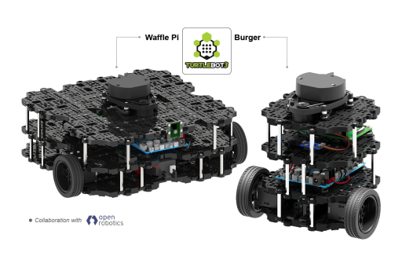](https://github.com/ROBOTIS-GIT/turtlebot3)
</figure>
<figure markdown="span">
  [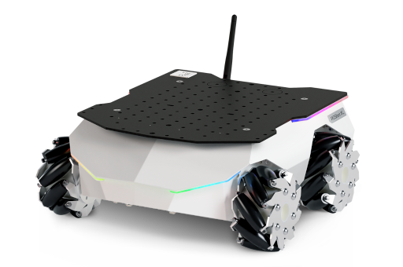](https://github.com/husarion/rosbot-xl-autonomy)
</figure>
<figure markdown="span">
  [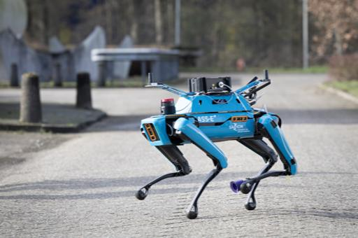](https://www.saxion.nl/)
</figure>
<figure markdown="span">
  
</figure>
<figure markdown="span">
  
</figure>

## Research Robots

<figure markdown="span">
  [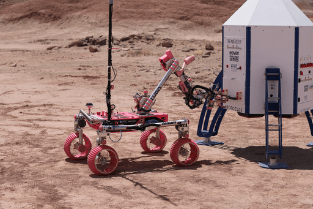](https://www.novarover.space/)
</figure>
<figure markdown="span">
  [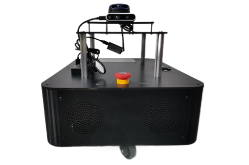](https://www.aztrobotics.com/walking-y2.html)
</figure>
<figure markdown="span">
  
</figure>

