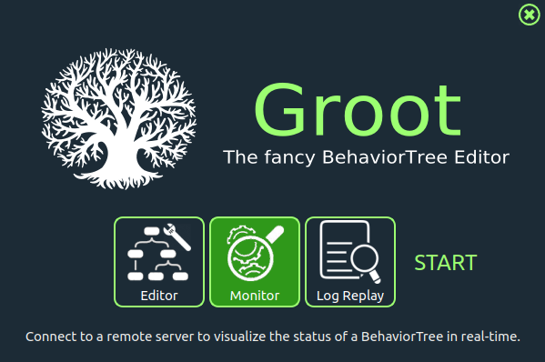

# Groot Tutorials { #groot-tutorials }

<figure markdown="span">
  { title="groot_startup_menu"}
</figure>

## Overview

  <iframe width="560" height="315" src="https://www.youtube-nocookie.com/embed/Z6xCat0zaWU?playlist=Z6xCat0zaWU&autoplay=1&mute=1&loop=1" frameborder="0" allowfullscreen></iframe>

[Groot](https://github.com/BehaviorTree/Groot) is the companion application of the [BehaviorTree.CPP](https://github.com/BehaviorTree/BehaviorTree.CPP) library used to create, edit, and visualize behavior trees.
Behavior Trees are deeply integrated into Nav2, used as the main method of orchestrating task server logic across a complex navigation and autonomy stack.
Behavior Trees, in short BTs, consist of many nodes completing different tasks and control the flow of logic, similar to a Hierarchical or Finite State Machine, but organized in a tree structure.
These nodes are of types: *Action*, *Condition*, *Control*, or *Decorator*, and are described in more detail in [Navigation Concepts][navigation-concepts] and [Types of nodes in BehaviorTree.CPP](https://www.behaviortree.dev/docs/learn-the-basics/BT_basics#types-of-nodes).

[Writing a New Behavior Tree Plugin][writing-a-new-behavior-tree-plugin] offers a well written example of creating a simple `Action` node if creating new BT nodes is of interest. This tutorial will focus solely on launching Groot, visualizing a Behavior Tree, and modifying that tree for a given customization, assuming a library of BT nodes. Luckily, Nav2 provides a robust number of BT nodes for your use out of the box, enumerated in [Navigation Plugins][navigation-plugins].

A BT configuration file in BehaviorTree.CPP is an XML file. This is used to dynamically load the BT node plugins at run-time from the appropriate libraries mapped to their names. The XML format is defined [in detail here](https://www.behaviortree.dev/docs/learn-the-basics/xml_format/). Therefore, Groot needs to have a list of nodes it has access to and important metadata about them like their type and ports (or parameters). We refer to this as the "palette" of nodes later in the tutorial.

In the video above you can see Groot side-by-side with RViz and a test platform 100% equipped with ROS-enabled hardware from SIEMENS.

There are tutorials available for both Groot and Groot2, with Groot2 being the newer version. Groot is used with BehaviorTree.CPP v3.x, while Groot2 is designed for v4.x.

[Groot - Interacting with Behavior Trees][groot-interacting-with-behavior-trees]{ .md-button .md-button--primary }
[Groot2 - Interacting with Behavior Trees][groot2-interacting-with-behavior-trees]{ .md-button .md-button--primary }

