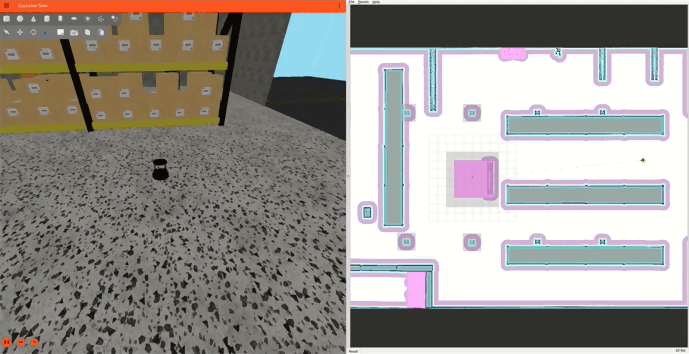

# Route Server Tools { #route-server-tools }

Route Server tools are essential components in the Nav2 ecosystem that help users create, edit, and manage route graphs for robot navigation. A route graph is a representation of valid paths that a robot can follow in its environment, consisting of nodes (waypoints) and edges (connections between waypoints). These tools simplify the process of defining preferred paths and restricted areas for robot navigation.

Unlike free-space planning, route-based navigation ensures that robots follow specific, predefined paths, which is particularly useful in:

- Industrial environments where specific routes must be followed
- Warehouse operations requiring structured movement patterns
- Facilities with restricted areas or preferred paths
- Multi-robot coordination scenarios where predefined routes help prevent conflicts
- Large scale outdoor urban or natural environments

<figure markdown="span">
  { width="100%" }
  <figcaption>Demonstration of Nav2 route tool using the Turtlebot4 Gazebo simulation environment visualised through RViz.</figcaption>
</figure>

## Provided Tools

- [Using the Nav2 Route Tool][using-the-nav2-route-tool]
- [Route Graph Generation LIF Editor][route-graph-generation-lif-editor]
- [Route Graph Generation][route-graph-generation]
- [SWAGGER Route Graph Generation][swagger-route-graph-generation]

## Description

There are several tools available for creating and editing route graphs for the Nav2 Route Server:

1. **Nav2 Route Tool**: An Rviz panel that allows users to create, edit, and manage route graphs directly within the ROS 2 environment. It supports loading existing graphs, adding/editing/removing nodes and edges, and saving changes to files.
2. **VDA LIF Editor**: A web-based tool that allows users to create route graphs using floor plan images. It can generate both GeoJSON and LIF formats, making it particularly useful for standardized route creation. No installation is required as it runs in a web browser.
3. **Manual Route Graph Generation**: For those who prefer direct file editing, route graphs can be created manually in GeoJSON format using QGIS. This method provides the most control over the graph structure but requires understanding of the GeoJSON format.
4. **Swagger Generation**: A tool that automatically generates route graphs from raster images using GPU-aided geometric techniques for unstructured, semistructured, or applications where specific lanes and manual annotations are not required.

Choose the tool that best fits your needs based on your workflow and requirements.
