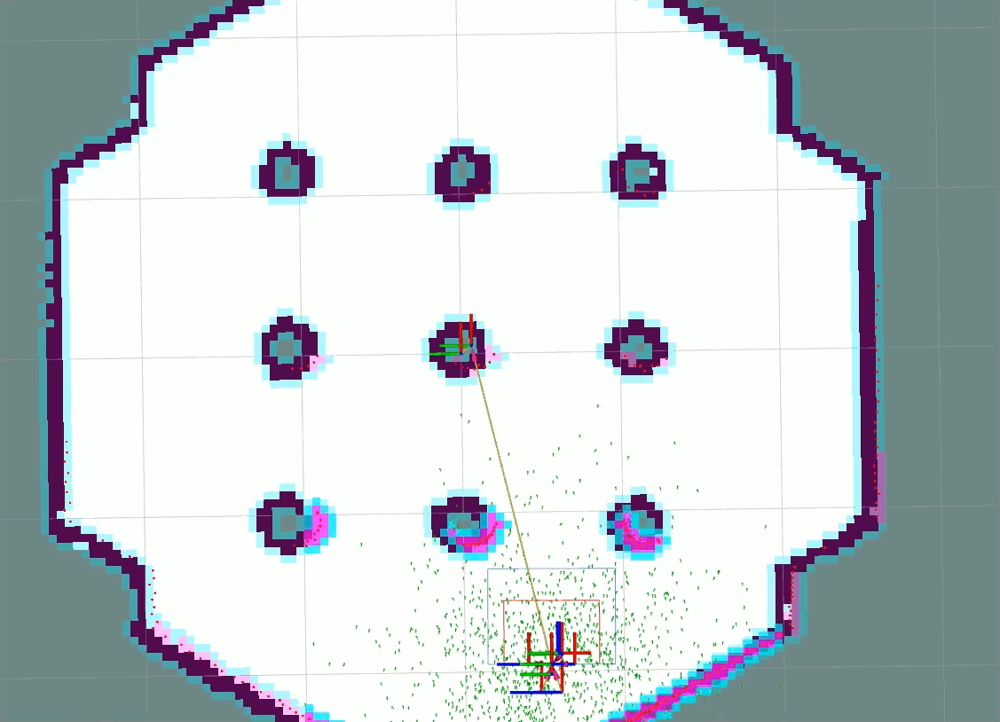
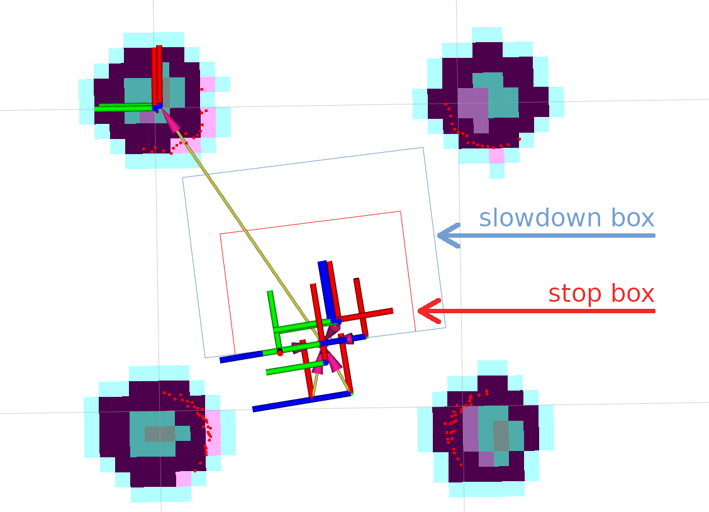
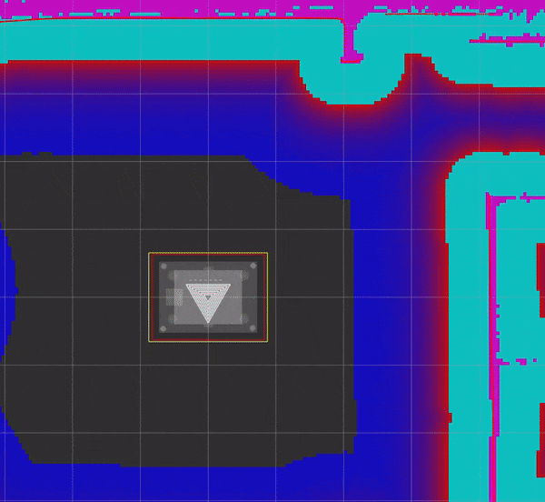
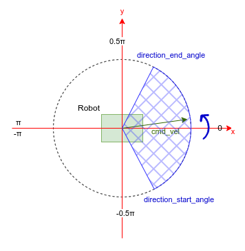
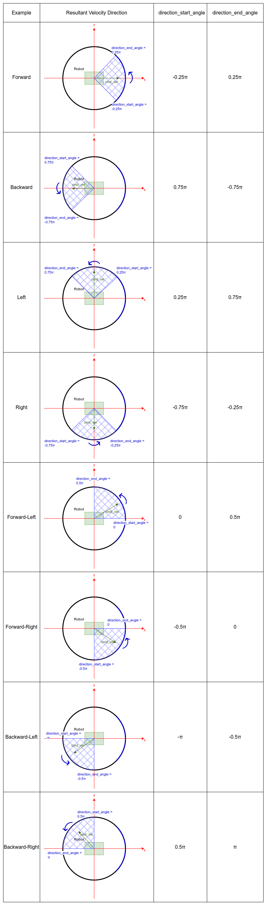
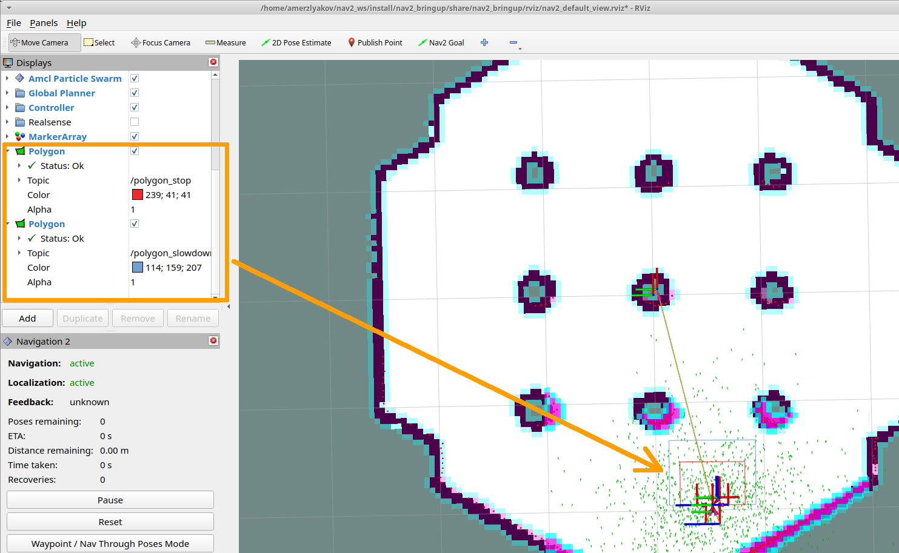
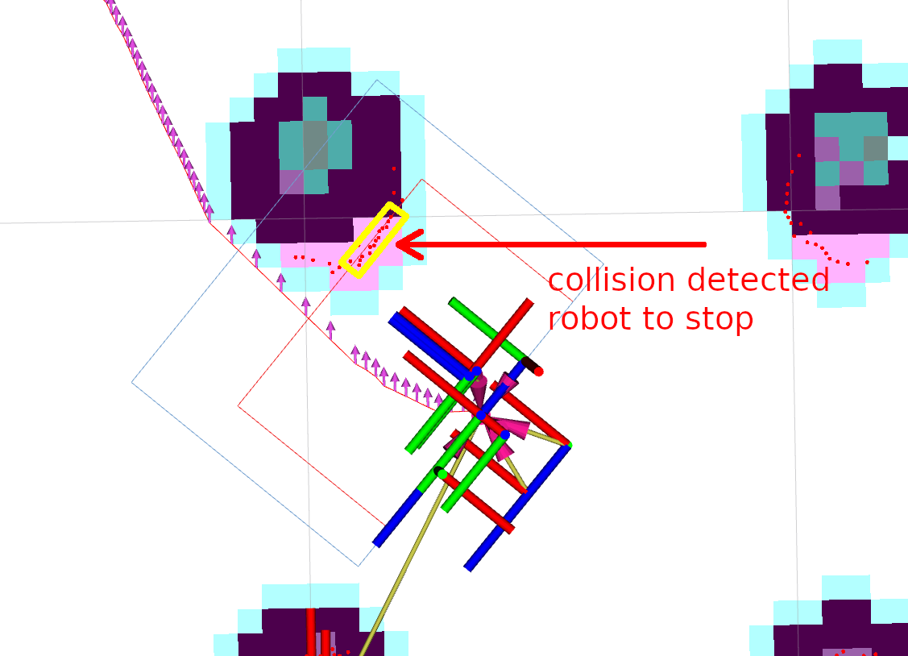

# Using Collision Monitor { #using-collision-monitor }

<figure markdown="span">
  { width="800px" }
</figure>

## Overview

This tutorial shows how to use a Collision Monitor with Nav2 stack. Based on this tutorial, you can setup it for your environment and needs.

## Requirements

It is assumed ROS2 and Nav2 dependent packages are installed or built locally.
Please make sure that Nav2 project is also built locally as it was made in [Build and Install][build-and-install].

## Configuring Collision Monitor

The Collision Monitor node has its own `collision_monitor_node.launch.py` launch-file and preset parameters in the `collision_monitor_params.yaml` file for demonstration, though its trivial to add this to Nav2's main launch file if being used in practice.
For the demonstration, two shapes will be created - an inner stop and a larger slowdown bounding boxes placed in the front of the robot:

<figure markdown="span">
  { width="800px" }
</figure>

If more than 3 points will appear inside a slowdown box, the robot will decrease its speed to `30%` from its value.
For the cases when obstacles are dangerously close to the robot, inner stop zone will work.
For this setup, the following lines should be added into `collision_monitor_params.yaml` parameters file. Stop box is named as `PolygonStop` and slowdown bounding box - as `PolygonSlow`:

```yaml
polygons: ["PolygonStop", "PolygonSlow"]
PolygonStop:
  type: "polygon"
  points: "[[0.4, 0.3], [0.4, -0.3], [0.0, -0.3], [0.0, 0.3]]"
  action_type: "stop"
  min_points: 4
  visualize: True
  polygon_pub_topic: "polygon_stop"
PolygonSlow:
  type: "polygon"
  points: "[[0.6, 0.4], [0.6, -0.4], [0.0, -0.4], [0.0, 0.4]]"
  action_type: "slowdown"
  min_points: 4
  slowdown_ratio: 0.3
  visualize: True
  polygon_pub_topic: "polygon_slowdown"
```

!!! note

    The circle shape could be used instead of polygon, e.g. for the case of omni-directional robots where the collision can occur from any direction. However, for the tutorial needs, let's focus our view on polygons. For the same reason, we leave out of scope the Approach model. Both of these cases could be easily enabled by referencing to the [Collision Monitor][collision-monitor] configuration guide.

!!! note

    Both polygon shapes in the tutorial were set statically. However, there is an ability to dynamically adjust them over time using topic messages containing vertices points for polygons or footprints. For more information, please refer to the configuration guide.

For the working configuration, at least one data source should be added.
In current demonstration, it is used laser scanner (though `PointCloud2` and Range/Sonar/IR sensors are also possible), which is described by the following lines for Collision Monitor node:

```yaml
observation_sources: ["scan"]
scan:
  type: "scan"
  topic: "scan"
```

Set topic names, frame ID-s and timeouts to work correctly with a default Nav2 setup.
The whole `nav2_collision_monitor/params/collision_monitor_params.yaml` file in this case will look as follows:

```yaml
collision_monitor:
  ros__parameters:
    enabled: True
    base_frame_id: "base_footprint"
    odom_frame_id: "odom"
    cmd_vel_in_topic: "cmd_vel_smoothed"
    cmd_vel_out_topic: "cmd_vel"
    transform_tolerance: 0.5
    source_timeout: 5.0
    stop_pub_timeout: 2.0
    enable_stamped_cmd_vel: True
    polygons: ["PolygonStop", "PolygonSlow"]
    PolygonStop:
      type: "polygon"
      points: "[[0.4, 0.3], [0.4, -0.3], [0.0, -0.3], [0.0, 0.3]]"
      action_type: "stop"
      min_points: 4
      visualize: True
      polygon_pub_topic: "polygon_stop"
    PolygonSlow:
      type: "polygon"
      points: "[[0.6, 0.4], [0.6, -0.4], [0.0, -0.4], [0.0, 0.4]]"
      action_type: "slowdown"
      min_points: 4
      slowdown_ratio: 0.3
      visualize: True
      polygon_pub_topic: "polygon_slowdown"
    observation_sources: ["scan"]
    scan:
      type: "scan"
      topic: "scan"
```

## Configuring Collision Monitor with VelocityPolygon

<figure markdown="span">
  { width="800px" }
</figure>

For this part of tutorial, we will set up the Collision Monitor with `VelocityPolygon` type for a `stop` action. `VelocityPolygon` allows the user to setup multiple polygons to cover the range of the robot's velocity limits. For example, the user can configure different polygons for rotation, moving forward, or moving backward. The Collision Monitor will check the robot's velocity against each sub polygon to determine the appropriate polygon to be used for collision checking.

In general, here are the steps to configure the Collision Monitor with `VelocityPolygon` type:

1. Add a `VelocityPolygon` to the `polygons` param list
2. Configure the `VelocityPolygon`
3. Specify the `holonomic` property of the polygon (default is `false`)
4. Start by adding a `stopped` sub polygon to cover the full range of the robot's velocity limits in `velocity_polygons` list
5. Add additional sub polygons to the front of the `velocity_polygons` list to cover the range of the robot's velocity limits for each type of motion (e.g. rotation, moving forward, moving backward)

In this example, we will consider a **non-holonomic** robot with linear velocity limits of `-1.0` to `1.0` m/s and angular velocity limits of `-1.0` to `1.0` rad/s. The `linear_min` and `linear_max` parameters of the sub polygons should be set to the robot's linear velocity limits, while the `theta_min` and `theta_max` parameters should be set to the robot's angular velocity limits.

Below is the example configuration using 4 sub-polygons to cover the full range of the robot's velocity limits:

```yaml
polygons: ["VelocityPolygonStop"]
VelocityPolygonStop:
  type: "velocity_polygon"
  action_type: "stop"
  min_points: 6
  visualize: True
  enabled: True
  polygon_pub_topic: "velocity_polygon_stop"
  velocity_polygons: ["rotation", "translation_forward", "translation_backward", "stopped"]
  holonomic: false
  rotation:
    points: "[[0.3, 0.3], [0.3, -0.3], [-0.3, -0.3], [-0.3, 0.3]]"
    linear_min: 0.0
    linear_max: 0.05
    theta_min: -1.0
    theta_max: 1.0
  translation_forward:
    points: "[[0.35, 0.3], [0.35, -0.3], [-0.2, -0.3], [-0.2, 0.3]]"
    linear_min: 0.0
    linear_max: 1.0
    theta_min: -1.0
    theta_max: 1.0
  translation_backward:
    points: "[[0.2, 0.3], [0.2, -0.3], [-0.35, -0.3], [-0.35, 0.3]]"
    linear_min: -1.0
    linear_max: 0.0
    theta_min: -1.0
    theta_max: 1.0
  # This is the last polygon to be checked, it should cover the entire range of robot's velocities
  # It is used as the stopped polygon when the robot is not moving and as a fallback if the velocity
  # is not covered by any of the other sub-polygons
  stopped:
    points: "[[0.25, 0.25], [0.25, -0.25], [-0.25, -0.25], [-0.25, 0.25]]"
    linear_min: -1.0
    linear_max: 1.0
    theta_min: -1.0
    theta_max: 1.0
```

!!! note

    It is recommended to include a `stopped` sub polygon as the last entry in the `velocity_polygons` list to cover the entire range of the robot's velocity limits. In cases where the velocity is not within the scope of any sub polygons, the Collision Monitor will log a warning message and continue with the previously matched polygon.

!!! note

    When velocity is covered by multiple sub polygons, the first sub polygon in the list will be used.

**For holomic robots:**

For holomic robots, the `holonomic` property should be set to `true`. In this scenario, the `linear_min` and `linear_max` parameters should cover  the magnitude of the robot's resultant velocity limits (using only non-negative values), while the `theta_min` and `theta_max` parameters should cover the robot's angular velocity limits. Additionally, there will be 2 more parameters, `direction_start_angle` and `direction_end_angle`, to specify the resultant velocity direction. The covered direction will always span from `direction_start_angle` to `direction_end_angle` in the **counter-clockwise** direction.

<figure markdown="span">
  { width="365px" }
</figure>

Below shows some common configurations for holonomic robots that cover multiple directions of the resultant velocity:

<figure markdown="span">
  { height="2880px" }
</figure>

```yaml
collision_monitor:
  ros__parameters:
    base_frame_id: "base_footprint"
    odom_frame_id: "odom"
    cmd_vel_in_topic: "cmd_vel_smoothed"
    cmd_vel_out_topic: "nav_vel"
    state_topic: "collision_monitor_state"
    transform_tolerance: 0.3
    source_timeout: 1.0
    base_shift_correction: True
    stop_pub_timeout: 2.0
    holonomic: true       # Set to true for holonomic robots

    polygons: ["VelocityPolygonSlow"]

    VelocityPolygonSlow:
      type: "velocity_polygon"
      action_type: "slowdown"
      slowdown_ratio: 0.5
      holonomic: true
      visualize: True
      enabled: True
      velocity_polygons: [
        "forward", "forward_left", "left", "backward_left",
        "backward", "backward_right", "right", "forward_right",
        "stopped"
      ]

      forward:
        points: "[[0.6, 0.4], [0.6, -0.4], [-0.3, -0.4], [-0.3, 0.4]]"
        linear_min: 0.05
        linear_max: 1.0
        direction_start_angle: -0.785   # -0.25pi
        direction_end_angle: 0.785      # 0.25pi
        theta_min: -1.0
        theta_max: 1.0

      forward_left:
        points: "[[0.55, 0.55], [0.55, -0.3], [-0.3, -0.3], [-0.3, 0.55]]"
        linear_min: 0.05
        linear_max: 1.0
        direction_start_angle: 0.0      # 0.0pi
        direction_end_angle: 1.571      # 0.5pi
        theta_min: -1.0
        theta_max: 1.0

      left:
        points: "[[0.4, 0.6], [0.4, -0.4], [-0.4, -0.4], [-0.4, 0.6]]"
        linear_min: 0.05
        linear_max: 1.0
        direction_start_angle: 0.785     # 0.25pi
        direction_end_angle: 2.356       # 0.75pi
        theta_min: -1.0
        theta_max: 1.0

      backward_left:
        points: "[[0.3, 0.55], [0.3, -0.3], [-0.55, -0.3], [-0.55, 0.55]]"
        linear_min: 0.05
        linear_max: 1.0
        direction_start_angle: -3.1415   # -pi
        direction_end_angle: -1.571      # -0.5pi
        theta_min: -1.0
        theta_max: 1.0

      backward:
        points: "[[0.3, 0.4], [0.3, -0.4], [-0.6, -0.4], [-0.6, 0.4]]"
        linear_min: 0.05
        linear_max: 1.0
        direction_start_angle: 2.356     # 0.75pi
        direction_end_angle: -2.356      # -0.75pi
        theta_min: -1.0
        theta_max: 1.0

      backward_right:
        points: "[[0.3, 0.3], [0.3, -0.55], [-0.55, -0.55], [-0.55, 0.3]]"
        linear_min: 0.05
        linear_max: 1.0
        direction_start_angle: 1.571     # 0.5pi
        direction_end_angle: 3.1415      # pi
        theta_min: -1.0
        theta_max: 1.0

      right:
        points: "[[0.4, 0.4], [0.4, -0.6], [-0.4, -0.6], [-0.4, 0.4]]"
        linear_min: 0.05
        linear_max: 1.0
        direction_start_angle: -2.356    # -0.75pi
        direction_end_angle: -0.785      # -0.25pi
        theta_min: -1.0
        theta_max: 1.0

      forward_right:
        points: "[[0.55, 0.3], [0.55, -0.55], [-0.3, -0.55], [-0.3, 0.3]]"
        linear_min: 0.05
        linear_max: 1.0
        direction_start_angle: -1.571   # -0.5pi
        direction_end_angle: 0.0        # 0.0pi
        theta_min: -1.0
        theta_max: 1.0

      # Stopped
      stopped:
        points: "[[0.4, 0.4], [0.4, -0.4], [-0.4, -0.4], [-0.4, 0.4]]"
        linear_min: 0.0
        linear_max: 0.05
        direction_start_angle: -3.1415
        direction_end_angle: 3.1415
        theta_min: -1.0
        theta_max: 1.0
```

## Designing Velocity Polygons

The configuration above shows the syntax.
This section explains how a sub-polygon is selected at runtime, how to split the velocity space into regimes, and how to size each sub-polygon.
All parameters are described in the [Collision Monitor][collision-monitor] configuration guide.

### How a sub-polygon is selected

Each time a velocity command arrives on `cmd_vel_in_topic`, the Collision Monitor switches each enabled `velocity_polygon` to one of its sub-polygons and checks the sensor data against that shape only.
The rules below are implemented in [`VelocityPolygon::updatePolygon()` and `VelocityPolygon::isInRange()`](https://github.com/ros-navigation/navigation2/blob/main/nav2_collision_monitor/src/velocity_polygon.cpp):

- The selection uses the **incoming command**, not odometry and not the output of the Collision Monitor.
  The shape follows what the robot is asked to do, not how fast it is actually moving.
- Sub-polygons are tested in the order of `velocity_polygons` and the **first match wins**.
  All limits are inclusive, e.g. `linear_min <= v <= linear_max`.
- `theta_min` and `theta_max` are compared with `angular.z`.
  With `holonomic: false`, `linear_min` and `linear_max` are compared with the signed `linear.x`, and `linear.y` is ignored.
  With `holonomic: true`, they are compared with the speed `hypot(linear.x, linear.y)`, and the heading `atan2(linear.y, linear.x)` must lie between `direction_start_angle` and `direction_end_angle`.
  The direction range wraps through ±π when the start angle is greater than the end angle.
  At zero speed, the heading is taken as `0.0`.
- If no sub-polygon matches, the warning `Velocity is not covered by any of the velocity polygons` is printed and the **previous shape is kept**.
  If no command has matched since startup, the polygon has no shape yet and is skipped (`Polygon shape is not set yet`).
- If a data source is invalid (e.g. no data received within `source_timeout`; this check is disabled when `source_timeout` is `0.0`), the robot is stopped and no polygon is updated.
  If a polygon earlier in `polygons` has already triggered a stop, the polygons after it are not updated.
  In both cases, their shape does not change for that command.
- `state_topic` reports the name of the `velocity_polygon` that triggered (e.g. `VelocityPolygonStop`), not the name of the sub-polygon.
  To see which sub-polygon is in use, set `visualize: True` and watch `polygon_pub_topic`, which carries the vertices of the selected sub-polygon.

### Choosing velocity regimes

A single fixed polygon has to cover the worst case of every motion, so it is either too large for narrow passages or too small for some motions.
With one sub-polygon per motion, each shape covers only the area that motion can reach before the robot stops:

| Motion | What the sub-polygon has to cover |
| ------ | --------------------------------- |
| Forward | The footprint, extended at the front by the stopping distance (see [Sizing a sub-polygon](#sizing-a-sub-polygon)) |
| Backward | The footprint, extended at the rear by the stopping distance |
| Rotation in place | The circle swept by the footprint corners (the circumscribed radius), because the corners move outside the footprint while turning |
| Stopped | The footprint plus a small margin. When the motion sub-polygons cover every other command (including rotation in place), it is only selected for a zero or near-zero command, so it mainly decides whether the zone reports a stop while the robot stands still and, with `release_consecutive_points` above `1`, how long the robot waits before moving again. If it also covers slow motion or rotation in place, as in the holonomic example above, size it for those motions too |

Because the first match wins and the limits are inclusive, check which sub-polygon a **zero command** selects.
Any sub-polygon placed before `stopped` whose ranges contain `(0, 0)` takes precedence at standstill (with `holonomic: true`, any sub-polygon with `linear_min: 0.0` whose `theta` range and direction range both contain `0.0`).
In the non-holonomic example above, `rotation` (`linear_min: 0.0`, `theta_min: -1.0`, `theta_max: 1.0`) contains the zero command, so a robot standing still uses the `rotation` shape.
Together with `translation_forward` and `translation_backward`, it also covers every other command within ±1.0, so `stopped` is never selected there.
To make `stopped` the standstill shape, keep zero out of the motion ranges with a small deadband, as in the example below.

The following `StopZone` is an example for a differential-drive robot with a 0.5 m x 0.5 m footprint centered on the base frame (`x` and `y` within ±0.25 m), whose commands are limited to 0.5 m/s forward, 0.2 m/s backward and ±1.0 rad/s:

- The rotation is split by direction, and no motion range contains a command with both `|linear.x| < 0.005` m/s and `|angular.z| < 0.005` rad/s, so a zero command falls through to `stopped`.
  With a single rotation sub-polygon whose angular range contains zero placed before `stopped`, a zero command would select the rotation shape instead, and an obstacle beside the robot (outside the stopped shape, but inside the rotation shape) would keep `StopZone` triggered after the robot has stopped.
- The motion sub-polygons cover every command within the limits, so `stopped` only catches the deadband around zero.
  A command beyond the limits matches no sub-polygon and is reported by the warning described above.
- The dimensions follow the formula of the next section with the illustrative values `t_r = 0.3` s, `a = 1.0` m/s² and `d_m = 0.05` m.
  The front of `translation_forward` is at `0.25 + 0.325 = 0.575` m (`d` at 0.5 m/s), the rear of `translation_backward` is at `-(0.25 + 0.13) = -0.38` m (`d` at 0.2 m/s), and their other edges are `d_m` outside the footprint.
  The octagon of the rotation sub-polygons stays at least 0.41 m from the center, more than `d_m` outside the 0.354 m corner radius of the footprint.
- The forward and backward shapes only extend the leading edge by the stopping distance; clearance while turning along a path is left to an `approach` polygon on the footprint, which projects the full footprint along the commanded motion.

```yaml
StopZone:
  type: "velocity_polygon"
  action_type: "stop"
  min_points: 3
  visualize: True
  polygon_pub_topic: "stop_zone"
  enabled: True
  holonomic: false
  velocity_polygons: ["rotation", "rotation_clockwise", "translation_forward", "translation_backward", "stopped"]
  # Turning in place: an octagon enclosing the 0.354 m corner radius of the footprint
  rotation:
    points: "[[0.41, 0.17], [0.17, 0.41], [-0.17, 0.41], [-0.41, 0.17], [-0.41, -0.17], [-0.17, -0.41], [0.17, -0.41], [0.41, -0.17]]"
    linear_min: -0.005
    linear_max: 0.005
    theta_min: 0.005   # counter-clockwise only, zero is excluded
    theta_max: 1.0
  rotation_clockwise:
    points: "[[0.41, 0.17], [0.17, 0.41], [-0.17, 0.41], [-0.41, 0.17], [-0.41, -0.17], [-0.17, -0.41], [0.17, -0.41], [0.41, -0.17]]"
    linear_min: -0.005
    linear_max: 0.005
    theta_min: -1.0
    theta_max: -0.005  # clockwise only, zero is excluded
  # Front extended by d at 0.5 m/s, other edges by d_m
  translation_forward:
    points: "[[0.575, 0.3], [0.575, -0.3], [-0.3, -0.3], [-0.3, 0.3]]"
    linear_min: 0.005
    linear_max: 0.5
    theta_min: -1.0
    theta_max: 1.0
  # Rear extended by d at 0.2 m/s, other edges by d_m
  translation_backward:
    points: "[[0.3, 0.3], [0.3, -0.3], [-0.38, -0.3], [-0.38, 0.3]]"
    linear_min: -0.2
    linear_max: -0.005
    theta_min: -1.0
    theta_max: 1.0
  # Footprint plus d_m, selected for a zero command and the deadband around it
  stopped:
    points: "[[0.3, 0.3], [0.3, -0.3], [-0.3, -0.3], [-0.3, 0.3]]"
    linear_min: -0.2
    linear_max: 0.5
    theta_min: -1.0
    theta_max: 1.0
```

### Sizing a sub-polygon

A `stop` sub-polygon has to reach, in the direction of motion, at least as far as the robot travels between an obstacle entering the shape and the robot standing still.
This is the same reasoning used to dimension the protective fields of safety laser scanners, although the Collision Monitor itself is not safety-rated (see [Collision Monitor Node][collision-monitor-node]):

$$
d = v \, t_r + \frac{v^2}{2a} + d_m
$$

- `v`: the highest speed the base can actually have while the sub-polygon is selected.
  The selection uses the command, not the measured speed, so right after the command drops from a faster sub-polygon into this one, the base can still be faster than `linear_max` (or `|linear_min|` for backward motion).
  The gap grows when the Velocity Smoother decelerates the command faster than the base can follow (`max_decel` defaults to -2.5 m/s² for `x`).
  Either size the shape for that speed, or limit the Velocity Smoother deceleration to what the base achieves and add the remaining tracking lag.
- `a`: the deceleration the base actually achieves for a zero command.
  For a `stop` action, the Collision Monitor publishes a zero velocity on `cmd_vel_out_topic` directly, so deceleration limits configured upstream (e.g. in the Velocity Smoother) do not apply.
  Measure it on the robot.
- `t_r`: the reaction time from an obstacle entering the shape to the base starting to brake.
  It is the sum of:
    - the sensor delay: an obstacle appears in the next scan, up to one period later, and a spinning scanner that publishes after a full revolution can add up to one more period (0.1 to 0.2 s at 10 Hz);
    - late or dropped scans: each one adds a period, because the last scan is reused until `source_timeout`, so keep `source_timeout` a small multiple of the sensor period;
    - the command period: the check only runs when a command arrives on `cmd_vel_in_topic`, up to one period later (0.05 s for a Velocity Smoother running at 20 Hz);
    - with `base_shift_correction`, the wait for the odometry transform, up to one odometry period (about half on average);
    - `trigger_consecutive_points - 1` further command periods, if it is set above `1`;
    - the latency of the base driver from `cmd_vel` to braking.
- `d_m`: a margin for the range noise of the sensor and the position error of the shape itself.

For the example above, with `t_r = 0.3` s, `a = 1.0` m/s² and `d_m = 0.05` m, 0.5 m/s forward needs `0.15 + 0.125 + 0.05 = 0.325` m in front of the footprint and 0.2 m/s backward needs `0.06 + 0.02 + 0.05 = 0.13` m behind it.
These numbers are only an illustration; use the values measured on your robot.
Because `d` grows with `v²` (the same values give 0.85 m at 1.0 m/s), splitting a speed range into a slow and a fast sub-polygon keeps the slow shape small enough for narrow passages, as long as the slow shape is sized for the speed the base can still have when the command enters its range (see `v` above).

An `approach` polygon complements the `stop` sub-polygons.
On each command, it moves the polygon along the commanded velocity in steps of `simulation_time_step` for up to `time_before_collision` seconds.
If a collision is found in this projection, the command is scaled by `t / time_before_collision`, where `t` is the projected time to the collision, so the robot slows down as it gets closer to the obstacle.
`simulation_time_step` is the spatial resolution of this projection: `v * simulation_time_step` is 0.1 m at 1.0 m/s with the default of 0.1 s.

Two properties of the sensor also limit the shape:

- Scan readings outside `[range_min, range_max]` of the `LaserScan` message are dropped, so any part of a shape that is closer to the sensor than its minimum range can never contain a point.
  A stop has to be triggered while the object is still farther away than the minimum range, so in the direction of motion a stop shape has to reach at least `d` beyond it.
  Once an object is inside the minimum range, it disappears from the scan and the stop can be released; cover that range with another sensor if the robot has to stop for objects there.
- A thin object of width `w` at range `r` returns about `w / (r * angle_increment)` points.
  A 3 cm chair leg returns about 7 points at 0.5 m but only 3 at 1.0 m with a 0.5° resolution.
  `min_points` is shared by all sub-polygons of a `velocity_polygon`, and the points of all its sources are counted together.
  Choose it below the count of the thinnest object you need to stop for at the far edge of the largest sub-polygon, and above the count produced by isolated noise.

### Common mistakes and how to check them

- **A motion range contains zero before `stopped`:** the motion shape is used at standstill (see above).
- **Commands outside every range:** the previous shape is kept.
  Make the motion sub-polygons cover every command the robot can receive (the Velocity Smoother limits and any other publisher on `cmd_vel_in_topic`), so that the last entry only catches the deadband around zero.
  A command that falls through to a small `stopped` shape is checked against that shape without any warning.
- **Rounded direction limits:** for a holonomic sub-polygon covering all directions, leave `direction_start_angle` and `direction_end_angle` unset.
  The defaults are exactly -π and π, while rounded values such as ±3.1415 exclude pure backward motion, where the heading is exactly π.
- **Reading `state_topic` to find the sub-polygon:** it only contains the `velocity_polygon` name.
  Use `polygon_pub_topic` instead.

To check the selection, publish commands and watch the selected vertices.
Do this in simulation or with the base driver stopped, since the Collision Monitor forwards the command to `cmd_vel`.
Keep the sensor data valid, since an invalid source stops the robot before the shape is updated:

```bash
# Terminal 1: vertices of the selected sub-polygon
ros2 topic echo /velocity_polygon_stop --field polygon.points
# Terminal 2: command a rotation in place
# (TwistStamped, as enable_stamped_cmd_vel is True by default; use geometry_msgs/msg/Twist otherwise)
ros2 topic pub -r 20 /cmd_vel_smoothed geometry_msgs/msg/TwistStamped "{twist: {angular: {z: 0.5}}}"
```

## Preparing Nav2 stack

The Collision Monitor is designed to operate below Nav2 as an independent safety node.
It acts as a filter for the `cmd_vel` messages from the controller to avoid potential collisions.
If no such zone is triggered, then the `cmd_vel` message is used.
Else, it is scaled or set to stop as appropriate.

By default, the Collision Monitor is configured for usage with the Nav2 bringup package, running in parallel with the `navigation_launch.py` launch file. For correct operation of the Collision Monitor with the Velocity Smoother, it is required to remove the Velocity Smoother's `cmd_vel_smoothed` remapping in the `navigation_launch.py` bringup script as presented below. This will make the output topic of the Velocity Smoother to be untouched, which will be the input to the newly added Collision Monitor:

```python
Node(
    package='nav2_velocity_smoother',
    executable='velocity_smoother',
    name='velocity_smoother',
    output='screen',
    respawn=use_respawn,
    respawn_delay=2.0,
    parameters=[configured_params],
    arguments=['--ros-args', '--log-level', log_level],
    remappings=remappings +
-           [('cmd_vel', 'cmd_vel_nav'), ('cmd_vel_smoothed', 'cmd_vel')]),
+           [('cmd_vel', 'cmd_vel_nav')]),
...
ComposableNode(
    package='nav2_velocity_smoother',
    plugin='nav2_velocity_smoother::VelocitySmoother',
    name='velocity_smoother',
    parameters=[configured_params],
    remappings=remappings +
-              [('cmd_vel', 'cmd_vel_nav'), ('cmd_vel_smoothed', 'cmd_vel')]),
+              [('cmd_vel', 'cmd_vel_nav')]),
```

If you have changed Collision Monitor's default `cmd_vel_in_topic` and `cmd_vel_out_topic` configuration, make sure Velocity Smoother's default output topic `cmd_vel_smoothed` should match to the input velocity `cmd_vel_in_topic` parameter value of the Collision Monitor node, and the output velocity `cmd_vel_out_topic` parameter value should be actual `cmd_vel` to fit the replacement.

!!! note

    As the Collision Monitor acts as a safety node, it must be the last link in the velocity message post-processing chain, making it the node that publishes to the `cmd_vel` topic. It could be placed after smoothed velocity, as in our demonstration, or after non-smoothed velocity from Controller Server, e.g. if Velocity Smoother was not enabled in the system, or going after any other module in custom configuration producing the end-velocity. Therefore, in any custom Nav2 launch configuration, the last node publishing to the `cmd_vel` topic, should be remapped to publish to the Collision Monitor input topic configured by `cmd_vel_in_topic` ROS-parameter (`cmd_vel_smoothed` by default).

## Demo Execution

Once Collision Monitor node has been tuned and `cmd_vel` topics adjusted, Collision Monitor node is ready to run.
For that, run Nav2 stack as written in [Quickstart][quickstart]:

```bash
ros2 launch nav2_bringup tb3_simulation_launch.py headless:=False
```

In parallel console, launch Collision Monitor node by using its launch-file:

```bash
ros2 launch nav2_collision_monitor collision_monitor_node.launch.py
```

Since both `PolygonStop` and `PolygonSlow` polygons will have their own publishers, they could be added to visualization as shown at the picture below:

<figure markdown="span">
  { width="800px" }
</figure>

Set the initial pose and then put Nav2 goal on map.
The robot will start its movement, slowing down while running near the obstacles, and stopping in close proximity to them:

<figure markdown="span">
  { width="800px" }
</figure>
