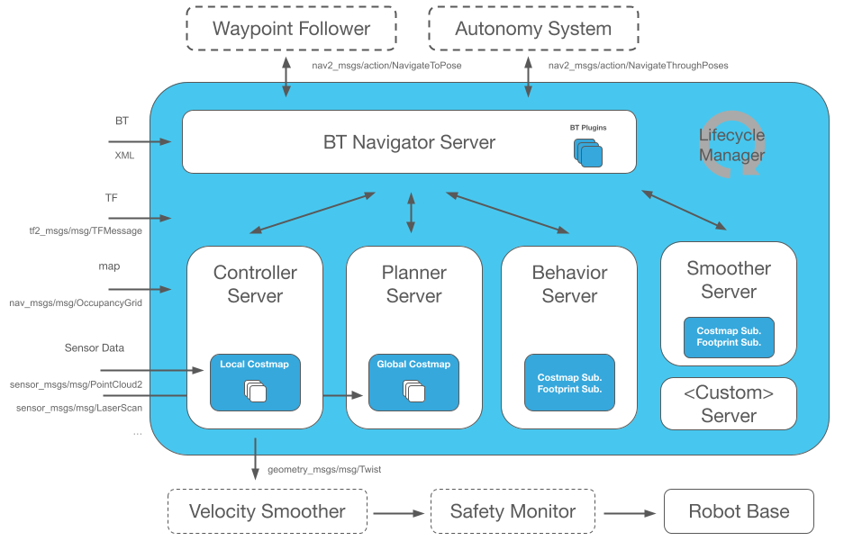

.. _documentation_home:

*****
|LPN|
*****

.. raw:: html

    <h1 align="center">
      

        

          <iframe width="450" height="300" src="https://www.youtube.com/embed/OklxMhdDfe0?autoplay=1&mute=1" frameborder="1" allowfullscreen></iframe>
          <iframe width="450" height="300" src="https://www.youtube.com/embed/CYaN43TJANc?autoplay=1&mute=1" frameborder="1" allowfullscreen></iframe>
        

      

    </h1>

Our Sponsors
############

Services
########

If you need professional services related to Nav2, please contact Open Navigation at info@opennav.org.

Overview
########

Nav2 is the professionally-supported successor of the ROS Navigation Stack deploying the same kinds of technology powering Autonomous Vehicles brought down, optimized, and reworked for mobile and surface robotics.
This project allows for mobile robots to navigate through complex environments to complete user-defined application tasks with nearly any class of robot kinematics.
Not only can it move from Point A to Point B, but it can have intermediary poses, and represent other types of tasks like object following, complete coverage navigation, and more.
Nav2 is a production-grade and high-quality navigation framework trusted by 100+ companies worldwide.

It provides perception, planning, control, localization, visualization, and much more to build highly reliable autonomous systems.
This will compute an environmental model from sensor and semantic data, dynamically path plan, compute velocities for motors, avoid obstacles, and structure higher-level robot behaviors.
To learn more about this project, such as related projects, robots using, ROS1 comparison, and maintainers, see :ref:`about`.
To learn more about navigation and ROS concepts, see :ref:`concepts`.

Nav2 uses behavior trees to create customized and intelligent navigation behavior via orchestrating many independent modular servers.
A task server can be used to compute a path, control effort, behavior, or any other navigation
related task. These separate servers communicate with the behavior tree (BT)
over a ROS interface such as an action server or service.
A robot may utilize potentially many different behavior trees to allow a robot to perform many types of unique and complex tasks.

The diagram below will give you a good first-look at the structure of Nav2.
Note that it is possible to have multiple plugins for controllers, planners,
and recoveries in each of their servers. This can be used to create contextual navigation behaviors.
Each of the servers also returns status indicators back to the BT Navigator in order to enact contextual behaviors based on their results.

The expected inputs to Nav2 are TF transformations conforming to REP-105, a
map source if utilizing the Static Costmap Layer, a BT XML file, and any relevant sensor data
sources. It will then provide valid velocity commands for the motors of a holonomic or
non-holonomic robot to follow when properly configured. We currently support all of the major robot types:
holonomic, differential-drive, legged, and ackermann (car-like) base types! We support
them uniquely with both circular and arbitrarily-shaped robots for SE2 collision checking. 

It has tools to:

- Load, serve, and store maps
- Localize the robot on a provided map (SLAM provides the initial map)
- Plan a complete path through the environment, even kinematically feasibly for large robots
- Control the robot to follows the path and dynamically adjust to avoid collision
- Smooth plans to be more continuous, smooth, and/or feasible
- Convert sensor data into an environmental model of the world
- Build complicated and highly-customizable robot behaviors using behavior trees 
- Conduct pre-defined behaviors in case of failure, human intervention, or other
- Follow sequential waypoints comprising a mission
- Manage the system's program lifecycle and watchdog for the servers 
- Easy dynamically loaded plugins for creating customized algorithms, behaviors and so on
- Monitor raw sensor data for imminent collision or dangerous situation
- Python3 API to interact with Nav2 and its internal task servers in a pythonic manner
- A smoother on output velocities to guarantee dynamic feasibility of commands
- ... and more!

We also provide a set of starting plugins to get you going. 
A list of all plugins can be found on :ref:`plugins` - but they include algorithms for the spanning cross section of common behaviors and robot platform types.

Related Projects
################

Check out related projects to Nav2:

- `BehaviorTree.CPP <https://www.behaviortree.dev/>`_
- `Robot Localization <https://github.com/cra-ros-pkg/robot_localization>`_
- `SLAM Toolbox <https://github.com/SteveMacenski/slam_toolbox>`_
- `Fuse <https://github.com/locusrobotics/fuse>`_

Citations
#########

If you use the navigation framework, an algorithm from this repository, or ideas from it
please cite this work in your papers!

S. Macenski, F. Martín, R. White, J. Clavero.
`The Marathon 2: A Navigation System <https://arxiv.org/abs/2003.00368/>`_.
IEEE/RSJ International Conference on Intelligent Robots and Systems (IROS), 2020.

IROS 2020 talk on Nav2 Marathon Experiments:

.. raw:: html

    <h1 align="center">
      

        <iframe width="708" height="400" src="https://www.youtube.com/embed/QB7lOKp3ZDQ?autoplay=1&mute=1" frameborder="1" allowfullscreen></iframe>
      

    </h1>

.. code-block:: bash

   @InProceedings{macenski2020marathon2,
   author = {Macenski, Steven and Martin, Francisco and White, Ruffin and Ginés Clavero, Jonatan},
   title = {The Marathon 2: A Navigation System},
   booktitle = {2020 IEEE/RSJ International Conference on Intelligent Robots and Systems (IROS)},
   year = {2020}
   }

If you use any of the algorithms in Nav2 or the analysis of the algorithms in your work, please cite this work in your papers!

S. Macenski, T. Moore, DV Lu, A. Merzlyakov, M. Ferguson,
`From the desks of ROS maintainers: A survey of modern & capable mobile robotics algorithms in the robot operating system 2 <https://arxiv.org/pdf/2307.15236.pdf>`_,
Robotics and Autonomous Systems, 2023

.. code-block:: bash

  @article{macenski2023survey,
        title={From the desks of ROS maintainers: A survey of modern & capable mobile robotics algorithms in the robot operating system 2}, 
        author={S. Macenski, T. Moore, DV Lu, A. Merzlyakov, M. Ferguson},
        year={2023},
        journal = {Robotics and Autonomous Systems}
  }

Smac Planner (Hybrid A*, State Lattice, 2D):

S. Macenski, M. Booker, J. Wallace,
`Open-Source, Cost-Aware Kinematically Feasible Planning for Mobile and Surface Robotics <https://arxiv.org/abs/2401.13078>`_,

.. code-block:: bash

  @article{macenski2024smac,
        title={Open-Source, Cost-Aware Kinematically Feasible Planning for Mobile and Surface Robotics}, 
        author={Steve Macenski and Matthew Booker and Josh Wallace},
        year={2024},
        journal = {Arxiv}
  }

Regulated Pure Pursuit Controller:

S. Macenski, S. Singh, F. Martin, J. Gines, 
`Regulated Pure Pursuit for Robot Path Tracking <https://arxiv.org/abs/2305.20026>`_,
Autonomous Robots, 2023.

.. code-block:: bash

  @article{macenski2023regulated,
        title={Regulated Pure Pursuit for Robot Path Tracking}, 
        author={Steve Macenski and Shrijit Singh and Francisco Martin and Jonatan Gines},
        year={2023},
        journal = {Autonomous Robots}
  }

VSLAM and formal comparisons for service robot needs:

A. Merzlyakov, S. Macenski.
`A Comparison of Modern General-Purpose Visual SLAM Approaches <https://arxiv.org/abs/2107.07589>`_.
IEEE/RSJ International Conference on Intelligent Robots and Systems (IROS), 2021.

.. code-block:: bash

   @InProceedings{vslamComparison2021,
   author = {Merzlyakov, Alexey and Macenski, Steven},
   title = {A Comparison of Modern General-Purpose Visual SLAM Approaches},
   booktitle = {2021 IEEE/RSJ International Conference on Intelligent Robots and Systems (IROS)},
   year = {2021}
   }

.. toctree::
   :hidden:

   getting_started/index.rst
   development_guides/index.rst
   concepts/index.rst
   setup_guides/index.rst
   about/robots.rst
   tutorials/index.rst
   plugin_tutorials/index.rst
   configuration/index.rst
   tuning/index.rst
   behavior_trees/index.rst
   plugins/index.rst
   migration/index.rst
   commander_api/index.rst
   roadmap/roadmap.rst
   about/index.rst
