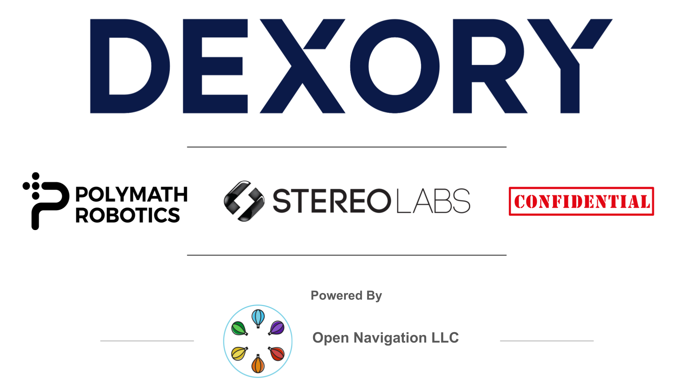

.. _documentation_home:

*****
|LPN|
*****

.. raw:: html

    <h1 align="center">
      

        

          <iframe width="450" height="300" src="https://www.youtube.com/embed/OklxMhdDfe0?autoplay=1&mute=1" frameborder="1" allowfullscreen></iframe>
          <iframe width="450" height="300" src="https://www.youtube.com/embed/dVwgfoLC6eA?autoplay=1&mute=1" frameborder="1" allowfullscreen></iframe>
        

      

    </h1>

Our Sponsors
############

Overview
########

Nav2 is the professionally supported spiritual successor of the ROS Navigation Stack.
This project seeks to find a safe way to have a mobile robot move to complete complex tasks through many types of environments and classes of robot kinematics.
Not only can it move from Point A to Point B, but it can have intermediary poses, and represent other types of tasks like object following and more.
Nav2 is a production-grade and high-quality navigation framework trusted by 50+ companies worldwide.

It provides perception, planning, control, localization, visualization, and much more to build highly reliable autonomous systems.
This will complete environmental modeling from sensor data, dynamic path planning, compute velocities for motors, avoid obstacles, represent semantic regions and objects, and structure higher-level robot behaviors.
To learn more about this project, such as related projects, robots using, ROS1 comparison, and maintainers, see :ref:`about`.
To learn more about navigation and ROS concepts, see :ref:`concepts`.

Nav2 uses behavior trees to create customized and intelligent navigation behavior via orchestrating many independent modular servers.
A task server can be used to compute a path, control effort, recovery, or any other navigation
related task. These separate servers communicate with the behavior tree (BT)
over a ROS interface such as an action server or service.
A robot may utilize potentially many different behavior trees to allow a robot to perform many types of unique tasks.

The diagram below will give you a good first-look at the structure of Nav2.
Note: It is possible to have multiple plugins for controllers, planners,
and recoveries in each of their servers with matching BT plugins. This can be used to
create contextual navigation behaviors.
If you would like to see a comparison between this project and ROS (1) Navigation, see :ref:`ros1_comparison`.

The expected inputs to Nav2 are TF transformations conforming to REP-105, a
map source if utilizing the Static Costmap Layer, a BT XML file, and any relevant sensor data
sources. It will then provide valid velocity commands for the motors of a holonomic or
non-holonomic robot to follow. We currently support all of the major robot types:
holonomic, differential-drive, legged, and ackermann (car-like) base types! We support
them uniquely with both circular and arbitrarily-shaped robots for SE2 collision checking. 

It has tools to:

- Load, serve, and store maps (Map Server)
- Localize the robot on the map (AMCL)
- Plan a path from A to B around obstacles (Nav2 Planner)
- Control the robot as it follows the path (Nav2 Controller)
- Smooth path plans to be more continuous and feasible (Nav2 Smoother)
- Convert sensor data into a costmap representation of the world (Nav2 Costmap 2D)
- Build complicated robot behaviors using behavior trees (Nav2 Behavior Trees and BT Navigator)
- Compute recovery behaviors in case of failure (Nav2 Recoveries)
- Follow sequential waypoints (Nav2 Waypoint Follower)
- Manage the lifecycle and watchdog for the servers (Nav2 Lifecycle Manager)
- Plugins to enable your own custom algorithms and behaviors (Nav2 Core)
- Monitor raw sensor data for imminent collision or dangerous situation (Collision Monitor)
- Python3 API to interact with Nav2 in a pythonic manner (Simple Commander)
- A smoother on output velocities to guarantee dynamic feasibility of commands (Velocity Smoother)

.. image:: images/nav2_architecture.png
    :width: 700px
    :align: center
    :alt: Navigation2 Block Diagram

We also provide a set of starting plugins to get you going. 
A list of all plugins can be found on :ref:`plugins` - but they include algorithms for the spanning cross section of common behaviors and robot platform types.

Citations
#########

If you use the navigation framework, an algorithm from this repository, or ideas from it
please cite this work in your papers!

S. Macenski, F. Martín, R. White, J. Clavero.
`The Marathon 2: A Navigation System <https://arxiv.org/abs/2003.00368/>`_.
IEEE/RSJ International Conference on Intelligent Robots and Systems (IROS), 2020.

IROS 2020 talk on Nav2 Marathon Experiments:

.. raw:: html

    <h1 align="center">
      

        <iframe width="708" height="400" src="https://www.youtube.com/embed/QB7lOKp3ZDQ?autoplay=1&mute=1" frameborder="1" allowfullscreen></iframe>
      

    </h1>

.. code-block:: bash

   @InProceedings{macenski2020marathon2,
   author = {Macenski, Steven and Martin, Francisco and White, Ruffin and Ginés Clavero, Jonatan},
   title = {The Marathon 2: A Navigation System},
   booktitle = {2020 IEEE/RSJ International Conference on Intelligent Robots and Systems (IROS)},
   year = {2020}
   }

If you use our work on VSLAM and formal comparisons for service robot needs, please cite the paper:

A. Merzlyakov, S. Macenski.
`A Comparison of Modern General-Purpose Visual SLAM Approaches <https://arxiv.org/abs/2107.07589>`_.
IEEE/RSJ International Conference on Intelligent Robots and Systems (IROS), 2021.

.. code-block:: bash

   @InProceedings{vslamComparison2021,
   author = {Merzlyakov, Alexey and Macenski, Steven},
   title = {A Comparison of Modern General-Purpose Visual SLAM Approaches},
   booktitle = {2021 IEEE/RSJ International Conference on Intelligent Robots and Systems (IROS)},
   year = {2021}
   }

Example
#######

Below is an example of the TB3 navigating in a small lounge.

.. raw:: html

    <h1 align="center">
      

        <iframe width="708" height="400" src="https://www.youtube.com/embed/ZeCds7Sv-5Q?autoplay=1&mute=1" frameborder="1" allowfullscreen></iframe>
      

    </h1>

.. toctree::
   :hidden:

   getting_started/index.rst
   development_guides/index.rst
   concepts/index.rst
   setup_guides/index.rst
   tutorials/index.rst
   plugin_tutorials/index.rst
   configuration/index.rst
   tuning/index.rst
   behavior_trees/index.rst
   plugins/index.rst
   migration/index.rst
   commander_api/index.rst
   roadmap/roadmap.rst
   about/index.rst
   about/robots.rst
