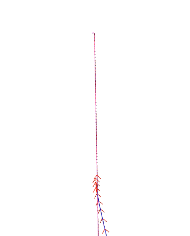
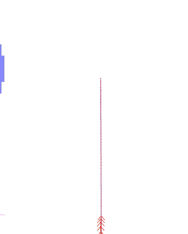
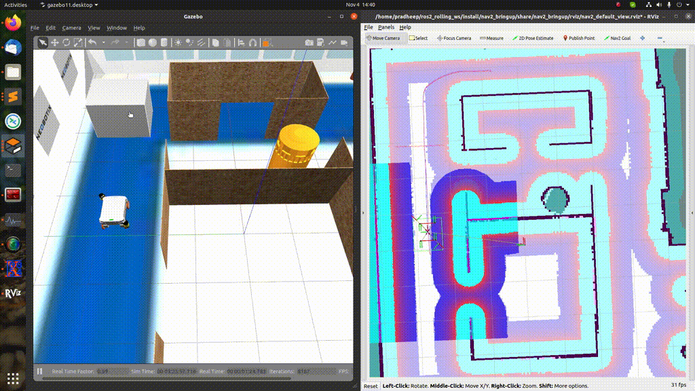
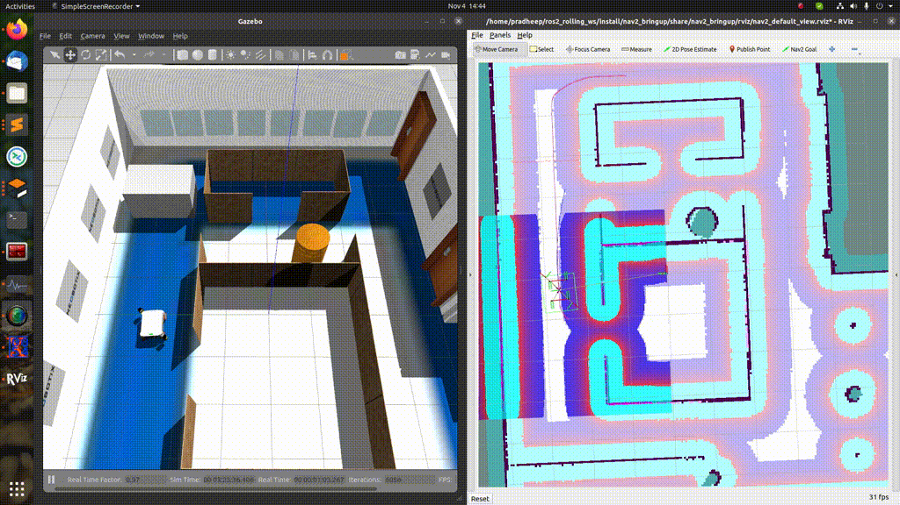

.. _galactic_migration:

Galactic to Humble
##################

Moving from ROS 2 Galactic to Humble, a number of stability improvements were added that we will not specifically address here.

Major improvements to Smac Planners
***********************************

The Smac Planner was significantly improved, of both the 2D and Hybrid-A* implementations, making the paths better, faster, and of higher quality.

  - Collision checker rejects collisions faster and queries the costmap for coordinates less often
  - Zero-copy collision checking object
  - precompute collision checking footprint orientations so no need for trig at runtime
  - Only checking full SE2 footprint when the robot is in the possibly inscribed zones
  - Computing the possibly inscribed zones, or the cost over which some part of the footprint may be in collision with a boundary to check the full footprint. Else, check center cost since promised to not be in a potential collision state
  - Renaming Hybrid-A* planner to SmacPlannerHybrid
  - Precomputing the Reedshepp and Dubin paths offline so at runtime its just a lookup table
  - Replacing the wavefront heuristic with a new, and novel, heuristic dubbed the obstacle heuristic. This computes a Dijkstra's path using Differential A* search taking into account the 8 connected space, as well as weights for the cost at the positions to guide the heuristic into the center of aisle ways. It also downsamples the costmap such that it can reduce the number of expansions by 75% and have a very small error introduced into the heuristic by being off by at most a partial fraction of a single cell distance
  - Improvements to the analytic expansion algorithm to remove the possibility of loops at the end of paths, whenever possible to remove
  - Improving analytic expansions to provide maximum path length to prevent skirting close to obstacles
  - 2D A* travel cost and heuristic improvements to speed up planning times and also increase the path quality significantly
  - Replaced smoother with a bespoke gradient descent implementation
  - Abstract out common utilities of planners into a utils file
  - tuned cost functions
  - precomputed obstacle heuristic using dynamic programming to expand only the minimum number of nodes
  - A caching heuristic setting to enable 25hz planning rates using cached obstacle heuristic values when the goal remains the same
  - Leveraging the symmetry in the dubin and reeds-sheep space to reduce cache size by 50% to increase the window size available for heuristic lookup.
  - Precompute primitives at all orientation bins
  - SmacPlanner2D parameters are now all reconfigurable
  - Both Hybrid-A* and State Lattice planners are now fully admissible
  - Hybrid-A* and State Lattice have had their parameterization for path smoothing readded.
  - The smoother now enables kinematically feasible boundary conditions.
  - State Lattice supports turning in place primitive types
  - Retrospective penalty added to speed up the planner, making it prioritize later search branches before earlier ones, which have negligible chance to improve path in vast majority of situations

The tl;dr of these improvements is:
  - Plans are 2-3x as fast as they were before, well under 200ms for nearly all situations, making it as fast as NavFn and Global Planner (but now kinematically feasible). Typical planning times are sub-100ms without even making use of the caching or downsampling features.
  - Paths are of significantly higher quality via improved smoothers and a novel heuristic that steers the robot towards the center of aisleways implicitly. This makes smoother paths that are also further from obstacles whenever possible.
  - Using caching or downsampler parameterizations, can easily achieve path planning with sub-50ms in nearly any sized space.
  - Smoother is now able to do more refinements and can create kinematically feasible boundary conditions, even while reversing.

Additional improvements were made to include a ``analytic_expansion_max_length`` parameter such that analytic expansions are limited in their potential length. If the length is too far, reject this expansion. This prevents unsafe shortcutting of paths into higher cost areas far out from the goal itself, let search to the work of getting close before the analytic expansion brings it home. This should never be smaller than 4-5x the minimum turning radius being used, or planning times will begin to spike.

Further, the traversal cost and heuristic cost computations were updated **requiring retuning of your penalty functions** if you have a previously existing configuration. Defaults of the algorithm were also retuned appropriately to the change for similar our of the box behavior as before (to use as a reference).

Simple (Python) Commander
*************************

`This PR 2411 <https://github.com/ros-planning/navigation2/pull/2411>`_ introduces a new package to Nav2, called the ``nav2_simple_commander``. It is a set of functions in an object, ``BasicNavigator``, which can be used to build Nav2-powered autonomy tasks in Python3 without concerning yourself with the Nav2, ROS 2, or Action server details. It contains a simple API taking common types (primarily ``PoseStamped``) and handles all of the implementation details behind the hood. For example, this is a simple navigation task using this API:

.. code-block:: python3

    def main():
        rclpy.init()
        navigator = BasicNavigator()

        # Set our demo's initial pose
        initial_pose = PoseStamped()
        ... populate pose ...
        navigator.setInitialPose(initial_pose)

        # Wait for navigation to fully activate
        navigator.waitUntilNav2Active()

        # Go to our demos first goal pose
        goal_pose = PoseStamped()
        ... populate pose ...
        navigator.goToPose(goal_pose)

        while not navigator.isTaskComplete():
            feedback = navigator.getFeedback()
            ... do something with feedback ...

            # Basic navigation timeout
            if Duration.from_msg(feedback.navigation_time) > Duration(seconds=600.0):
                navigator.cancelNav()

        result = navigator.getResult()
        if result == TaskResult.SUCCEEDED:
            print('Goal succeeded!')
        elif result == TaskResult.CANCELED:
            print('Goal was canceled!')
        elif result == TaskResult.FAILED:
            print('Goal failed!')

`The full API can be found in the README of the package <https://github.com/ros-planning/navigation2/tree/main/nav2_simple_commander>`_. A number of well commented examples and demos can also be found in the package's source code at the link prior.

Reduce Nodes and Executors
**************************

In order for nav2 to make the best use of ROS 2, we need minimize the number of nodes and executors in nav2, which can improve performance.

This functionality has been discussed in `the ticket #816 <https://github.com/ros-planning/navigation2/issues/816>`_, and carried out in

  - Remove ``client_node_`` in ``class WaypointFollower`` : `PR2441 <https://github.com/ros-planning/navigation2/pull/2441>`_
  - Remove ``rclcpp_node_`` in ``class MapSaver`` : `PR2454 <https://github.com/ros-planning/navigation2/pull/2454>`_
  - Remove ``bond_client_node_`` in ``class LifecycleManager`` : `PR2456 <https://github.com/ros-planning/navigation2/pull/2456>`_
  - Remove ``node_`` in ``class LifecycleManagerClient`` : `PR2469 <https://github.com/ros-planning/navigation2/pull/2469>`_
  - Remove ``rclcpp_node_`` in ``class ControllerServer`` : `PR2459 <https://github.com/ros-planning/navigation2/pull/2459>`_, `PR2479 <https://github.com/ros-planning/navigation2/pull/2479>`_
  - Remove ``rclcpp_node_`` in ``class PlannerServer`` : `PR2459 <https://github.com/ros-planning/navigation2/pull/2459>`_, `PR2480 <https://github.com/ros-planning/navigation2/pull/2480>`_
  - Remove ``rclcpp_node_`` in ``class AmclNode`` : `PR2483 <https://github.com/ros-planning/navigation2/pull/2483>`_
  - Remove ``rclcpp_node_`` and ``clinet_node_`` in ``class Costmap2DROS`` : `PR2489 <https://github.com/ros-planning/navigation2/pull/2489>`_
  - Remove ``rclcpp_node_`` in ``class LifecycleNode`` : `PR2993 <https://github.com/ros-planning/navigation2/pull/2993>`_

some APIs are changed in these PRs:
  - `PR2489 <https://github.com/ros-planning/navigation2/pull/2489>`_ removes arguments ``client_node``, ``rclcpp_node`` and adds argument ``callback_group`` in the initialize function of class ``nav2_costmap_2d::Layer``. ``callback_group`` is used to replace ``rclcpp_node``.
  - `PR2993 <https://github.com/ros-planning/navigation2/pull/2993>`_ removes argument ``use_rclcpp_node `` in the constructor of class ``nav2_util::LifecycleNode``.

API Change for nav2_core
************************

`PR 2976 <https://github.com/ros-planning/navigation2/pull/2976>`_ changes the API for ``nav2_core::Controller`` and ``nav2_core::Smoother`` by replacing the use of shared pointer references ``(const shared_ptr<> &)`` to shared pointers ``(shared_ptr<>)``.
Use of shared pointer references meant that the shared pointer counter was never incremented.

Extending the BtServiceNode to process Service-Results
******************************************************

`This PR 2481 <https://github.com/ros-planning/navigation2/pull/2481>`_ and `PR 2992 <https://github.com/ros-planning/navigation2/pull/2992>`_  address `the ticket <https://github.com/ros-planning/navigation2/issues/2467>`_ and `this ticket <https://github.com/ros-planning/navigation2/issues/2968>`_ and adds a virtual ``on_completion()`` function to the ``BtServiceNode`` class (`can be found here <https://github.com/ros-planning/navigation2/blob/c417e2fd267e1dfa880b7ff9d37aaaa7b5eab9ca/nav2_behavior_tree/include/nav2_behavior_tree/bt_service_node.hpp>`_).
Similar to the already existing virtual ``on_wait_for_result()`` function, it can be overwritten in the child class to react to a respective event with some user-defined operation.
The added ``on_completion()`` function will be called after the service interaction of the ``BtServiceNode`` has been successfully completed.

.. code-block:: cpp

    /**
    * @brief Function to perform some user-defined operation upon successful
    * completion of the service. Could put a value on the blackboard.
    * @param response can be used to get the result of the service call in the BT Node.
    * @return BT::NodeStatus Returns SUCCESS by default, user may override to return another value
    */
    virtual BT::NodeStatus on_completion(std::shared_ptr<typename ServiceT::Response>/*response*/)
    {
      return BT::NodeStatus::SUCCESS;
    }

The returned ``BT::NodeStatus`` will set the current status of the BT-Node. Since the function has access to the results of the service, the returned node-status can depend on those service results, for example.
The normal behavior of the ``BtServiceNode`` is not affected by introducing the ``on_completion()`` function, since the the default implementation still simply returns ``BT::NodeStatus::SUCCESS``, if the service interaction completed successfully.

Including new Rotation Shim Controller Plugin
*********************************************

`This PR 2718 <https://github.com/ros-planning/navigation2/pull/2718>`_ introduces the new ``nav2_rotation_shim_controller``. This controller will check the rough heading difference with respect to the robot and a newly received path. If within a threshold, it will pass the request onto the primary controller to execute. If it is outside of the threshold, this controller will rotate the robot towards that path heading. Once it is within the tolerance, it will then pass off control-execution from this rotation shim controller onto the primary controller plugin. At this point, the robot is still going to be rotating, allowing the current plugin to take control for a smooth hand off into path tracking.

The Rotation Shim Controller is suitable for:

- Robots that can rotate in place, such as differential and omnidirectional robots.
- Preference to rotate in place rather than 'spiral out' when starting to track a new path that is at a significantly different heading than the robot's current heading.
- Using planners that are non-kinematically feasible, such as NavFn, Theta\*, or Smac 2D (Feasible planners such as Smac Hybrid-A* and State Lattice will start search from the robot's actual starting heading, requiring no rotation).

Spawning the robot in Gazebo
****************************

`This PR 2473 <https://github.com/ros-planning/navigation2/pull/2473>`_ deletes the pkg ``nav2_gazebo_spawner`` inside nav2_bringup directory. Instead of ``nav2_gazebo_spawner`` the Node `spawn_entity.py <https://github.com/ros-simulation/gazebo_ros_pkgs/blob/ros2/gazebo_ros/scripts/spawn_entity.py>`_ of ``gazebo_ros`` is recomended to spawn the robot in gazebo.
Note that

  * gazebo should be started with both ``libgazebo_ros_init.so`` and ``libgazebo_ros_factory.so`` to work correctly.

  * spawn_entity node could not remap /tf and /tf_static to tf and tf_static in the launch file yet, used only for multi-robot situations. This problem was overcame by adding remapping argument ``<remapping>/tf:=tf</remapping>``  ``<remapping>/tf_static:=tf_static</remapping>`` under ros2 tag in each plugin which publishs transforms in the SDF file. It is essential to differentiate the tf's of the different robot.

Recovery Behavior Timeout
*************************

Recoveries in Nav2, spin and backup, now have ``time_allowance`` ports in their BT nodes and request fields in their actions to specify a timeout. This helps ensure that the robot can exit a backup or spin primitive behavior in case it gets stuck or otherwise is unable to backup the full distance over a reasonable block of time.

New parameter ``use_final_approach_orientation`` for the 3 2D planners
**********************************************************************

`Pull request 2488 <https://github.com/ros-planning/navigation2/pull/2488>`_ adds a new parameter ``use_final_approach_orientation`` to the 3 2D planners (Theta*, SmacPlanner2D and NavFn), ``false`` by default. If ``true``, the last pose of the path generated by the planner will have its orientation set to the approach orientation, i.e. the orientation of the vector connecting the last two points of the path. It allows sending the robot to a position (x,y) instead of a pose (x,y,theta) by effectively ignoring the goal orientation.
For example, below, for the same goal with an orientaton pointed left of the screen, ``use_final_approach_orientation=false`` (left) and ``use_final_approach_orientation=true`` (right)

SmacPlanner2D and Theta*: fix goal orientation being ignored
************************************************************

`This pull request 2488 <https://github.com/ros-planning/navigation2/pull/2488>`_ fixes `the  issue <https://github.com/ros-planning/navigation2/issues/2482>`_ of the goal pose orientation being ignored (the end path pose orientation was always set to 0).

SmacPlanner2D, NavFn and Theta*: fix small path corner cases
************************************************************

`This PR 2488 <https://github.com/ros-planning/navigation2/pull/2488>`_ ensures the planners are not failing when the distance between the start and the goal is small (i.e. when they are on the same costmap cell), and in that case the output path is constructed with a single pose.

Change and fix behavior of dynamic parameter change detection
*************************************************************

`This <https://github.com/ros-planning/navigation2/pull/2576>`_ and `this PR <https://github.com/ros-planning/navigation2/pull/2585>`_ modify the method used to catch the changes of dynamic parameters. The motivation was to fix the issue that ``void on_parameter_event_callback(const rcl_interfaces::msg::ParameterEvent::SharedPtr event)`` was called for every parameter change of every node leading to unwanted parameter changes if 2 different nodes had the same parameter name.

Dynamic Parameters
******************

Newly added dynamic parameters to:

-  `This PR 2592 <https://github.com/ros-planning/navigation2/pull/2592>`_ makes most of the Costmap2DROS parameters dynamic
-  `This PR 2607 <https://github.com/ros-planning/navigation2/pull/2607>`_ makes most of the Regulated Pure Pursuit parameters dynamic
-  `This PR 2665 <https://github.com/ros-planning/navigation2/pull/2665>`_ makes most of the Theta * Planner parameters dynamic
-  `This PR 2704 <https://github.com/ros-planning/navigation2/pull/2704>`_ makes Waypoint Follower, Planner Server, and Controller Server's params reconfigurable

BT Action Nodes Exception Changes
*********************************

When BT action nodes throw exceptions due to networking or action server failures, they now return a status code of ``FAILURE`` to fail that particular action in the behavior tree to react to. This is in contrast to prior where the exceptions thrown from networking were sent to the root tree which would count as a task-level failure that the tree could not react to.

BT Navigator Groot Multiple Navigators
**************************************

`This PR 2627 <https://github.com/ros-planning/navigation2/pull/2627>`_ creates separate parameters for groot monitoring for the NavToPose and NavThroughPoses navigator types so you can individually track the state of each behavior tree through the ZMQ publisher. This resolves a long-standing problem after we added multiple navigator types to BT Navigator that you could only view the nav to poses BT execution live. BT.CPP and Groot only support one static ZMQ stream at a time, so there is a bit of a quirk where you must locally reset Groot after switching trees in order to view the live stream of the Nav Through Poses BT, if in use. This is a state of the BT.CPP and Groot libraries and not something we can resolve withing Nav2.

There is some thought into the future regarding complete deprecation of live BT monitoring using Groot due to this quirk and the almost-certain infux of tickets on the topic. Groot will however always be supported for visualizing behavior tree XML files and modifications, simply not visualizing the BT execution live during robot navigation.

Removed Kinematic Limiting in RPP
*********************************

The parameters ``max_linear_accel`` and ``max_linear_decel`` were removed along with the kinematic limiting in the controller causing instabilities. Instead, use a velocity smoother available in the ROS ecosystem if you would like similar behavior.

Added Smoother Task Server
**************************

A new task server was added which loads smoother plugins and executes them to improve quality of an existing planned path. Smoothing action can be called from a behavior tree using SmoothPath action node. `PR 2569 <https://github.com/ros-planning/navigation2/pull/2569>`_ implements and `PR 2875 <https://github.com/ros-planning/navigation2/pull/2875>`_ adds in the first of the plugins using it with a simple smoother. Other smoothers are in development and will be added in the future.

Removed Use Approach Velocity Scaling Param in RPP
**************************************************

The parameter ``use_approach_linear_velocity_scaling`` is removed in favor of always on to help in smooth transitions to the goal. `This PR 2701 <https://github.com/ros-planning/navigation2/pull/2701>`_ implements.

Refactored AMCL motion models as plugins
****************************************

`This PR 2642 <https://github.com/ros-planning/navigation2/pull/2642>`_ creates plugins for the different motion models currently used in AMCL. This functionality enables users to use any custom motion model by creating it as a plugin and changing the robot_model_type parameter to the name of the plugin in nav2_params.yaml file. This helps to use custom motion models without the need to modify the AMCL source code.

Dropping Support for Live Groot Monitoring of Nav2
**************************************************

- https://github.com/ros-planning/navigation2/pull/2642

It was a great feature idea but never quite panned out, especially after we introduced multiple navigator types in the BT Navigator server. The issue we run into primarily is that Zero-MQ prevents users from producing multiple logger types in the same process. Since BT nav has multiple servers, the swapping between them for viewing has never had a clean hand off causing folks to file tickets or have nasty logs appear or ZMQ crashes in the background. The BT.CPP client for this doesn't allow us to have a clean shutdown process so we're left with hoping that ZMQ properly handles the situation, which it rarely does. Further, Groot only supports visualizing one type of tree at a time so for applications often switching between navigator types, its not possible to use a single groot client, causing great frustration.

So, what I propose here is to remove live monitoring of the BT from Nav2. **We can still use Groot to modify, visualize, and generally work with behavior trees**, the only thing being removed is to live view the executing behavior tree as Nav2 is currently executing it (it used to light up the boxes of the current nodes). This was of dubious value anyhow, since the tree ticks so fast its difficult to visualize and get meaningful insights into things as the system is moving so quickly.

Replanning Only if Path is Invalid
**********************************

`This PR 2591 <https://github.com/ros-planning/navigation2/pull/2591>`_ creates two new condition BT node to facilitate replanning only if path becomes invalid rather than constantly replanning. These new nodes were integrated into the default BT.

Fix CostmapLayer clearArea invert param logic
*********************************************
`This PR 2772 <https://github.com/ros-planning/navigation2/pull/2772>`_ fixes the invert paramlogic of the CostmapLayer clearArea fonction. Hence correcting the behavior of the clearAroundRobot and clearExceptRegion services and their corresponding BT actions.

Dynamic Composition
*******************

`This PR 2750 <https://github.com/ros-planning/navigation2/pull/2750>`_ provides a optional bringup based on ROS2 dynamic composition for users. It can be used to compose all Nav2 nodes in a single process instead of launching these nodes separately, which is useful for embedded systems users that need to make optimizations due to harsh resource constraints. it's used by default, but can be disabled by using the launch argument ``use_composition:=False``.

Some experiments to show performance improvement of dynamic composition, and the cpu and memory are captured by ``psutil`` :

 ============================================================================== ========= ============
  CPU: Intel(R) i7-8700 (6Cores 12Threads), Memory: 32GB                         cpu(%)    memory(%)
 ============================================================================== ========= ============
  normal multiple processes                                                        44        0.76
  dynamic composition (use ``component_container_isolated``)                       38        0.23
 ============================================================================== ========= ============

The way of dynamic composition consumes lower memory(saves ~70%),  and lower cpu (saves ~13%) than normal multiple processes.

BT Cancel Node
**************
`This PR 2787 <https://github.com/ros-planning/navigation2/pull/2787>`_ caters the users with an abstract node to develop cancel behaviors for different servers present in the Nav2 stack such as the controller_server, recovery_server and so on. As a start, this PR also provides the ``CancelControl`` behavior to cancel the goal given to the controller_server. As an addition to the ``CancelControl`` `This PR 2856 <https://github.com/ros-planning/navigation2/pull/2856>`_ provides the users with the option to cancel the recoveries such as the ``backup``, ``spin`` and ``wait``.

BT PathLongerOnApproach Node
****************************

In the `PR <https://github.com/ros-planning/navigation2/pull/2802>`_, a new Decorator BT node known as ``PathLongerOnApproach`` has been added to provide with the functionality to check and potentially handle longer path generated due to an obstacle in the given goal proximity. To demonstrate this functionality, a new BT ``navigate_to_pose_w_replanning_goal_patience_and_recovery.xml`` would serve both as an example and ready-to-use BT for a specific application that wishes to optimize their process cycle time. Demo of the developed BT can be seen below, where the robot pauses when close to a goal to see if the dynamic obstacle moves out of the way. Else, it executes the replan:

Obstacle does not clear at all, with `obstacle_clearance_time` to be 3 seconds:

Obstacle clears and you can see the robot pass through the (could have been ideally the) same path:

BT TruncatePathLocal Node
*************************

In the `PR 2753 <https://github.com/ros-planning/navigation2/pull/2753>`_, a new Action BT node named ``TruncatePathLocal`` has been added to extract a bounded-length path section near robot to be used e.g. for collision checking or computationally expensive smoothers

Constrained Smoother
********************

In `the PR 2753 <https://github.com/ros-planning/navigation2/pull/2753>`_, a new Smoother named ``nav2_constrained_smoother::ConstrainedSmoother`` has been added to optimize various path criteria such as smoothness or distance from obstacles, maintaining minimum turning radius

Replanning at a Constant Rate and if the Path is Invalid
********************************************************
`This PR 2804 <https://github.com/ros-planning/navigation2/pull/2841>`_ introduces a new behavior tree that navigates to pose with consistent replanning and if the path becomes invalid.
To facilitate the new behavior tree a new condition node PathExpiringTimer was introduced to trigger replanning at a consistent rate.

Euclidean Distance 2D
*********************

`This PR 2865 <https://github.com/ros-planning/navigation2/pull/2865>`_ changes Euclidean distance calculation throughout nav2 to project on to the XY plane (i.e. discard any information related to components in Z).
This may potentially subtly change the way certain BT nodes, BT Navigators, controller servers, planner servers, and RPP behave if using custom plugins outside the Nav2 ecosystem.

Recovery To Behavior
********************
`This PR 2867 <https://github.com/ros-planning/navigation.ros.org/pull/298>`_ renames the nav2_recoveries to nav2_behaviors.

In navigation_launch.py recoveries_server -> behavior_server and nav2_recoveries -> nav2_behaviors.
In nav2_params.yaml recovery_plugins -> behavior_plugins and nav2_recoveries -> nav2_behaviors.

Respawn Support in Launch and Lifecycle Manager
***********************************************

`PR 2752 <https://github.com/ros-planning/navigation2/pull/2910>`_ enables respawn support in Nav2. In the launch files, you may set ``use_respawn`` to ``true`` to enable respawning of servers that crash. This is only available in non-composed systems, since in composed systems, all of the nodes are under a single process and a crash anywhere will bring everything down (including the lifecycle manager itself). Even if the container was set to respawn, it would only respawn the empty container, not with all of the components loaded into it.

That PR also enables the lifecycle manager to check if a system goes down due to a crash. If so, it allows the manager to check if the server comes back online within a given timeout period. If it does, it will automatically retransition the system back up to active to continue on its task automatically.

New Nav2 Velocity Smoother
**************************

`PR 2964 <https://github.com/ros-planning/navigation2/pull/2964>`_ introduces the ``nav2_velocity_smoother`` for smoothing velocity commands from Nav2 to a robot controller by velocity, acceleration, and deadband constraints. See :ref:`configuring_velocity_smoother` for more details. It is not included in the default bringup batteries included from ``nav2_bringup``.

Goal Checker API Changed
************************
`PR 2965 <https://github.com/ros-planning/navigation2/pull/2965>`_ adds an extra argument in the initialize function of the `nav2_core::GoalChecker` class.
The extra argument is a costmap_ros pointer. This is used to check if the goal is in collision, so that we can avoid moving towards the goal and replanning can be initiates using some BT plugin.

Added Assisted Teleop
*********************
`PR 2904 <https://github.com/ros-planning/navigation2/pull/2904>`_ adds a new behavior for assisted teleop along with two new BT nodes AssistedTeleop and CancelAssistedTeleop.
