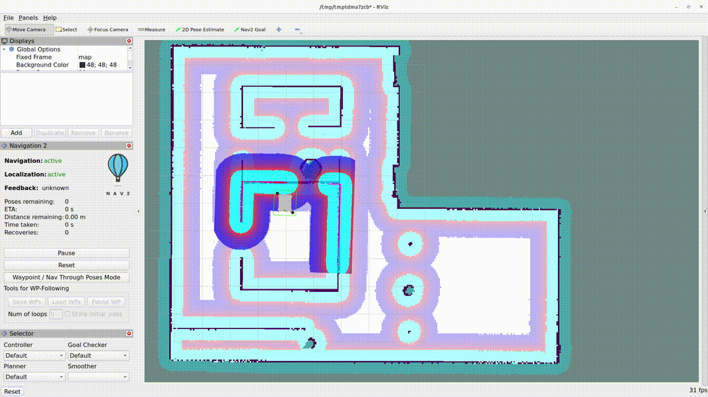

.. _iron_migration:

Iron to Jazzy
##############

Moving from ROS 2 Iron to Jazzy, a number of stability improvements were added that we will not specifically address here.

Added TwistStamped Option for Commands
**************************************

A new parameter ``enable_stamped_cmd_vel`` has been added to all of the publishers and subscribers of ``cmd_vel`` and related topics. This allows you to set the publication and subscription of TwistStamped messages over Twist messages to have frame and timestamp information of the set command. For now, this is default to ``false`` to not change current behavior, but it is planned to make ``TwistStamped`` the default behavior alongside Gazebo, ROS 2 Control, and related projects.

Add VelocityPolygon in Collision Monitor
****************************************

`PR #3708 <https://github.com/ros-planning/navigation2/pull/3708>`_ adds ``VelocityPolgon`` type in Collision Monitor. This allows the user to setup multiple polygons to cover the range of the robot's velocity limits. For example, the user can configure different polygons for rotation, moving forward, or moving backward. The Collision Monitor will check the robot's velocity against each sub polygon to determine the approriate polygon to be used for collision checking. The tutorial is available in the :ref:`Configuring Collision Monitor with VelocityPolygon <collision_monitor_tutorial>` section.

Change polygon points parameter format in Collision Monitor
***********************************************************

`PR #4020 <https://github.com/ros-planning/navigation2/pull/4020>`_ changes the format of the Polygon points parameter from ``vector<double>`` to ``string``. This makes the polygon description more uniform accross the Collision Monitor and Costmap_2D.
Now we can define a polygon's points in string that has a ``vector<vector<double>>`` structure like this ``"[[p1.x, p1.y], [p2.x, p2.y], [p3.x, p3.y],...]"`` with a minimum of 4 points described. An example of a Square polygon will be written as follows.

.. code-block:: yaml

    PolygonFront:
      type: "polygon"
      points: "[[0.3, 0.3], [0.3, -0.3], [0.0, -0.3], [0.0, 0.3]]"
      action_type: "none"
      min_points: 4
      visualize: True
      polygon_pub_topic: "polygon_front"

Introduction of Soft-Real Time Action Servers
*********************************************

`PR #3914 <https://github.com/ros-planning/navigation2/pull/3914>`_ adds soft real-time priorization to the controller server to better ensure resources to time sensitive portions of the codebase. The Simple Action Server now has a ``realtime`` input field exposed in the Controller Server via the parameter ``use_realtime_priority`` which will set the controller's execution thread to a higher priority than the rest of the system to meet scheduling deadlines. To use this feature, you use set the following inside of ``/etc/security/limits.conf`` to give userspace access to elevated prioritization permissions. This is currently only enabled in the Controller Server, who's execution thread is sensitive to scheduling priorities, but could be set with other threads in the future if found necessary.

.. code-block:: text

    <username> soft rtprio 99
    <username> hard rtprio 99

The Collision Monitor and Velocity Smoothers also had ``use_realtime_priority`` added as well!

``opennav_coverage`` Project
****************************

A new metapackage exists in: https://github.com/open-navigation/opennav_coverage which contains complete coverage navigator plugins, BT nodes, behavior tree demos, and coverage planning server based on ``Fields2Cover``. See that project for more information. It is on long-term trajectory for inclusion into ``Nav2``, but there are still yet a few missing features from Fields2Cover before we can integrate that into the main project to be up to snuff in terms of all the major features and capabilities users would expect from a coverage planning system. 

If you'd like to see coverage planning in Nav2 directly, please consider contributing `to the as-of-yet needed features described here <https://github.com/Fields2Cover/Fields2Cover/issues/73>`_.

Introduce a new Multi-Robot Bringup Launch
******************************************

`PR #3572 <https://github.com/ros-planning/navigation2/pull/3572>`_ introduces a new way of bringup tb3 multi-robot that names as ``cloned_tb3_simulation_launch.py`` for simulation. ``cloned_tb3_simulation_launch.py`` enables to bring up multiple robots with same parameter that described in ``nav2_multirobot_param_all.yaml``. And multiple robots are separeted by namespaces which are given as a Launch Arguments.
Existing ``multi_tb3_simulation_launch.py`` which was utilized in previous is replaced with ``unique_tb3_simulation_launch.py``, allowing for multiple unique robot instances utilizing ``nav2_multirobot_params_<N>.yaml`` configuration files.

New option for the Voxel and Obstacle Layers
********************************************
`PR #3612 <https://github.com/ros-planning/navigation2/pull/3612>`_ adds a new MaxWithoutUnknownOverwrite option to combination_method parameter in Voxel and Obstacle Layers. This can be used to make sure that the static map is the dominant source of information, and
easily prevent the robot to go through places that are not present in the static map.

use_interpolation RPP Parameter Depreciated 
*******************************************
After a distribution of testing by many users, we have depreciated the use_interpolation parameter and it is now default on at all times without the ability to disable. It improves velocity smoothness and overall quality of tracking positively in all cases.

Changes to MPPI Goal Critic
***************************

The MPPI Goal critic's formulation is changed to better keep up with speed on approach to goal instead of preemptively slowing too significantly. It also allows you to better use the weight to adjust the degree at which it slows more naturally. This change involves adjusting the ``threshold_to_consider`` to be the same as your prediction horizon (e.g. samples * dt * max speed) for both the goal critic and path follower critic to have a good hand-off between them without deceleration. 

Changes to MPPI Path Angle Critic
*********************************

MPPI's Path Angle critic now has a ``mode`` setting to adjust behavior depending on robot's desired behavioral traits. Previously, it penalized path orientations that deviated far the the robot's forward orientation to turn the robot towards sharp changes in the path. This is still default (``mode: 0``), but other modes now exist too. 

``mode: 1`` sets the penalization of path's relative directions by either forward orientation or the opposite for reversing to allow for true bidirectional motion when one way or another is not preferable for a symmetric robot. This uses only the path's relative points to the robot to decide which direction to incentivize. 

``mode: 2`` instead uses the path's orientations when a feasible path is given from the Smac Planners or the Smoother server's algorithms. This way, the globally planned orientations are followed rather than the based solely on the path's relative points. This is useful for non-circular robots in highly confined settings where there may be restricted opportunities to change directions so following the global path's orientation are required to end in the orientation you require.

Changes to MPPI Path Handling For Directionality
************************************************

MPPI's Path Align Critic and Path Handler object now have options to utilize the path's orientation information to force the controller to change directions when and only when requested by a feasible planner. When ``enforce_path_inversion`` is ``true``, the path handler will prune the path to the first time the directions change to force the controller to plan to the inversion point and then be set the rest of the path, once in tolerance. The Path Align critic also contains a parameter ``use_path_orientations``  which can be paired with it to incentivize aligning the path containing orientation information to better attempt to achieve path inversions where requested **and** not do them when not requested.

See MPPI's configuration guide for complete information.

Addition of new MPPI Cost Critic
********************************

Analog to the ``ObstacleCritic``, the ``CostCritic`` is another obstacle avoiding critic alternative if the ``ObstacleCritic`` is not working well for you.
This critic uses the inflated costs in the costmap to score rather than distance to obstacles as the ``ObstaclesCritic`` does.
See the configuration guide for more information.

Move Error Code Enumerations
****************************

`PR #3693 <https://github.com/ros-planning/navigation2/pull/3693>`_ moves the enumeration codes from the goal to the result section. 

Substitution in parameter file
******************************

Enabled substitution in parameter file. For example, you can write the following

.. code-block:: yaml

    bt_navigator:
      ros__parameters:
        default_nav_to_pose_bt_xml: $(find-pkg-share my_package)/behavior_tree/my_nav_to_pose_bt.xml

For more information about substitutions syntax, see `here <https://docs.ros.org/en/rolling/How-To-Guides/Launch-files-migration-guide.html#substitutions>`_

Allow Behavior Server Plugins to Access The Action Result
*********************************************************

`PR #3704 <https://github.com/ros-planning/navigation2/pull/3704>`_ allows behavior servers plugins to access and modify the action result.

Smac Planner Debug Param Name Change
************************************

``debug_visualizations`` replaces ``viz_expansions`` parameter in Hybrid-A* to reflect the new inclusion of footprint debug information being published as well.

Smac Planner On Approach to Goal Shortcutting Solutions
*******************************************************

PR #3962 adds new params ``analytic_expansion_max_cost`` and ``analytic_expansion_max_cost_override`` in extension of ``analytic_expansion_max_length`` in Humble to further limit potential shortcutting of paths near obstacles in close proximity to the goal.
It uses a maximum cost parameter (default ``200``) to tell if an expansion is closer to an obstacle than a user would like. If the expansion is critically close to the goal, then it may override this constraint if ``analytic_expansion_max_cost_override`` is ``false`` - allowing the constraint to be overridden to find a successful path solution, as it may be required.
This PR also introduces additional analytic expansion scoring logic and edge case handling to improve path qualities by an analog heuristic function.

Added GPS Waypoint Follower Server
**********************************

`This PR 2814 <https://github.com/ros-planning/navigation2/pull/2814>`_  adds the ``follow_gps_waypoints`` action server in ``nav2_waypoint_follower``. This server accepts a set of GPS goals instead of cartesian goals and provides all the other functionalities available on ``nav2_waypoint_follower``. A new tutorial demonstrating its functionality was also added on `PR 70 on navigation2_tutorials <https://github.com/ros-planning/navigation2_tutorials/pull/70>`_ and can be found on the General Tutorials directory on this website. 

Smac Planner Hybrid-A* New Features
***********************************

New features ``allow_primitive_interpolation`` which allows for more primitives in the search set, ``use_quadratic_cost_penalty``  to impact the cost penalty order in the traversal and heuristic functions, and ``downsample_obstacle_heuristic`` to optionally not downsample the obstacle heuristic's costmap were added. The default behavior will remain the same. If you would like to use these new features, please check out the Smac Planner Hybrid-A* configuration guide. 

New node in nav2_collision_monitor: Collision Detector
******************************************************

In this `PR #3500 <https://github.com/ros-planning/navigation2/pull/3500>`_ A new node was introduced in the nav2_collision_monitor: Collision Detector. 
It works similarly to the Collision Monitor, but does not affect the robot's velocity. It will only inform that data from the configured sources has been detected within the configured polygons via message to the ``collision_detector_state`` topic that might be used by any external module (e.g. switching LED or sound alarm in case of collision).

Dynamic enabling/disabling of sources/polygons in Collision Monitor/Detector
****************************************************************************

In this `PR #3825 <https://github.com/ros-planning/navigation2/pull/3825>`_ we added the ability to dynamically enable/disable sources and polygons in the Collision Monitor/Detector.

Expose action server's result timeout
*************************************

In this `PR #3787 <https://github.com/ros-planning/navigation2/pull/3787>`_ the timeout for action server's result was exposed in all nodes having action servers. 
This is because in this `PR #1012 <https://github.com/ros2/rcl/pull/1012>`_ in rcl a change was introduced which makes action servers discard a goal handle if the result
is not produced within 10 seconds, when the default was set to 15 minutes before. Since some actions in Nav2 may take more than 10 seconds to complete, the user has now the ability
to set this value through the ``action_server_result_timeout`` parameter, which defaults to 15 minutes in the ``bt_navigators`` and ``waypoint_follower`` and to 10 seconds in all other nodes.

RewrittenYaml could add new parameters to YAMLs
***********************************************

Now ``RewrittenYaml`` widely used in Nav2 launch-scripts, could do not only substitutions of ROS-parameters existing in original YAML, but rather additions of new parameters, that did not exist in the YAML. Certainly, these parameters should be declared for target ROS-nodes, otherwise they won't be processed in run-time. In such functionality, they should be expressed in absolute values, separated by a dot. For example, the rewrite for a ``prune_distance`` parameter of a ``FollowPath`` node will look like ``'controller_server.ros__parameters.FollowPath.prune_distance': '1.0'`` in a ``param_rewrites`` dictionary of ``RewrittenYaml()`` argument.
The change was intoroduced in the scope of `PR #3785 <https://github.com/ros-planning/navigation2/pull/3785>`_ fix.

Simple Commander API Allows Multi-Robot Namespacing
***************************************************

The Simple Navigator API now allows multi-robot namespacing by exposing a ``namespace`` field in the constructor to allow you to specify the Nav2 stacks' namespace for a robot or system. See `this PR for details <https://github.com/ros-planning/navigation2/pull/3803/files>`_.

Change duration type in wait_action node
****************************************

In this `PR #3871 <https://github.com/ros-planning/navigation2/pull/3871>`_ the type of duration variable in wait_action node is changed from int to double, which allows you to use floating values for wait_action.

The costmap activation fails when required transforms are not available
***********************************************************************

In this `PR #3866 <https://github.com/ros-planning/navigation2/pull/3866>`_ the parameter ``initial_transform_timeout`` is added to the costmap. The activation of the costmap now fails,
if the transformation from the robot base frame to the global frame does not become available during this timeout.

Subtrees Obtain Shared Resources
********************************

`PR #3911 <https://github.com/ros-planning/navigation2/pull/3911>`_ gives all sub-trees in BT.CPP the same shared resources as the main tree (node, shared timeouts, etc).

Collision Monitor: added watchdog mechanism based on ``source_timeout`` parameter with default blocking behavior
****************************************************************************************************************

`PR #3880 <https://github.com/ros-planning/navigation2/pull/3880>`_ adds a watchdog mechanism that stops the robot if a source data is not published yet, or if no new data is received within the `source_timeout`` parameter, or if impossible to transform data to base frame. ``source_timeout`` parameter can now be set per source: if ``source_timeout`` is not set for a source, the value of the node ``source_timeout`` parameter is used.

Additionally, this watchdog mechanism can be disabled by setting ``source_timeout: 0.0``.

BtActionServer: use native library haltTree()
*********************************************

`PR #3950 <https://github.com/ros-planning/navigation2/pull/3950>`_ changes the method used by `BehaviorTreeEngine::haltAllActions` to halt the BT nodes to the bt.cpp native method `haltTree()`.

Before this change, only the active BT node was halted when finishing the action. After this change, all BT nodes halt() methods are called. This is very convenient to handle cleaning operation (switch off your lights when leaving) in halt().

Also updated nav2_behavior_tree::BtActionServer::haltTree() to use the same. It is used nowhere in nav2 but is useful for external users (like me) that want for instance to halt the tree on preemption.

Global Frame Removed from 2 BT Nodes
************************************

The Global Frame was removed from ``RemovePassedGoals`` and ``GoalReached`` BT nodes and instead using the ``frame_id`` of the goal's headers for transformation.

Introduction of ``CostmapUpdate.msg``
*************************************

`PR #3965 <https://github.com/ros-planning/navigation2/pull/3965>`_ introduces a new type of message - ``CostmapUpdate.msg``. It is the update message related to the ``Costmap.msg``. Now instead of sending the whole costmap in every message, such as with ``Costmap.msg``, the ``CostmapUpdate.msg`` includes only the area of the costmap that has changed since the previous update message. The ``Costmap.msg`` is sent only once at the beginning, followed by the messages of the ``CostmapUpdate.msg`` type. The idea is to mimic the ``OccupancyGrid.msg`` and ``OccupancyGridUpdate.msg`` behavior.

To activate this feature, the Costmap2D ROS parameter ``always_send_full_costmap`` has to be set to ``false``. 

To subscribe to ``Costmap.msg`` and ``CostmapUpdate.msg`` it is recommended to use the ``CostmapSubscriber`` class.

Full Stack Uses Node Clocks
***************************

The stack no longer contains wall timers or wall rates. It will now use the node clocks. This will be ROS Time for simulation when ``use_sim_time`` is true. Else, it uses a steady clock.

New Graceful Motion Controller
******************************

`PR #4021 <https://github.com/ros-planning/navigation2/pull/4021>`_ introduces a new type of controller for differential robots based on a pose-following kinematic control law that generates a smooth and confortable trajectory.

See :ref:`configuring_graceful_motion_controller` for more information.

Plugin Libraries in BT Navigator Only Includes Custom Nodes
***********************************************************

New to Jazzy, the ``plugin_lib_names`` parameter implicitly includes all Nav2 BT nodes automatically. It is only required now to specify additional user-generated BT plugins to load.

New RViz Plugin for selecting Planners, Controllers, Goal Checkers, Progress Checkers and Smoothers
***************************************************************************************************

`In PR #4091 <https://github.com/ros-planning/navigation2/pull/4091>`_ a new RViz plugin was added to select the planner, controller, goal checker, progress checker, and smoother on the fly.

The primary goal of this plugin is to facilitate the developers and easy integration testing of their configuration before deploying the robot in the intended application.

In order to facilitate the dynamic selection of the specified components, the BT selector nodes for all these components were utilized and were updated to all the relevant BT nodes. 

Here we can see the working demo of the plugin:

In the GIF, it can be seen that there are two controller_ids namely, `FollowPath` and `HighSpeedFollowPath`. By default, the one defined in the Behavior tree is utilized.

In this case, the `FollowPath` is the default controller_id. The difference between the two controller_ids is that HighSpeedFollowPath has a higher max velocity compared to the FollowPath. This difference can be well noted in the GIF.

.. attention:: If a server is unavailable, then the combo box or the drop down list of the particular component will be empty.

Vector Objects were Supported for Raster Maps
*********************************************

`PR #3930 <https://github.com/ros-planning/navigation2/pull/3930>`_ adds new Vector Object server into ``nav2_map_server`` package.
It reads vector objects (polygons and polygonal chains as ``PolygonObject.msg``; and circles as ``CircleObject.msg``) from input parameters, handles them by service calls (``AddShapes.srv``/``GetShapes.srv``/``RemoveShapes.srv``) and finally puts them on output raster OccupancyGrid map.
This map is typically used with costmaps by acting as an input mask for Costmap Filters.
This allows to cover such use-cases as:
adding virtual obstacles on maps, dynamic objects simulation/highlighting, hiding some areas or sticking-out robot parts, sensors noise removal, blacking-out areas on maps, adding keep-out or maximum speed restricted areas on vector basis, synthetic testing purposes, and much more.

To run Vector Object server a new ``vector_object_server.launch.py`` launch-file is being supplied.
:ref:`navigation2_with_vector_objects` tutorial explains how launch Vector Object server and navigate with vector objects added to raster costmaps.
The information about Vector Object server parameters set-up could be found at :ref:`configuring_vector_object_server` configuration guide.
