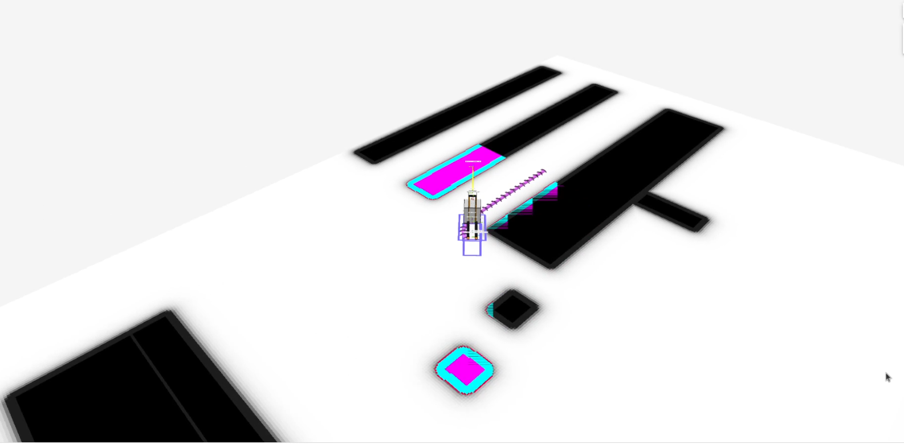
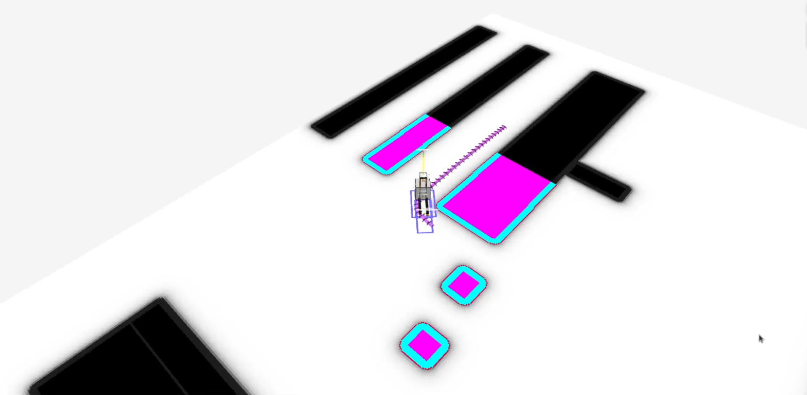

.. _jazzy_migration:

Jazzy to K-Turtle
#################

Moving from ROS 2 Jazzy to K-Turtle, a number of stability improvements were added that we will not specifically address here.

New Nav2 Loopback Simulator
***************************

The ``nav2_loopback_sim`` is a stand-alone simulator to create a "loopback" for non-physical simulation to replace robot hardware, physics simulators (Gazebo, Bullet, Isaac Sim, etc).
It computes the robot's odometry based on the command velocity's output request to create a perfect 'frictionless plane'-style simulation for unit testing, system testing, R&D on higher level systems, testing behaviors without concerning yourself with localization accuracy or system dynamics, and multirobot simulations.

Docking with Static Infrastructure or Dynamic Docking
*****************************************************

In `PR #4627 <https://github.com/ros-navigation/navigation2/pull/4627>`_ a docking plugin type and logic was added to support non-charging dock types in the nav2 docking server.
This allows users to specify docking locations to static infrastructure, such as conveyers, or dynamic docking locations, such as a pallet.
It also includes a new docking plugin to demonstrate the new docking server capabilities ``simple_non_charging_dock``.

New RViz panel for Docking
**************************

In `PR #4458 <https://github.com/ros-navigation/navigation2/pull/4458>`_ a new RViz panel was added to interact with the Docking Server.

This panel allows the user to:

- Dock the robot to a charger, selecting the dock id or the dock pose and type. It also allows the user to set whether or not to navigate to the staging pose.
- Undock the robot from a charger.

The panel displays the action goal status and feedback published by ``nav2_msgs/DockRobot`` and ``nav2_msgs/UndockRobot`` actions. Users can find information such as elapsed time, number of retries and the current state of the action (staging, controlling, etc.), as well as the error codes of the action.

Here we can see the working demo of the plugin:

.. image:: images/docking_panel.gif

.. attention:: If the docking server is unavailable, then the combo box of the dock type will be empty.

New BT Nodes
************

Below is a list of new BT Nodes added:

- ``GetPoseFromPath``: An action to get a particular pose from an input path.
- ``RemoveInCollisionGoals``: An action to remove waypoints that have a cost higher than a threshold.

New RViz Tool for Costmap Cost Cell Inspection
**********************************************

In `PR #4546 <https://github.com/ros-navigation/navigation2/pull/4546>`_ a new RViz tool was added to get the costmap costcell's cost and a service to get the costcell's cost at the footprint pose.

Usage:

- Click on any point in the costmap with costmap rviz tool to retrieve and display the cost value at that cell.
- ``nav2_msgs/GetCosts`` service can be used to retrieve the cost at footprint pose

Working demo of the tool:

.. image:: images/rviz_costmap_cost_tool.gif

.. attention:: If the costmap service is unavailable, then the tool will not be able to fetch and display the cost values.

Fix flickering visualization
****************************

In `PR #4561 <https://github.com/ros-navigation/navigation2/pull/4561>`_ a ``map_vis_z`` parameter has been introduced to Costmap2DROS to help modify the map slightly below the default plane, aiming to eliminate rviz visualization flickering issues.

Default Value:

- map_vis_z: 0.0

Minimum Value Without Flickering:

- map_vis_z: -0.008

Before:

After:

Option to limit velocity through DWB trajectory
***********************************************

In `PR #4663 <https://github.com/ros-navigation/navigation2/pull/4663>`_ a ``limit_vel_cmd_in_traj`` parameter was introduced to DWB local planner to allow the user to limit the velocity used in the trajectory generation based on the robot's current velocity.

Default value: 

- false

Option to disable zero velocity publishing on goal exit
*******************************************************

In `PR #4675 <https://github.com/ros-navigation/navigation2/pull/4675>`_ a ``publish_zero_velocity`` parameter was introduced for the `Controller server </configuration/packages/configuring-controller-server.html#controller-server>`_ in order to disable zero velocity publishing on goal exit.

Default value:

- true
