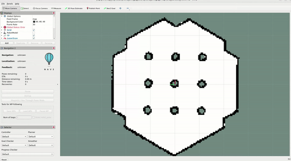
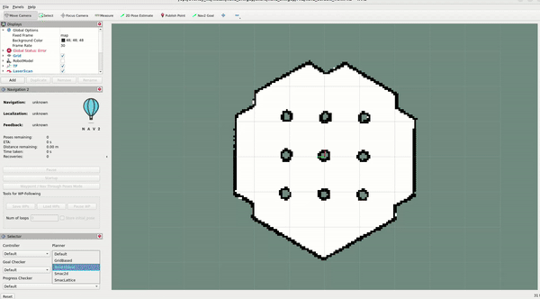
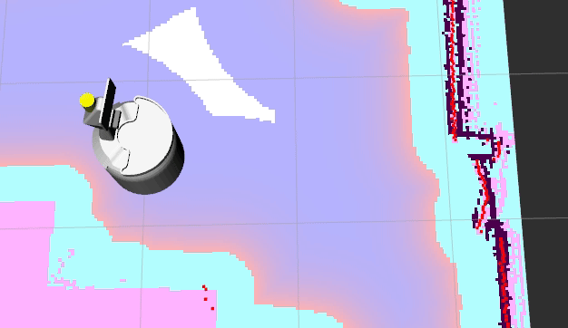

.. _jazzy_migration:

Jazzy to Kilted
###############

Moving from ROS 2 Jazzy to Kilted, a number of stability improvements were added that we will not specifically address here.

Nav2 Route Server
*****************

The Route Server in ``nav2_route`` implements the server for computing routes through a predefined navigation graph rather than using freespace planning like the Planner Server.
It may be used to fully replace freespace planning when following a particular route closely or to augment the global planner with long-distance routing to a goal.
In this case, the planner will generate feasible paths with localized environmental information for only the future part of the route necessary.

This is useful for industrial applications where the robot should deterministically plan within known areas, lanes, and/or routes rather than having free rein to globally navigate.
It is also useful for outdoor navigation in locations like urban centers on roadways or natural environments over vast distances.

It also includes a tracking feature that will track the route's progression and provide live feedback on its status as well as trigger contextual operations at various nodes and edge events (change speed, turn on light, etc).

See :ref:`configuring_croute_server` for additional configuration information, the tutorials on generating graphs and using it, and example graphs in ``nav2_bringup`` and ``nav2_route``.

BehaviorTree error_msg
**********************

In `PR #4459 <https://github.com/ros-navigation/navigation2/pull/4459>`_ adds error_msg to all action result messages
and `PR #4460 <https://github.com/ros-navigation/navigation2/pull/4460>`_ captures and propagates error_msg result strings through the bt_navigator,
a new parameter for the BT Navigator ``error_code_name_prefixes`` was introduced, *AND* it is a *mandatory* replacement for ``error_code_names``.

In other words the existence of the ``error_code_names`` parameter will be rejected as a runtime exception at startup and *MUST* be removed.

When configured correctly, and the behaviour tree xml configuration is modified appropriately, error codes and contextual error messages are propagated in the Result message of Nav2 action server requests.

This allows handling of specific errors with more contextual information, than simply the error code, to be viewed by application clients calling Nav2 or its servers.

Behavior tree based Navigator Action requests, require augmentation of behavior tree elements that support ``error_code_id`` and ``error_msg`` output ports.

The corresponding attribute values, must use port variable names that combine the relevant ``error_code_names_prefix`` with the suffix ``_error_code`` and ``_error_msg``.

The following is an example of the ``error_code_names`` parameter that must be replaced

.. code-block:: yaml

    error_code_names:
      - compute_path_error_code
      - follow_path_error_code

with the ``error_code_names_prefixes`` parameter which specifies prefixes for the current set of built in action servers.

.. code-block:: yaml

    error_code_name_prefixes:
      - assisted_teleop
      - backup
      - compute_path
      - dock_robot
      - drive_on_heading
      - follow_path
      - nav_thru_poses
      - nav_to_pose
      - spin
      - route
      - undock_robot
      - wait

The following provides examples of modifications that should be made to behavior tree configurations to propagate the error messages and codes to the BT navigator result.

.. code-block:: xml

  <ComputePathToPose goal="{goal}" path="{path}" planner_id="{selected_planner}" error_code_id="{compute_path_error_code}" error_msg="{compute_path_error_msg}"/>
  <FollowPath path="{path}" controller_id="{selected_controller}" error_code_id="{follow_path_error_code}" error_msg="{follow_path_error_msg}"/>
  <Spin spin_dist="1.57" error_code_id="{spin_error_code}" error_msg="{spin_error_msg}"/>
  <Wait wait_duration="5.0" error_code_id="{wait_error_code}" error_msg="{wait_error_msg}"/>
  <BackUp backup_dist="0.30" backup_speed="0.15" error_code_id="{backup_error_code}" error_msg="{backup_error_msg}"/>
  <DriveOnHeading dist_to_travel="2.0" speed="0.2" time_allowance="12" error_code_id="{drive_on_heading_error_code}" error_msg="{drive_on_heading_error_msg}"/>
  <UndockRobot dock_type="{dock_type}" error_code_id="{undock_robot_error_code}" error_msg="{undock_robot_error_msg}" />
  <DockRobot dock_id="{dock_id}" error_code_id="{dock_robot_error_code}" error_msg="{dock_robot_error_msg}"/>
  <NavigateToPose goal="{picking_location}" error_code_id="{nav_to_pose_error_code}" error_msg="{nav_to_pose_error_msg}"/>

The explicit specification of the ``error_code_names_prefix`` for both ``error_code_id`` and ``error_msg`` in the behavior tree xml is done to provide a configuration based level of indirection to enable resolution of namespace conflicts between built in Nav2 and third party actions servers.

If custom ``BTActionServer``, ``BehaviorTreeNavigator``, or associated BT nodes for task servers exist in your system, please review the PR to update the files to support the error code propagation.

TwistStamped Default CmdVel Change
**********************************

In Kilted and newer, the default ``cmd_vel`` topic for all ``Twist`` publishers and subscriptions is changed to ``TwistStamped`` in order to enable a broader range of applications.
it also allows for rejection of stale velocity messages, which can be useful in some applications.
Your robot should now subscribe to a ``TwistStamped`` message instead of a ``Twist`` message & update your simulation appropriately.
The topic names are the same.

However, this can be disabled by setting ``enable_stamped_cmd_vel`` to ``false`` in the ``nav2_params.yaml`` file for all nodes that involve Twist subscriptions or publications.
See the configuration guide for more information on how to configure this parameter for each node.

An example simulation migration using Gazebo can be seen in the `following pull request for the Turtlebot 3 and 4 <https://github.com/ros-navigation/nav2_minimal_turtlebot_simulation/pull/16>`_.

New Nav2 Loopback Simulator
***************************

The ``nav2_loopback_sim`` is a stand-alone simulator to create a "loopback" for non-physical simulation to replace robot hardware, physics simulators (Gazebo, Bullet, Isaac Sim, etc).
It computes the robot's odometry based on the command velocity's output request to create a perfect 'frictionless plane'-style simulation for unit testing, system testing, R&D on higher level systems, testing behaviors without concerning yourself with localization accuracy or system dynamics, and multirobot simulations.

Docking with Static Infrastructure or Dynamic Docking
*****************************************************

In `PR #4627 <https://github.com/ros-navigation/navigation2/pull/4627>`_ a docking plugin type and logic was added to support non-charging dock types in the nav2 docking server.
This allows users to specify docking locations to static infrastructure, such as conveyers, or dynamic docking locations, such as a pallet.
It also includes a new docking plugin to demonstrate the new docking server capabilities ``simple_non_charging_dock``.

New RViz panel for Docking
**************************

In `PR #4458 <https://github.com/ros-navigation/navigation2/pull/4458>`_ a new RViz panel was added to interact with the Docking Server.

This panel allows the user to:

- Dock the robot to a charger, selecting the dock id or the dock pose and type. It also allows the user to set whether or not to navigate to the staging pose.
- Undock the robot from a charger.

The panel displays the action goal status and feedback published by ``nav2_msgs/DockRobot`` and ``nav2_msgs/UndockRobot`` actions. Users can find information such as elapsed time, number of retries and the current state of the action (staging, controlling, etc.), as well as the error codes of the action.

Here we can see the working demo of the plugin:

.. image:: images/docking_panel.gif

.. attention:: If the docking server is unavailable, then the combo box of the dock type will be empty.

BT Nodes Changes
****************

Below is a list of new BT Nodes added:

- ``GetPoseFromPath``: An action to get a particular pose from an input path.
- ``RemoveInCollisionGoals``: An action to remove waypoints that have a cost higher than a threshold.
- ``IsStopped``: A condition to check if the robot is stopped for a certain duration.

Below is a list of changes to existing BT Nodes:

- ``GoalUpdater``: It now supports updating a list of goals as well (useful for NavigateThroughPoses interface)

New RViz Tool for Costmap Cost Cell Inspection
**********************************************

In `PR #4546 <https://github.com/ros-navigation/navigation2/pull/4546>`_ a new RViz tool was added to get the costmap costcell's cost and a service to get the costcell's cost at the footprint pose.

Usage:

- Click on any point in the costmap with costmap rviz tool to retrieve and display the cost value at that cell.
- ``nav2_msgs/GetCosts`` service can be used to retrieve the cost at footprint pose

Working demo of the tool:

.. image:: images/rviz_costmap_cost_tool.gif

.. attention:: If the costmap service is unavailable, then the tool will not be able to fetch and display the cost values.

Fix flickering visualization
****************************

In `PR #4561 <https://github.com/ros-navigation/navigation2/pull/4561>`_ a ``map_vis_z`` parameter has been introduced to Costmap2DROS to help modify the map slightly below the default plane, aiming to eliminate rviz visualization flickering issues.

Default Value:

- map_vis_z: 0.0

Minimum Value Without Flickering:

- map_vis_z: -0.008

Before:

.. image:: images/fix_flickering_visualization_before.png

After:

.. image:: images/fix_flickering_visualization_after.png

Option to limit velocity through DWB trajectory
***********************************************

In `PR #4663 <https://github.com/ros-navigation/navigation2/pull/4663>`_ a ``limit_vel_cmd_in_traj`` parameter was introduced to DWB local planner to allow the user to limit the velocity used in the trajectory generation based on the robot's current velocity.

Default value:

- false

Option to disable zero velocity publishing on goal exit
*******************************************************

In `PR #4675 <https://github.com/ros-navigation/navigation2/pull/4675>`_ a ``publish_zero_velocity`` parameter was introduced for the `Controller server </configuration/packages/configuring-controller-server.html#controller-server>`_ in order to disable zero velocity publishing on goal exit.

Default value:

- true

Rotation Shim Disengagement Threshold
*************************************

The parameter ``angular_disengage_threshold`` was introduced as a new threshold for disengagement of the rotation in the rotation shim controller.
Previous behavior rotated until the ``angular_dist_threshold``, now it can rotate until the ``angular_disengage_threshold``, which can be set closer to the path's orientation if desired.

Added optional collision checking for the Docking Server
********************************************************

In `PR #4752 <https://github.com/ros-navigation/navigation2/pull/4752>`_ an optional collision checking feature was added to the `Docking server </configuration/packages/configuring-docking-server.html#docking-server>`_ to check for collisions between the robot and the dock.

Default value:

- true

Revamped multirobot bringup and config files to use namespaces
**************************************************************

In `PR #4715 <https://github.com/ros-navigation/navigation2/pull/4715>`_ multirobot bringup and the use of namespaces were overhauled to be compatible out of the box with ROS namespaces and remove custom logic, specifically:

* The ``use_namespace`` parameter has been removed from ``nav2_bringup`` launch files. The ``namespace`` parameter will now always be used and default to ``/`` for "global namespace".
* There is now a single rviz config file for both normal and namespaced robots. Topics have been changed to a relative path (i.e. ``/map`` -> ``map``) and the rviz ``namespace`` will be added automatically.
* There is now a single ``nav2_params.yaml`` config file for both single and multirobot bringup. All the topics have been changed to relative (i.e. ``/scan`` -> ``scan``).

Note that some plugins / nodes might have their own local namespace. This is the case for ``CostmapLayer`` which will be in a ``/ns/[layer_name]`` namespace. For these, a new function ``joinWithParentNamespace`` has been added to make sure joining relative paths results in ``/ns/topic_name`` rather than ``/ns/[layer_name]/topic_name``.

If your use case doesn't require multiple robots, keeping absolute paths in your ``nav2_params.yaml`` config file and rviz config file will preserve existing behavior.

For example, if you specify ``topic: scan`` in the ``voxel_layer`` of a ``local_costmap`` and you launch your bringup with a ``tb4`` namespace:

* User chosen namespace is ``tb4``.
* User chosen topic is ``scan``.
* Topic will be remapped to ``/tb4/scan`` without ``local_costmap``.
* Use global topic ``/scan`` if you do not wish the node namespace to apply

Removed global map_topic from Costmap node
******************************************

In `PR #4715 <https://github.com/ros-navigation/navigation2/pull/4715>`_ the global ``map_topic`` parameter has been removed from the ``Costmap2DROS`` node. This parameterwas only used in the ``StaticLayer`` and should be defined as a parameter local to the ``StaticLayer`` instead, for example:

.. code-block:: yaml

  global_costmap:
    global_costmap:
      ros__parameters:
        [...]
        # Not supported anymore
        map_topic: my_map
        static_layer:
          plugin: "nav2_costmap_2d::StaticLayer"
          map_subscribe_transient_local: True
          # Do this instead
          map_topic: my_map

Simplified Costmap2DROS constructors
************************************

The following constructors for ``Costmap2DROS`` have been removed:

.. code-block:: cpp

   explicit Costmap2DROS(
    const std::string & name,
    const std::string & parent_namespace,
    const std::string & local_namespace,
    const bool & use_sim_time);

   explicit Costmap2DROS(const std::string & name, const bool & use_sim_time = false);

They have been consolidated into a single one:

.. code-block:: cpp

   explicit Costmap2DROS(
    const std::string & name,
    const std::string & parent_namespace = "/",
    const bool & use_sim_time = false);

The ``local_namespace`` parameter has been removed and is now automatically set to the node's name (which is what the second removed constructor did).
Parameters ``parent_namespace`` / ``use_sim_time`` both provide default values to maintain the ability of creating a ``Costmap2DROS`` object by just specifying a name.

Option to disable collision checking in DriveOnHeading, BackUp and Spin Actions
*******************************************************************************

In `PR #4785 <https://github.com/ros-navigation/navigation2/pull/4785>`_ a new boolean parameter named `disable_collision_checks` was added to the `DriveOnHeading`, `BackUp` and `Spin` actions to optionally disable collision checking.
This can be useful, for example, in cases where you want to move the robot even in the presence of known obstacles.

Default value:

- false

New Plugin Container Layer
**************************

In `PR #4781 <https://github.com/ros-navigation/navigation2/pull/4781>`_ a costmap layer plugin type was added to support the grouping of different costmap layers under a single costmap layer. This would allow for different isolated combinations of costmap layers to be combined under one parent costmap instead of the current implementation which would indiscriminately combine all costmap layers together.

Iterative Target Selection for the Graceful Controller
******************************************************

In `PR #4795 <https://github.com/ros-navigation/navigation2/pull/4795>`_ the ``nav2_graceful_controller`` was updated to iteratively select motion targets. This is a large refactor which significantly improves the performance of the controller. The ``motion_target_dist`` parameter has been replaced by ``min_lookahead`` and ``max_lookahead`` parameters. Additional changes include:

* Improved defaults for ``k_phi``, ``k_delta``, ``beta`` parameters of the underlying control law.
* Automatic creation of orientations for the plan if they are missing.
* Addition of ``v_angular_min_in_place`` parameter to avoid the robot getting stuck while rotating due to mechanical limitations.
* ``final_rotation`` has been renamed ``prefer_final_rotation`` and the behavior has changed slightly.

Conform to ROS 2 launch syntax in Turtlebot 3 multi-robot launch file
*********************************************************************

In `PR #5000 <https://github.com/ros-navigation/navigation2/pull/5000>`_ the ``cloned_multi_tb3_simulation_launch.py`` launch file was updated so that parsing the robots conforms to the ROS 2 launch file standards. This change allows users to pass the ``robots`` from another launch file through ``launch_arguments`` which was not possible with the old version.

Example for including ``cloned_multi_tb3_simulation_launch.py`` in another launch file:

.. code-block:: python

    IncludeLaunchDescription(
        PythonLaunchDescriptionSource(
            os.path.join(get_package_share_directory('nav2_bringup'), "launch", "cloned_multi_tb3_simulation_launch.py")
        ),
        launch_arguments={"robots": "{name: 'robot1', pose: {x: 0.5, y: 0.5, yaw: 1.5707}}"}.items(),
    )

ComputePathThroughPoses, NavigateThroughPoses and other BT nodes now use nav_msgs/Goals instead of vector<PoseStamped>
************************************************************************************************************************

In `PR #269 <https://github.com/ros2/common_interfaces/pull/269>`_ a new message type `Goals` was introduced to the `nav_msgs` package.
In `PR #4980 <https://github.com/ros-navigation/navigation2/pull/4980>`_, all collections of `PoseStamped` has been migrated to use the `nav_msgs::msg::Goals` message. Most notably, `NavigateThroughPoses.action` and `ComputePathThroughPoses.action` have been updated to use `nav_msgs/Goals`.
Since `nav_msgs/Goals` contains a header, the poses are now accessed via `NavigateThroughPoses.poses.goals` instead of `NavigateThroughPoses.poses` or `ComputePathThroughPoses.goals.goals` instead of `ComputePathThroughPoses.poses`. Please update your code accordingly when using these interfaces.

MPPI controller re-implemented using Eigen library and performance improved by 40-45%
*************************************************************************************

In the `PR #4621 <https://github.com/ros-navigation/navigation2/pull/4621>`_ MPPI controller is fully reimplemented using Eigen as it is well supported hpc library and suits better for our use case of two dimensional batches of trajectories. GPU support for rolling out trajectories could also be possible in future using Eigen.
MPPI Optimizer's performance is improved by 40-50%. Now MPPI Controller can also be run on ARM processors which do not support SIMD Instructions extensively.

Enable goal orientation non-specificity
***************************************
`PR #4148 <https://github.com/ros-planning/navigation2/pull/4127>`_  introduces two new parameters(goal_heading_mode, coarse_search_resolution) in the smac planner, specifically the smac planner hybrid and smac planner lattice that allows for the
planner to plan to a goal with multiple orientations and return the best path in just one planning call. This is useful for robots that can approach a goal from multiple orientations and the user does not want to plan to each orientation separately.
In addition to this, the coarse_search_resolution parameter is added to the smac planner lattice to allow for a faster search for the best path.

Here is an Example of the smacHybrid planner with the default goal_heading_mode to see the difference in the planned path.

Here is an Example of the smacHybrid planner with the bidirectional goal_heading_mode to see the difference in the planned path.

Here is an Example of the smacHybrid planner with the all_directions goal_heading_mode to see the difference in the planned path.

.. image:: images/smacHybrid_with_all_direction_goal_heading_mode.gif
    :width: 700px
    :alt: Navigation2 with smacHybrid planner with all_direction goal_heading_mode
    :align: center

DriveOnHeading and BackUp behaviors: Addition of acceleration constraints
*************************************************************************
`PR #4810 <https://github.com/ros-navigation/navigation2/pull/4810>`_ adds new parameters ``acceleration_limit``, ``deceleration_limit``, ``minimum_speed`` for the `DriveOnHeading` and `BackUp` Behaviors. The default values are as follows:

- ``acceleration_limit``: 2.5
- ``deceleration_limit``: -2.5
- ``minimum_speed``: 0.10

Rotation Shim Deceleration as a function of its target orientation
******************************************************************

In `PR #4864 <https://github.com/ros-navigation/navigation2/pull/4864>`_ the Rotation Shim Controller was updated to decelerate as a function of its target orientation. This allows the robot to slow down as it approaches its target orientation, reducing overshoot when passing to the primary controller. The deceleration is controlled by the `max_angular_accel` parameter.

A demo can be seen below with the following parameters:

.. code-block:: yaml

  [...]:
    plugin: "nav2_rotation_shim_controller::RotationShimController"
    angular_dist_threshold: 1.22 # (70 degrees)
    angular_disengage_threshold: 0.05 # (3 degrees)
    rotate_to_heading_angular_vel: 0.8
    max_angular_accel: 0.5

.. image:: images/rotation_shim_decel.gif
  :width: 800
  :alt: Rotation Shim Deceleration
  :align: center

Rotation Shim Open-loop Control
*******************************

The parameter ``closed_loop`` was introduced to the Rotation Shim Controller to allow users to choose between open-loop and closed-loop control. If false, the rotationShimController will use the last commanded velocity as the next iteration's current velocity. When acceleration limits are set appropriately and the robot's controllers are responsive, this can be a good assumption. If true, it will use odometry to estimate the robot's current speed. In this case it is important that the source is high-rate and low-latency to account for control delay.

Default value:

- true

Near collision cost in MPPI cost critic
***************************************

In `PR #4996 <https://github.com/ros-navigation/navigation2/pull/4996>`_ a new parameter ``near_collision_cost`` was added to the MPPI cost critic to set a maximum proximity for avoidance. The critical cost will be applied to costs higher than this value even if non-collision inducing.

Default value:

- 253

Service introspection
*********************

In `PR #4955 <https://github.com/ros-navigation/navigation2/pull/4955>`_ the parameter ``service_introspection_mode`` was introduced to the `Nav2` stack to allow introspection of services. The options are "disabled", "metadata", "contents".

Default value:

- "disabled"

Rotation Shim Using Path Orientations
*************************************

The parameter ``use_path_orientations`` was introduced to the Rotation Shim Controller to allow users to choose between using the orientations of the path points to compute the heading of the path instead of computing the heading from the path point's relative locations. This is useful for planners that generate feasible paths with orientations for forward and reverse motion, such as the Smac Planner.

Default value:

- false

MPPI - Publishing Optimal Trajectory
************************************

When ``publish_optimal_trajectory`` is enabled, the full optimal trajectory in the form of a ``nav2_msgs/Trajectory`` is published for debugging, visualization, and/or injection by other systems. This provides not just the pose information but velocities and timestamps of the MPC trajectory's viapoints which can be useful for multi-stage control systems, jerk minimization, or collision avoidance systems.

NavigateThroughPoses - Reporting waypoint statuses information
**************************************************************

`PR #4994 <https://github.com/ros-navigation/navigation2/pull/4994>`_ enhances the ``NavigateThroughPoses`` navigator to provide real-time status feedback for waypoints.
Introduces the ``WaypointStatus`` message type, which indicates a waypoint's status: pending, complete, skipped, or failed.
This also replaces the deprecated ``MissedWaypoint`` type used in ``WaypointFollower``.
This also updates the behavior tree nodes ``RemovePassedGoals`` and ``RemoveInCollisionGoals`` to mark waypoint statuses as the action progresses.
``NavigateThroughPoses`` now retrieves waypoint statuses via the blackboard (similar to path and goal(s)) and organizes them into the action server’s feedback and result messages, exposing the waypoint execution status to users.

The parameter ``waypoint_statuses_blackboard_id`` was introduced to the ``bt_navigator`` node to allow users to customize the variable name for ``waypoint_statuses`` in the blackboard.
In the Behavior Tree XML, the ``RemovePassedGoals`` and ``RemoveInCollisionGoals`` nodes must expose corresponding ports to align with the ``waypoint_statuses`` workflow to manage the waypoints' state when removing them due to completion or skipped due to collision.
This ensures ``NavigateThroughPoses`` can retrieve and propagate waypoint statuses via the blackboard.
The action also populates the completed waypoints at the end when populating the action result.

The following is an example of the ``RemovePassedGoals`` and ``RemoveInCollisionGoals`` nodes configuration:

.. code-block:: xml

    <RemovePassedGoals input_goals="{goals}" output_goals="{goals}" radius="0.7" input_waypoint_statuses="{waypoint_statuses}" output_waypoint_statuses="{waypoint_statuses}"/>
    <RemoveInCollisionGoals input_goals="{goals}" output_goals="{goals}" cost_threshold="254.0" use_footprint="true" service_name="/global_costmap/get_cost_global_costmap" input_waypoint_statuses="{waypoint_statuses}" output_waypoint_statuses="{waypoint_statuses}" />

The ``waypoint_statuses`` array matches the length of the original input ``goals`` vector, with each element being a ``WaypointStatus`` message.
The ``RemovePassedGoals`` and ``RemoveInCollisionGoals`` nodes prune invalid or completed goals from the goals vector and update their corresponding entries in the ``waypoint_statuses`` array.

Custom nodes can access or modify the ``waypoint_statuses`` array as well if other skip, removal, completion, or failures are used when working with multiple ordered goals. Use the utility method ``find_next_matching_goal_in_waypoint_statuses`` (from nav2_utils) to map goals to their status entries.
Modified statuses should then be propagated through output ports for downstream nodes.

The ``NavigateThroughPoses`` navigator retrieves the ``waypoint_statuses`` instance from the blackboard in its ``onLoop`` callback and writes it into the feedback message.
During the ``goalCompleted`` callback, it fetches the ``waypoint_statuses`` instance and, based on the BT's final execution status (``final_bt_status``), updates any waypoints still in the ``PENDING`` state to either ``COMPLETED`` (if ``final_bt_status`` is ``SUCCEEDED``) or ``FAILED`` (otherwise).

Groot 2 Support
***************
In `PR #5065 <https://github.com/ros-navigation/navigation2/pull/5065>`_ , BT navigators: ``navigate_to_pose`` and ``navigate_through_poses`` now support live monitoring and visualization of the behavior tree using Groot 2. JSON conversions are also available to see the content of the Blackboard, allowing the introspection of the BT nodes. Switching bt-xmls on the fly through a new goal request is also included.

Because live monitoring of Behavior Tree with more than 20 nodes and visualizing the content of the blackboard is a PRO (paid) feature of Groot 2. This feature is disabled by default.

.. note::

  Currently, there is a known bug that crashes Groot 2 when visualizing vectors and related types (e.g., ``Goals`` and ``Path``) contained in the blackboard. Efforts are underway to resolve this issue. For updates, please refer to the following links: `Groot2 issue #55 <https://github.com/BehaviorTree/Groot2/issues/55>`_ and `BehaviorTree PR #958 <https://github.com/BehaviorTree/BehaviorTree.CPP/pull/958>`_.

Docking backwards as plugin parameter
*************************************
In `PR #5079 <https://github.com/ros-navigation/navigation2/pull/5079>`_, the ``dock_backwards`` boolean parameter has been moved from the docking server to the dock plugin as the string parameter ``dock_direction``. This allows the user to have multiple dock plugins with different directions in the same docking server. Default value is ``forward`` but may also be set as ``backward``.

See :ref:`configuring_docking_server` for more information.

New Position Goal Checker
*************************

In `PR #5162 <https://github.com/ros-navigation/navigation2/pull/5162>`_, a new goal checker plugin called ``PositionGoalChecker`` has been added to Nav2. This plugin provides an alternative to the existing goal checkers by focusing only on the position component of the robot pose, ignoring orientation. This is used by the RPP controller to create stateful behavior to rotate to heading once meeting the goal tolerance.

Docking backwards without sensor
********************************

In `PR #5153 <https://github.com/ros-navigation/navigation2/pull/5153>`_, the docking server was updated to allow docking backwards without a sensor for detection. It should be setup to approach the staging pose for the dock in the forward direction with sensor coverage for dock detection, then after detection it will rotate to back up into the dock using the initial detected pose only for deadreckoning.

A new parameter ``reverse_to_dock`` was added to the ``SimpleChargingDock`` and ``SimpleNonChargingDock`` plugins to allow this feature.

Default value:

- false

See :ref:`configuring_docking_server` for more information.

Here we can see the working demo of the feature:

RegulatedPurePursuit Controller [RPP]: new parameter ``stateful``
*****************************************************************

`PR #5167 <https://github.com/ros-navigation/navigation2/pull/5167>`_ adds a new parameter stateful for the regulated pure pursuit controllers. This parameter enables stateful goal handling behavior. When set to true, the controller will persist the goal state once the robot reaches the XY tolerance. It will then focus on aligning to the goal heading without reverting to XY position corrections.

Controller Server Frequency Removed Dynamic Parameter
*****************************************************

`PR #5106 <https://github.com/ros-navigation/navigation2/pull/5106>`_ removes ``control_frequency`` as a dynamic parameter.
This is done so that the plugins can identify which parameters belong to itself and not the larger servers to perform dynamic reconfigurations.
The controller server would update this value but the internal plugins would not properly so it was removed.
If you rely on this behavior, please file a ticket and discuss with maintainers how to readd.
