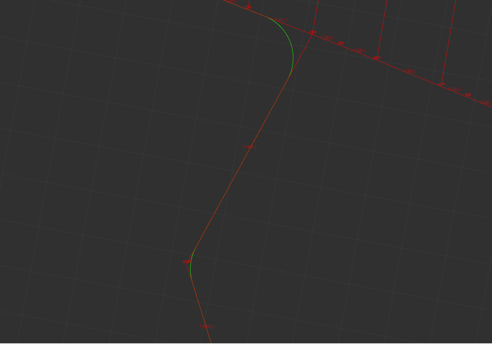

.. _kilted_migration:

Kilted to L-turtle
##################

Moving from ROS 2 Kilted to L-Turtle, a number of stability improvements were added that we will not specifically address here.

New Nav2 ROS Common & Nav2 Lifecycle Node
-----------------------------------------

Starting in Lyrical, a new package ``nav2_ros_common`` was added that contains a set of Nav2, ROS 2 utilities, wrappers, and overrides for working with ROS 2 in Nav2 in a standardized and controllable way.
This ingests previous capabilities from ``nav2_util`` like the ``LifecycleNode`` and ``SimpleActionServer``, but extends it to wrap all ROS 2 interfaces with Nav2 variants in the ``nav2::`` namespace.
The new ``nav2::LifecycleNode``'s factory members (``create_client``, ``create_service``, ``create_publisher``, ``create_subscriber``, ``create_action_server``, and ``create_action_client``) now return these Nav2 objects.
This requires some migration of custom plugins, Task Servers, or other components in the Nav2 styling and/or application that wish to use Nav2's utilities.
Additionally, it contains a set of QoS profiles to be globally used within the stack to give developers complete control over the QoS settings of the system and a one-stop location to update or test different profiles and be applied globally in the stack.

This work is motived by a need to set certain global configurations for interfaces, such as enabling QoS overrides for publishers and subscribers via a run-time parameter and enabling Action and Service introspection.
It also lets us add additional configuration, tracing, advanced features, and wrappers than was previously possible throughout the codebase at large.

The expectation is that all Nav2 nodes and packages use the utilities in this package globally to be consistent and to avoid code duplication.
The lifecycle node includes factories for subscriptions, publishers, clients, and servers that return Nav2 objects in this package rather than the ROS 2 base classes as a level of abstraction of common boilerplate configurations and capabilities.
The factories are listed below:

- `create_client` --> `nav2::ServiceClient`
- `create_service` --> `nav2::ServiceServer`
- `create_publisher` --> `nav2::Publisher`
- `create_subscriber` --> `nav2::Subscriber`
- `create_action_server` --> `nav2::SimpleActionServer`
- `create_action_client` --> `nav2::ActionClient`

`A large-scale migration example can be found here <https://github.com/ros-navigation/navigation2/pull/5288>`_.

In most cases, these are very similar to the previous ``rclcpp`` version.
If a previous ``nav2_util`` version existed, the APIs should be largely the same, except now they should be constructed using the ``create_*`` factory rather than manually to make use of the abstracted configuration settings and advanced features to come.
Where changed, it is typically to move the QoS profile specification to the end of the arguments, which is now optional and defaults to the `nav2::qos::StandardTopicQoS` profile (reliable, volitile, queue depth of 10).

* `nav2_util::LifecycleNode` is now `nav2::LifecycleNode`, which is largely the same except for the factories and a couple of internal implementation details.
* The Service Client, Service Server, and Simple Action Server were also moved to the `nav2::` namespace, but they should not be accessed directly. Use the `create_*` factories from the `nav2::LifecycleNode`, such as `create_action_server` or `create_action_client`.
* There are now `nav2::qos` profiles for QoS to be used in the codebase for homologation and later easier changing: `nav2::qos::StandardTopicQoS` `nav2::qos::LatchedPublisherQoS`, `nav2::qos::LatchedSubscriberQoS` and `nav2::qos::SensorDataQoS`. These should be used rather than `rclcpp` profiles.
* The APIs for `create_*` are very similar to the default ones, but slightly different to move the now optional QoS profile specification below required information. When this is not specified the `StandardTopicQoS` is used (reliable, queue size 10). Only override this if you want another QoS type. Avoid use of `SystemDefaultsQoS`.

Plugin Migration
^^^^^^^^^^^^^^^^

All plugins now use `nav2::LifecycleNode` instead of `rclcpp_lifecycle::LifecycleNode` or `nav2_util::LifecycleNode`.
All must be updated to use this new API from planners and controllers to behavior tree nodes.
Similarly, calls to the `create_*` factories will now point to the Nav2 objects, where applicable.
See above for what those look like and below for a migration from the existing code usage to the new version in order to make use of the new features and API.

Service Client Migration
^^^^^^^^^^^^^^^^^^^^^^^^

We no longer need to create the object manually, nor should we as it bypasses the lifecycle node factories that set introspection and other future features.
We can use the node now to do this instead of passing in a node and we don't need to specify the node type anymore as a template.
All Nav2 servers should use ``nav2::ServiceClient<T>``.

.. code-block:: cpp

   // If using rclcpp::Client<T> from previous create_client factor
   main_client_ = node->create_client<SrvT>(main_srv_name_, rclcpp::SystemDefaultsQoS(), callback_group_);  // Type rclcpp:Client<T>

   // If using nav2_util::ServiceClient<T> manually
   main_client_ =
     std::make_shared<nav2_util::ServiceClient<SrvT>>(
     main_srv_name_,
     node,
     false /* Does not create and spin an internal executor*/);  // Type nav2_util::ServiceClient<T>

To:

.. code-block:: cpp

   main_client_ = node->create_client<SrvT>(main_srv_name_, false  /* Does not create and spin an internal executor*/);  // Type nav2::ServiceClient<T>

If migrating from the ``rclcpp::Client<T>`` factory, check out the ``nav2::ServiceClient<T>`` API for its features like ``invoke()`` which wraps the async call and spinning for results using the given node or another internal executor.
You may optionally directly migrate by changing calls from ``async_send_request`` to ``async_call`` and otherwise handle the future in your application code.
It now supports service introspection using the parameter ``introspection_mode``.

Service Server Migration
^^^^^^^^^^^^^^^^^^^^^^^^

Services should now use ``nav2::ServiceServer<T>`` instead of ``rclcpp::Service<T>`` or ``nav2_util::ServiceServer<T>``.
The factory is now available from the node ``create_service(...)``, so we can use that to create the service server.
The callback should now include the ``rmw_request_id_t`` header now, so we have 3 placeholders rather than 2:

.. code-block:: cpp

  // If using previous create_service factory
    service_ = node->create_service<std_srvs::srv::Trigger>(
      std::string(node->get_name()) + "/" + getName() + "/reroute",
      std::bind(
        &ReroutingService::serviceCb, this,
        std::placeholders::_1, std::placeholders::_2));  // type rclcpp::Service<T>

  // If using nav2_util::ServiceServer<T> manually
    service_ = std::make_shared<nav2_util::ServiceServer<std_srvs::srv::Trigger,
        std::shared_ptr<rclcpp_lifecycle::LifecycleNode>>>(
      std::string(node->get_name()) + "/" + getName() + "/reroute",
      node,
      std::bind(
        &ReroutingService::serviceCb, this,
        std::placeholders::_1, std::placeholders::_2, std::placeholders::_3));  // type nav2_util::ServiceServer<T>

To

.. code-block:: cpp

    service_ = node->create_service<std_srvs::srv::Trigger>(
      std::string(node->get_name()) + "/" + getName() + "/reroute",
      std::bind(&ReroutingService::serviceCb, this,
          std::placeholders::_1, std::placeholders::_2, std::placeholders::_3));  // type nav2::ServiceServer<T>

No additional changes should be required since the operations are handled in the same way as before.
It now supports service introspection using the parameter ``introspection_mode``.

Action Server Migration
^^^^^^^^^^^^^^^^^^^^^^^

We can use the factory now from the node and the node is not required as an argument.
This otherwise does not change.
This is analog to the action server but configures with action introspection and other features that are not available in the base ``rclcpp_action::Server<T>``.

.. code-block:: cpp

    compute_and_track_route_server_ = std::make_shared<ComputeAndTrackRouteServer>(
      node, "compute_and_track_route",
      std::bind(&RouteServer::computeAndTrackRoute, this),
      nullptr, std::chrono::milliseconds(500), true);  // Type nav2_util::SimpleActionServer<T>

To

.. code-block:: cpp

    compute_and_track_route_server_ = create_action_server<ComputeAndTrackRoute>(
      "compute_and_track_route",
      std::bind(&RouteServer::computeAndTrackRoute, this),
      nullptr, std::chrono::milliseconds(500), true);  // Type nav2::SimpleActionServer<T>

No additional changes should be required since the operations are handled in the same way as before.
It now supports action request, feedback, and result introspection using the parameter ``introspection_mode``.

Action Client Migration
^^^^^^^^^^^^^^^^^^^^^^^

We can use the node now to create an action client using ``create_action_client`` without providing all the node interfaces.
This is analog to the action client but configures with action introspection and other features that are not available in the base ``rclcpp_action::Client<T>``.

.. code-block:: cpp

    nav_to_pose_client_ = rclcpp_action::create_client<ClientT>(
      get_node_base_interface(),
      get_node_graph_interface(),
      get_node_logging_interface(),
      get_node_waitables_interface(),
      "navigate_to_pose", callback_group_);  // Type rclcpp_action::Client<T>

To

.. code-block:: cpp

    nav_to_pose_client_ = create_action_client<ClientT>(
      "navigate_to_pose", callback_group_);  // Type nav2::ActionClient<T>

No additional changes should be required since the operations are handled in the same way as before.
It now supports action request, feedback, and result introspection using the parameter ``introspection_mode``.

Publisher Subscriber Migration
^^^^^^^^^^^^^^^^^^^^^^^^^^^^^^

To migrate, the order of the arguments in the Subscription must change since the QoS profile is now optional. It is now ``(topic, callback, QoS)`` whereas QoS defaults to the StandardTopicQoS, which is the same as ``rclcpp::QoS`` for the moment.

Publishers that explicitly specify a QoS profile do not require changes, though if the constructor using `depth` is used, it must now specify a policy explicitly.
Both are now ``nav2::Publisher`` and ``nav2::Subscription`` objects that today just typedef the rclcpp and rclcpp_lifecycle versions.
In the future, more features will be added here like lifecycle support for the subscriptions, so its highly recommended as part of this migration to migrate the ``rclcpp::`` to ``nav2::`` as well so those updates are already easily available.

.. code-block:: cpp

    plan_publisher_ = create_publisher<nav_msgs::msg::Path>("plan", 1);
    plan_publisher_ = create_publisher<nav_msgs::msg::Path>("plan", rclcpp::QoS(), callback_group);

    data_sub_ = node->create_subscription<sensor_msgs::msg::Range>(
      source_topic, range_qos,
      std::bind(&Range::dataCallback, this, std::placeholders::_1));

To

.. code-block:: cpp

    plan_publisher_ = create_publisher<nav_msgs::msg::Path>("plan");  // No QoS is required if using the StandardTopicQoS, else it can be provided

    data_sub_ = node->create_subscription<sensor_msgs::msg::Range>(
      source_topic,
      std::bind(&Range::dataCallback, this, std::placeholders::_1));  // QoS can be omitted if using StandardTopicQoS, else it can be provided last

No additional changes should be required since the operations are handled in the same way as before.
Now, it supports future extensions for lifecycle subscriptions or additional wrapper APIs for ease of use.
Additionally, it supports QoS override using the parameter ``allow_parameter_qos_overrides``.

Removed Parameter action_server_result_timeout
----------------------------------------------

Removed the parameter ``action_server_result_timeout`` from all action servers after resolution within ``rcl`` and ``rclcpp`` to address early goal removal.
This is not longer required to be set.

Dock Plugin Detector Control
----------------------------

`PR #5218 <https://github.com/ros-navigation/navigation2/pull/5218>`_ adds on-demand detector control to ``opennav_docking``.
``ChargingDock`` and ``NonChargingDock`` now provide pure virtual ``startDetectionProcess`` / ``stopDetectionProcess`` functions that the docking server invokes around the perception loop.

- Custom dock plugins must implement the new hooks (return ``true`` if nothing extra is required).
- ``Simple(Non)ChargingDock`` gained ``detector_service_name``, ``detector_service_timeout``, and ``subscribe_toggle`` parameters so a detector service can be triggered only while detections are needed.
- See :ref:`configuring_docking_server` for the updated parameter reference and YAML example.

Added Corner Smoothing functionality to route_server
----------------------------------------------------

In `PR #5226 <https://github.com/ros-navigation/navigation2/pull/5226>`_ the ability to stitch two successive edges in ``route_server`` with a smooth circular arc has been added. Below is an example of two successive edges forming a corner being smoothed with a radius of one. The red lines are the edges of the route graph and the green line is the resultant path that can be used by a local planner.

New parameters include ``smooth_corners`` which enable or disable corner smoothing and ``smoothing_radius`` which specifies the radius of the corner to fit to a corner. The tangents of the starting and ending points of the circular arc will match the tangent of the edges that form the corner. In the event that two edges are basically straight, no corner arc is added and regular linear interpolation is done. In addition to that, if the corner arc requires a starting point and ending point that's longer than the edge lengths, then it will not add a corner arc.

Added NonblockingSequence Control Node
--------------------------------------

In `PR #5325 <https://github.com/ros-navigation/navigation2/pull/5325>`_ a new Nav2 specific behavior tree control node has been added. The new behavior tree control node, ``NonblockingSequence``, allows every child node in the sequence to be ticked through even if one of the child node returns ``RUNNING``. This is done to prevent long running child nodes from blocking the sequence.

For additional details regarding the ``NonblockingSequence`` please see the `Nav2 specific node walkthrough <../behavior_trees/overview/nav2_specific_nodes.html>`_ and `NonblockingSequence configuration guide <../configuration/packages/bt-plugins/controls/NonblockingSequence.html>`_.

MPPI Optimal Trajectory Validator Plugin
----------------------------------------

The MPPI controller now has a plugin, ``OptimalTrajectoryValidator``, which can be used to validate an output trajectory for execution.
This can be used to check for collisions, margin from obstacles, distance from a path, progress being made, etc.
By default, it uses the ``DefaultOptimalTrajectoryValidator`` which checks for collisions.
Note that kinematic and dynamic constraints are not required to be checked as the Optimizer ensures these constraints are met.

Added PersistentSequence and PauseResumeController Control Nodes
----------------------------------------------------------------

In `PR #5247 <https://github.com/ros-navigation/navigation2/pull/5247>`_ two new Nav2 specific behavior tree control nodes have been added.

The `PauseResumeController <../configuration/packages/bt-plugins/controls/PauseResumeController.html>`_ adds services to pause and resume execution of the tree. Related to this, the `PersistentSequence <../configuration/packages/bt-plugins/controls/PersistentSequence.html>`_ control node allows the child index to be exposed to the behavior tree through a bidirectional port. This allows the sequence to be continued on resume where it was paused.

Option to use point_cloud_transport
-----------------------------------

In `PR #5264 <https://github.com/ros-navigation/navigation2/pull/5264>`_, option to use `point_cloud_transport <https://github.com/ros-perception/point_cloud_transport>`_ has been added.
This enables transporting PointClouds using compression libraries (such as Draco, Zstd, Zlib, etc.) to reduce network traffic and work around DDS limitations in low-bandwidth environments.

Default value:

- ``"raw"`` - Uses ``sensor_msgs/msg/PointCloud2`` with no compression.

Configuration guide
^^^^^^^^^^^^^^^^^^^

If your sensor already publishes compressed streams (e.g., `Seterolabs ZED X Cameras <https://www.stereolabs.com/docs/ros2/dds_and_network_tuning#use-compressed-topics>`_), you can enable this option in the costmap layers that ingest pointcloud sensor streams (i.e. obstacle, voxel) and in the collision monitor as well.

Example costmap layer configuration:

.. code-block:: yaml

  <costmap_layer>:
    observation_sources: pointcloud
    pointcloud:
      data_type: "PointCloud2"
      topic: /intel_realsense_r200_depth/points  # Change this to your topic
      transport_type: "raw"  # Change this to your compressed format (zlib, draco, zstd)

Similarly for the collision monitor config:

.. code-block:: yaml

  collision_monitor:
    ros__parameters:
      observation_sources: ["pointcloud"]
      pointcloud:
        type: "pointcloud"
        topic: /intel_realsense_r200_depth/points  # Change this to your topic
        transport_type: "raw"  # Change this to your compressed format (zlib, draco, zstd)

See `transport_type` in :ref:`configuring_collision_monitor_node` for more information.

Performance Metrics
^^^^^^^^^^^^^^^^^^^

Below are measured bandwidth values for different transport types with default parameters:

+------------------+----------------+
| Transport Type   | Bandwidth (KB) |
+==================+================+
| raw              | 593.63         |
+------------------+----------------+
| draco            | 443.28         |
+------------------+----------------+
| zstd             | 64.33          |
+------------------+----------------+
| zlib             | 121.95         |
+------------------+----------------+

Private BT Navigator's BlackBoard ID parameters
-----------------------------------------------

The parameters ``xx_blackboard_id`` used in the BT navigator to specify the name of the blackboard variables from the
behavior trees were moved into the respective navigators. They now have to be specified under the namespace of the particular navigator.

These parameters are:

 - NavigateToPose:

  - ``<navigate_to_pose_name>.goal_blackboard_id``
  - ``<navigate_to_pose_name>.path_blackboard_id``

 - NavigateThroughPoses:

  - ``<navigate_through_poses_name>.goals_blackboard_id``
  - ``<navigate_through_poses_name>.path_blackboard_id``
  - ``<navigate_through_poses_name>.waypoint_statuses_blackboard_id``

 - CoverageNavigator:

  - ``<coverage_navigator_name>.path_blackboard_id``
  - ``<coverage_navigator_name>.field_file_blackboard_id``
  - ``<coverage_navigator_name>.field_polygon_blackboard_id``
  - ``<coverage_navigator_name>.polygon_frame_blackboard_id``

Example:

.. code-block:: yaml

  bt_navigator:
    ros__parameters:
      other parameters: ....

      navigate_to_pose:
        plugin: "nav2_bt_navigator::NavigateToPoseNavigator"
        enable_groot_monitoring: false
        groot_server_port: 1667
        goal_blackboard_id: "goal"
        path_blackboard_id: "path"

      navigate_through_poses:
        plugin: "nav2_bt_navigator::NavigateThroughPosesNavigator"
        enable_groot_monitoring: false
        groot_server_port: 1669
        goals_blackboard_id: "goals"
        path_blackboard_id: "path"
        waypoint_statuses_blackboard_id: "waypoint_statuses"

      navigate_complete_coverage:
        plugin: "opennav_coverage_navigator/CoverageNavigator"
        path_blackboard_id: "path"
        field_file_blackboard_id: "field_filepath"
        field_polygon_blackboard_id: "field_polygon"
        polygon_frame_blackboard_id: "polygon_frame_id"

See also :ref:`configuring_bt_navigator`

Add BehaviorTree SubTrees Support
---------------------------------

The BehaviorTree engine now supports SubTrees in different files within directory(s) set through ``bt_search_directories`` parameter. This allows you to modularize your behavior trees into smaller components that can be reused across different trees.
The interface now supports passing the behavior tree file or ID as input to the `loadBehaviorTree` method of the BT action server.
Each behavior tree is now strictly required to have its own unique ID, therefore the need to replace `MainTre` to a unique ID. For example, in `navigate_through_poses_w_replanning_and_recovery.xml
` `MainTree` can be replaced with `NavigateThroughPosesWReplanningAndRecovery`.

Option to have custom window size and poly order in Savitsky-Golay Smoother
---------------------------------------------------------------------------

In `PR #5489 <https://github.com/ros-navigation/navigation2/pull/5489>`_, option to have custom window size and polynomial order was added.
Previously, the implementation used a fixed window size of 7 and a polynomial order of 3.

Default value:

- window_size: 7
- poly_order: 3

Vector Objects were Supported for Raster Maps
---------------------------------------------

`PR #5479 <https://github.com/ros-navigation/navigation2/pull/5479>`_ adds new Vector Object server into ``nav2_map_server`` package.
It reads vector objects (polygons and polygonal chains as ``PolygonObject.msg``; and circles as ``CircleObject.msg``) from input parameters, handles them by service calls (``AddShapes.srv``/``GetShapes.srv``/``RemoveShapes.srv``) and finally puts them on output raster OccupancyGrid map.
This map is typically used with costmaps by acting as an input mask for Costmap Filters.
This allows to cover such use-cases as:
adding virtual obstacles on maps, dynamic objects simulation/highlighting, hiding some areas or sticking-out robot parts, sensors noise removal, blacking-out areas on maps, adding keep-out or maximum speed restricted areas on vector basis, synthetic testing purposes, and much more.

To run Vector Object server a new ``vector_object_server.launch.py`` launch-file is being supplied.
:ref:`navigation2_with_vector_objects` tutorial explains how launch Vector Object server and navigate with vector objects added to raster costmaps.
The information about Vector Object server parameters set-up could be found at :ref:`configuring_vector_object_server` configuration guide.

Toggle collision monitor service and BT plugin
----------------------------------------------

`PR #5493 <https://github.com/ros-navigation/navigation2/pull/5493>`_ and `PR #5532 <https://github.com/ros-navigation/navigation2/pull/5532>`_ introduce a new toggle service for the collision monitor.
This service allows enabling or disabling all collision monitor polygons while keeping sensor checks within the collision monitor active.

The service is defined using a new interface, ``Toggle.srv``:

.. code-block:: text

   bool enable
   ---
   bool success
   string message

This interface can be extended in the future if needed.

A corresponding Behavior Tree (BT) plugin was also created to call this service.
The plugin is based on ``BtServiceNode`` and provides the following input ports:

- ``service_name``: name of the toggle service
- ``server_timeout``: timeout for service calls
- ``enable``: boolean flag to enable or disable the collision monitor

An example usage in a Behavior Tree XML file:

.. code-block:: xml

   <ToggleCollisionMonitor enable="false" service_name="collision_monitor/toggle"/>

Following Server
----------------

`PR #5565 <https://github.com/ros-navigation/navigation2/pull/5565>`_ adds a new Following Server into the ``opennav_following`` package.
The Following Server implements a server for following dynamic objects or specific reference frames.
This server allows the robot to follow and maintain a determined distance from a detected object or specific frame, using topic-based detection techniques or coordinate frame tracking.

The information about Following Server parameters set-up could be found at :ref:`configuring_following_server` configuration guide.

The tutorial for the Following Server has been recently updated. For the latest instructions and examples, see :ref:`navigation2-dynamic-point-following`.
