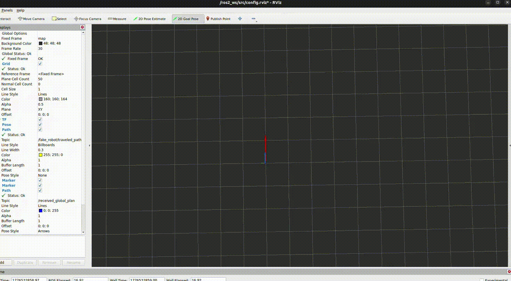
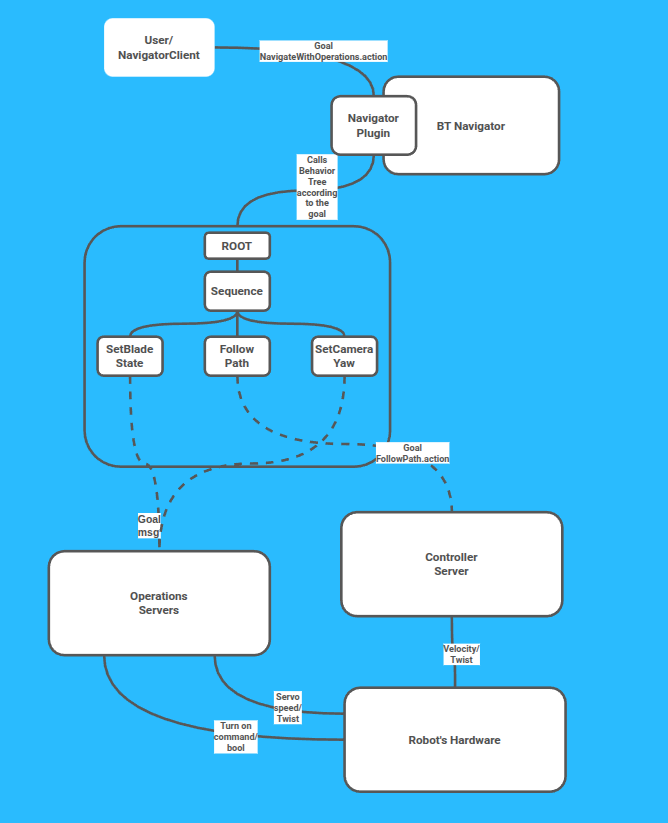

.. _writing_new_nav2_full_pipeline:

Writing a Full Pipeline For New Functionality in Nav2
*****************************************************

- `Overview`_
- `Requirements`_
- `Package Structure`_
- `Step 1 - Define Action Messages`_
- `Step 2 - Implement Dedicated Action Servers`_
- `Step 3 - Implement Behavior Tree Nodes`_
- `Step 4 - Implement the Navigator Plugin`_
- `Step 5 - Write Behavior Tree XML`_
- `Step 6 - Configure Parameters and Launch`_
- `Step 7 - Build and Run`_

Overview
========

.. note::

   Source code can be `found here <https://github.com/NOTMOVETON/NAV2Tutorial>`_.

This tutorial shows how to integrate a custom server to do a task-specific action as part of navigation using the Nav2 framework. This could be anything from a custom VLM integration, application-specific algorithm, or even a task to complete along the mission. This shows, for example, how to put together a navigation system following a precomputed path while performing hardware operations to engage a mowing blade and rotate a camera for a lawn mowing example.

This tutorial shows how to wire together custom hardware-operation task servers, Behavior Tree (BT) action nodes, and a ``BehaviorTreeNavigator`` plugin so that a robot can execute hardware commands corresponding to the specific navigation style the application requires (e.g. engage a mowing blade, rotate a camera) as part of autonomous navigation with Nav2. This demonstrates that you do not need to simply navigate to pose, but can create autonomous navigation capabilities within Nav2 completing customized navigation APIs.

The example implements a lawnmower robot with two operations:

- **BladeServer** — enables or disables the cutting blade.
- **CameraServer** — rotates an onboard camera to a target yaw.

The key insight is the **layered integration pattern**: a dedicated ROS 2 action server owns each hardware operation, a BT node wraps an action client that calls this server as a tree primitive, and the navigator plugin composes those primitives into a navigation mission with the task-specific inputs and outputs via a BT XML file.

For a better understanding, here is the image of the pipeline flow:

Data Flow Explanation
---------------------

Here is how a navigation request travels through the stack end-to-end:

1. **Client → Navigator plugin**: The ``bt_navigator`` node loads and manages navigator plugins via pluginlib. Each plugin registers its own ROS 2 action server during activation. A client (i.e. your application) sends a goal to that action server (e.g. ``navigate_with_operations``) to navigate using a customizable API.
2. **Navigator plugin → Behavior Tree**: The plugin's ``goalReceived()`` loads the BT XML file specified in the goal and writes all required variables onto the blackboard from the action request — in this demo that is the precomputed path (``nav_msgs/Path``). The BT executor then executes on the behavior tree.
3. **Behavior Tree → BT nodes**: The tree executes the navigation behavior, each BT node is a thin wrapper around a ROS 2 action client. They read inputs from blackboard ports, sends the action goal, and maps the server response back to its output ports.
4. **BT nodes → Task servers**: Each BT ndoe action client calls a dedicated ROS 2 action server that owns one task or operation (``blade_server``, ``controller_server``, ``camera_server``).
5. **Task servers → Task**: Each server owns a core capability like computing a path or performing an operation with hardware. It returns the derived result to be used by other behavior tree nodes to compose the complete navigation behavior.

For another real-world example of this pattern see `opennav_coverage <https://github.com/open-navigation/opennav_coverage>`_ — a coverage planning navigator uses the same approach.

.. note::

   Both operation servers can alternatively be implemented as Nav2 *behavior plugins* loaded by the ``behavior_server``, which avoids writing a separate lifecycle node. But this tutorial deliberately uses standalone action servers to illustrate the full integration path: how to write a Nav2-compatible server from scratch, expose it to the BT, and creating a BT  Navigator to leverage them as a first-class node type.

Requirements
============

- ROS 2 (Jazzy or later)
- Nav2 (binary or source)
- Docker

Package Structure
=================

The tutorial spans five packages, which you can find at XYZ:

+---------------------------------------+------------------------------------------------------+
| **Package**                           | **Role**                                             |
+=======================================+======================================================+
| ``nav2_operations_msgs``              | Action message definitions                           |
+---------------------------------------+------------------------------------------------------+
| ``nav2_operations_servers``           | BladeServer and CameraServer lifecycle nodes         |
+---------------------------------------+------------------------------------------------------+
| ``nav2_operations_bt_nodes``          | ``SetBladeState`` and ``SetCameraYaw`` BT nodes      |
+---------------------------------------+------------------------------------------------------+
| ``nav2_operations_navigator``         | ``NavigateWithOperations`` navigator plugin          |
+---------------------------------------+------------------------------------------------------+
| ``nav2_operations_bringup``           | Launch files, params, and BT XML trees               |
+---------------------------------------+------------------------------------------------------+

Step 1 - Define Action Messages
================================

Each task server or operation gets its own action file with a goal, result, and feedback section. We also define a navigation action to be used by the BT Navigator plugin to define the I/O for the customized lawn mower navigation task using the task servers and precomputed path.

Create three action definitions in ``nav2_operations_msgs/action/``.

**BladeCommand.action** — binary blade toggle:

.. code-block:: text

   bool enable
   ---
   bool success
   ---
   # no feedback

**CameraCommand.action** — rotate camera to a yaw setpoint with streaming feedback:

.. code-block:: text

   float32 target_yaw
   ---
   bool success
   ---
   float32 current_yaw

**NavigateWithOperations.action** — custom navigator interface:

.. code-block:: text

   string behavior_tree
   nav_msgs/Path path
   ---
   uint16 error_code
   ---
   # no feedback

For more details refer to the ``nav2_operations_msgs`` package in the tutorial code. You can find more examples of this in ``nav2_msgs`` for ``NavigateToPose``, ``NavigateThroughPoses`` navigator APIs as well as other task servers like ``FollowPath`` and ``ComputePathToPose``.

Step 2 - Implement Dedicated Action Servers
============================================

Each server is a ``nav2::LifecycleNode`` that wraps a ``nav2::SimpleActionServer``. Using ``LifecycleNode`` is what allows the ``nav2_lifecycle_manager`` to bring the servers up and down in the correct order alongside the rest of the Nav2 stack. ``SimpleActionServer`` handles goal queuing, preemption, and cancellation logic so the execute callback only contains task specific logic rather than ROS 2 actions boilerplate.

BladeServer
-----------

The blade server publishes a ``std_msgs/Bool`` to the hardware topic on every goal and returns immediately.

Key constructor parameters declared:

.. code-block:: cpp

   declare_parameter("blade_command_topic", std::string("/lawnmower/blade_command"));
   declare_parameter("action_server_result_timeout", 10.0);

Lifecycle transitions:

+--------------------+----------------------------------------------+
| **Callback**       | **Action**                                   |
+====================+==============================================+
| ``on_configure``   | Create publisher and action server           |
+--------------------+----------------------------------------------+
| ``on_activate``    | Activate publisher, start server, bond       |
+--------------------+----------------------------------------------+
| ``on_deactivate``  | Deactivate server and publisher, destroy bond|
+--------------------+----------------------------------------------+
| ``on_cleanup``     | Reset all members                            |
+--------------------+----------------------------------------------+

**on_configure** — reads parameters, creates the publisher and action server. Nothing is activated yet; this is setup only.

.. code-block:: cpp

   BladeServer::CallbackReturn
   BladeServer::on_configure(const rclcpp_lifecycle::State & /*state*/)
   {
     blade_command_topic_ = get_parameter("blade_command_topic").as_string();

     // Publisher is created but not yet activated — it won't send messages until on_activate
     blade_pub_ = create_publisher<std_msgs::msg::Bool>(blade_command_topic_, 10);

     double result_timeout = get_parameter("action_server_result_timeout").as_double();
     rcl_action_server_options_t server_options = rcl_action_server_get_default_options();
     server_options.result_timeout.nanoseconds = RCL_S_TO_NS(result_timeout);

     // Action server is created but not yet accepting goals
     action_server_ = std::make_unique<ActionServer>(
       shared_from_this(), "blade_server",
       std::bind(&BladeServer::execute, this),
       nullptr, std::chrono::milliseconds(500), true, server_options);

     return CallbackReturn::SUCCESS;
   }

**on_activate** — activates the publisher and action server so they can send messages and accept goals, then creates a bond with the lifecycle manager so it detects crashes.

.. code-block:: cpp

   BladeServer::CallbackReturn
   BladeServer::on_activate(const rclcpp_lifecycle::State & /*state*/)
   {
     blade_pub_->on_activate();
     action_server_->activate();
     createBond();  // bond lets lifecycle_manager detect if this node crashes
     return CallbackReturn::SUCCESS;
   }

**on_deactivate** — reverses activation in the opposite order: server first (stop accepting goals), then publisher, then destroy the bond.

.. code-block:: cpp

   BladeServer::CallbackReturn
   BladeServer::on_deactivate(const rclcpp_lifecycle::State & /*state*/)
   {
     action_server_->deactivate();
     blade_pub_->on_deactivate();
     destroyBond();
     return CallbackReturn::SUCCESS;
   }

**on_cleanup** — releases all resources so the node returns to a clean state and could be reconfigured.

.. code-block:: cpp

   BladeServer::CallbackReturn
   BladeServer::on_cleanup(const rclcpp_lifecycle::State & /*state*/)
   {
     action_server_.reset();
     blade_pub_.reset();
     return CallbackReturn::SUCCESS;
   }

Execute handler to complete some kind of task:

.. code-block:: cpp

   void BladeServer::execute()
   {
     auto goal = action_server_->get_current_goal();
     auto result = std::make_shared<BladeCommand::Result>();
     std_msgs::msg::Bool msg;
     msg.data = goal->enable;
     blade_pub_->publish(msg);
     result->success = true;
     action_server_->succeeded_current(result);
   }

You can find other examples of Task Servers across Nav2, including the ``controller_server`` and ``planner_server`` for more example implementations.

CameraServer
------------

The camera server simulates incremental rotation at ``max_rotation_speed`` deg/s in a 20 Hz loop, publishing feedback on each tick.

Key constructor parameters:

.. code-block:: cpp

   declare_parameter("max_rotation_speed", 45.0);
   declare_parameter("tolerance", 0.5);
   declare_parameter("camera_mount_offset", 0.0);
   declare_parameter("action_server_result_timeout", 10.0);

Lifecycle transitions:

+--------------------+----------------------------------------------+
| **Callback**       | **Action**                                   |
+====================+==============================================+
| ``on_configure``   | Create publisher and action server           |
+--------------------+----------------------------------------------+
| ``on_activate``    | Activate publisher, start server, bond       |
+--------------------+----------------------------------------------+
| ``on_deactivate``  | Deactivate server and publisher, destroy bond|
+--------------------+----------------------------------------------+
| ``on_cleanup``     | Reset all members                            |
+--------------------+----------------------------------------------+

``CameraServer`` follows the same lifecycle pattern as ``BladeServer`` above — ``on_configure`` reads parameters and creates the publisher and action server, ``on_activate`` activates them and bonds to the lifecycle manager, ``on_deactivate`` reverses that, and ``on_cleanup`` resets all members. The full implementation is in ``workspace/nav2_operations_servers/src/camera_server.cpp``.

The execute loop checks for cancellation, steps ``current_yaw_`` toward ``target_yaw``, publishes the intermediate yaw, and exits when within ``tolerance_``:

.. code-block:: cpp

   while (rclcpp::ok()) {
     if (action_server_->is_cancel_requested()) {
       result->success = false;
       action_server_->terminate_current(result);
       return;
     }
     float diff = target_yaw - current_yaw_;
     if (std::abs(diff) <= static_cast<float>(tolerance_)) { break; }
     current_yaw_ += (diff > 0 ? 1.0f : -1.0f) * std::min(step, std::abs(diff));
     // publish and feedback ...
     loop_rate.sleep();
   }

For more details refer to the ``nav2_operations_servers`` package in the tutorial code.

Step 3 - Implement Behavior Tree Nodes
=======================================

Each BT node inherits from ``nav2_behavior_tree::BtActionNode<ActionT>`` and is a BehaviorTree.CPP library plugin that is loaded by the BT Navigator at runtime when loading the BT XML file. ``BtActionNode`` handles the full ROS 2 action lifecycle — sending the goal, waiting for acceptance, streaming feedback, and mapping the result to a ``BT::NodeStatus``. The subclass only needs to override ``on_tick()`` to populate the goal from the BT blackboard/ports, and ``on_XYZ()`` for handling terminal states like cancellation, preemption, or successful completion to populate the response ports.

The shared library is registered under a string ID (e.g. ``"SetBladeState"``) via ``BT_REGISTER_NODES``. The BT executor discovers it at startup by scanning the library names listed in ``plugin_lib_names`` in ``nav2_params.yaml``.

SetBladeState
-------------

Header (``include/nav2_operations_bt_nodes/action/set_blade_state.hpp``):

.. code-block:: cpp

   class SetBladeState
     : public nav2_behavior_tree::BtActionNode<nav2_operations_msgs::action::BladeCommand>
   {
   public:
     static BT::PortsList providedPorts()
     {
       return providedBasicPorts({
         BT::InputPort<bool>("enable", true, "true to enable blade, false to disable"),
       });
     }
     void on_tick() override;
     BT::NodeStatus on_success() override { return BT::NodeStatus::SUCCESS; }
   };

Implementation (``src/action/set_blade_state.cpp``):

.. code-block:: cpp

   void SetBladeState::on_tick()
   {
     bool enable = true;
     getInput("enable", enable);
     goal_.enable = enable;
   }

   BT_REGISTER_NODES(factory)
   {
     BT::NodeBuilder builder = 
     {
       return std::make_unique<nav2_operations_bt_nodes::SetBladeState>(
         name, "blade_server", config);
     };
     factory.registerBuilder<nav2_operations_bt_nodes::SetBladeState>("SetBladeState", builder);
   }

SetCameraYaw
------------

Follows the same pattern with ``float target_yaw`` as the input port and connects to the ``camera_server`` action server.

For more details refer to the ``nav2_operations_bt_nodes`` package in the tutorial code.

Model XML (``nav2_tree_nodes.xml``):

.. code-block:: xml

   <root BTCPP_format="4">
     <TreeNodesModel>
       <Action ID="SetBladeState">
         <input_port name="enable" type="bool" default="true"/>
       </Action>
       <Action ID="SetCameraYaw">
         <input_port name="target_yaw" type="float" default="0.0"/>
       </Action>
     </TreeNodesModel>
   </root>
Many more BT node examples can be found in ``nav2_behavior_tree`` as well.

Step 4 - Implement the Navigator Plugin
========================================

The navigator inherits from ``nav2_core::BehaviorTreeNavigator<ActionT>`` and is registered via ``pluginlib``. The navigator plugin is what runs in the BT Navigator server to expose a ROS 2 action interface (what the client calls), which creates the behavior tree based on the BT XML file (what actually runs) with the request fields of the action. It also computes and publishes the feedback along the route and final goal response fields. When a goal arrives, ``goalReceived()`` writes the goal fields onto the BT blackboard so that BT nodes can read them as input ports. The BT is then ticked by the navigator loop until it returns ``SUCCESS`` or ``FAILURE``.

The ``behavior_tree`` string field in the goal allows the caller to specify which BT XML file to load at runtime. This is what makes the navigator reusable across different mission profiles — the same navigator plugin can execute a blade-control mission or a camera-repositioning mission depending on which XML is passed. If the field is empty, the navigator falls back to ``default_navigate_with_operations_bt_xml`` from the parameters.

Virtual method summary:

+--------------------+--------------------------------------------------------------+
| **Method**         | **Responsibility**                                           |
+====================+==============================================================+
| ``getName()``      | Return ``"navigate_with_operations"``                        |
+--------------------+--------------------------------------------------------------+
| ``getDefaultBT``   | Read ``default_navigate_with_operations_bt_xml`` param       |
| ``Filepath()``     |                                                              |
+--------------------+--------------------------------------------------------------+
| ``configure()``    | Declare ``path_blackboard_id``, init blackboard              |
+--------------------+--------------------------------------------------------------+
| ``cleanup()``      | Return true (no extra resources)                             |
+--------------------+--------------------------------------------------------------+
| ``goalReceived()`` | Load BT, write ``path`` to blackboard                        |
+--------------------+--------------------------------------------------------------+
| ``onLoop()``       | Publish empty feedback                                       |
+--------------------+--------------------------------------------------------------+
| ``onPreempt()``    | Accept or reject pending goal based on BT file               |
+--------------------+--------------------------------------------------------------+
| ``goalCompleted()``| Write ``error_code`` (0/1/2), clear blackboard               |
+--------------------+--------------------------------------------------------------+

**goalReceived** — loads the BT file and writes the path to the blackboard so BT nodes can read it immediately on the first tick.

.. code-block:: cpp

   bool NavigateWithOperations::goalReceived(
     typename ActionT::Goal::ConstSharedPtr goal)
   {
     if (!bt_action_server_->loadBehaviorTree(goal->behavior_tree)) {
       RCLCPP_ERROR(logger_, "BT file not found: %s.", goal->behavior_tree.c_str());
       return false;
     }
     auto blackboard = bt_action_server_->getBlackboard();
     blackboard->set<nav_msgs::msg::Path>(path_blackboard_id_, goal->path);
     active_goal_ = true;
     return true;
   }

**onLoop** — called on every tick of the BT executor loop. This is where the navigator publishes action feedback to the client. For this navigator the feedback is empty, but a richer implementation could read progress from the blackboard here.

.. code-block:: cpp

   void NavigateWithOperations::onLoop()
   {
     bt_action_server_->publishFeedback(std::make_shared<ActionT::Feedback>());
   }

**goalCompleted** — called once when the tree finishes. Maps the BT outcome to an error code in the action result and clears the blackboard so a subsequent goal that reuses the same BT file does not find stale data.

.. code-block:: cpp

   void NavigateWithOperations::goalCompleted(
     typename ActionT::Result::SharedPtr result,
     const nav2_behavior_tree::BtStatus final_bt_status)
   {
     active_goal_ = false;

     if (final_bt_status == nav2_behavior_tree::BtStatus::SUCCEEDED) {
       result->error_code = 0;
     } else if (final_bt_status == nav2_behavior_tree::BtStatus::FAILED) {
       result->error_code = 1;
     } else {
       result->error_code = 2;
     }

     // Clear blackboard so the next goal does not see stale values
     auto blackboard = bt_action_server_->getBlackboard();
     blackboard->set<nav_msgs::msg::Path>(path_blackboard_id_, nav_msgs::msg::Path());
   }

**onPreempt** — called when a new goal arrives while the tree is still running. Accepts the preemption only if the new goal requests the same BT file; switching files mid-run would require hard cancellation of the current tree, so mismatched requests are rejected and the client is asked to cancel and resend.

.. code-block:: cpp

   void NavigateWithOperations::onPreempt(
     typename ActionT::Goal::ConstSharedPtr goal)
   {
     if (goal->behavior_tree == bt_action_server_->getCurrentBTFilename() ||
       (goal->behavior_tree.empty() &&
        bt_action_server_->getCurrentBTFilename() ==
          bt_action_server_->getDefaultBTFilename()))
     {
       // Same BT file — accept the new goal and update the blackboard in-place
       auto pending_goal = bt_action_server_->acceptPendingGoal();
       auto blackboard = bt_action_server_->getBlackboard();
       blackboard->set<nav_msgs::msg::Path>(path_blackboard_id_, pending_goal->path);
     } else {
       RCLCPP_WARN(logger_,
         "Preemption rejected: BT file mismatch. Cancel and resend to change BT.");
       bt_action_server_->terminatePendingGoal();
     }
   }

Export at the bottom of the ``.cpp``:

.. code-block:: cpp

   #include "pluginlib/class_list_macros.hpp"
   PLUGINLIB_EXPORT_CLASS(
     nav2_operations_navigator::NavigateWithOperations,
     nav2_core::NavigatorBase)
See ``nav2_bt_navigator`` package for the implementations of ``NavigateToPose`` and ``NavigateThroughPoses`` for more examples.

Step 5 - Write Behavior Tree XML
==================================

The BT XML is what connects everything: it sequences the BT nodes (hardware commands + path following) into a mission. Because nodes communicate through the blackboard, ``FollowPath`` reads the ``{path}`` key that the navigator wrote in ``goalReceived()`` — no direct coupling between the navigator plugin and the BT nodes.

Place BT XML files in ``nav2_operations_bringup/config/bt/``.

**navigate_with_operations.xml** — full navigation with blade control:

.. code-block:: xml

   <root BTCPP_format="4" main_tree_to_execute="MainTree">
     <BehaviorTree ID="MainTree">
       <Sequence>
         <SetBladeState enable="true"/>
         <FollowPath path="{path}" controller_id="FollowPath"
                     goal_checker_id="goal_checker"/>
         <SetBladeState enable="false"/>
       </Sequence>
     </BehaviorTree>
   </root>

**predefined_operations.xml** — straight-line mow sequence with camera reposition:

.. code-block:: xml

   <root BTCPP_format="4" main_tree_to_execute="MainTree">
     <BehaviorTree ID="MainTree">
       <Sequence>
         <DriveOnHeading dist_to_travel="0.2" speed="0.3" time_allowance="50"/>
         <SetBladeState enable="true"/>
         <DriveOnHeading dist_to_travel="3.0" speed="0.3" time_allowance="50"/>
         <SetBladeState enable="false"/>
         <SetCameraYaw target_yaw="180.0"/>
       </Sequence>
     </BehaviorTree>
   </root>

Step 6 - Configure Parameters and Launch
==========================================

nav2_params.yaml (relevant sections)
--------------------------------------
The following configures the BT Navigator node to use our new navigator type and establish a default if the behavior tree field is not populated in the request. We also configure our new task servers as well.

.. code-block:: yaml

   bt_navigator:
     ros__parameters:
       default_navigate_with_operations_bt_xml: "/ros2_ws/src/nav2_operations_bringup/config/bt/navigate_with_operations.xml"
       navigators: ["navigate_with_operations"]
       navigate_with_operations:
         plugin: nav2_operations_navigator::NavigateWithOperations
       plugin_lib_names:
           # default plugins already loaded
         - nav2_set_blade_state_bt_node
         - nav2_set_camera_yaw_bt_node

   blade_server:
     ros__parameters:
       action_server_result_timeout: 10.0
       blade_command_topic: "/lawnmower/blade_command"

   camera_server:
     ros__parameters:
       action_server_result_timeout: 10.0
       max_rotation_speed: 45.0
       tolerance: 0.5
       camera_mount_offset: 0.0

   # other servers as usual

Launch File (``operations_launch.py``)
---------------------------------------

The single launch file brings up the entire stack:

- **Nav2 core** — ``planner_server``, ``controller_server``, ``behavior_server``, ``velocity_smoother``, ``bt_navigator``
- **Custom operation servers** — ``blade_server``, ``camera_server``
- **Lifecycle manager** — configures and activates all lifecycle nodes in sequence
- **Simulation and test nodes** — ``fake_robot``, ``blade_simulator``, ``camera_simulator``, ``rviz_goal_client`` (covered in Step 7)

Add the custom servers alongside the Nav2 nodes:

.. code-block:: python

   Node(
       package='nav2_operations_servers',
       executable='blade_server_node',
       name='blade_server',
       output='screen',
       parameters=[configured_params],
   ),
   Node(
       package='nav2_operations_servers',
       executable='camera_server_node',
       name='camera_server',
       output='screen',
       parameters=[configured_params],
   ),

Lifecycle manager ``node_names``:

.. code-block:: python

   'node_names': [
       'planner_server',
       'controller_server',
       'blade_server',
       'camera_server',
       'behavior_server',
       'velocity_smoother',
       'bt_navigator',
   ]

Step 7 - Build and Run
=======================

.. note::

   For a step-by-step video on how to launch and try the demos with explanations, `click here <https://youtu.be/Au8p1TmpboI>`_.

First of all, to try the demos, build the workspace:

.. code-block:: bash

   cd /ros2_ws && colcon build --symlink-install
   source install/setup.bash

**Additional:** if you want to use the project's Docker, copy the commands below to fully build (including ``colcon build``) and use Docker as if ROS 2 was installed directly:

.. code-block:: bash

   docker/run.sh --build

   docker/run.sh

   docker exec -it nav2_tutorials bash

Two launch configurations are provided, each paired with its own params file:

+--------------------------------------+----------------------------+-----------------------------------------------+
| **Launch file**                      | **Params file**            | **BT used**                                   |
+======================================+============================+===============================================+
| ``operations_launch.py``             | ``nav2_params.yaml``       | ``navigate_with_operations.xml`` — follow a   |
|                                      |                            | planned path with blade on/off                |
+--------------------------------------+----------------------------+-----------------------------------------------+
| ``predefined_operations_launch.py``  | ``nav2_params_predefined`` | ``predefined_operations.xml`` — hardcoded     |
|                                      | ``.yaml``                  | straight-line mow sequence                    |
+--------------------------------------+----------------------------+-----------------------------------------------+

Launch the default stack (path following with blade control):

.. code-block:: bash

   ros2 launch nav2_operations_bringup operations_launch.py

Or launch the predefined straight-line mow sequence:

.. code-block:: bash

   ros2 launch nav2_operations_bringup predefined_operations_launch.py

Both launch files start the full stack. In addition to the Nav2 core and the custom operation servers, the launch files also start three lightweight simulation nodes from ``nav2_operations_test_nodes``:

- **fake_robot** — integrates ``/cmd_vel`` commands into a pose, publishes ``odom`` and the ``odom -> base_link`` TF transform at 50 Hz. Written specifically for this demo to keep the setup self-contained.
- **blade_simulator** — subscribes to ``/lawnmower/blade_command`` and logs blade state changes, simulating the hardware response.
- **camera_simulator** — subscribes to the camera action server's output and simulates incremental yaw rotation.

These nodes are already written and ready to use; there is no need to reimplement them since they were added only for ease of demonstration.

RViz's built-in navigation panel cannot send goals to a custom navigator without a dedicated RViz plugin. Instead, ``rviz_goal_client.py`` (``nav2_operations_test_nodes/scripts/rviz_goal_client.py``) bridges that gap:

1. Subscribes to ``/goal_pose`` — the ``PoseStamped`` topic published by RViz's **2D Nav Goal** button.
2. Calls ``BasicNavigator.getPath()`` from the official Nav2 Simple Commander API to compute a path from the current pose to the goal via the loaded planner.
3. Builds a ``NavigateWithOperations`` action goal with the computed ``nav_msgs/Path`` and the BT XML file path.
4. Sends the goal to the ``navigate_with_operations`` action server.
5. ``rviz_goal_client.ros__parameters.bt_xml_file`` — the BT path that ``rviz_goal_client`` explicitly sends in every goal.

Set a **2D Nav Goal** in RViz and watch the robot driving and executing operations!

You can see operations execution in RViz with green (blade on) or red (blade off) dots along the robot's trajectory and a blue arrow attached to the robot that mimics camera yaw control.
