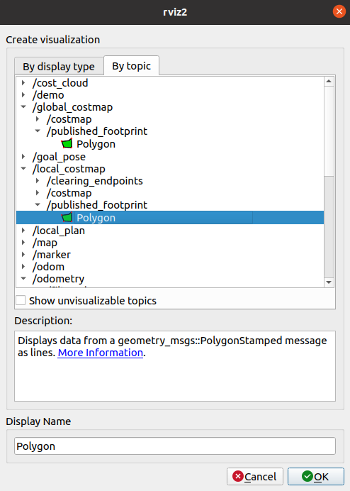
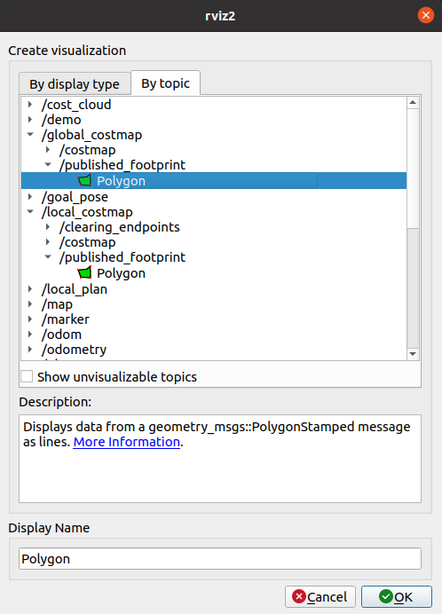
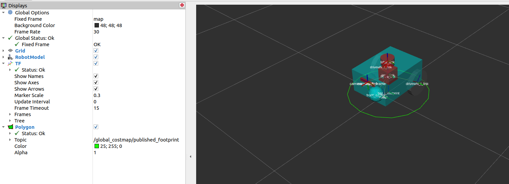

.. _setup_footprint:

Setting Up the Robot's Footprint
################################

In this guide, we will discuss how to configure the footprint of your robot for the navigation algorithms used by Nav2. We will also show a sample footprint configuration on ``sam_bot``, the simulated robot that we have been building in this series of setup guides. Lastly, we will also show the visualization of ``sam_bot``'s footprint in RViz to ensure that we have set it up correctly. 

Footprint Introduction
**********************

The footprint outlines the robot's 2D shape when projected to the ground and is primarily used by Nav2 to avoid collisions during planning. The algorithms involved in this task makes sure that the robot does not collide with the obstacles in the costmap while it computes the robot's paths or plans. 

The footprint is set up using the ``footprint`` or ``robot_radius`` parameter of the global and local costmaps which we tackled in the previous tutorials (:ref:`Setting Up Sensors Guide<setup_sensors>`). The value defined in the ``footprint`` parameter is an ordered vector of 2-D points defining the robot's footprint with the ``base_link`` frame as the origin. The first and last points in the vector are joined into the last line segment to close the footprint's shape. As an alternative, you may also use the ``robot_radius`` parameter wherein circular footprint is automatically generated and centered at ``base_link``.  In cases both the ``footprint`` and ``robot_radius`` parameters have been defined in the configuration, the ``footprint`` is used.

.. seealso::
   A section in the previous guide, :ref:`Configuring nav2_costmap_2d<configuring_nav2_costmap_2d>`, explains how to configure basic costmap parameters. Please refer to that guide for more details on costmap configuration. 

For the global costmap footprint, the decision to choose between the ``robot_radius`` (circular) or ``footprint`` (polygon) parameter depends on the robot, its environment, and the path planning algorithm you will use. Even if you are working with a non-circular robot, there may be situations where a circular footprint is acceptable. For example, path planning algorithms like `NavFn <https://navigation.ros.org/configuration/packages/configuring-navfn.html>`_ assume that the robot is circular since it only checks for collision per grid cell, so it will not be necessary to outline the robot's exact shape for its footprint. On the other hand, algorithms such as `Smac Planner's Hybrid-A* <https://navigation.ros.org/configuration/packages/configuring-smac-planner.html>`_ perform collision checking on the robot's polygon-shaped footprint if possible and necessary. Hence, it might be useful to use a polygon-shaped footprint. Another example is having a small RC car sized robot roaming a warehouse. This robot is so small it won't need to make confined maneuvers -- thusly approximating it with the largest cross-sectional radius is a good time-saving optimization. 

For the local costmap footprint, it is typical for non-circular robots to be set up with ``footprint`` (polygon). Some situations where this is not recommended is when you do not have enough computing resources to implement collision avoidance algorithms on a polygon-shaped footprint. Another possible reason to use ``robot_radius`` (circular) for the local costmap is when the robot is very small relative to its environment such that precise collision avoidance is not necessary. However, generally the local trajectory planner should use the actual footprint polygon of the robot. 

Configuring the Robot's Footprint
*********************************
In this section, we will configure the footprint of ``sam_bot`` such that ``footprint`` (polygon) is used for the local costmap and ``robot_radius`` (circular) is used for the global costmap. We will utilize the default configuration file of Nav2 with a modified footprint parameter for the global and local costmaps.

.. note:: The complete source code for ``sam_bot`` can be found in `navigation2_tutorials <https://github.com/ros-planning/navigation2_tutorials/tree/master/sam_bot_description>`_ repository.

Under the ``config`` directory, create a new file named  ``nav2_params.yaml``. Next, copy the contents of `config/nav2_params.yaml <https://github.com/ros-planning/navigation2_tutorials/blob/master/sam_bot_description/config/nav2_params.yaml>`_ and paste them into the newly created file. The contents of `config/nav2_params.yaml <https://github.com/ros-planning/navigation2_tutorials/blob/master/sam_bot_description/config/nav2_params.yaml>`_ are copied from the default configuration file of Nav2 but with changes in the ``footprint`` and  ``robot_radius`` parameters to match the shape of ``sam_bot``.

.. seealso::
  The default configuration file for Nav2 can be found in the official `Navigation2 repository <https://github.com/ros-planning/navigation2/blob/galactic/nav2_bringup/bringup/params/nav2_params.yaml>`_. 

Below is the code snippet from ``nav2_params.yaml`` defining the local costmap footprint. In this configuration file, the ``footprint`` parameter of the local costmap has already been set with a rectangular-shaped footprint. This box is centered at the ``base_link`` frame of ``sam_bot``. 

.. code-block:: yaml
  :lineno-start: 188

  resolution: 0.05
  footprint: "[ [0.21, 0.195], [0.21, -0.195], [-0.21, -0.195], [-0.21, 0.195] ]"
  plugins: ["voxel_layer", "inflation_layer"]

For the global costmap, we have already set the ``robot_radius`` parameter to create a circular footprint that matches ``sam_bot``'s size and centered at ``base_link``. The parameter that was modified is shown in the code snippet below.

.. code-block:: yaml
  :lineno-start: 232

  use_sim_time: True
  robot_radius: 0.3
  resolution: 0.05

Build, Run and Verification
***************************
We will now confirm that we have properly set up ``sam_bot``'s footprint.

First, we launch `launch/display.launch.py <https://github.com/ros-planning/navigation2_tutorials/blob/master/sam_bot_description/launch/display.launch.py>`_ to launch the robot state publisher, spawn ``sam_bot`` in Gazebo, and visualize ``sam_bot`` and its footprint in Rviz. The robot state publisher publishes the ``base_link`` => ``sensors`` transforms defined in ``sam_bot``'s URDF, while Gazebo's differential drive plugin publishes the ``odom`` => ``base_link`` transform. Open a new terminal and execute the lines below. 

.. code-block:: shell

  colcon build
  . install/setup.bash
  ros2 launch sam_bot_description display.launch.py

After launching ``display.launch.py``, RViz and Gazebo should open. RViz should show ``sam_bot``, the frames of ``sam_bot``'s parts, and the ``odom`` frame without errors. Gazebo should show ``sam_bot`` with a sphere and a cube detectable by ``sambot``'s lidar sensor. 

Next, we will publish the ``map`` => ``odom`` transform using the ``static_transform_publisher``. We publish the ``map`` => ``odom`` transform as static in this guide as a simple way to publish the transform and visualize the footprint. Open a new terminal and execute the lines below.

.. code-block:: shell

  ros2 run tf2_ros static_transform_publisher 0 0 0 0 0 0 map odom

The ``map`` => ``odom`` transform should now be being published and the ``map`` frame should be added in RViz without errors. 

Lastly, we will launch Nav2 using the ``nav2_params.yaml`` configuration file we just made and ``navigation_launch.py``, the built-in launch file of ``nav2_bringup``. Open a new terminal and execute the following:

.. code-block:: shell

  ros2 launch nav2_bringup navigation_launch.py params_file:=<full/path/to/config/nav2_params.yaml>

We should now be able to visualize the footprints in RViz, which will be discussed in the next section. 

Visualizing Footprint in RViz
*****************************
To visualize the footprint of the local costmap, click the add button at the bottom-left part of the RViz window. Under the ``By topic`` tab, select the ``Polygon`` under the ``/local_costmap/published_footprint`` topic, as shown below. 

Set the fixed frame in RViz to ``odom`` and you should see the rectangular-shaped footprint of ``sam_bot``:

.. image:: images/polygon_footprint.png
    :align: center

On the other hand, for the global costmap, click the add button at the bottom-left part of the RViz window. Go to ``By topic`` tab then select the ``Polygon`` under the ``/global_costmap/published_footprint`` topic, as shown below. 

Set the fixed frame in RViz to ``map`` and you should see the circular footprint of ``sam_bot``:

Conclusion
**********
In this guide, we have shown how to configure a circular and polygon-shaped footprint for your robot. This footprint is important since it plays a major role in Nav2's pathfinding algorithms function. 

As a demo, we have configured the costmap footprint parameters of  ``sam_bot``. We set the local costmap to use a polygon-shaped footprint following ``sam_bot``'s shape while we set the the global costmap to use a circular footprint. Lastly, we visualized and confirmed the footprints of the local and global costmaps in RViz. 
