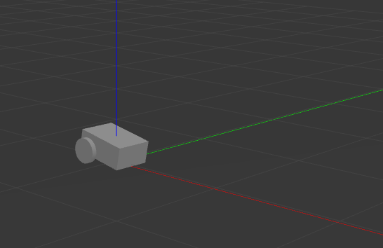

Setting Up Odometry
###################

In this guide, we will be looking at how to integrate our robot's odometry system with Nav2.
First we will provide a brief introduction on odometry, plus the necessary messages and transforms that need to be published for Nav2 to function correctly.
Next, we will show how to setup odometry with two different cases.
In the first case, we will show how to setup an odometry system for a robot with already available wheel encoders.
In the second case, we will build a demo that simulates a functioning odometry system on ``sam_bot`` (the robot that we built in the previous section) using Gazebo.
Afterwards, we will discuss how various sources of odometry can be fused to provide a smoothed odometry using the ``robot_localization`` package.
Lastly, we will also show how to publish the ``odom`` => ``base_link`` transform using ``robot_localization``.

.. seealso::
  The complete source code in this tutorial can be found in `navigation2_tutorials <https://github.com/ros-navigation/navigation2_tutorials/tree/master/sam_bot_description>`_ repository under the ``sam_bot_description`` package. Note that the repository contains the full code after accomplishing all the tutorials in this guide.

Odometry Introduction
*********************

The odometry system provides a locally accurate estimate of a robot's pose and velocity based on its motion. The odometry information can be obtained from various sources such as IMU, LIDAR, RADAR, VIO, and wheel encoders. One thing to note is that IMUs drift over time while wheel encoders drift over distance traveled, thus they are often used together to counter each other's negative characteristics.

The ``odom`` frame and the transformation associated with it use a robot's odometry system to publish localization information that is continuous but becomes less accurate over time or distance (depending on the sensor modalities and drift). In spite of this, the information can still be used by the robot to navigate its immediate vicinity (e.g collision avoidance). To obtain consistently accurate odometry information over time, the ``map`` frame provides globally accurate information that is used to correct the ``odom`` frame. 

As discussed in the previous guides and in `REP 105 <https://www.ros.org/reps/rep-0105.html>`_, the ``odom`` frame is connected to the rest of the system and Nav2 through the ``odom`` => ``base_link`` transform. This transform is published by a tf2 broadcaster or by frameworks such as ``robot_localization``, which also provide additional functionalities. We will be talking more about ``robot_localization`` in a following section. 

In addition to the required ``odom`` => ``base_link`` transform, Nav2 also requires the publishing of ``nav_msgs/Odometry`` message because this message provides the velocity information of the robot. In detail, the ``nav_msgs/Odometry`` message contains the following information:

.. code-block:: shell

  # This represents estimates of position and velocity in free space.
  # The pose in this message should be specified in the coordinate frame given by header.frame_id
  # The twist in this message should be specified in the coordinate frame given by the child_frame_id

  # Includes the frame id of the pose parent.
  std_msgs/Header header

  # Frame id the pose is pointing at. The twist is in this coordinate frame.
  string child_frame_id

  # Estimated pose that is typically relative to a fixed world frame.
  geometry_msgs/PoseWithCovariance pose

  # Estimated linear and angular velocity relative to child_frame_id.
  geometry_msgs/TwistWithCovariance twist

This message tells us the estimates for the pose and velocity of the robot. The ``header`` message provides the timestamped data in a given coordinate frame. The ``pose`` message provides the position and orientation of the robot relative to the frame specified in ``header.frame_id``. The ``twist`` message gives the linear and angular velocity relative to the frame defined in ``child_frame_id``. 

Setting Up Odometry on your Robot
*********************************

Setting up the odometry system for Nav2 for your physical robot depends a lot on which odometry sensors are available with your robot. Due to the large number of configurations your robot may have, specific setup instructions will not be within the scope of this tutorial. Instead, we will provide some basic examples and useful resources to help you configure your robot for Nav2.

To start, we will use an example of a robot with wheel encoders as its odometry source. Note that wheel encoders are not required for Nav2 but it is common in most setups. The goal in setting up the odometry is to compute the odometry information and publish the ``nav_msgs/Odometry`` message and ``odom`` => ``base_link`` transform over ROS 2. To calculate this information, you will need to setup some code that will translate wheel encoder information into odometry information, similar to the snippet below:

.. code-block:: shell

  linear = (right_wheel_est_vel + left_wheel_est_vel) / 2
  angular = (right_wheel_est_vel - left_wheel_est_vel) / wheel_separation;

The ``right_wheel_est_vel`` and ``left_wheel_est_vel`` are the estimated velocities of the right and left wheels respectively, and the ``wheel separation`` is the distance between the wheels. The values of ``right_wheel_est_vel`` and ``left_wheel_est_vel`` can be obtained by simply getting the changes in the positions of the wheel joints over time. This information can then be used to publish the Nav2 requirements. A basic example on how to do this can be found in the Navigation documentation on odometry `located here <http://wiki.ros.org/navigation/Tutorials/RobotSetup/Odom/>`_

An alternative to manually publishing this information that we recommend is through the ``ros2_control`` framework. The ``ros2_control`` framework contains various packages for real-time control of robots in ROS 2. For wheel encoders, ``ros2_control`` has a ``diff_drive_controller`` (differential drive controller) under the ``ros2_controller`` package. The ``diff_drive_controller`` takes in the ``geometry_msgs/Twist`` messages published on ``cmd_vel`` topic, computes odometry information, and publishes ``nav_msgs/Odometry`` messages on ``odom`` topic. Other packages that deal with different kind of sensors are also available in ``ros2_control``. 

.. seealso::
  For more information, see the `ros2_control documentation <https://ros-controls.github.io/control.ros.org/>`_ and the `Github repository of diff_drive_controller <https://github.com/ros-controls/ros2_controllers/tree/master/diff_drive_controller/>`_.

For other types of sensors such as IMU, VIO, etc, their respective ROS drivers should have documentation on how publish the odometry information. Keep in mind that Nav2 requires the ``nav_msgs/Odometry`` message and ``odom`` => ``base_link`` transforms to be published and this should be your goal when setting up your odometry system.

Simulating an Odometry System using Gazebo
******************************************

In this section, we will be using Gazebo to simulate the odometry system of ``sam_bot``, the robot that we built in the previous section of this tutorial series. You may go through that guide first or grab the `complete source here  <https://github.com/ros-navigation/navigation2_tutorials/tree/master/sam_bot_description/>`_. 

.. note:: If you are working on your own physical robot and have already set up your odometry sensors, you may opt to skip this section and head onto the next one where we fuse IMU and odometry messages to provide a smooth ``odom`` => ``base_link`` transformation.

As an overview for this section, we will first setup Gazebo and the necessary packages required to make it work with ROS 2. Next, we will be adding Gazebo plugins, which simulate an IMU sensor and a differential drive odometry system, in order to publish ``sensor_msgs/Imu`` and ``nav_msgs/Odometry`` messages respectively. Lastly, we will spawn ``sam_bot`` in a Gazebo environment and verify the published ``sensor_msgs/Imu`` and ``nav_msgs/Odometry`` messages over ROS 2. 

Setup and Prerequisites
=======================

`Gazebo <http://gazebosim.org/>`_ is a 3D simulator that allows us to observe how our virtual robot will function in a simulated environment. To start using Gazebo with ROS 2, follow the installation instructions in the `Gazebo Installation Documentation <https://gazebosim.org/docs/latest/ros_installation/>`_.

Note that you may have described ``sam_bot`` using URDF. However, Gazebo uses `Simulation Description Format (SDF) <http://sdformat.org/>`_ to describe a robot in its simulated environment. Fortunately, Gazebo automatically translates compatible URDF files into SDF. The main requirement for the URDF to be compatible with Gazebo is to have an ``<inertia>`` element within each ``<link>`` element. This requirement is already satisfied in the URDF file of ``sam_bot``, so it can already be used in Gazebo.

Adding Gazebo Plugins to a URDF/SDF
===================================

We will now add the IMU sensor and the differential drive plugins of Gazebo to our URDF/SDF. For an overview of the different sensors available in Gazebo, have a look at the `Sensor Documentation <https://gazebosim.org/docs/latest/sensors>`_.

A sensor must be attached to a link, thus we will create an ``imu_link`` to which the IMU sensor will be attached. This link will be referenced under the ``<gazebo>`` element if using URDF. Next, we will set ``/demo/imu`` as the topic to which the IMU will be publishing its information, and we will comply with `REP145 <https://www.ros.org/reps/rep-0145.html>`_ by setting ``initalOrientationAsReference`` to ``false``. We will also add some noise to the sensor configuration using Gazebo's `sensor noise model <https://classic.gazebosim.org/tutorials?tut=sensor_noise>`_.

Now, we will set up our IMU sensor plugin according to the description above.
If using URDF add the following lines before the ``</robot>`` line:

.. code-block:: xml
  :lineno-start: 133

  <link name="imu_link">
    <visual>
      <geometry>
        <box size="0.1 0.1 0.1"/>
      </geometry>
    </visual>

    <collision>
      <geometry>
        <box size="0.1 0.1 0.1"/>
      </geometry>
    </collision>

    <xacro:box_inertia m="0.1" w="0.1" d="0.1" h="0.1"/>
  </link>

  <joint name="imu_joint" type="fixed">
    <parent link="base_link"/>
    <child link="imu_link"/>
    <origin xyz="0 0 0.01"/>
  </joint>

  <gazebo reference="imu_link">
    <sensor name="imu_sensor" type="imu">
      <always_on>true</always_on>
      <update_rate>100</update_rate>
      <visualize>true</visualize>
      <topic>demo/imu</topic>
      <imu>
        <angular_velocity>
          <x>
            <noise type="gaussian">
              <mean>0.0</mean>
              <stddev>2e-4</stddev>
              <bias_mean>0.0000075</bias_mean>
              <bias_stddev>0.0000008</bias_stddev>
            </noise>
          </x>
          <y>
            <noise type="gaussian">
              <mean>0.0</mean>
              <stddev>2e-4</stddev>
              <bias_mean>0.0000075</bias_mean>
              <bias_stddev>0.0000008</bias_stddev>
            </noise>
          </y>
          <z>
            <noise type="gaussian">
              <mean>0.0</mean>
              <stddev>2e-4</stddev>
              <bias_mean>0.0000075</bias_mean>
              <bias_stddev>0.0000008</bias_stddev>
            </noise>
          </z>
        </angular_velocity>
        <linear_acceleration>
          <x>
            <noise type="gaussian">
              <mean>0.0</mean>
              <stddev>1.7e-2</stddev>
              <bias_mean>0.1</bias_mean>
              <bias_stddev>0.001</bias_stddev>
            </noise>
          </x>
          <y>
            <noise type="gaussian">
              <mean>0.0</mean>
              <stddev>1.7e-2</stddev>
              <bias_mean>0.1</bias_mean>
              <bias_stddev>0.001</bias_stddev>
            </noise>
          </y>
          <z>
            <noise type="gaussian">
              <mean>0.0</mean>
              <stddev>1.7e-2</stddev>
              <bias_mean>0.1</bias_mean>
              <bias_stddev>0.001</bias_stddev>
            </noise>
          </z>
        </linear_acceleration>
      </imu>
    </sensor>
  </gazebo>

If using SDF add the following lines before the ``</model>`` line:

.. code-block:: xml
  :lineno-start: 184

    <link name='imu_link'>
      <must_be_base_link>true</must_be_base_link>
      <visual name="imu_link_visual">
        <geometry>
          <box><size>
            0.1 0.1 0.1
          </size></box>
        </geometry>
      </visual>

      <collision name="imu_link_collision">
        <geometry>
          <box><size>
            0.1 0.1 0.1
          </size></box>
        </geometry>
      </collision>

      <xacro:box_inertia m="0.1" w="0.1" d="0.1" h="0.1"/>

      <sensor name="imu_sensor" type="imu">
        <always_on>true</always_on>
        <update_rate>100</update_rate>
        <visualize>true</visualize>
        <topic>demo/imu</topic>
        <imu>
          <angular_velocity>
            <x>
              <noise type="gaussian">
                <mean>0.0</mean>
                <stddev>2e-4</stddev>
                <bias_mean>0.0000075</bias_mean>
                <bias_stddev>0.0000008</bias_stddev>
              </noise>
            </x>
            <y>
              <noise type="gaussian">
                <mean>0.0</mean>
                <stddev>2e-4</stddev>
                <bias_mean>0.0000075</bias_mean>
                <bias_stddev>0.0000008</bias_stddev>
              </noise>
            </y>
            <z>
              <noise type="gaussian">
                <mean>0.0</mean>
                <stddev>2e-4</stddev>
                <bias_mean>0.0000075</bias_mean>
                <bias_stddev>0.0000008</bias_stddev>
              </noise>
            </z>
          </angular_velocity>
          <linear_acceleration>
            <x>
              <noise type="gaussian">
                <mean>0.0</mean>
                <stddev>1.7e-2</stddev>
                <bias_mean>0.1</bias_mean>
                <bias_stddev>0.001</bias_stddev>
              </noise>
            </x>
            <y>
              <noise type="gaussian">
                <mean>0.0</mean>
                <stddev>1.7e-2</stddev>
                <bias_mean>0.1</bias_mean>
                <bias_stddev>0.001</bias_stddev>
              </noise>
            </y>
            <z>
              <noise type="gaussian">
                <mean>0.0</mean>
                <stddev>1.7e-2</stddev>
                <bias_mean>0.1</bias_mean>
                <bias_stddev>0.001</bias_stddev>
              </noise>
            </z>
          </linear_acceleration>
        </imu>
      </sensor>
    </link>

    <joint name='imu_joint' type='fixed'>
      <parent>base_link</parent>
      <child>imu_link</child>
      <pose relative_to="base_link">0.0 0.0 0.01 0 0 0</pose>
    </joint>

Now, let us add the DiffDrive ModelPlugin and the JointStatePublisher plugin. We will configure the plugin such that ``nav_msgs/Odometry`` messages are published on the ``/demo/odom`` topic and the ``sensor_msgs/msg/JointState`` messages for the two wheels are published on ``/joint_states``. The joints of the left and right wheels will be set to the wheel joints of ``sam_bot``. The wheel separation and wheel radius are set according to the values of the defined values of ``wheel_ygap`` and ``wheel_radius`` respectively.
We will configure the DiffDrive ModelPLugin to also publish ``tf2_msgs/msg/TFMessage`` messages on the ``/demo/tf`` topic, but instead of them the transform messages published by ``ekf_node`` will be used. See `Robot Localization Demo <https://docs.nav2.org/setup_guides/odom/setup_odom.html#robot-localization-demo/>`_

If using URDF, add the following lines after the ``</gazebo>`` tag of the IMU sensor:

.. code-block:: xml
  :lineno-start: 218

  <gazebo>
    <plugin filename="gz-sim-diff-drive-system" name="gz::sim::systems::DiffDrive">
      <!-- wheels -->
      <left_joint>drivewhl_l_joint</left_joint>
      <right_joint>drivewhl_r_joint</right_joint>

      <!-- kinematics -->
      <wheel_separation>0.4</wheel_separation>
      <wheel_radius>${wheel_radius}</wheel_radius>

      <!-- limits -->
      <max_linear_acceleration>0.1</max_linear_acceleration>

      <!-- input -->
      <topic>/demo/cmd_vel</topic>

      <!-- output -->
      <odom_topic>/demo/odom</odom_topic>
      <tf_topic>/demo/tf</tf_topic>

      <frame_id>odom</frame_id>
      <child_frame_id>base_link</child_frame_id>
    </plugin>

    <plugin
      filename="gz-sim-joint-state-publisher-system"
      name="gz::sim::systems::JointStatePublisher">
      <topic>joint_states</topic>
    </plugin>
  </gazebo>

If using SDF, add the following lines after the ``</link>`` tag of the IMU sensor:

.. code-block:: xml
  :lineno-start: 272

    <plugin filename="gz-sim-diff-drive-system" name="gz::sim::systems::DiffDrive">
      <!-- wheels -->
      <left_joint>drivewhl_l_joint</left_joint>
      <right_joint>drivewhl_r_joint</right_joint>

      <!-- kinematics -->
      <wheel_separation>0.4</wheel_separation>
      <wheel_radius>${wheel_radius}</wheel_radius>

      <!-- limits -->
      <max_linear_acceleration>0.1</max_linear_acceleration>

      <!-- input -->
      <topic>/demo/cmd_vel</topic>

      <!-- output -->
      <odom_topic>/demo/odom</odom_topic>
      <tf_topic>/demo/tf</tf_topic>

      <frame_id>odom</frame_id>
      <child_frame_id>base_link</child_frame_id>
    </plugin>

    <plugin
      filename="gz-sim-joint-state-publisher-system"
      name="gz::sim::systems::JointStatePublisher">
      <topic>joint_states</topic>
    </plugin>

Launch and Build Files
======================

We will now edit our launch file, `launch/display.launch.py <https://github.com/ros-navigation/navigation2_tutorials/blob/master/sam_bot_description/launch/display.launch.py>`_, to spawn ``sam_bot`` in Gazebo. Since the DiffDrive ModelPLugin will now publish the ``joint_states``, we can remove everything related to the joint state publisher by deleting the following lines inside the ``generate_launch_description()``:

.. code-block:: python

  joint_state_publisher_node = Node(
      package='joint_state_publisher',
      executable='joint_state_publisher',
      name='joint_state_publisher',
      parameters=[{'robot_description': Command(['xacro ', default_model_path])}],
      condition=UnlessCondition(LaunchConfiguration('gui'))
  )
  joint_state_publisher_gui_node = Node(
      package='joint_state_publisher_gui',
      executable='joint_state_publisher_gui',
      name='joint_state_publisher_gui',
      condition=IfCondition(LaunchConfiguration('gui'))
  )

Remove the following from ``return LaunchDescription([])``:

.. code-block:: shell

  DeclareLaunchArgument(name='gui', default_value='True', description='Flag to enable joint_state_publisher_gui'),
  joint_state_publisher_node,
  joint_state_publisher_gui_node,

Next, open `package.xml <https://github.com/ros-navigation/navigation2_tutorials/blob/master/sam_bot_description/package.xml>`_ and delete the lines:

.. code-block:: shell

  <exec_depend>joint_state_publisher</exec_depend>
  <exec_depend>joint_state_publisher_gui</exec_depend>

To make ``robot_state_publisher`` ``use_sim_time`` change it in the following way:

.. code-block:: shell

  robot_state_publisher_node = Node(
      package='robot_state_publisher',
      executable='robot_state_publisher',
      parameters=[{'robot_description': Command(['xacro ', LaunchConfiguration('model')])}, {'use_sim_time': LaunchConfiguration('use_sim_time')}]
  )

Also declare the ``use_sim_time`` argument in ``LaunchDescription([])`` by adding the below line to it:

.. code-block:: shell

  DeclareLaunchArgument(name='use_sim_time', default_value='True', description='Flag to enable use_sim_time'),

To launch Gazebo and spawn ``sam_bot`` in it, add the following after the ``rviz_node`` definition ``display.launch.py``:

.. code-block:: shell
  
  gz_server = GzServer(
      world_sdf_file=world_path,
      container_name='ros_gz_container',
      create_own_container='True',
      use_composition='True',
  )
  ros_gz_bridge = RosGzBridge(
      bridge_name='ros_gz_bridge',
      config_file=bridge_config_path,
      container_name='ros_gz_container',
      create_own_container='False',
      use_composition='True',
  )
  spawn_entity = IncludeLaunchDescription(
      PythonLaunchDescriptionSource(gz_spawn_model_launch_source),
      launch_arguments={
          'world': 'my_world',
          'topic': '/robot_description',
          'entity_name': 'sam_bot',
      }.items(),
  )

Also add the following lines to ``LaunchDescription([])``:

.. code-block:: shell
 
  ExecuteProcess(cmd=['gz', 'sim', '-g'], output='screen'),
  gz_server,
  ros_gz_bridge,
  spawn_entity,

Finally, create a file named ``bridge_config.yaml`` in the ``config`` directory of your package and add the following line to it to define what topics we want to bridge between ROS and Gazebo:

.. code-block:: shell
 
  ---
  - ros_topic_name: "/clock"
    gz_topic_name: "/clock"
    ros_type_name: "rosgraph_msgs/msg/Clock"
    gz_type_name: "gz.msgs.Clock"
    direction: GZ_TO_ROS

  - ros_topic_name: "/demo/imu"
    gz_topic_name: "/demo/imu"
    ros_type_name: "sensor_msgs/msg/Imu"
    gz_type_name: "gz.msgs.IMU"
    direction: GZ_TO_ROS

  # Topic published by DiffDrive plugin
  - ros_topic_name: "/demo/odom"
    gz_topic_name: "/demo/odom"
    ros_type_name: "nav_msgs/msg/Odometry"
    gz_type_name: "gz.msgs.Odometry"
    direction: GZ_TO_ROS

  # Topic published by JointStatePublisher plugin
  - ros_topic_name: "/joint_states"
    gz_topic_name: "/joint_states"
    ros_type_name: "sensor_msgs/msg/JointState"
    gz_type_name: "gz.msgs.Model"
    direction: GZ_TO_ROS

  # Topic subscribed to by DiffDrive plugin
  - ros_topic_name: "/demo/cmd_vel"
    gz_topic_name: "/demo/cmd_vel"
    ros_type_name: "geometry_msgs/msg/TwistStamped"
    gz_type_name: "gz.msgs.Twist"
    direction: ROS_TO_GZ

Build, Run and Verification
===========================

Let us run our package to check if the ``/demo/imu`` and ``/demo/odom`` topics are active in the system.

Navigate to the root of the project and execute the following lines:

.. code-block:: shell

  colcon build
  . install/setup.bash
  ros2 launch sam_bot_description display.launch.py

Gazebo should launch and you should see a 3D model of ``sam_bot``:

To see the active topics in the system, open a new terminal and execute:

.. code-block:: shell

  ros2 topic list

You should see ``/demo/imu`` and ``/demo/odom`` in the list of topics. 

To see more information about the topics, execute:

.. code-block:: shell

  ros2 topic info /demo/imu
  ros2 topic info /demo/odom

You should see an output similar to below:

.. code-block:: shell

  Type: sensor_msgs/msg/Imu
  Publisher count: 1
  Subscription count: 0

.. code-block:: shell

  Type: nav_msgs/msg/Odometry
  Publisher count: 1
  Subscription count: 0

Observe that the ``/demo/imu`` topic publishes ``sensor_msgs/Imu`` type messages while the ``/demo/odom`` topic publishes ``nav_msgs/Odometry`` type messages. The information being published on these topics come from the gazebo simulation of the IMU sensor and the differential drive respectively. Also note that both topics currently have no subscribers. In the next section, we will create a ``robot_localization`` node that will subscribe to these two topics. It will then use the messages published on both topics to provide a fused, locally accurate and smooth odometry information for Nav2. 

Robot Localization Demo
***********************

The ``robot_localization`` package is used to provide a fused and locally accurate smooth odometry information from the data provided by ``N`` odometry sensor inputs. These information can be provided to the package through ``nav_msgs/Odometry``, ``sensor_msgs/Imu``, ``geometry_msgs/PoseWithCovarianceStamped``, and ``geometry_msgs/TwistWithCovarianceStamped`` messages. 

A usual robot setup consists of at least the wheel encoders and IMU as its odometry sensor sources. When multiple sources are provided to ``robot_localization``, it is able to fuse the odometry information given by the sensors through the use of state estimation nodes. These nodes make use of either an Extended Kalman filter (``ekf_node``) or an Unscented Kalman Filter (``ukf_node``) to implement this fusion. In addition, the package also implements a ``navsat_transform_node`` which transforms geographic coordinates into the robot’s world frame when working with GPS.

Fused sensor data is published by the ``robot_localization`` package through the ``odometry/filtered`` and the ``accel/filtered`` topics, if enabled in its configuration. In addition, it can also publish the ``odom`` => ``base_link`` transform on the ``/tf`` topic.

.. seealso::
  More details on ``robot_localization`` can be found in the official `Robot Localization Documentation <http://docs.ros.org/en/noetic/api/robot_localization/html/index.html>`_.

If your robot is only able to provide one odometry source, the use of ``robot_localization`` would have minimal effects aside from smoothing. In this case, an alternative approach is to publish transforms through a tf2 broadcaster in your single source of odometry node. Nevertheless, you can still opt to use ``robot_localization`` to publish the transforms and some smoothing properties may still be observed in the output.

.. seealso::
  For more information on how to write a tf2 broadcaster, you can check Writing a tf2 broadcaster `(C++)  <https://docs.ros.org/en/rolling/Tutorials/Tf2/Writing-A-Tf2-Broadcaster-Cpp.html>`_  `(Python)  <https://docs.ros.org/en/rolling/Tutorials/Tf2/Writing-A-Tf2-Broadcaster-Py.html>`_.

For the rest of this section, we will show how to use ``robot_localization`` to fuse the sensors of ``sam_bot``. It will use the ``sensor_msgs/Imu`` messages published on ``/demo/Imu`` and the ``nav_msgs/Odometry`` message published on ``/demo/odom`` and then it will publish data on ``odometry/filtered``,  ``accel/filtered``, and ``/tf`` topics.

Configuring Robot Localization
==============================

Let us now configure the ``robot_localization`` package to use an Extended Kalman Filter (``ekf_node``) to fuse odometry information and publish the ``odom`` => ``base_link`` transform. 

First, install the ``robot_localization`` package using your machines package manager or by executing the following command:

.. code-block:: shell
 
  sudo apt install ros-<ros2-distro>-robot-localization

Next, we specify the parameters of the ``ekf_node`` using a YAML file. Create a directory named ``config`` at the root of your project and create a file named ``ekf.yaml``. Copy the following lines of code into your ``ekf.yaml`` file.

.. code-block:: yaml

  ### ekf config file ###
  ekf_filter_node:
      ros__parameters:
  # The frequency, in Hz, at which the filter will output a position estimate. Note that the filter will not begin
  # computation until it receives at least one message from one of theinputs. It will then run continuously at the
  # frequency specified here, regardless of whether it receives more measurements. Defaults to 30 if unspecified.
          frequency: 30.0
          
  # ekf_localization_node and ukf_localization_node both use a 3D omnidirectional motion model. If this parameter is
  # set to true, no 3D information will be used in your state estimate. Use this if you are operating in a planar
  # environment and want to ignore the effect of small variations in the ground plane that might otherwise be detected
  # by, for example, an IMU. Defaults to false if unspecified.
          two_d_mode: false
  
  # Whether to publish the acceleration state. Defaults to false if unspecified.
          publish_acceleration: true
  
  # Whether to broadcast the transformation over the /tf topic. Defaultsto true if unspecified.
          publish_tf: true
          
  # 1. Set the map_frame, odom_frame, and base_link frames to the appropriate frame names for your system.
  #     1a. If your system does not have a map_frame, just remove it, and make sure "world_frame" is set to the value of odom_frame.
  # 2. If you are fusing continuous position data such as wheel encoder odometry, visual odometry, or IMU data, set "world_frame" 
  #    to your odom_frame value. This is the default behavior for robot_localization's state estimation nodes.
  # 3. If you are fusing global absolute position data that is subject to discrete jumps (e.g., GPS or position updates from landmark 
  #    observations) then:
  #     3a. Set your "world_frame" to your map_frame value
  #     3b. MAKE SURE something else is generating the odom->base_link transform. Note that this can even be another state estimation node 
  #         from robot_localization! However, that instance should *not* fuse the global data.
          map_frame: map              # Defaults to "map" if unspecified
          odom_frame: odom            # Defaults to "odom" if unspecified
          base_link_frame: base_link  # Defaults to "base_link" ifunspecified
          world_frame: odom           # Defaults to the value ofodom_frame if unspecified
          
          odom0: demo/odom
          odom0_config: [true,  true,  true,
                         false, false, false,
                         false, false, false,
                         false, false, true,
                         false, false, false]
  
          imu0: demo/imu
          imu0_config: [false, false, false,
                        true,  true,  true,
                        false, false, false,
                        false, false, false,
                        false, false, false]
        
In this configuration, we defined the parameter values of ``frequency``, ``two_d_mode``, ``publish_acceleration``, ``publish_tf``, ``map_frame``, ``odom_frame``, ``base_link_frame``, and ``world_frame``. For more information on the other parameters you can modify, see `Parameters of state estimation nodes <http://docs.ros.org/en/melodic/api/robot_localization/html/state_estimation_nodes.html#parameters>`_, and a sample ``efk.yaml`` can be found `here <https://github.com/cra-ros-pkg/robot_localization/blob/foxy-devel/params/ekf.yaml>`_.

To add a sensor input to the ``ekf_filter_node``, add the next number in the sequence to its base name (odom, imu, pose, twist). In our case, we have one ``nav_msgs/Odometry`` and one ``sensor_msgs/Imu`` as inputs to the filter, thus we use ``odom0`` and ``imu0``. We set the value of ``odom0`` to ``demo/odom``, which is the topic that publishes the ``nav_msgs/Odometry``. Similarly, we set the value of ``imu0`` to the topic that publishes ``sensor_msgs/Imu``, which is ``demo/imu``. 

You can specify which values from a sensor are to be used by the filter using the ``_config`` parameter. The order of the values of this parameter is x, y, z, roll, pitch, yaw, vx, vy, vz, vroll, vpitch, vyaw, ax, ay, az. In our example, we set everything in ``odom0_config`` to ``false`` except the 1st, 2nd, 3rd, and 12th entries, which means the filter will only use the x, y, z, and the vyaw values of ``odom0``. 

In the ``imu0_config`` matrix, you'll notice that only roll, pitch, and yaw are used. Typical mobile robot-grade IMUs will also provide angular velocities and linear accelerations. For ``robot_localization`` to work properly, you should not fuse in multiple fields that are derivative of each other. Since angular velocity is fused internally to the IMU to provide the roll, pitch and yaw estimates, we should not fuse in the angular velocities used to derive that information. We also do not fuse in angular velocity due to the noisy characteristics it has when not using exceptionally high quality (and expensive) IMUs. 

.. seealso::
  For more advise on configuration of input data to ``robot_localization``, see `Preparing Your Data for Use with robot_localization <http://docs.ros.org/en/melodic/api/robot_localization/html/preparing_sensor_data.html#odometry>`_, and `Configuring robot_localization <http://docs.ros.org/en/melodic/api/robot_localization/html/configuring_robot_localization.html>`_.
  

Launch and Build Files
======================

Now, let us add the ``ekf_node`` into the launch file. Open ``launch/display.launch.py`` and paste the following lines before the ``return launch.LaunchDescription([`` line.

.. code-block:: shell
 
  robot_localization_node = Node(
      package='robot_localization',
      executable='ekf_node',
      name='ekf_filter_node',
      output='screen',
      parameters=[os.path.join(pkg_share, 'config/ekf.yaml'), {'use_sim_time': LaunchConfiguration('use_sim_time')}]
  )

Lastly, add ``robot_localization_node,`` to ``LaunchDescription([])``.

Next, we need to add the ``robot_localization`` dependency to our package definition. Open ``package.xml`` and add the following line below the last ``<exec_depend>`` tag.  

.. code-block:: shell

   <exec_depend>robot_localization</exec_depend>
   
Lastly, open ``CMakeLists.txt`` and append the ``config`` directory inside the ``install(DIRECTORY...)``, as shown in the snippet below.

.. code-block:: shell

  install(
    DIRECTORY src launch rviz config
    DESTINATION share/${PROJECT_NAME}
  )
   
  
Build, Run and Verification
===========================

Let us now build and run our package. Navigate to the root of the project and execute the following lines:

.. code-block:: shell

  colcon build
  . install/setup.bash
  ros2 launch sam_bot_description display.launch.py

Gazebo and RVIZ should launch. In the RVIZ window, you should see the model and TF frames of ``sam_bot``:

.. image:: images/rviz.png
    :width: 100%
    :align: center

Next, let us verify that the ``odometry/filtered``,  ``accel/filtered``, and ``/tf`` topics are active in the system. Open a new terminal and execute:

.. code-block:: shell

  ros2 topic list

You should see ``odometry/filtered``, ``accel/filtered``, and ``/tf`` in the list of the topics. 

You can also check the subscriber count of these topics again by executing:

.. code-block:: shell

  ros2 topic info /demo/imu
  ros2 topic info /demo/odom

You should see that ``/demo/imu`` and ``/demo/odom`` now both have 1 subscriber each.

To verify that the ``ekf_filter_node`` are the subscribers of these topics, execute:

.. code-block:: shell

  ros2 node info /ekf_filter_node

You should see an output as shown below.

.. code-block:: shell
  
  /ekf_filter_node
  Subscribers:
    /demo/imu: sensor_msgs/msg/Imu
    /demo/odom: nav_msgs/msg/Odometry
    /parameter_events: rcl_interfaces/msg/ParameterEvent
    /set_pose: geometry_msgs/msg/PoseWithCovarianceStamped
  Publishers:
    /accel/filtered: geometry_msgs/msg/AccelWithCovarianceStamped
    /diagnostics: diagnostic_msgs/msg/DiagnosticArray
    /odometry/filtered: nav_msgs/msg/Odometry
    /parameter_events: rcl_interfaces/msg/ParameterEvent
    /rosout: rcl_interfaces/msg/Log
    /tf: tf2_msgs/msg/TFMessage
  Service Servers:
     ... 

From the output above, we can see that the ``ekf_filter_node`` is subscribed to ``/demo/imu`` and ``/demo/odom``. We can also see that the ``ekf_filter_node`` publishes on the ``odometry/filtered``, ``accel/filtered``, and ``/tf`` topics.

You may also verify that ``robot_localization`` is publishing the ``odom`` => ``base_link`` transform by using the tf2_echo utility. Run the following command in a separate command line terminal:

.. code-block:: shell

  ros2 run tf2_ros tf2_echo odom base_link

You should see a continuous output similar to what is shown below.

.. code-block:: shell

  At time 8.842000000
  - Translation: [0.003, -0.000, 0.127]
  - Rotation: in Quaternion [-0.000, 0.092, 0.003, 0.996]
  At time 9.842000000
  - Translation: [0.002, -0.000, 0.127]
  - Rotation: in Quaternion [-0.000, 0.092, 0.003, 0.996]

Conclusion
**********

In this guide, we have discussed the messages and transforms that are expected by Nav2 from the odometry system. We have seen how to set up an odometry system and how to verify the published messages. We also have discussed how multiple odometry sensors can be used to provide a filtered and smoothed odometry using ``robot_localization``. We have also checked if the ``odom`` => ``base_link`` transform is being published correctly by ``robot_localization``.
