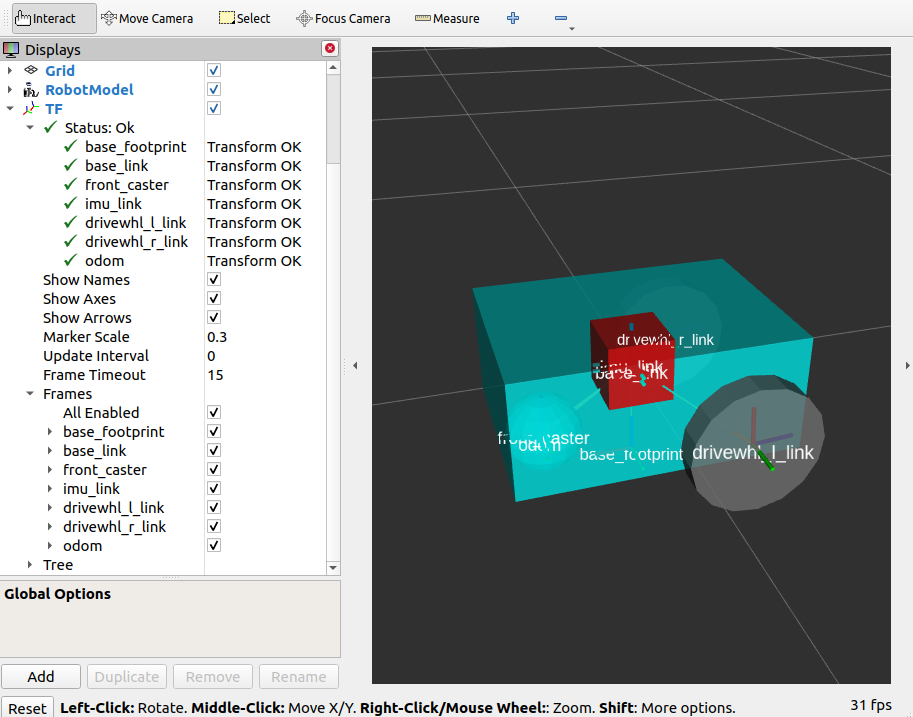

Smoothing Odometry using Robot Localization
###########################################

In this tutorial, we will discuss how various sources of odometry can be fused to provide a smoothed odometry using the ``robot_localization`` package and we will also show how to publish the ``odom`` => ``base_link`` transform using ``robot_localization``.

The ``robot_localization`` package is used to provide a fused and locally accurate smooth odometry information from the data provided by ``N`` odometry sensor inputs. These information can be provided to the package through ``nav_msgs/Odometry``, ``sensor_msgs/Imu``, ``geometry_msgs/PoseWithCovarianceStamped``, and ``geometry_msgs/TwistWithCovarianceStamped`` messages.

A usual robot setup consists of at least the wheel encoders and IMU as its odometry sensor sources. When multiple sources are provided to ``robot_localization``, it is able to fuse the odometry information given by the sensors through the use of state estimation nodes. These nodes make use of either an Extended Kalman filter (``ekf_node``) or an Unscented Kalman Filter (``ukf_node``) to implement this fusion. In addition, the package also implements a ``navsat_transform_node`` which transforms geographic coordinates into the robot’s world frame when working with GPS.

Fused sensor data is published by the ``robot_localization`` package through the ``odometry/filtered`` and the ``accel/filtered`` topics, if enabled in its configuration. In addition, it can also publish the ``odom`` => ``base_link`` transform on the ``/tf`` topic. Do note that if you followed :ref:`setup_odom_gz`, you will need to remove the /tf bridge in ``bridge_config.yaml`` to get the transforms from ``ekf_node`` instead of Gazebo.

.. seealso::
  More details on ``robot_localization`` can be found in the official `Robot Localization Documentation <http://docs.ros.org/en/noetic/api/robot_localization/html/index.html>`_.

If your robot is only able to provide one odometry source, the use of ``robot_localization`` would have minimal effects aside from smoothing. In this case, an alternative approach is to publish transforms through a tf2 broadcaster in your single source of odometry node. Nevertheless, you can still opt to use ``robot_localization`` to publish the transforms and some smoothing properties may still be observed in the output.

.. seealso::
  For more information on how to write a tf2 broadcaster, you can check Writing a tf2 broadcaster `(C++)  <https://docs.ros.org/en/rolling/Tutorials/Tf2/Writing-A-Tf2-Broadcaster-Cpp.html>`_  `(Python)  <https://docs.ros.org/en/rolling/Tutorials/Tf2/Writing-A-Tf2-Broadcaster-Py.html>`_.

For the rest of this section, we will show how to use ``robot_localization`` to fuse the sensors of ``sam_bot``. It will use the ``sensor_msgs/Imu`` messages published on ``/demo/Imu`` and the ``nav_msgs/Odometry`` message published on ``/demo/odom`` and then it will publish data on ``odometry/filtered``,  ``accel/filtered``, and ``/tf`` topics.

Configuring Robot Localization
==============================

Let us now configure the ``robot_localization`` package to use an Extended Kalman Filter (``ekf_node``) to fuse odometry information and publish the ``odom`` => ``base_link`` transform.

First, install the ``robot_localization`` package using your machines package manager or by executing the following command:

.. code-block:: shell

  sudo apt install ros-<ros2-distro>-robot-localization

Next, we specify the parameters of the ``ekf_node`` using a YAML file. Create a directory named ``config`` at the root of your project and create a file named ``ekf.yaml``. Copy the following lines of code into your ``ekf.yaml`` file.

.. code-block:: yaml

  ### ekf config file ###
  ekf_node:
      ros__parameters:
  # The frequency, in Hz, at which the filter will output a position estimate. Note that the filter will not begin
  # computation until it receives at least one message from one of the inputs. It will then run continuously at the
  # frequency specified here, regardless of whether it receives more measurements. Defaults to 30 if unspecified.
          frequency: 30.0
          
  # ekf_localization_node and ukf_localization_node both use a 3D omnidirectional motion model. If this parameter is
  # set to true, no 3D information will be used in your state estimate. Use this if you are operating in a planar
  # environment and want to ignore the effect of small variations in the ground plane that might otherwise be detected
  # by, for example, an IMU. Defaults to false if unspecified.
          two_d_mode: false

  # Whether to publish the acceleration state. Defaults to false if unspecified.
          publish_acceleration: true

  # Whether to broadcast the transformation over the /tf topic. Defaults to true if unspecified.
          publish_tf: true
          
  # 1. Set the map_frame, odom_frame, and base_link frames to the appropriate frame names for your system.
  #     1a. If your system does not have a map_frame, just remove it, and make sure "world_frame" is set to the value of odom_frame.
  # 2. If you are fusing continuous position data such as wheel encoder odometry, visual odometry, or IMU data, set "world_frame" 
  #    to your odom_frame value. This is the default behavior for robot_localization's state estimation nodes.
  # 3. If you are fusing global absolute position data that is subject to discrete jumps (e.g., GPS or position updates from landmark 
  #    observations) then:
  #     3a. Set your "world_frame" to your map_frame value
  #     3b. MAKE SURE something else is generating the odom->base_link transform. Note that this can even be another state estimation node 
  #         from robot_localization! However, that instance should *not* fuse the global data.
          map_frame: map              # Defaults to "map" if unspecified
          odom_frame: odom            # Defaults to "odom" if unspecified
          base_link_frame: base_link  # Defaults to "base_link" if unspecified
          world_frame: odom           # Defaults to the value of odom_frame if unspecified
          
          odom0: demo/odom
          odom0_config: [false, false, false,
                        false, false, false,
                        true, true, false,
                        false, false, true,
                        false, false, false]

          imu0: demo/imu
          imu0_config: [false, false, false,
                        false, false, false,
                        false, false, false,
                        false, false, true,
                        false, false, false]

In this configuration, we defined the parameter values of ``frequency``, ``two_d_mode``, ``publish_acceleration``, ``publish_tf``, ``map_frame``, ``odom_frame``, ``base_link_frame``, and ``world_frame``. For more information on the other parameters you can modify, see `Parameters of state estimation nodes <http://docs.ros.org/en/melodic/api/robot_localization/html/state_estimation_nodes.html#parameters>`_, and a sample ``efk.yaml`` can be found `here <https://github.com/cra-ros-pkg/robot_localization/blob/ros2/params/ekf.yaml>`_.

To add a sensor input to the ``ekf_filter_node``, add the next number in the sequence to its base name (odom, imu, pose, twist). In our case, we have one ``nav_msgs/Odometry`` and one ``sensor_msgs/Imu`` as inputs to the filter, thus we use ``odom0`` and ``imu0``. We set the value of ``odom0`` to ``demo/odom``, which is the topic that publishes the ``nav_msgs/Odometry``. Similarly, we set the value of ``imu0`` to the topic that publishes ``sensor_msgs/Imu``, which is ``demo/imu``.

To understand how ``robot_localization`` is configured and understand the reasoning behind the config have a look at `Configuring robot_localization <http://docs.ros.org/en/melodic/api/robot_localization/html/configuring_robot_localization.html>`_.

.. seealso::
  For more advise on configuration of input data to ``robot_localization``, see `Preparing Your Data for Use with robot_localization <http://docs.ros.org/en/melodic/api/robot_localization/html/preparing_sensor_data.html#odometry>`_, and `Configuring robot_localization <http://docs.ros.org/en/melodic/api/robot_localization/html/configuring_robot_localization.html>`_.

Launch and Build Files
======================

Now, let us add the ``ekf_node`` into the launch file. Open ``launch/display.launch.py`` and paste the following lines before the ``return launch.LaunchDescription([`` line.

.. code-block:: shell

  robot_localization_node = Node(
      package='robot_localization',
      executable='ekf_node',
      name='ekf_node',
      output='screen',
      parameters=[os.path.join(pkg_share, 'config/ekf.yaml'), {'use_sim_time': LaunchConfiguration('use_sim_time')}]
  )

Next, add the following launch arguments within the ``return launch.LaunchDescription([`` block.

.. code-block:: shell

  launch.actions.DeclareLaunchArgument(name='use_sim_time', default_value='True',
                                              description='Flag to enable use_sim_time'),

Lastly, add ``robot_localization_node,`` above the ``rviz_node`` line to launch the robot localization node.

.. code-block:: shell

        robot_state_publisher_node,
        spawn_entity,
        robot_localization_node,
        rviz_node
  ])

Next, we need to add the ``robot_localization`` dependency to our package definition. Open ``package.xml`` and add the following line below the last ``<exec_depend>`` tag.

.. code-block:: shell

   <exec_depend>robot_localization</exec_depend>

Lastly, open ``CMakeLists.txt`` and append the ``config`` directory inside the ``install(DIRECTORY...)``, as shown in the snippet below.

.. code-block:: shell

  install(
    DIRECTORY src launch rviz config
    DESTINATION share/${PROJECT_NAME}
  )

Build, Run and Verification
===========================

Let us now build and run our package. Navigate to the root of the project and execute the following lines:

.. code-block:: shell

  colcon build
  . install/setup.bash
  ros2 launch sam_bot_description display.launch.py

Gazebo and RVIZ should launch. In the RVIZ window, you should see the model and TF frames of ``sam_bot``:

Next, let us verify that the ``odometry/filtered``,  ``accel/filtered``, and ``/tf`` topics are active in the system. Open a new terminal and execute:

.. code-block:: shell

  ros2 topic list

You should see ``odometry/filtered``, ``accel/filtered``, and ``/tf`` in the list of the topics.

You can also check the subscriber count of these topics again by executing:

.. code-block:: shell

  ros2 topic info /demo/imu
  ros2 topic info /demo/odom

You should see that ``/demo/imu`` and ``/demo/odom`` now both have 1 subscriber each.

To verify that the ``ekf_filter_node`` are the subscribers of these topics, execute:

.. code-block:: shell

  ros2 node info /ekf_filter_node

You should see an output as shown below.

.. code-block:: shell

  /ekf_filter_node
  Subscribers:
    /demo/imu: sensor_msgs/msg/Imu
    /demo/odom: nav_msgs/msg/Odometry
    /parameter_events: rcl_interfaces/msg/ParameterEvent
    /set_pose: geometry_msgs/msg/PoseWithCovarianceStamped
  Publishers:
    /accel/filtered: geometry_msgs/msg/AccelWithCovarianceStamped
    /diagnostics: diagnostic_msgs/msg/DiagnosticArray
    /odometry/filtered: nav_msgs/msg/Odometry
    /parameter_events: rcl_interfaces/msg/ParameterEvent
    /rosout: rcl_interfaces/msg/Log
    /tf: tf2_msgs/msg/TFMessage
  Service Servers:
     ...

From the output above, we can see that the ``ekf_filter_node`` is subscribed to ``/demo/imu`` and ``/demo/odom``. We can also see that the ``ekf_filter_node`` publishes on the ``odometry/filtered``, ``accel/filtered``, and ``/tf`` topics.

You may also verify that ``robot_localization`` is publishing the ``odom`` => ``base_link`` transform by using the tf2_echo utility. Run the following command in a separate command line terminal:

.. code-block:: shell

  ros2 run tf2_ros tf2_echo odom base_link

You should see a continuous output similar to what is shown below.

.. code-block:: shell

  At time 8.842000000
  - Translation: [0.003, -0.000, 0.127]
  - Rotation: in Quaternion [-0.000, 0.092, 0.003, 0.996]
  At time 9.842000000
  - Translation: [0.002, -0.000, 0.127]
  - Rotation: in Quaternion [-0.000, 0.092, 0.003, 0.996]

Conclusion
**********
In this guide we have discussed how multiple odometry sensors can be used to provide a filtered and smoothed odometry using ``robot_localization``. We have also checked if the ``odom`` => ``base_link`` transform is being published correctly by ``robot_localization``.
