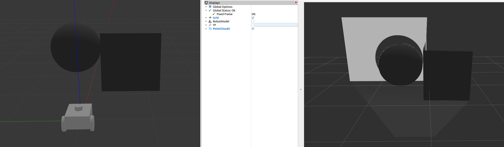
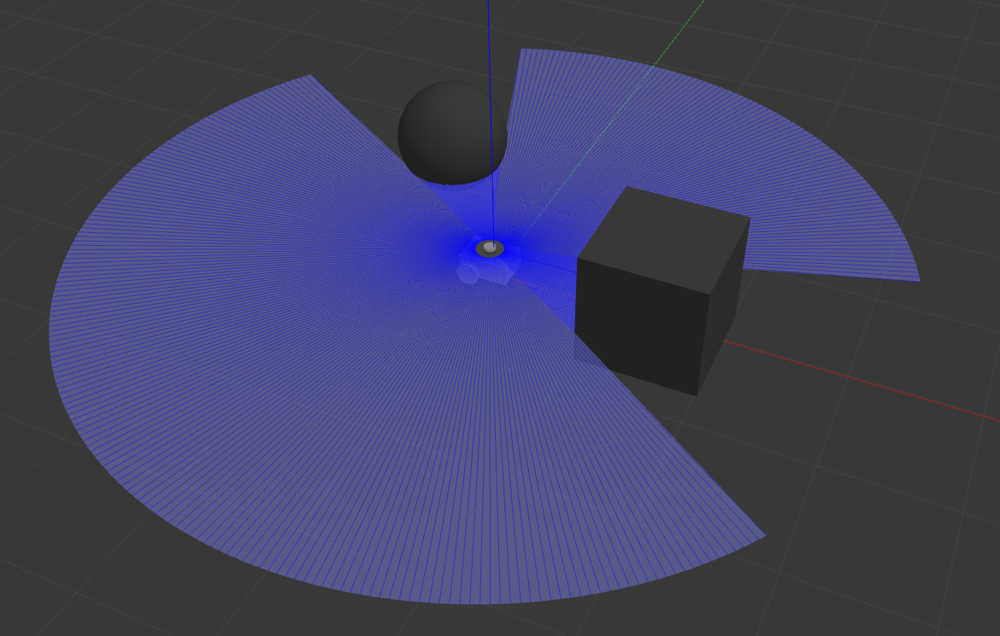
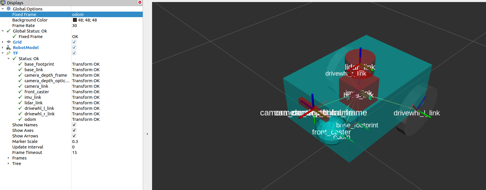
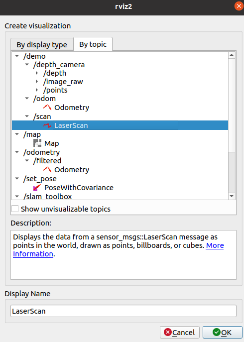
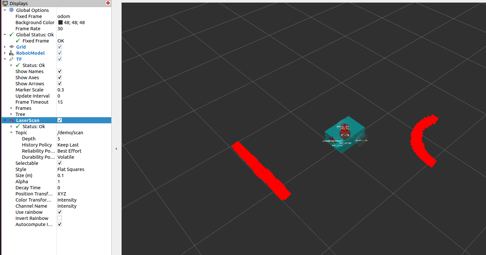
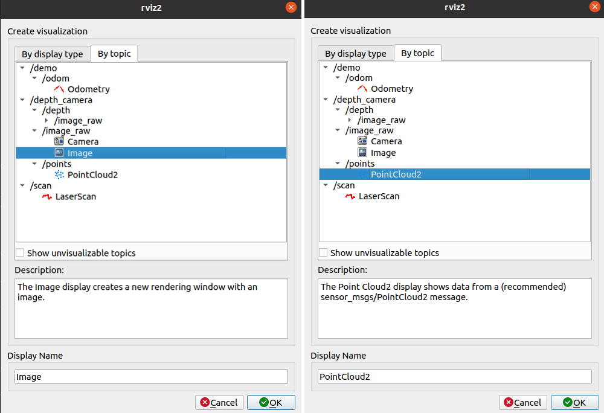
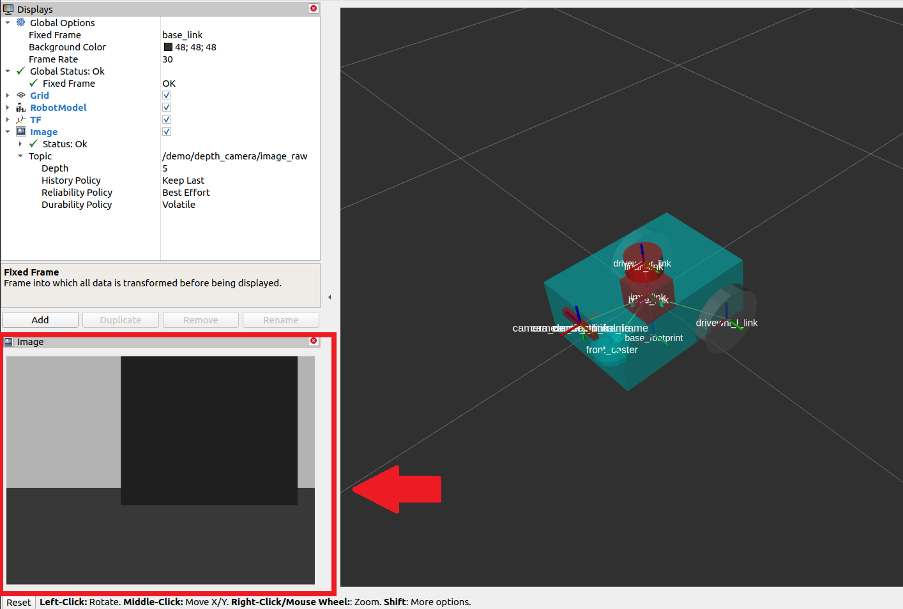
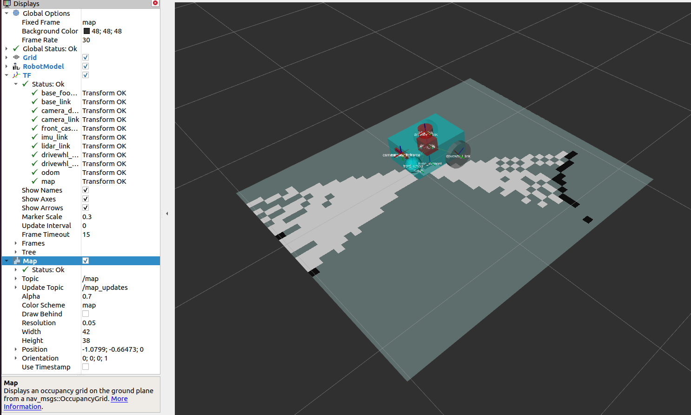
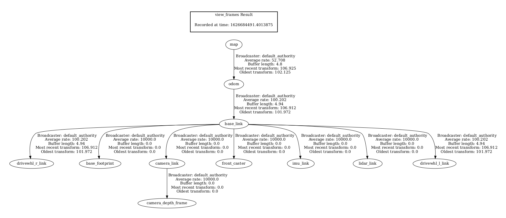
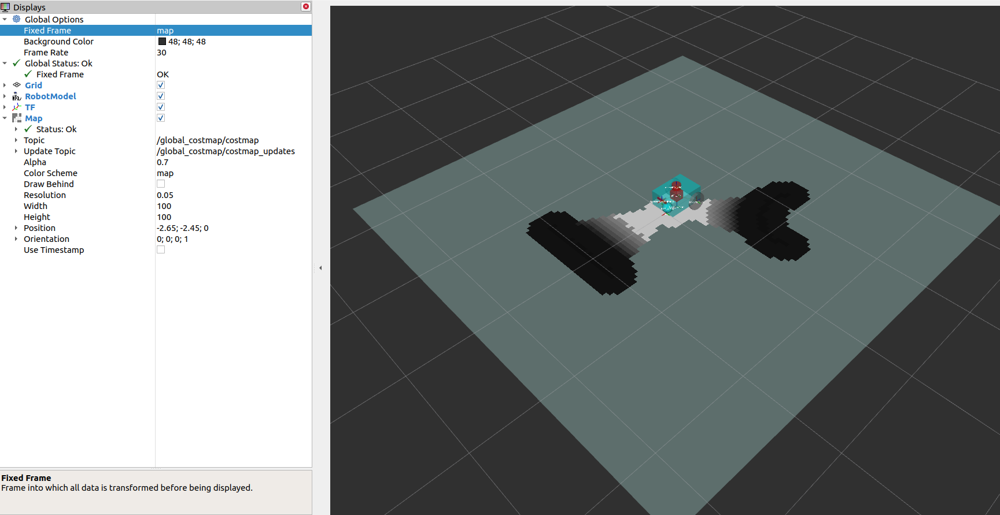

.. _setup_sensors:

Setting Up Sensors
##################

In this guide, we will discuss the importance of the sensors in navigating a robot safely and how to set up the sensors with Nav2. In the first half of this tutorial, we will take a brief look at commonly used sensors and common sensor messages in Nav2. Next, we will add a basic sensor setup on our previously built simulated robot, ``sam_bot``. Lastly, we will then verify the simulated sensor messages of ``sam_bot`` by visualizing them in RViz. 

Once sensors have been set up on a robot, their readings can be used in mapping, localization, and perception tasks. In the second half of this guide, we will first discuss how mapping and localization use the sensor data. Then, we will also take a look at one of Nav2's packages, ``nav2_costmap_2d``, which generates costmaps that will eventually be used in Nav2 path planning. We will set up basic configuration parameters for this package so it properly takes in sensor information from ``sam_bot``. Lastly, we visualize a generated costmaps in RViz to verify its received data.

Sensor Introduction
*******************
Mobile robots are equipped with a multitude of sensors that allow them to see and perceive their environment. These sensors obtain information which can be used to build and maintain the map of the environment, to localize the robot on the map, and to see the obstacles in the environment. These tasks are essential to be able to safely and efficiently navigate a robot through a dynamic environment. 

Examples of commonly used sensors are lidar, radar, RGB camera, depth camera, IMU, and GPS. To standardize the message formats of these sensors and allow for easier interoperation between vendors, ROS provides the ``sensor_msgs`` package that defines the common sensor interfaces. This also allows users to use any sensor vendor as long as it follows the standard format in ``sensor_msgs``. In the next subsection, we introduce some of commonly used messages in navigation, namely the ``sensor_msgs/LaserScan``, ``sensor_msgs/PointCloud2``, ``sensor_msgs/Range``, and ``sensor_msgs/Image``.

Aside from the ``sensor_msgs`` package, there are also the ``radar_msgs`` and ``vision_msgs`` standard interfaces you should be aware of.  The ``radar_msgs`` defines the messages for radar-specific sensors while the ``vision_msgs`` package defines the messages used in computer vision such as object detection, segmentation, and other machine learning models. Messages supported by this package are ``vision_msgs/Classification2D``, ``vision_msgs/Classification3D``, ``vision_msgs/Detection2D``, and ``vision_msgs/Detection3D``, to name a few.

.. seealso::
   For more information, see the API documentation of `sensor_msgs <http://wiki.ros.org/sensor_msgs>`_, `radar_msgs <http://wiki.ros.org/radar_msgs>`_, and `vision_msgs <http://wiki.ros.org/vision_msgs>`_.

Your physical robot's sensors probably have ROS drivers written for them (e.g. a ROS node that connects to the sensors, populates data into messages, and publishes them for your robot to use) that follow the standard interface in the ``sensor_msgs`` package. The ``sensor_msgs`` package makes it easy for you to use many different sensors from different manufacturers. General software packages like Nav2 can then can read these standardized messages and perform tasks independent of the sensor hardware. On simulated robots such as ``sam_bot``, Gazebo has sensor plugins which also publish their information following the ``sensor_msgs`` package.

Common Sensor Messages
======================  

In this subsection, we discuss some of the common types of ``sensor_msgs`` you might encounter when setting up Nav2. We will provide a brief description for each sensor, an image of it being simulated in Gazebo and the corresponding visualization of the sensor readings in RViz.

.. note::  There are other types of ``sensor_msgs`` aside from the ones listed below.  The complete list of messages and their definitions can be found in the `sensor_msgs documentation <http://wiki.ros.org/sensor_msgs>`_.

sensor_msgs/LaserScan
---------------------

This message represents a single scan from a planar laser range-finder. This message is used in ``slam_toolbox`` and ``nav2_amcl`` for localization and mapping, or in ``nav2_costmap_2d`` for perception.

.. image:: images/sensor_laserscan.png

sensor_msgs/PointCloud2
-----------------------

This message holds a collection of 3D points, plus optional additional information about each point. This can be from a 3D lidar, a 2D lidar, a depth camera or more.

sensor_msgs/Range
-----------------

This is a single range reading from an active ranger that emits energy and reports one range reading that is valid along an arc at the distance measured. A sonar, IR sensor, or 1D range finder are examples of sensors that use this message.

.. image:: images/sensor_range.png

sensor_msgs/Image
-----------------

This represents the sensor readings from RGB or depth camera, corresponding to RGB or range values.

.. image:: images/sensor_image.png

Simulating Sensors using Gazebo
*******************************
To give you a better grasp of how to set up sensors on a simulated robot, we will build up on our previous tutorials and attach sensors to our simulated robot ``sam_bot``. Similar to the previous tutorial where we used Gazebo plugins to add odometry sensors to ``sam_bot``, we will be using the Gazebo plugins to simulate a lidar sensor and a depth camera on ``sam_bot``. If you are working with a real robot, most of these steps are still required for setting up your URDF frames and it will not hurt to also add in the gazebo plugins for later use. 

To be able to follow the rest of this section, make sure that you have properly installed Gazebo. You can follow the instructions at the `Setup and Prerequisites <https://navigation.ros.org/setup_guides/odom/setup_odom.html#setup-and-prerequisites>`_ of the previous tutorial to setup Gazebo. 

Adding Gazebo Plugins to a URDF
===============================

Let us first add a lidar sensor to ``sam_bot``. Open the URDF file, `src/description/sam_bot_description.urdf <https://github.com/ros-planning/navigation2_tutorials/blob/master/sam_bot_description/src/description/sam_bot_description.urdf>`_ and paste the following lines before the ``</robot>`` tag.

.. code-block:: xml
  :lineno-start: 251

  <link name="lidar_link">
    <inertial>
      <origin xyz="0 0 0" rpy="0 0 0"/>
      <mass value="0.125"/>
      <inertia ixx="0.001"  ixy="0"  ixz="0" iyy="0.001" iyz="0" izz="0.001" />
    </inertial>

    <collision>
      <origin xyz="0 0 0" rpy="0 0 0"/>
      <geometry>
         <cylinder radius="0.0508" length="0.055"/>
      </geometry>
    </collision>

    <visual>
      <origin xyz="0 0 0" rpy="0 0 0"/>
      <geometry>
         <cylinder radius="0.0508" length="0.055"/>
      </geometry>
    </visual>
  </link>
    
  <joint name="lidar_joint" type="fixed">
    <parent link="base_link"/>
    <child link="lidar_link"/>
    <origin xyz="0 0 0.12" rpy="0 0 0"/>
  </joint>
    
  <gazebo reference="lidar_link">
    <sensor name="lidar" type="ray">
      <always_on>true</always_on>
      <visualize>true</visualize>
      <update_rate>5</update_rate>
      <ray>
        <scan>
          <horizontal>
            <samples>360</samples>
            <resolution>1.000000</resolution>
            <min_angle>0.000000</min_angle>
            <max_angle>6.280000</max_angle>
          </horizontal>
        </scan>
        <range>
          <min>0.120000</min>
          <max>3.5</max>
          <resolution>0.015000</resolution>
        </range>
        <noise>
          <type>gaussian</type>
          <mean>0.0</mean>
          <stddev>0.01</stddev>
        </noise>
      </ray>
      <plugin name="scan" filename="libgazebo_ros_ray_sensor.so">
        <ros>
          <remapping>~/out:=scan</remapping>
        </ros>
        <output_type>sensor_msgs/LaserScan</output_type>
        <frame_name>lidar_link</frame_name>
      </plugin>
    </sensor>
  </gazebo>

In the code snippet above, we create a ``lidar_link`` which will be referenced by the ``gazebo_ros_ray_sensor`` plugin as the location to attach our sensor. We also set values to the simulated lidar's scan and range properties. Lastly, we set the ``/scan`` as the topic to which it will publish the ``sensor_msgs/LaserScan`` messages.

Next, let us add a depth camera to ``sam_bot``. Paste the following lines after the ``</gazebo>`` tag of the lidar sensor. 

.. code-block:: xml
  :lineno-start: 314

  <link name="camera_link">
    <visual>
      <origin xyz="0 0 0" rpy="0 0 0"/>
      <geometry>
        <box size="0.015 0.130 0.022"/>
      </geometry>
    </visual>

    <collision>
      <origin xyz="0 0 0" rpy="0 0 0"/>
      <geometry>
        <box size="0.015 0.130 0.022"/>
      </geometry>
    </collision>

    <inertial>
      <origin xyz="0 0 0" rpy="0 0 0"/>
      <mass value="0.035"/>
      <inertia ixx="0.001"  ixy="0"  ixz="0" iyy="0.001" iyz="0" izz="0.001" />
    </inertial>
  </link>
  
  <joint name="camera_joint" type="fixed">
    <parent link="base_link"/>
    <child link="camera_link"/>
    <origin xyz="0.215 0 0.05" rpy="0 0 0"/>
  </joint>

  <link name="camera_depth_frame"/>

  <joint name="camera_depth_joint" type="fixed">
    <origin xyz="0 0 0" rpy="${-pi/2} 0 ${-pi/2}"/>
    <parent link="camera_link"/>
    <child link="camera_depth_frame"/>
  </joint>

  <gazebo reference="camera_link">
    <sensor name="depth_camera" type="depth">
      <visualize>true</visualize>
      <update_rate>30.0</update_rate>
      <camera name="camera">
        <horizontal_fov>1.047198</horizontal_fov>
        <image>
          <width>640</width>
          <height>480</height>
          <format>R8G8B8</format>
        </image>
        <clip>
          <near>0.05</near>
          <far>3</far>
        </clip>
      </camera>
      <plugin name="depth_camera_controller" filename="libgazebo_ros_camera.so">
        <baseline>0.2</baseline>
        <alwaysOn>true</alwaysOn>
        <updateRate>0.0</updateRate>
        <frame_name>camera_depth_frame</frame_name>
        <pointCloudCutoff>0.5</pointCloudCutoff>
        <pointCloudCutoffMax>3.0</pointCloudCutoffMax>
        <distortionK1>0</distortionK1>
        <distortionK2>0</distortionK2>
        <distortionK3>0</distortionK3>
        <distortionT1>0</distortionT1>
        <distortionT2>0</distortionT2>
        <CxPrime>0</CxPrime>
        <Cx>0</Cx>
        <Cy>0</Cy>
        <focalLength>0</focalLength>
        <hackBaseline>0</hackBaseline>
      </plugin>
    </sensor>
  </gazebo>

Similar to the lidar sensor, we create ``camera_link`` which will be referenced by the ``gazebo_ros_camera`` plugin as the sensor attachment location. We also create a ``camera_depth_frame`` that is attached to the ``camera_link`` and will be set as the ``<frame_name>`` of the depth camera plugin.  We also configure the plugin such that it will publish ``sensor_msgs/Image`` and ``sensor_msgs/PointCloud2`` messages to ``/depth_camera/image_raw`` and  ``/depth_camera/points`` topics respectively. Lastly, we also set up other basic configuration properties for our depth camera.

Launch and Build Files
======================

To verify that the sensors are set up properly and that they can see objects in our environemnt, let us launch ``sam_bot`` in a Gazebo world with objects. 
Let us create a Gazebo world with a single cube and a single sphere that are within the range of ``sam_bot``'s sensors so we can verify if it can see the objects correctly. 

To create the world, create a directory named ``world`` at the root of your project and create a file named ``my_world.sdf`` inside the ``world`` folder . Then copy the contents of `world/my_world.sdf <https://github.com/ros-planning/navigation2_tutorials/blob/master/sam_bot_description/world/my_world.sdf>`_ and paste them inside ``my_world.sdf``.

Now, let us edit our launch file, `launch/display.launch.py <https://github.com/ros-planning/navigation2_tutorials/blob/master/sam_bot_description/launch/display.launch.py>`_, to launch Gazebo with the world we just created. First, add the path of ``my_world.sdf`` by adding the following lines inside the ``generate_launch_description()``:

.. code-block:: shell

  world_path=os.path.join(pkg_share, 'world/my_world.sdf'),

Lastly, add the world path in the ``launch.actions.ExecuteProcess(cmd=['gazebo',...`` line, as shown below.

.. code-block:: shell

  launch.actions.ExecuteProcess(cmd=['gazebo', '--verbose', '-s', 'libgazebo_ros_init.so', '-s', 'libgazebo_ros_factory.so', world_path], output='screen'),

We also have to add the ``world`` directory to our ``CMakeLists.txt`` file. Open `CmakeLists.txt <https://github.com/ros-planning/navigation2_tutorials/blob/master/sam_bot_description/CMakeLists.txt>`_ and append the ``world`` directory inside the install(DIRECTORY...), as shown in the snippet below.

.. code-block:: shell

  install(
    DIRECTORY src launch rviz config world
    DESTINATION share/${PROJECT_NAME}
  )

Build, Run and Verification
===========================

We can now build and run our project. Navigate to the root of the project and execute the following lines:

.. code-block:: shell

  colcon build
  . install/setup.bash
  ros2 launch sam_bot_description display.launch.py

RViz and the Gazebo will then be launched with ``sam_bot`` present in both. In the Gazebo window, the world that we created should be launched and ``sam_bot`` should be spawned in that world. You should now be able to observe ``sam_bot`` with the 360 lidar sensor and the depth camera, as shown in the image below.

In the RViz window, we can verify if we have properly modeled our sensors and if the transforms of our newly added sensors are correct:

Lastly, we can also visualize the sensor readings in RViz.  To visualize the ``sensor_msgs/LaserScan`` message published on ``/scan`` topic, click the add button at the bottom part of the RViz window. Then go to the ``By topic`` tab and select the ``LaserScan`` option under ``/scan``, as shown below.

Next, set the ``Reliability Policy`` in RViz to ``Best Effort`` and set the ``size`` to 0.1 to see the points clearer. You should see the visualized ``LaserScan`` detection as shown below. This corresponds to the detected cube and sphere that we added to the Gazebo world. 

To visualize ``sensor_msgs/Image`` and ``sensor_msgs/PointCloud2``, do the same for topics ``/depth_camera/image_raw`` and ``/depth_camera/points`` respectively:

After adding the ``/depth_camera/image_raw`` topic in RViz, set the ``Reliability Policy`` in RViz to ``Best Effort``. Then you should see the cube in the image window at the lower-left side of the RViz window, as shown below.

You should also see the ``sensor_msgs/PointCloud2``, as shown below.

.. image:: images/pointcloud2_data.png
    :align: center

Mapping and Localization
************************
Now that we have a robot with its sensors set up, we can use the obtained sensor information to build a map of the environment and to localize the robot on the map. The ``slam_toolbox`` package is a set of tools and capabilities for 2D Simultaneous Localization and Mapping (SLAM) in potentially massive maps with ROS2. It is also one of the officially supported SLAM libraries in Nav2, and we recommend to use this package in situations you need to use SLAM on your robot setup. Aside from the ``slam_toolbox``, localization can also be implemented through the ``nav2_amcl`` package. This package implements Adaptive Monte Carlo Localization (AMCL) which estimates the position and orientation of the robot in a map. Other techniques may also be available, please check Nav2 documentation for more information.

Both the ``slam_toolbox`` and ``nav2_amcl`` use information from the laser scan sensor to be able to perceive the robot's environment. Hence, to verify that they can access the laser scan sensor readings, we must make sure that they are subscribed to the correct topic that publishes the ``sensor_msgs/LaserScan`` message. This can be configured by setting their ``scan_topic`` parameters to the topic that publishes that message. It is a convention to publish the ``sensor_msgs/LaserScan`` messages to  ``/scan`` topic. Thus, by default, the ``scan_topic`` parameter is set to ``/scan``. Recall that when we added the lidar sensor to ``sam_bot`` in the previous section, we set the topic to which the lidar sensor will publish the ``sensor_msgs/LaserScan`` messages as ``/scan``. 

In-depth discussions on the complete configuration parameters will not be a scope of our tutorials since they can be pretty complex. Instead, we recommend you to have a look at their official documentation in the links below.

.. seealso::
  | For the complete list of configuration parameters of ``slam_toolbox``, see the `Github repository of slam_toolbox <https://github.com/SteveMacenski/slam_toolbox#readme>`_.
  | For the complete list of configuration parameters and example configuration of ``nav2_amcl``, see the `AMCL Configuration Guide <https://navigation.ros.org/configuration/packages/configuring-amcl.html>`_.

 
You can also refer to the `(SLAM) Navigating While Mapping guide <https://navigation.ros.org/tutorials/docs/navigation2_with_slam.html>`_ for the tutorial on how to use Nav2 with SLAM. You can verify that ``slam_toolbox`` and ``nav2_amcl`` have been correctly setup by visualizing the map and the robot's pose in RViz, similar to what was shown in the previous section.

Costmap 2D
**********
The costmap 2D package makes use of the sensor information to provide a representation of the robot's environment in the form of an occupancy grid. The cells in the occupancy grid store cost values between 0-254 which denote a cost to travel through these zones. A cost of 0 means the cell is free while a cost of 254 means that the cell is lethally occupied. Values in between these extremes are used by navigation algorithms to steer your robot away from obstacles as a potential field. Costmaps in Nav2 are implemented through the ``nav2_costmap_2d`` package. 

The costmap implementation consists of multiple layers, each of which has a certain function that contributes to a cell's overall cost. The package consists of the following layers, but are plugin-based to allow customization and new layers to be used as well: static layer, inflation layer, range layer, obstacle layer, and voxel layer. The static layer represents the map section of the costmap, obtained from the messages published to the ``/map`` topic like those produced by SLAM.  The obstacle layer includes the objects detected by sensors that publish either or both the ``LaserScan`` and ``PointCloud2`` messages. The voxel layer is similar to the obstacle layer such that it can use either or both the ``LaserScan`` and ``PointCloud2`` sensor information but handles 3D data instead. The range layer allows for the inclusion of information provided by sonar and infrared sensors. Lastly, the inflation layer represents the added cost values around lethal obstacles such that our robot avoids navigating into obstacles due to the robot's geometry. In the next subsection of this tutorial, we will have some discussion about the basic configuration of the different layers in ``nav2_costmap_2d``. 

The layers are integrated into the costmap through a plugin interface and then inflated using a user-specified `inflation radius <http://wiki.ros.org/costmap_2d/hydro/inflation>`_, if the inflation layer is enabled. For a deeper discussion on costmap concepts, you can have a look at the `ROS1 costmap_2D documentation <http://wiki.ros.org/costmap_2d>`_. Note that the ``nav2_costmap_2d`` package is mostly a straightforward ROS2 port of the ROS1 navigation stack version with minor changes required for ROS2 support and some new layer plugins.

.. _configuring_nav2_costmap_2d:

Configuring nav2_costmap_2d
===========================
In this subsection, we will show an example configuration of ``nav2_costmap_2d`` such that it uses the information provided by the lidar sensor of ``sam_bot``. We will show an example configuration that uses static layer, obstacle layer, voxel layer, and inflation layer. We set both the obstacle and voxel layer to use the ``LaserScan`` messages published  to the ``/scan`` topic by the lidar sensor. We also set some of the basic parameters to define how the detected obstacles are reflected in the costmap. Note that this configuration is to be included in the configuration file of Nav2. 

.. code-block:: yaml
  :lineno-start: 1

  global_costmap:
    global_costmap:
      ros__parameters:
        update_frequency: 1.0
        publish_frequency: 1.0
        global_frame: map
        robot_base_frame: base_link
        use_sim_time: True
        robot_radius: 0.22
        resolution: 0.05
        track_unknown_space: false
        rolling_window: false
        plugins: ["static_layer", "obstacle_layer", "inflation_layer"]
        static_layer:
          plugin: "nav2_costmap_2d::StaticLayer"
          map_subscribe_transient_local: True
        obstacle_layer:
          plugin: "nav2_costmap_2d::ObstacleLayer"
          enabled: True
          observation_sources: scan
          scan:
            topic: /scan
            max_obstacle_height: 2.0
            clearing: True
            marking: True
            data_type: "LaserScan"
            raytrace_max_range: 3.0
            raytrace_min_range: 0.0
            obstacle_max_range: 2.5
            obstacle_min_range: 0.0
        inflation_layer:
          plugin: "nav2_costmap_2d::InflationLayer"
          cost_scaling_factor: 3.0
          inflation_radius: 0.55
        always_send_full_costmap: True

  local_costmap:
    local_costmap:
      ros__parameters:
        update_frequency: 5.0
        publish_frequency: 2.0
        global_frame: odom
        robot_base_frame: base_link
        use_sim_time: True
        rolling_window: true
        width: 3
        height: 3
        resolution: 0.05
        robot_radius: 0.22
        plugins: ["voxel_layer", "inflation_layer"]
        voxel_layer:
          plugin: "nav2_costmap_2d::VoxelLayer"
          enabled: True
          publish_voxel_map: True
          origin_z: 0.0
          z_resolution: 0.05
          z_voxels: 16
          max_obstacle_height: 2.0
          mark_threshold: 0
          observation_sources: scan
          scan:
            topic: /scan
            max_obstacle_height: 2.0
            clearing: True
            marking: True
            data_type: "LaserScan"
        inflation_layer:
          plugin: "nav2_costmap_2d::InflationLayer"
          cost_scaling_factor: 3.0
          inflation_radius: 0.55
        always_send_full_costmap: True

In the configuration above, notice that we set the parameters for two different costmaps: ``global_costmap`` and ``local_costmap``. We set up two costmaps since the ``global_costmap`` is mainly used for long-term planning over the whole map while ``local_costmap`` is for short-term planning and collision avoidance. 

The layers that we use for our configuration are defined in the ``plugins`` parameter, as shown in line 13 for the ``global_costmap`` and line 50 for the ``local_costmap``. These values are set as a list of mapped layer names that also serve as namespaces for the layer parameters we set up starting at lines 14 and line 51. Note that each layer/namespace in this list must have a ``plugin`` parameter (as indicated in lines 15, 18, 32, 52, and 68) defining the type of plugin to be loaded for that specific layer.

For the static layer (lines 14-16), we set the ``map_subscribe_transient_local`` parameter to ``True``. This sets the QoS settings for the map topic. Another important parameter for the static layer is the ``map_topic`` which defines the map topic to subscribe to. This defaults to ``/map`` topic when not defined. 

For the obstacle layer (lines 17-30), we define its sensor source under the ``observation_sources`` parameter (line 20) as ``scan`` whose parameters are set up in lines 22-30. We set its ``topic`` parameter as the topic that publishes the defined sensor source and we set the ``data_type`` according to the sensor source it will use. In our configuration, the obstacle layer will use the ``LaserScan`` published by the lidar sensor to ``/scan``. 

Note that the obstacle layer and voxel layer can use either or both ``LaserScan`` and ``PointCloud2`` as their ``data_type`` but it is set to ``LaserScan`` by default. The code snippet below shows an example of using both the ``LaserScan`` and ``PointCloud2`` as the sensor sources. This may be particularly useful when setting up your own physical robot.

.. code-block:: shell

  obstacle_layer:
    plugin: "nav2_costmap_2d::ObstacleLayer"
    enabled: True
    observation_sources: scan pointcloud
    scan:
      topic: /scan
      data_type: "LaserScan"
    pointcloud:
      topic: /depth_camera/points
      data_type: "PointCloud2"

For the other parameters of the obstacle layer, the ``max_obstacle_height`` parameter sets the maximum height of the sensor reading to return to the occupancy grid. The minimum height of the sensor reading can also be set using the ``min_obstacle_height`` parameter, which defaults to 0 since we did not set it in the configation. The ``clearing`` parameter is used to set whether the obstacle is to be removed from the costmap or not. The clearing operation is done by raytracing through the grid. The maximum and minimum range to raytrace clear objects from the costmap is set using the ``raytrace_max_range`` and ``raytrace_min_range`` respectively. The ``marking`` parameter is used to set whether the inserted obstacle is marked into the costmap or not. We also set the maximum and minimum range to mark obstacles in the costmap through the ``obstacle_max_range`` and ``obstacle_min_range`` respectively. 

For the inflation layer (lines 31-34 and 67-70), we set the exponential decay factor across the inflation radius using the ``cost_scaling_factor`` parameter. The value of the radius to inflate around lethal obstacles is defined using the ``inflation_radius``. 

For the voxel layer (lines 51-66), we set the ``publish_voxel_map`` parameter to ``True`` to enable the publishing of the 3D voxel grid. The resolution of the voxels in height is defined using the ``z_resolution`` parameter, while the number of voxels in each column is defined using the ``z_voxels`` parameter. The ``mark_threshold`` parameter sets the minimum number of voxels in a column to mark as occupied in the occupancy grid. We set the ``observation_sources`` parameter of the voxel layer to ``scan``, and we set the scan parameters (in lines 61-66) similar to the parameters that we have discussed for the obstacle layer. As defined in its ``topic`` and ``data_type`` parameters, the voxel layer will use the ``LaserScan`` published on the ``/scan`` topic by the lidar scanner.

Note that the we are not using a range layer for our configuration but it may be useful for your own robot setup. For the range layer, its basic parameters are the ``topics``, ``input_sensor_type``, and ``clear_on_max_reading`` parameters. The range topics to subscribe to are defined in the ``topics`` parameter. The ``input_sensor_type`` is set to either ``ALL``, ``VARIABLE``, or ``FIXED``. The ``clear_on_max_reading`` is a boolean parameter that sets whether to clear the sensor readings on max range.  Have a look at the configuration guide in the link below in case you need to set it up. 

.. seealso::
  For more information on ``nav2_costmap_2d`` and the complete list of layer plugin parameters, see the `Costmap 2D Configuration Guide <https://navigation.ros.org/configuration/packages/configuring-costmaps.html>`_.

Build, Run and Verification
===========================
We will first launch ``display.launch.py`` which launches the robot state publisher that provides the ``base_link`` => ``sensors`` transformations in our URDF. It also launches Gazebo that acts as our physics simulator and also provides the ``odom`` => ``base_link`` from the differential drive plugin, which we added to ``sam_bot`` in the previous guide, `Simulating an Odometry System Using Gazebo <https://navigation.ros.org/setup_guides/odom/setup_odom.html#simulating-an-odometry-system-using-gazebo>`_. It also launches RViz which we can use to visualize the robot and sensor information. 

Then we will launch ``slam_toolbox`` to publish to ``/map`` topic and provide the ``map`` => ``odom`` transform. Recall that the ``map`` => ``odom`` transform is one of the primary requirements of the Nav2 system. The messages published on the ``/map`` topic will then be used by the static layer of the ``global_costmap``. 

After we have properly setup our robot description, odometry sensors, and necessary transforms, we will finally launch the Nav2 system itself. For now, we will only be exploring the costmap generation system of Nav2. After launching Nav2, we will visualize the costmaps in RViz to confirm our output. 

Launching Description Nodes, RViz and Gazebo
--------------------------------------------

Let us now launch our Robot Description Nodes, RViz and Gazebo through the launch file ``display.launch.py``. Open a new terminal and execute the lines below. 

.. code-block:: shell

  colcon build
  . install/setup.bash
  ros2 launch sam_bot_description display.launch.py

RViz and the Gazebo should now be launched with ``sam_bot`` present in both. Recall that the ``base_link`` => ``sensors`` transform is now being published by ``robot_state_publisher`` and the ``odom`` => ``base_link`` transform by our Gazebo plugins. Both transforms should now be dislpayed show without errors in RViz.

Launching slam_toolbox
----------------------

To be able to launch ``slam_toolbox``, make sure that you have installed the ``slam_toolbox`` package by executing the following command:

.. code-block:: shell

  sudo apt install ros-<ros2-distro>-slam-toolbox

We will launch the ``async_slam_toolbox_node`` of ``slam_toolbox`` using the package's built-in launch files. Open a new terminal and then execute the following lines:

.. code-block:: shell

  ros2 launch slam_toolbox online_async_launch.py

The ``slam_toolbox`` should now be publishing to the ``/map`` topic and providing the ``map`` => ``odom`` transform. 

We can verify in RViz that the ``/map`` topic is being published. In the RViz window, click the add button at the bottom-left part then go to ``By topic`` tab then select the ``Map`` under the ``/map`` topic. You should be able to visualize the message received in the ``/map`` as shown in the image below.

We can also check that the transforms are correct by executing the following lines in a new terminal:

.. code-block:: shell

  ros2 run tf2_tools view_frames.py

Note: For Galactic and newer, it should be ``view_frames`` and not ``view_frames.py``
The line above will create a ``frames.pdf`` file that shows the current transform tree. Your tranform tree should be similar to the one shown below:

Launching Nav2
--------------
First, Make sure you have installed the Nav2 packages by executing the following:

.. code-block:: shell

  sudo apt install ros-<ros2-distro>-navigation2
  sudo apt install ros-<ros2-distro>-nav2-bringup

We will now launch Nav2 using the ``nav2_bringup``'s built-in launch file, ``navigation_launch.py`` . Open a new terminal and execute the following:

.. code-block:: shell

  ros2 launch nav2_bringup navigation_launch.py

Note that the parameters of the ``nav2_costmap_2d`` that we discussed in the previous subsection are included in the default parameters of ``navigation_launch.py``. Aside from the ``nav2_costmap_2d`` parameters, it also contains parameters for the other nodes that are included in Nav2 implementation. 

After we have properly set up and launched Nav2, the ``/global_costmap`` and ``/local_costmap`` topics should now be active.

.. note::  
  To make the costmaps show up, run the 3 commands in this order

  #. Launching Description Nodes, RViz and Gazebo - in logs wait for "Connected to gazebo master"
  #. Launching slam_toolbox - in logs wait for "Registering sensor"
  #. Launching Nav2 - in logs wait for "Creating bond timer"

Visualizing Costmaps in RViz
----------------------------

The ``global_costmap``, ``local_costmap`` and the voxel representation of the detected obstacles can be visualized in RViz.

To visualize the ``global_costmap`` in RViz, click the add button at the bottom-left part of the RViz window. Go to ``By topic`` tab then select the ``Map`` under the ``/global_costmap/costmap`` topic. The ``global_costmap`` should show in the RViz window, as shown below. The ``global_costmap`` shows areas which should be avoided (black) by our robot when it navigates our simulated world in Gazebo.

To visualize the ``local_costmap`` in RViz, select the ``Map`` under the ``/local_costmap/costmap`` topic. Set the ``color scheme`` in RViz to ``costmap`` to make it appear similar to the image below. 

.. image:: images/local_costmap_rviz.png
    :align: center

To visualize the voxel representation of the detected object, open a new terminal and execute the following lines:

.. code-block:: shell

  ros2 run nav2_costmap_2d nav2_costmap_2d_markers voxel_grid:=/local_costmap/voxel_grid visualization_marker:=/my_marker

The line above sets the topic where the the markers will be published to ``/my_marker``. To see the markers in RViz, select ``Marker`` under the ``/my_marker`` topic, as shown below.

.. image:: images/add_my_marker.png
    :align: center
    :width: 49 % 

Then set the ``fixed frame`` in RViz to ``odom`` and you should now see the voxels in RViz, which represent the cube and the sphere that we have in the Gazebo world:

.. image:: images/voxel_layer.png
    :align: center

Conclusion
**********

In this section of our robot setup guide, we have discussed the importance of sensor information for different tasks associated with Nav2. More specifically, tasks such as mapping (SLAM), localization (AMCL), and perception (costmap) tasks. 

We also had a discussion on the common types of sensor messages in Nav2 which standardize the message formats for different sensor vendors. We also discussed how to add sensors to a simulated robot using Gazebo and how to verify that the sensors are working correctly through RViz. 

Lastly, we set up a basic configuration for the ``nav2_costmap_2d`` package using different layers to produce a global and local costmap. We then verify our work by visualizing these costmaps in RViz.
