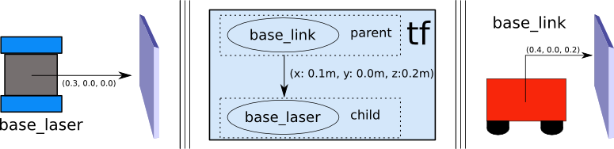

.. _setup_transforms:

Setting Up Transformations
##########################

In this guide, we will be looking at the necessary transforms required by Navigation2 (Nav2). These transforms allow Nav2 to correctly interpret information coming in from various sources, such as sensors and odometry, by transforming them to the correct coordinate frames.

For this tutorial, we will first provide a brief introduction to transforms in ROS. Second, we will outline the necessary transforms that need to be published for Nav2 to function. Lastly, we will be working on a simple command-line demo of a tf2 static publisher to see it in action.

Transforms Introduction
***********************

.. note::
  This section of this guide has been adapted from the `Setting Up You Robot using tf <http://wiki.ros.org/navigation/Tutorials/RobotSetup/TF>`__ tutorial in the Navigation 1 documentation.

Many ROS packages require the transform tree of a robot to be published using the Transform2 ROS package (tf2). A transform tree defines offsets in terms of both translation and rotation between different coordinate frames. To make this more concrete, let us apply an example of a simple robot that has a mobile base with a single laser sensor mounted on top of it. 

This robot has two defined coordinate frames: one corresponding to the center point of the mobile base of the robot, and one for the center point of the laser that is mounted on top of the base. We'll call the coordinate frame attached to the mobile base  ``base_link`` (for Nav2, we advise that it be placed at the rotational center of the robot if present) and we'll call the coordinate frame attached to the laser ``laser_link``. Note that will be talking more about the naming and conventions of these coordinate frames in the next section. 

At this point, let's assume that we have some data from the laser in the form of distance measurements from the laser's center point. In other words, we have some data in the ``laser_link`` coordinate frame. 

Now, suppose we want to take this data and use it to help the mobile base avoid obstacles in the world. To do this successfully, we need a way to transform the laser scan we've received from the ``laser_link`` frame to the  ``base_link`` frame. In essence, we need to define a relationship between the ``laser_link`` and  ``base_link`` coordinate frames.
  
.. image:: images/simple_robot.png

In defining this relationship, let us assume that the only data we have is that the laser is mounted 10cm forward and 20cm above the center point of the mobile base. This gives us a translational offset that relates the  ``base_link`` frame to the ``laser_link`` frame. Specifically, we know that to get data from the  ``base_link`` frame to the ``laser_link`` frame, we must apply a translation of (x: 0.1m, y: 0.0m, z: 0.2m), and transversely, to get data from the ``laser_link`` frame to the  ``base_link`` frame, we must apply the opposite translation (x: -0.1m, y: 0.0m, z: -0.20m).

We could choose to manage this relationship ourselves, meaning to store and apply the appropriate translations between the frames when necessary, but this becomes a real pain as the number of coordinate frames increases. Luckily, we don't have to do this work ourselves. Instead, we'll define the relationship between  ``base_link`` and ``laser_link`` once using tf2 and let it manage the transformation between the two coordinate frames for us.

To define and store the relationship between the  ``base_link`` and ``laser_link`` frames using tf2, we need to add them to a transform tree. Conceptually, each node in the transform tree corresponds to a coordinate frame, and each edge corresponds to the transform that needs to be applied to move from the current node to its child. Tf2 uses a tree structure to guarantee that there is only a single traversal that links any two coordinate frames together, and assumes that all edges in the tree are directed from parent to child nodes.
 

To create a transform tree for our simple example, we'll create two nodes: one for the  ``base_link`` coordinate frame and one for the ``laser_link`` coordinate frame. To create the edge between them, we first need to decide which node will be the parent and which will be the child. Remember — this distinction is important because tf2 assumes that all transforms move from parent to child. 

Let's choose the  ``base_link`` coordinate frame as the parent because when other pieces/sensors are added to the robot, it will make the most sense for them to relate to the ``laser_link`` frame by traversing through the  ``base_link`` frame. This means that the transform associated with the edge connecting  ``base_link`` and ``laser_link`` should be (x: 0.1m, y: 0.0m, z: 0.2m).

With this transform tree set up, converting the laser scan received in the ``laser_link`` frame to the  ``base_link`` frame is as simple as making a call to the tf2 library. Our robot can now use this information to reason about laser scans in the  ``base_link`` frame and safely plan around obstacles in its environment.

Transforms in Navigation2
*************************

Before we begin with this section, there two important ROS REPs which we highly suggest for you to check out. These documents detail some standards set about by the ROS community to ensure proper operation across different packages. Nav2 also adheres to these standards and conventions.

1. `REP 105 - Coordinate Frames for Mobile Platforms <https://www.ros.org/reps/rep-0105.html>`__
2. `REP 103 - Standard Units of Measure and Coordinate Conventions <https://www.ros.org/reps/rep-0103.html>`__

To quickly summarize REP 105, this document specifies the naming conventions and semantic meanings of the different coordinate frames used in ROS. Of interest to this tutorial are the ``base_link``, ``odom`` and ``map`` coordinate frames. The ``base_link`` is a coordinate frame that is attached to a fixed position on the robot, typically at its main chassis and its rotational center. The ``odom`` coordinate frame is a world fixed frame wherein a robot's pose is guaranteed to be continuous but may drift significantly over time. Lastly, the ``map`` coordinate frame is a world fixed frame that may drift but is corrected by sensor observations (such as GPS or localization), which also causes the platforms position in this frame to discretely jump at any time.

REP 103, on the other hand, discusses some standard units of measure and other related conventions to keep integration issues between different ROS packages to a minimum.

Now let's move on to some specifics for the Navigation2 package to function correctly. Nav2 requires the following transformations to be published in ROS:

1.	``map`` => ``odom``
2.	``odom`` => ``base_link``
3.	``base_link`` => ``laser_link`` (sensor base frames)

.. note::
  The ``laser_link`` coordinate frame is not included in the REP 105 standard. For this guide, we will be using this name to refer to the coordinate frame for a laser sensor on our robot platform.  If there are multiple sensor base frames (e.g. camera_link, laser_link2, lidar_link etc.), then a transformation back to ``base_link`` for each one is required.

The first transform ``map`` => ``odom`` is usually provided by a different ROS package dealing with localization and mapping such as AMCL. This transform updates live in use so we don't set static values for this in our robot's TF tree. Further detail about how to set this up may be pretty complex, so we highly suggest to have a look at the documentation of the mapping or localization package you are using for your platform. 

The ``odom`` => ``base_link`` is usually published by our odometry system using sensors such as wheel encoders.

All other statically defined transforms (e.g. ``base_link`` => ``laser_link``, ``base_link`` => ``wheels``, ``wheels`` => ``IMU``, etc) is what we will be talking about for the rest of this guide. This transformation tree is used by Nav2 to properly relate the information from the sensors to the rest of the robot. The transformation between these two coordinate frames is usually provided to Nav2 through the Robot State Publisher and the Universal Robot Descriptor File (URDF). In cases where there are more sensor coordinate frames on your platform, then a transform tree from ``base_link`` to each sensor coordinate frame needs to be published. 

.. seealso::
  For a more in-depth discussion on the usage of transforms and how these are used to estimate the current state of your robot, we highly recommend having a look at the State Estimation topic in :ref:`concepts`.

Static Transform Publisher Demo
*******************************

.. warning:: This section was tested and written with ROS2 Foxy. However, we always recommend to use the latest version of ROS2 if possible. If you are new to ROS2 or do not have a working environment yet, then please take some time to properly setup your machine using the resources in the official `ROS2 Installation Documentation <https://index.ros.org/doc/ros2/Installation/>`__

Now let's try publishing a very simple transform using the static_transform_publisher tool provided by tf2. We will be publishing a transformation from the link ``base_link`` to the link ``base_laser`` with a translation of (x: 0.1m, y: 0.0m, z: 0.2m). Note that we will be building the transform from the diagram earlier in this tutorial.

Open up your command line and execute the following command:

.. code-block:: shell

  ros2 run tf2_ros static_transform_publisher 0.1 0 0.2 0 0 0 base_link base_laser

With this, we are now sucessfully publishing our ``base_link`` to ``base_laser`` transform in tf2. Let us now check if it is working properly through ``tf2_echo``. Open up a separate command line window and execute the following:

.. code-block:: shell

  ros2 run tf2_ros tf2_echo base_link base_laser

You should be able to observe a repeated output simiar to the one below.

.. code-block:: shell

  At time 0.0
  - Translation: [0.100, 0.000, 0.200]
  - Rotation: in Quaternion [0.000, 0.000, 0.000, 1.000]

And that's it for this short demo - we were able to successfully publish a transform from ``base_link`` to ``base_laser`` using the tf2 library. Note that we do not recommend using the above demo in publishing transforms for your actual robotics projects, it is just a quick demo to see tf2 in action. There are more suitable and practical ways to go about this which will be discussed in a future tutorial.

.. seealso:: 
  If you would like to learn more about tf2 and how to create your own transform publishers, head onto the official `tf2 Documentation <https://wiki.ros.org/tf2/Tutorials>`__

Conclusion
**********

In this tutorial, we have discussed about the concept of transforms and how they are used in Nav2. We also discussed the three published transform requirements of Nav2 and the neccessary REPs to keep in mind when setting them up. 

In the last section, we have also explored using the static_transform_publisher of tf2 to publish our transforms. You may use this to set up your transforms for Nav2, but this is generally not the best way to do it. In most robotics projects, we make use of the Robot State Publisher since it is much easier to use and scales well as our robot gets more complex. We will be talking about the Robot State Publisher, URDF, and how to set it up in a future tutorial.
