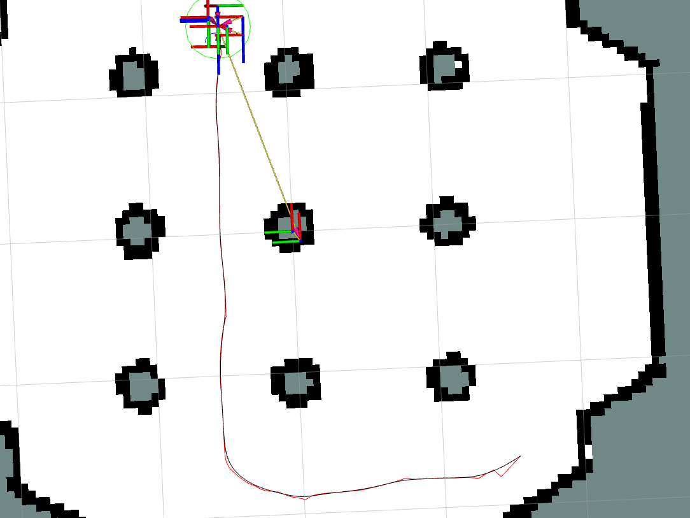

.. _adding-smoother:

Adding a Smoother to a BT
*************************

- `Overview`_
- `Requirements`_
- `Tutorial Steps`_

Overview
========

This tutorial shows how to add a smoother to your behavior tree to smooth output paths from a path planner.
Before completing this tutorials, completing :ref:`getting_started` is highly recommended especially if you are new to ROS and Nav2.

Requirements
============

You must install Nav2, Turtlebot3.
If you don't have them installed, please follow :ref:`getting_started`.
You must also have a working behavior tree, such as those provided by the Nav2 BT Navigator package, for editing.
You should also have a copy of the ``nav2_params.yaml`` file for your system to edit as well.

Tutorial Steps
==============

0- Familiarization with the Smoother BT Node
--------------------------------------------

The :ref:`bt_smooth_action` BT node is a behavior tree node that interacts with the smoother task server similar to that which you may expect to find for the planner or controller servers. It contains the action client to call the server and specifies its arguments and return types as BT ports. It too calls the server via an action interface that may be seperately interacted with via other servers and client library languages.

Please see the BT node's configuration page to familiarize yourself with all aspects, but the core ports to note are the ``unsmoothed_path`` input port and the ``smoothed_path`` output port. The first takes in a raw path from a planning algorithm and the latter will set the value of the smoothed output path post-smoothing. Other ports are available that fully implements the Smoother Server's action API.

1- Specifying a Smoother Plugin
-------------------------------

In order to use a smoother in your BT node, you must first configure the smoother server itself to contain the smoother plugins of interest. These plugins implement the specific algorithms that you would like to use. 

For each smoother plugin you would like to use, a name must be given to it (e.g. ``simple_smoother``, ``curvature_smoother``). This name is its ``smoother_id`` for other servers to interact with this algorithm from a request to the Smoother Server's action interface.

Under each name, the parameters for that particular algorithm must be specified along with the ``plugin`` name for pluginlib to load a given algorithm's library. An example configuration of 2 smoother plugins is shown below that could be used in the ``nav2_params.yaml`` for your robot.

.. code-block:: yaml

    smoother_server:
      ros__parameters:
        costmap_topic: global_costmap/costmap_raw
        footprint_topic: global_costmap/published_footprint
        robot_base_frame: base_link
        transform_timeout: 0.1
        smoother_plugins: ["simple_smoother", "curvature_smoother"]
        simple_smoother:
          plugin: "nav2_smoother::SimpleSmoother"
          tolerance: 1.0e-10
          do_refinement: True
        curvature_smoother:
          plugin: "nav2_ceres_costaware_smoother/CeresCostawareSmoother"

2- Modifying your BT XML
------------------------

Now that you have selected and configured the smoother server for your given plugin(s), it is time to use those smoother(s) in your behavior tree for navigation behavior. While there are many places / ways to use this in a BT, what is shown below is probably the most likely situation you would want to use the smoother in (to smooth a path returned by the path planner and then using that smoothed path for path tracking).

Note: If you use only a single type of smoothing algorithm, there is no need to specify the ``smoother_id`` in the BT XML entry. Since there is only a single option, that will be used for any request that does not specifically request a smoother plugin. However, if you leverage multiple smoother plugins, you **must** populate the ``smoother_id`` XML port.

A given behavior tree will have a line: 

.. code-block:: xml

  <ComputePathToPose goal="{goal}" path="{path}" planner_id="GridBased" error_code_id="{compute_path_error_code}"/>

This line calls the planner server and return a path to the ``path`` blackboard variable in the behavior tree. We are  going to replace that line with the following to compute the path, smooth the path, and finally replace the ``path`` blackboard variable with the new smoothed path that the system will now interact with:

.. code-block:: xml

    <Sequence name="ComputeAndSmoothPath">
      <ComputePathToPose goal="{goal}" path="{path}" planner_id="GridBased" error_code_id="{compute_path_error_code}"/>
      <SmoothPath unsmoothed_path="{path}" smoothed_path="{path}" error_code_id="{smoother_error_code}"/>
    </Sequence>

If you wish to have recoveries for the smoother error codes, such as triggering the system recoveries branch of a behavior tree:

.. code-block:: xml 

    <Sequence name= "TryToResolveSmootherErrorCodes">
      <WouldASmootherRecoveryHelp error_code="{smoother_error_code}">
      <!-- recovery to resolve smoother error code goes here -->
    <Sequence/>

And its as simple as that! You can now compile or use this behavior tree in your system and see that the plans are now smoothed and the controllers are now tracking this smoothed path. The image at the top of the tutorial shows the unsmoothed path from NavFn (red) and the smoothed path (black). Note the smoother approach to goal, turns, and transitions in the straight-line segments.

If you wish to see the difference, but not track the smoothed path, you may wish to remove the ``smoothed_path="{path}"`` portion to compute the smoothed path, but not replace the original path with it. Instead, the topic ``/smoothed_path`` contains this information published by the smoother server for visualization or use by other parts of the system. You may also remap the smoothed path to another blackboard variable to interact with it in other parts of the behavior tree (e.g. ``smoothed_path="{smoothed_path}"``).
