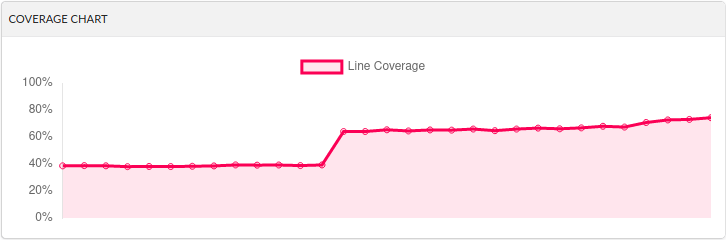
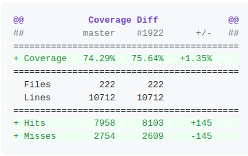

.. _ci_testing:

CI Testing in Nav2
******************
**Overview:**

- `Benefits of Automated Testing`_
- `Hands on Testing`_
- `Rewriting Parameter Values from YAML Files in Launch scripts`_

Benefits of Automated Testing
=============================

Whenever a feature gets added or altered, it is best practice to confirm the intended outcome with automated test scripts.
This document features an easy step by step guide how CI should be integrated alongside new PRs.

Also, not only new code should have CI testing. To find nasty bugs and corner cases, it is Nav2's ultimate goal to have a test coverage of nearly 100% !
This will lead to a more improved, stable, and industry-grade code basis, as new PRs will see if they break things in other sub-systems, that they normally would not think of impacting.

The current code-coverage can be tracked on `codecov.io/gh/ros-planning/navigation2 <https://codecov.io/gh/ros-planning/navigation2>`_ .

Hands on Testing
================
0. Get Nav2 Working
-------------------
Before you can test anything, make sure you have the basic examples of the :ref:`getting_started` guides up and running.

For integrating and running your own tests, you have to build nav2 from source. Using nav2 main with ros2 installed as binaries technically works, 
but automated CI testing happening on github when you merge you create a PR for the nav2 stack also uses ros2 rolling (= latest/main).
Therefor, it is recommend to test your new code with the nav2 stack based on the main branch and also let the script install ros2 from source.

1. Run Existing Tests
---------------------
Nav2 specific tests can be found in each individual component under a dedicated test folder. 
One additional package, ``nav2_system_tests``, `exists <https://github.com/ros-planning/navigation2/tree/main/nav2_system_tests>`_ for testing components, sub-systems and full system tests.
This package also comes with a ``README.md`` pointing out, that unit tests for sub-functions of components should be provided within each individual component.

To run existing tests of components or the whole system from within the ``nav2_system_tests`` package, you can use this procedure:

  - build nav2 with ``$ colcon build --symlink-install``
  - navigate to the component you would like to test ``$ cd build/<package_name>``
  - run all the tests of this package ``$ ctest -V``

To run all tests of all nav2 components, you can also use ``colcon`` for convenience: 

.. code-block:: bash

  $ colcon test

Refering to the *chapter 4.7* of the `colcon documentation <https://buildmedia.readthedocs.org/media/pdf/colcon/latest/colcon.pdf>`_, one can also run individual tests through ``colcon``, as it uses ``ctest`` and ``pytest`` under the hood. 
  
Now you should see a couple of tests run in your command line. After they have finished ``ctest`` gives an report about the tests.
This looks something like this:

.. code-block:: bash

  [.. Output of 30 individual tests ..]
  100% tests passed, 0 tests failed out of 30

  Label Time Summary:
  copyright     =  10.18 sec*proc (1 test)
  cppcheck      =   1.46 sec*proc (1 test)
  cpplint       =   2.72 sec*proc (1 test)
  gtest         =  49.72 sec*proc (24 tests)
  lint_cmake    =   1.18 sec*proc (1 test)
  linter        =  19.24 sec*proc (6 tests)
  uncrustify    =   1.65 sec*proc (1 test)
  xmllint       =   2.04 sec*proc (1 test)

  Total Test time (real) =  69.00 sec

2. Run Individual Tests
-----------------------
Tests are declared in individual ``CMakeList.txt`` files in the test sub-folders of components or in ``nav2_system_tests``.
While developing individual tests, it might make sense to only run one out of multiple tests.
This can be done with either:

- ``$ ctest -V -R <regex>`` in the respective folder **or**
- ``$ colcon test --packages-select <name-of-pkg> --ctest-args -V -R <regex>``

Where ``regex`` represents the name or search-expression for the test(s) you want to run manually. 
You can also find the name of a certain test by running all tests of the desired package. 

.. note::
  When testing with ``pytest`` - typically for ros2 launch files -  and building your package with ``$ colcon build --symlink-install``, you can even change your test scripts without rebuilding the whole package! 

3. Writing Your Own Test
------------------------
**Before writing a new test**, you have to think about what you want to test:

- Is my feature relevant in combination with other (sub-)components of the nav2 stack? --> Integrate it into ``nav2_system_tests``
- Is my feature only component specific? --> Write dedicated unit tests inside of the component

**What makes a good test?**

- Code Coverage: Are all my new code lines run at least once with my test? (check with codecov.io automated with each PR on github)
- Corner Cases: Monkey proof input, test the limits (overflow etc)
- Expect things to break: this is good! -> make sure to catch all errors and handle them accordingly
- Combine your components with other test: If feasible create corner scenarios where your code really should improve things
- Quantity over complexity: Better write multiple tests than make them to complicate so others cannot understand why it fails in the future

**What tools do I have?**

- look and learn from existing code in the nav2 stack, we have plenty of tests!
- play with different launch parameters: Have a look at overwriting them in the next section

4. Register Your Own Test
-------------------------

Make sure to include your new Tests in the specific ``CMakeList.txt`` file and recompile your working-space with ``colcon build --symlink-install``.
Depending on writing tests in C++ or python there are different ways to register tests.

This first example is for registering tests surrounding behavior tree actions.
`Source c++ test <https://github.com/ros-planning/navigation2/blob/main/nav2_behavior_tree/test/plugins/action/CMakeLists.txt>`_ 

.. code-block:: text

  ament_add_gtest(test_action_spin_action test_spin_action.cpp)
  target_link_libraries(test_action_spin_action nav2_spin_action_bt_node)
  ament_target_dependencies(test_action_spin_action ${dependencies})

  ament_add_gtest(test_action_back_up_action test_back_up_action.cpp)
  target_link_libraries(test_action_back_up_action nav2_back_up_action_bt_node)
  ament_target_dependencies(test_action_back_up_action ${dependencies})

Here is an example for testing with python and pytest, especially useful for testing launch sequences.
Interesting to note are the free set-able environment variables that can later be used to rewrite parameter values for launch scripts.
`Source python test <https://github.com/ros-planning/navigation2/blob/main/nav2_system_tests/src/system/CMakeLists.txt>`_

.. code-block:: text

  ament_add_test(test_bt_navigator_with_groot_monitoring
    GENERATE_RESULT_FOR_RETURN_CODE_ZERO
    COMMAND "${CMAKE_CURRENT_SOURCE_DIR}/test_system_launch.py"
    WORKING_DIRECTORY "${CMAKE_CURRENT_BINARY_DIR}"
    TIMEOUT 180
    ENV
      TEST_DIR=${CMAKE_CURRENT_SOURCE_DIR}
      TEST_MAP=${PROJECT_SOURCE_DIR}/maps/map_circular.yaml
      TEST_WORLD=${PROJECT_SOURCE_DIR}/worlds/turtlebot3_ros2_demo.world
      GAZEBO_MODEL_PATH=${PROJECT_SOURCE_DIR}/models
      BT_NAVIGATOR_XML=navigate_w_replanning_and_recovery.xml
      ASTAR=False
      GROOT_MONITORING=True
  )

5. Check Your Test with CI and Check Code Coverage
--------------------------------------------------

    

Is there room to improve the test coverage near your code? Ain't you just the right expert about this code section?
Think about adding tests that exceed your own focus and help improve nav2/ros2 reach a higher overall code coverage and ultimately also quality.

The report above is an automated post by codecov.io-bot on github that posts results of CI automatically for every new PR.
Please consider helping increase the code coverage and use the opportunity to learn more about the internals of the navigation2 stack! 

Rewriting Parameter Values from YAML Files in Launch scripts
============================================================
In most occasions some small new features are added and made available through a few new parameters. As the standard nav2 user should not be overloaded with features it makes sense to disable most of the additional or drop-in features in the default ``params.yaml`` file.
But tests should still be comparable and only alter the test-scope specific parameters. 
Therefor, it makes no sense to copy most of the ``params.yaml`` file into multiple test.yaml files that would be prone to fail future changes.

ROS2 with its launch systems already includes many substitution mechanisms, that seem to handle a few dozen different scenarios, but are a little bit hard to use from a user standpoint with lacking example material.
Luckily, nav2 already includes a nice helper function for replacing values in YAML files.
Here is an example showing a small feature set of the capability of the launch system:

.. code-block:: python

  #Replace the default parameter values for testing special features without having multiple params_files inside the nav2 stack
  context = LaunchContext()
  param_substitutions = {}

  if (os.getenv('ASTAR') == "True"):
      param_substitutions.update({'use_astar': "True"})
      print ("ASTAR set True")

  if (os.getenv('GROOT_MONITORING') == "True"):
      param_substitutions.update({'enable_groot_monitoring': "False"})
      print ("GROOT_MONITORING set True")

  # Fails -> multi dimensional keys ['planner_server']['ros__parameters']['GridBased']['use_astar'] cannot be combined in such manner
  #param_substitutions = {'planner_server.ros__parameters.GridBased.use_astar': "True"}

  # Fails -> value for 'bt_navigator' gets overwritten with 'ros__parameters' as value and not as next stage dict
  #param_substitutions = {'bt_navigator':{'ros__parameters':{'enable_groot_monitoring' : 'True'}}} 

  # Obviously not the needed behavior but shows that 'HELLOO...' only gets written when perform gets triggered
  #param_substitutions = {'bt_navigator':'HELLOOOOOOOOOOOOOOOOOOOOOOOOOOOOOOOOOOOOOO'} 

  # Finally works with LaunchContext and perform sub-function
  #param_substitutions = {'enable_groot_monitoring' : 'True'} 

  # This would also work, but then the whole params_file gets recursively searched and replaces "False" with "False" -> time wasted
  #param_substitutions = { 
  #    'use_astar': os.getenv('ASTAR', default = "False"),
  #    'enable_groot_monitoring': os.getenv('GROOT_MONITORING', default = "False")
  #    }

  configured_params = RewrittenYaml(
      source_file=params_file,
      root_key='',
      param_rewrites=param_substitutions,
      convert_types=True)

    
  new_yaml = configured_params.perform(context)

  # Check if value has the desired value now before loading the yaml as launch_argument
  #data = yaml.safe_load(open(new_yaml, 'r'))
  #print (data['planner_server']['ros__parameters']['GridBased']['use_astar'])

This can also be investigated in a real scenario in the nav2-CI test. Just have a look at the ``nav2_system_tests`` test for the whole system `here <https://github.com/ros-planning/navigation2/tree/main/nav2_system_tests/src/system>`_.