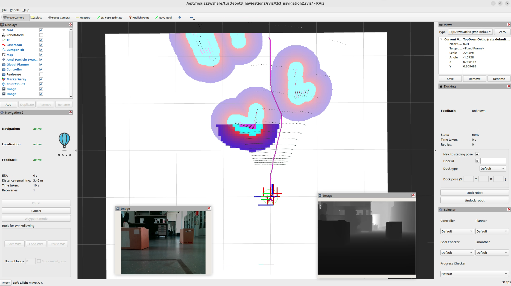
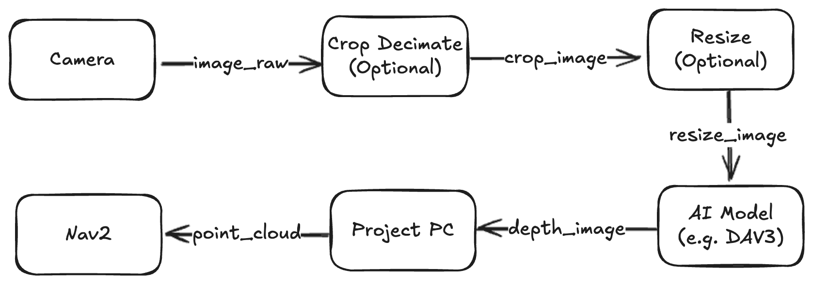

.. _depth_ai_integration:

AI Depth Estimation with Nav2 Costmap
*************************************

- `Overview`_
- `Requirements`_
- `Tutorial Steps`_

.. raw:: html

    <h1 align="center">
        

            <iframe width="708" height="400" src="https://www.youtube.com/embed/QDN1uA71su4?autoplay=1&mute=1" frameborder="1" allowfullscreen></iframe>
        

    </h1>

Overview
========

Traditional 3D navigation typically requires expensive hardware like LiDAR or Stereo/RGB-D depth cameras. This pipeline allows a standard monocular camera (in this example, a USB camera) to behave like a depth sensor by leveraging an AI model, which estimates depth from 2D images. The resulting depth image is then converted into PointCloud2 message that Nav2 can use as Voxel costmap layer for obstacle avoidance and path planning, enabling cost-effective navigation on the robots.

What is Depth Anything 3 AI model?
----------------------------------

Depth Anything 3 (DA3) is an AI model that predicts spatially consistent geometry from an arbitrary number of visual inputs, with or without known camera poses. `For more details <https://arxiv.org/abs/2511.10647>`_. In this tutorial, we are using ROS 2 implementation of Depth Anything 3 :ref:`[2] <repo_link>`, which provides the ROS 2 composable node to run the inference of the DA3 model. The attached image shows Rviz2 with two image views, one is showig the Color Image topic and other is showing Depth Image topic, published by DA3 ROS2 Node.

Pipeline to process image
-------------------------

The data flows sequentially through five distinct steps:

1. USB Cam Node: Captures the raw RGB video stream from your physical camera. This may be easily replaced with a camera from any source, not only a USB camera.
2. Crop Decimate Node: Crops or skips pixels to remove unneeded peripheral data and save processing power.
3. Resize Node: Scales the image down to match the exact input dimensions required by the AI model.
4. Depth Anything V3 Node: Processes the 2D image and calculates an estimated depth map.
5. Point Cloud Projection: Converts the 2D depth map into a 3D Point Cloud (sensor_msgs/msg/PointCloud2), which Nav2 can natively understand.

.. note::
  In this tutorial, we are using Depth Anything V3 TensorRT ROS 2 package to run the inference of the DA3 model. This model already provides the depth estimation and point cloud projection functionalities, so we have commented out the pointcloud node. If your are using different model, then you just need to configure the required parameters for the nodes in the `nav2_depth_estimation_ai` package and launch the pipeline.

Requirements
============

Before starting, make sure you have the following hardware and software baselines established:

1. Hardware

  Robot: A physical TurtleBot 3 (Burger, Waffle, or Custom setup) running ROS 2 and Nav2.

  Camera: Any standard, Linux-compatible Monocular USB RGB camera.

  Compute Host: An edge computer mounted on the robot (e.g., NVIDIA Jetson or an x86 laptop) preferably equipped with a CUDA-compatible GPU to run the AI model at a functional frame rate.

2. Software

  Successfully completed the official tutorial for `Navigating with a Physical TurtleBot 3 <https://docs.nav2.org/tutorials/docs/navigation2_on_real_turtlebot3.html>`_.

  Calibrate your camera before following the tutorial steps using the official `camera calibration tutorial <https://docs.nav2.org/tutorials/docs/camera_calibration.html>`_.

Tutorial Steps
==============

We need to install the core image processing stacks alongside the specialized TensorRT-accelerated Depth Anything V3 ROS 2 package.

1. Install Core Dependencies
----------------------------

Run the following commands on your robot's main computer to install the foundational ROS 2 perception packages:

.. code-block:: shell

  sudo apt update
  sudo apt install ros-$ROS_DISTRO-image-proc ros-$ROS_DISTRO-depth-image-proc ros-$ROS_DISTRO-usb-cam

2. Build Depth Anything V3 package
----------------------------------

Navigate to your workspace, clone the TensorRT Depth Anything stack, and build it:

.. code-block:: shell

  cd ~/ros2_ws/src
  git clone https://github.com/ika-rwth-aachen/ros2-depth-anything-v3-trt.git
  git clone https://github.com/ros-navigation/navigation2.ai.git

  # Resolve any missing package-level dependencies
  cd ~/ros2_ws
  rosdep install --from-paths src --ignore-src -r -y

  # Build the packages with optimization flags enabled
  colcon build --cmake-args -DCMAKE_BUILD_TYPE=Release
  source install/setup.bash

1. Model Weights Preparation
----------------------------

You need the compiled ONNX model weights for the pipeline to compute depth maps. You can choose any option from below:

A. Download the ONNX file from `Huggingface <https://huggingface.co/TillBeemelmanns/Depth-Anything-V3-ONNX>`_
B. Generate ONNX following the instruction `here <https://github.com/ika-rwth-aachen/ros2-depth-anything-v3-trt/blob/main/onnx/README.md>`_

You can place this file anywhere as you fit, e.g. `depth_anything_v3/models/`, but remember to modify this path in the ``nav2_depth_ai_params.yaml`` file as shown :ref:`below <param_yaml>`.

4. Configure Params
-------------------

Now, you need to configure the parameters for the nodes used to process the pipeline in the ``nav2_depth_ai_params.yaml`` file of ``nav2_depth_estimation_ai`` pkg.

Params for USB Cam Node
~~~~~~~~~~~~~~~~~~~~~~~

.. note::
  Replace with your sensor driver as you see fit (i.e. realsense)

.. code-block:: yaml

  usb_cam:
    ros__parameters:
      video_device: /dev/video0
      image_width: 640
      image_height: 480
      pixel_format: mjpeg2rgb
      frame_rate: 30.0

Params for Crop Decimate Node
~~~~~~~~~~~~~~~~~~~~~~~~~~~~~

.. note::
  This node is used to crop the image, update the params as you fit.

.. code-block:: yaml

   crop_decimate:
    ros__parameters:
      x_offset: 0
      y_offset: 0
      width: 640
      height: 480
      decimation_x: 1
      decimation_y: 1

Params to resize the image
~~~~~~~~~~~~~~~~~~~~~~~~~~
Here we are using Depth Anything V3 model, and it is exported to ONNX with these params for the input image:

.. code-block:: yaml

  resize:
    ros__parameters:
      width: 504
      height: 280

Params for Depth Anything V3
~~~~~~~~~~~~~~~~~~~~~~~~~~~~

.. note::
  These params need to be configured for the Depth Anything V3 AI Model

.. _param_yaml:

.. code-block:: yaml

  depth_anything_v3:
    ros__parameters:
      # Model configuration
      onnx_path: "$(find-pkg-share depth_anything_v3)/models/DA3METRIC-LARGE.onnx"
      precision: "fp16"  # fp16 or fp32

      # Debug configuration
      enable_debug: false
      debug_colormap: "JET"  # JET, HOT, COOL, SPRING, SUMMER, AUTUMN, WINTER, BONE, GRAY, HSV, PARULA, PLASMA, INFERNO, VIRIDIS, MAGMA, CIVIDIS
      debug_filepath: "/tmp/depth_anything_v3_debug/"
      write_colormap: false
      debug_colormap_min_depth: 0.0    # Minimum depth value for colormap visualization
      debug_colormap_max_depth: 50.0   # Maximum depth value for colormap visualization
      sky_threshold: 0.3               # Threshold for sky classification (lower = more sky)
      sky_depth_cap: 200.0             # Maximum depth value to fill sky regions

      # Point cloud downsampling (1 = no downsampling, 10 = every 10th point)
      point_cloud_downsample_factor: 2

      # Point cloud colorization with RGB from input image
      colorize_point_cloud: true  # Set to true to publish RGB point cloud instead of XYZ only

Point Cloud Node to project the points from depth image
~~~~~~~~~~~~~~~~~~~~~~~~~~~~~~~~~~~~~~~~~~~~~~~~~~~~~~~

.. note::
  Uncomment if you want to output the point cloud. As in this example, we are using point cloud from depth_anything_v3 node.

.. code-block:: yaml

  pointcloud:
    ros__parameters:
      image_transport: "raw"  # "raw" or "compressed"
      depth_image_transport: "raw"  # "raw" or "compressed"
      queue_size: 10
      invalid_depth: 0.0  # Depth value to use for invalid points (e.g., sky)
      colorize: true  # Set to true to publish RGB point cloud instead of XYZ only
      exact_sync: true  # Set to true to use exact sync, false for approximate synchronization

Voxel Costmap Nav2
~~~~~~~~~~~~~~~~~~
To integrate this pointcloud with Nav2 Voxel Costmap Layer, configure the params in your Nav2 Params file.

.. code-block:: yaml

  local_costmap:
    local_costmap:
      ros__parameters:
        update_frequency: 5.0
        publish_frequency: 2.0
        global_frame: odom
        robot_base_frame: base_link
        rolling_window: true
        width: 3
        height: 3
        resolution: 0.05
        robot_radius: 0.15
        plugins: ["voxel_layer", "inflation_layer"]

        voxel_layer:
          plugin: "nav2_costmap_2d::VoxelLayer"
          enabled: true
          publish_voxel_map: true
          origin_z: 0.0
          z_resolution: 0.05
          z_voxels: 16
          max_obstacle_height: 2.0
          mark_threshold: 0
          observation_sources: pointcloud

          pointcloud:
            topic: /pipeline/points
            data_type: "PointCloud2"
            max_obstacle_height: 2.0
            min_obstacle_height: 0.2  # Ignores reflections/noise on the floor
            obstacle_max_range: 8.0    # Maximum reliable distance for AI depth
            obstacle_min_range: 0.0
            raytrace_max_range: 6.0
            raytrace_min_range: 0.0
            clearing: True
            marking: True

        inflation_layer:
          plugin: "nav2_costmap_2d::InflationLayer"
          inflation_radius: 0.5
          cost_scaling_factor: 5.0

5. Launch the Pipeline
----------------------

Finally, launch the entire pipeline using the provided launch file:

.. code-block:: shell

  ros2 launch nav2_depth_estimation_ai depth_estimation_pipeline_launch.py

.. note::
  This will start the camera node (if not using already), process the image topic using pipeline through the DA3 model, and publish the resulting PointCloud2 topic. This topic is subscribed by Nav2 to add voxel costmap layer for path planning and obstacle avoidance.

If everything is configured and running correctly, your results in RViz2 should match the demonstration in the video below.

.. raw:: html

    <h1 align="center">
        

            <iframe width="708" height="400" src="https://www.youtube.com/embed/QDN1uA71su4?autoplay=1&mute=1" frameborder="1" allowfullscreen></iframe>
        

    </h1>

Acknowledgements
================

This tutorial was developed in collaboration with the ROS 2 community. Special thanks to the contributors who provided insights and feedback during the development process.

.. _repo_link:

1. `Depth Anything 3: Recovering the Visual Space from Any Views (arXiv:2511.10647) <https://arxiv.org/abs/2511.10647>`_
2. `ika-rwth-aachen Depth Anything V3 TensorRT repository <https://github.com/ika-rwth-aachen/ros2-depth-anything-v3-trt>`_
