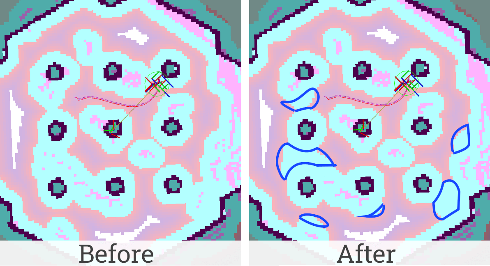
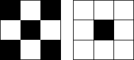
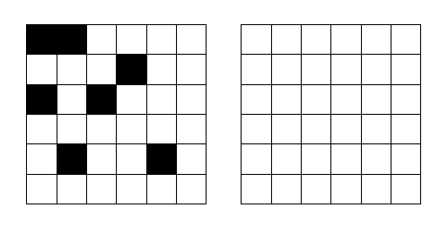
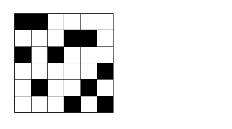

.. _filtering_of_noise-induced_obstacles:

Filtering of Noise-Induced Obstacles
************************************

- `Overview`_
- `Requirements`_
- `Tutorial Steps`_
- `How it works`_

Overview
========

Noisy sensor measurements can cause to errors in ``Voxel Layer`` or ``Obstacle Layer``. As a result, salt and pepper noise may appear on the costmap. This noise creates false obstacles that prevent the robot from finding the best path on the map. While the images above show both salt and pepper noise as well as error due to mislocalization, this layer will only remove sensor noise, not mislocalized artifacts misaligned with the static map.
This tutorial shows how to configure filtering of false obstacles caused by noise. This functionality is provided by the ``DenoiseLayer`` costmap layer plugin which will be enabled and used in this document.

Requirements
============

It is assumed that ROS 2, Gazebo and TurtleBot3 packages are installed or built locally. Please make sure that Nav2 project is also built locally as it was made in :ref:`build-instructions`.

Tutorial Steps
==============

1. Enable Denoise Layer
-----------------------

Denoise Layer is Costmap2D plugin. You can enable the ``DenoiseLayer`` plugin in Costmap2D by adding ``denoise_layer`` to the ``plugins`` parameter in ``nav2_params.yaml``. You can place it in the ``global_costmap`` and (or) ``local_costmap`` to filter noise on a global or local map. The DenoiseLayer plugin should have the following parameter defined:

- ``plugin``: type of plugin. In our case ``nav2_costmap_2d::DenoiseLayer``.

Full list of parameters supported by ``DenoiseLayer`` are listed at :ref:`denoise` page.

It is important to note that ``DenoiseLayer`` typically should be placed before the inflation layer.
This is required to prevent inflation from noise-induced obstacles.
Moreover, ``DenoiseLayer`` processes only obstacle information in the costmap.
Values ``INSCRIBED_INFLATED_OBSTACLE``, ``LETHAL_OBSTACLE`` and optionally ``NO_INFORMATION``
will be interpreted as obstacle cell. Cells with any other values will be interpreted as ``FREE_SPACE`` when processed (won't be distorted in the cost map).
If a cell with an obstacle is recognized as noise, it will be replaced by ``FREE_SPACE`` after processing.

To enable ``DenoiseLayer`` for both global and local costmaps, use the following configuration:

.. code-block:: text

  global_costmap:
    global_costmap:
      ros__parameters:
        ...
        plugins: ["static_layer", "obstacle_layer", "denoise_layer", "inflation_layer"]
        ...
        denoise_layer:
          plugin: "nav2_costmap_2d::DenoiseLayer"
          enabled: True
  ...
  local_costmap:
    local_costmap:
      ros__parameters:
        ...
        plugins: ["voxel_layer", "denoise_layer", inflation_layer"]
        ...
        keepout_filter:
          plugin: "nav2_costmap_2d::DenoiseLayer"
          enabled: True

.. note::

  The key to success in filtering noise is to understand its type and choose the right ``DenoiseLayer`` parameters.
  The default parameters are focused on fast removal of standalone obstacles.
  More formally, an obstacle is discarded if there are no obstacles among the adjacent eight cells.
  This should be sufficient in typical cases.

  If some sensor generates intercorrelated noise-induced obstacles and small obstacles in the world are unlikely, small groups of obstacles can be removed.
  To configure the ``DenoiseLayer`` to such cases and understand how it works, refer to the section `How it works`_.
.. warning::

  Use this plugin to filter the global costmap with caution. It introduces potential performance issues.
  For example in case of typically-high-range lidars (20+ meters) update window can be massive making processing time unacceptably long.
  It is worth taking this into account as an application designer.

2. Run Nav2 stack
-----------------

After Denoise Layer was enabled for global/local costmaps, run Nav2 stack as written in :ref:`getting_started`:

.. code-block:: bash

  ros2 launch nav2_bringup tb3_simulation_launch.py headless:=False

And check that filter is working properly: with the default parameters,
no standalone obstacles should remain on the cost map. This can be checked, for example, in RViz main window displaying local and global costmaps after removing unnecessary particles (illustrated at the top of this tutorial).

How it works
============

The plugin is based on two algorithms.

When parameter ``minimal_group_size`` = 2, the first algorithm turns on.
It apply `erosion <https://docs.opencv.org/3.4/db/df6/tutorial_erosion_dilatation.html>`_ function with kernel from image below (left if ``group_connectivity_type`` = 4 or right if ``group_connectivity_type`` = 8) to the costmap.
White color of the kernel pixel means to use the value, black means to ignore it.

As a result of erosion function the neighbors image is created. Each possible position of the kernel on the costmap corresponds to one pixel of the neighbors image. The pixel value of this image is equal to the maximum of 4/8 costmap pixels corresponding to the white pixels of the mask.
In other words, the pixel of the neighbors image is equal to the obstacle code if there is an obstacle nearby, the free space code in other case.
After that, obstacles corresponding to free space code on neighbors image are removed.

This process is illustrated below. On the left side of the image is a costmap, on the right is a neighbors image. White pixels are free space, black pixels are obstacles, ``group_connectivity_type`` = 4.
Obstacles marked at the end of the animation will be removed.

When parameter ``minimal_group_size`` > 2, the second algorithm is executed.
This is a generalized solution that allows you to remove groups of adjacent obstacles if their total number is less than ``minimal_group_size``.
To select groups of adjacent obstacles, the algorithm performs their segmentation.
The type of cell connectivity in one segment is determined by the parameter ``group_connectivity_type``.
Next, the size of each segment is calculated.
Obstacles segments with size less than the ``minimal_group_size`` are replaced with empty cells.
This algorithm is about 10 times slower than first, so use it with caution and only when necessary.
Its execution time depends on the size of the processed map fragment (and not depend on the value of ``minimal_group_size``).

This algorithm is illustrated in the animation below (``group_connectivity_type`` = 8).
Obstacles marked at the end of the animation will be removed (groups that size less 3).

