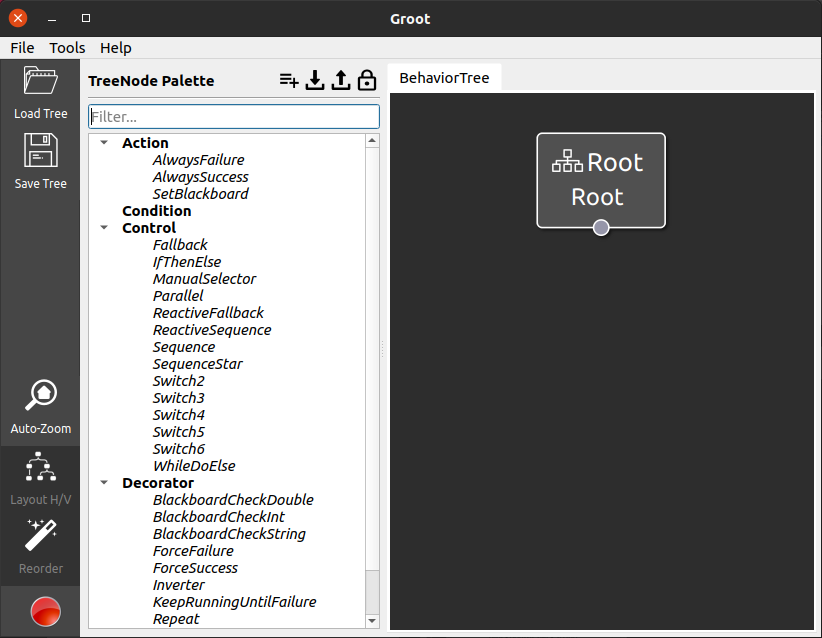

.. _groot_introduction:

Groot - The fancy BehaviorTree Editor
*************************************
- `Overview`_ 
- `Edit Custom Behavior Trees`_
- `Live Monitoring Behavior Trees`_

Overview
========

 .. raw:: html

    <h1 align="center">
      

        

          <iframe width="560" height="315" src="https://www.youtube-nocookie.com/embed/Z6xCat0zaWU?autoplay=1&mute=1" frameborder="0" allowfullscreen></iframe>
        

      

    </h1>

`Groot <https://github.com/BehaviorTree/Groot>`_ is the companion application of 
`BehaviorTree.CPP <https://github.com/BehaviorTree/BehaviorTree.CPP>`_ to create, edit, and monitor behavior trees.
With Groot one can visualize, edit and create new behavior trees. Also, complete new custom nodes except control flow nodes can be created using Groot.
`Recently added <https://github.com/ros-planning/navigation2/pull/1958>`_ to the ROS2 and nav2 implementation of BT.cpp V3 is live monitoring of the current status of the behavior tree.

Edit Custom Behavior Trees
==========================

.. .. image:: images/Groot/codecov.io_show_covered_code.png
  :width: 80%

A few steps are necessary to view and edit existing behavior trees:

1. Open Groot in editor mode
2. Select the `Load palette from file` option  (import button) near the top left corner.

.. image:: images/Groot/groot_with_nav2_custom_nodes.png
  :width: 49%

3. Open the file `/path/to/navigation2/nav2_behavior_tree/nav2_tree_nodes.xml` to import all the behavior tree nodes used for navigation.
4. Select `Load tree` option near the top left corner
5. Browse the tree you want to visualize the select ok.

.. image:: images/Groot/bt_w_replanning_and_recovery.png

.. note::
  If a tree cannot be visualized because some nodes are missing in the pallet, you might need to visit :ref:`plugins` and search for the plugin that is missing.
  If you got all the optional blackboard fields from the code of the plugin, you are free to go to add the description to ``/path/to/navigation2/nav2_behavior_tree/nav2_tree_nodes.xml``.
  Now you can reload the pallet from this updated file and should be able to work with the tree.

  Monitoring mode is unaffected from this, as the whole factory with sufficient meta data gets transferred upon connection.
  This is a known issue to reduce the overhead of creating additional xml-node-description files, when the data is also available in the shared object.
  Feel free to support adding this feature to the open source project Groot. The `feature request <https://github.com/BehaviorTree/Groot/issues/10>`_ already exists for this.

Also, the Groot editor allows for creating new custom nodes via its graphical user interface. This also works with nav2 except custom control nodes.

Live Monitoring Behavior Trees
==============================

.. raw:: html

  

In order to live monitor a running behavior tree, a few easy steps are necessary.

Behavior trees of the BT.cpp V3 kind do not automatically include monitoring. 
This is and always should be an optional feature as it involves opening an additional communication layer: ``ZMQ``.

Adding the monitoring feature to nav2 therefore involves activating a special parameter listed in :ref:`configuring_bt_navigator`.
After activating ``enable_groot_monitoring``, the zmq network ports for a ``zmq-server`` and ``zmq-publisher`` can be set optionally.

Given the launch-parameters are set correctly, the navigation2 stack has to be started normally first.
Regardless of simulation or real hardware, **monitoring only works if the behavior tree is currently running!**

A step-by-step guide for simulation can look like this:

  1. complete :ref:`getting_started` and be able to run the tb3 simulation
  2. set ``enable_groot_monitoring`` to ``True`` in the ``params.yaml`` file
  3. (re-)start the tb3 simulation (optionally with ``headless:=True`` for only RVIZ as GUI)
  4. set the initial pose of the robot -> this will activate the whole navigation2 stack (check if they are active)
  5. start Groot and choose the monitor mode
  6. press connect in the upper left corner (``Server IP``, ``Publisher Port``, and ``Server Port`` can all be left to the default for the simulation)
  7. the behavior tree should now be visible in Groot
  8. send a new goal to your robot (can also include a new behaviorTree.xml, which gets loaded automatically)
  9. watch your robot drive in simulation and see how Groot automatically watches the state of your behavior tree 

Real world robots can easily be adapted to this. Just change the ``Server IP`` 
and zmq network ports accordingly to your local environment.

Reloading of the behavior tree in Groot is done on multiple occasions, 
but only when a new behavior tree is loaded by nav2 or Groot is restarted. More about `Groot reloading the BT <https://github.com/BehaviorTree/Groot/pull/96>`_ can be seen in the merged PR here.
