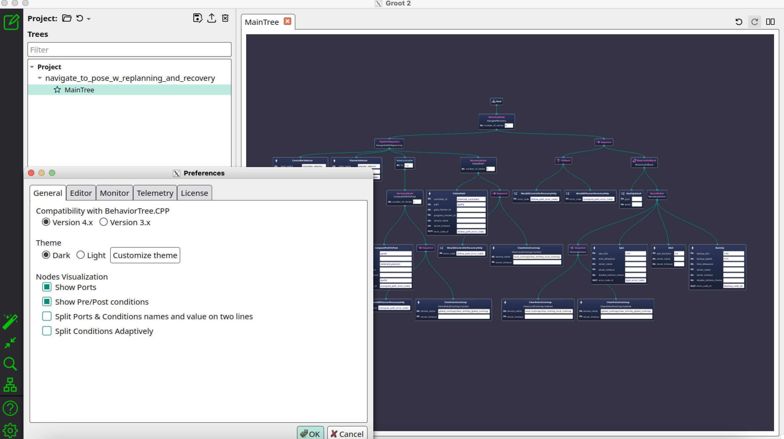
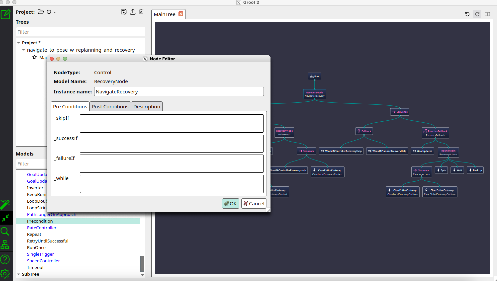

.. _groot2_introduction:

Groot2 - Interacting with Behavior Trees
****************************************

- `Visualize Behavior Trees`_
- `Edit Behavior Trees`_
- `Adding A Custom Node`_

Visualize Behavior Trees
========================

To display the default editor view, we will first start the Groot2 executable.
Out of the box, Groot2 can only display Behavior Trees and nodes that are from the defaults in BT.CPP, since it does not know anything about Nav2 or your other projects.
Therefore, we must point Groot2 to our palette, or index of Nav2 / custom behavior tree nodes:

1. Open Groot2 in editor mode. The interface should now look like the example shown in the first image below.
2. Click the red icon as shown in the second image, open the file `/path/to/navigation2/nav2_behavior_tree/nav2_tree_nodes.xml` to import all the custom behavior tree nodes used for navigation. Once loaded, you should see the full palette of Nav2's custom nodes.
3. Click the blue icon as shown in the second image, browse the tree you want to visualize, then select `Open`. The Nav2 BTs exist in `/path/to/navigation2/nav2_bt_navigator/behavior_trees/`.

If you select the default tree `navigate_w_replanning_and_recovery.xml`, the Groot2 editor should now display the full behavior tree structure, as shown in the image below.

You can also check/uncheck the Nodes visualization part in the preferences to better visualize the tree.

.. note::
  If a tree cannot be visualized because some nodes are missing in the palette, you might need to add it to your palette. While we try to keep Nav2's BT nodes and palettes in sync, if you notice one is missing, please file a ticket or pull request and we should have that updated quickly.

Edit Behavior Trees
===================

Now that you have a Nav2 BT open in Groot2 in editor mode, you should be able to trivially modify it using the GUI.
You can pull in new nodes from the side panel to add them to the workspace.
You may then connect the nodes using a "drag and drop" motion between the node's input and output ports to assemble the new nodes into the tree.

If you select a given node, you can change metadata about it such as its name or values of parameterizable ports. When you're done modifying, simply save the new configuration file and use that on your robot the next time!

Adding A Custom Node
====================

Each node in the behavior tree holds a specialized function.
Sometimes, its useful to create new nodes and add them to your palette during the design process - perhaps before the implementations themselves exist.
This helps designers abstract away the implementation specifics of the nodes from the higher level logic of the tree itself and how they'd like to interact with a given node (e.g. type, ports, etc).
Within Groot2, you may create new custom nodes to add to your tree and export these new nodes back to your palette.
Implementing the node itself needs to be done separately from Groot2, which is described in :ref:`writing_new_nbt_plugin`.

Creating a new custom node can be started by clicking the red marked icon, while Groot2 is in Editor mode.

This should load a new window, as shown in the next image. 

In this new window, it asks you to fill in the metadata about this new node, in order to create it. 
It will ask you for standard information such as port name, type of node, and any optional ports for parameterization or access to blackboard variables.
After completing, select `OK`, the new custom node should now appear in the `TreeNode Palette`.

.. image:: images/Groot2/groot_new_node.png
  :width: 35%