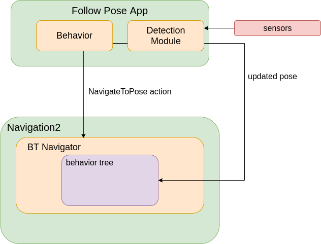

.. _navigation2-dynamic-point-following:

Dynamic Object Following
************************

Using Following server
======================

- `Following Server Overview`_
- `Following Server Tutorial Steps`_

Following Server Overview
=========================

The Following server is a specialized server in Nav2 designed to handle dynamic object following tasks. It dynamically follows an object while maintaining a defined distance specified by the ``desired_distance`` parameter. The server abstracts away the complexities of tracking and following moving objects, allowing users to focus on higher-level navigation goals.

The ``FollowObject`` action can be called using two different input methods:

- **pose_topic**: Topic to publish the pose of the object to follow. When using this method, the server subscribes to the specified topic of type ``geometry_msgs::msg::PoseStamped`` containing the pose of the object to follow.
- **tracked_frame**: Target TF frame to follow. When using this method, the server directly follows the specified frame name using the transform tree.

The Following server uses the same controller as the Docking server, leveraging the ``SmoothControlLaw`` to generate velocity commands for smoothly following the target object. This ensures consistent and predictable motion behavior across Nav2's specialized servers.

**Recovery Mechanism**: If the object becomes undetectable for a period of time (e.g., when the pose topic stops publishing), the server implements a recovery mechanism where the robot will rotate left and right in a search pattern until it relocates the target object.

Following Server Tutorial Steps
===============================

To use the Following server, you need to configure it in your behavior tree. This involves setting up the necessary action nodes and parameters to ensure smooth following behavior. The ``FollowObject`` action node provides two different approaches for object tracking.

Method 1: Using pose_topic
--------------------------

The simplest behavior tree for following a dynamic object using a pose topic is as follows:

.. code-block:: xml

  <root main_tree_to_execute="MainTree">
    <BehaviorTree ID="MainTree">
      <FollowObject name="FollowPerson" pose_topic="/person_pose" max_duration="0.0"/>
    </BehaviorTree>
  </root>

In this configuration:

- ``pose_topic``: Specifies the topic (``/person_pose``) where ``geometry_msgs::msg::PoseStamped`` messages containing the object's pose are published
- ``max_duration``: Duration to run the action (0.0 means indefinitely)

Method 2: Using tracked_frame
-----------------------------

Alternatively, you can follow a specific TF frame directly:

.. code-block:: xml

  <root main_tree_to_execute="MainTree">
    <BehaviorTree ID="MainTree">
      <FollowObject name="FollowPerson" tracked_frame="person_frame" max_duration="0.0"/>
    </BehaviorTree>
  </root>

In this configuration:

- ``tracked_frame``: Specifies the frame name (``person_frame``) to follow using the transform tree
- ``max_duration``: Duration to run the action (0.0 means indefinitely)

**Additional Parameters**

The ``FollowObject`` action supports additional parameters for fine-tuning:

- ``desired_distance``: Distance to maintain from the target object (in meters)
- ``detection_timeout``: Time to wait without detecting the object before triggering recovery behavior
- ``rotate_to_object_timeout``: Maximum time allowed for the rotation recovery mechanism to find the object
- ``static_object_timeout``: Time threshold to determine if an object has been stationary
- ``search_by_rotating``: Enable/disable the rotational search recovery mechanism when the object is lost

Recovery behavior is automatically activated when the target becomes undetectable, utilizing the search parameters above.

**Following Server in Action**

The following video demonstrates the Following Server functionality in a real-world scenario:

.. raw:: html

    <h1 align="center">
      

        <iframe width="700" height="450" src="https://www.youtube.com/embed/g-g58J1g9Ww?autoplay=1" frameborder="1" allow="accelerometer; autoplay; encrypted-media; gyroscope; picture-in-picture" allowfullscreen></iframe>
      

    </h1>

Using ComputePathToPose and FollowPath
======================================

- `ComputePathToPose Overview`_
- `ComputePathToPose Tutorial Steps`_

.. raw:: html

    <h1 align="center">
      

        <iframe width="700" height="450" src="https://www.youtube.com/embed/sRodzrrJChA?autoplay=1" frameborder="1" allow="accelerometer; autoplay; encrypted-media; gyroscope; picture-in-picture" allowfullscreen></iframe>
      

    </h1>

ComputePathToPose Overview
==========================

This tutorial shows how to use Nav2 for a different task other than going from point A to point B. In this case, we will use Nav2 to follow a moving object at a distance indefinitely.

This task is useful in cases such as following a person or another robot. Below are some sample videos of applications that could be created using this capability. The "Carry My Luggage" RoboCup @ Home test, in which the `CATIE Robotics <https://robotics.catie.fr/>`_ team performs the test successfully and this real (future) world application:

.. raw:: html

    <h1 align="center">
      

        

          <iframe width="450" height="300" src="https://www.youtube.com/embed/lTjKO4M7yZc?autoplay=1&mute=1" frameborder="1" allowfullscreen></iframe>
          <iframe width="450" height="300" src="https://www.youtube.com/embed/KgRKyzsja9Q?autoplay=1&mute=1" frameborder="1" allowfullscreen></iframe>
        

      

    </h1>

The requirements for this task are as follows:

- Changes are limited to the behavior tree used to navigate. This behavior tree can be selected in the ``NavigateToPose`` action when required, or it can be the default behavior tree. It is made up of run-time configurable plugins.
- The configuration of the planner and the controller will not be modified.
- The action will indefinitely run until it is canceled by who initiated it.

The detection of the dynamic object (like a person) to follow is outside the scope of this tutorial. As shown in the following diagram, your application should provide a detector for the object(s) of interest,
send the initial pose to the ``NavigateToPose`` action, and update it on a topic for the duration of the task. Many different types of detectors exist that you can leverage for this application:

ComputePathToPose Tutorial Steps
================================

0- Create the Behavior Tree
---------------------------

Let's start from this simple behavior tree. This behavior tree replans a new path at 1 hz and passes that path to the controller to follow:

.. code-block:: xml

  <root main_tree_to_execute="MainTree">
    <BehaviorTree ID="MainTree">
      <PipelineSequence name="NavigateWithReplanning">
        <RateController hz="1.0">
          <ComputePathToPose goal="{goal}" path="{path}" planner_id="GridBased"/>
        </RateController>
        <FollowPath path="{path}" controller_id="FollowPath"/>
      </PipelineSequence>
    </BehaviorTree>
  </root>

First, let's make this behavior run until there's a failure. For this purpose, we will use the ``KeepRunningUntilFailure`` control node.

.. code-block:: xml

  <root main_tree_to_execute="MainTree">
    <BehaviorTree ID="MainTree">
      <PipelineSequence name="NavigateWithReplanning">
        <RateController hz="1.0">
          <ComputePathToPose goal="{goal}" path="{path}" planner_id="GridBased"/>
        </RateController>
        <KeepRunningUntilFailure>
          <FollowPath path="{path}" controller_id="FollowPath"/>
        </KeepRunningUntilFailure>
      </PipelineSequence>
    </BehaviorTree>
  </root>

We will then use the decorator ``GoalUpdater`` to accept updates of the dynamic object pose we're trying to follow. This node takes as input the current goal and subscribes to the topic ``/goal_update``. It sets the new goal as ``updated_goal`` if a new goal on that topic is received.

.. code-block:: xml

  <root main_tree_to_execute="MainTree">
    <BehaviorTree ID="MainTree">
      <PipelineSequence name="NavigateWithReplanning">
        <RateController hz="1.0">
          <GoalUpdater input_goal="{goal}" output_goal="{updated_goal}">
            <ComputePathToPose goal="{updated_goal}" path="{path}" planner_id="GridBased"/>
          </GoalUpdater>
        </RateController>
        <KeepRunningUntilFailure>
          <FollowPath path="{path}" controller_id="FollowPath"/>
        </KeepRunningUntilFailure>
      </PipelineSequence>
    </BehaviorTree>
  </root>

To stay at a certain distance from the target, we will use the action node ``TruncatePath``. This node modifies a path making it shorter so we don't try to navigate into the object of interest. We can set up the desired distance to the goal using the input port ``distance``.

.. code-block:: xml

  <root main_tree_to_execute="MainTree">
    <BehaviorTree ID="MainTree">
      <PipelineSequence name="NavigateWithReplanning">
        <RateController hz="1.0">
          <Sequence>
            <GoalUpdater input_goal="{goal}" output_goal="{updated_goal}">
              <ComputePathToPose goal="{updated_goal}" path="{path}" planner_id="GridBased"/>
            </GoalUpdater>
           <TruncatePath distance="1.0" input_path="{path}" output_path="{truncated_path}"/>
          </Sequence>
        </RateController>
        <KeepRunningUntilFailure>
          <FollowPath path="{truncated_path}" controller_id="FollowPath"/>
        </KeepRunningUntilFailure>
      </PipelineSequence>
    </BehaviorTree>
  </root>

Now, you may save this behavior tree and use it in our navigation task.

For reference, this exact behavior tree is `made available <https://github.com/ros-navigation/navigation2/blob/main/nav2_bt_navigator/behavior_trees/follow_point.xml>`_ to you batteries included in the ``nav2_bt_navigator`` package.

1- Setup Rviz clicked point
---------------------------

We are going to use RViz instead of a full application so you can test at home without finding a detector to get started. We will use the "clicked point" button on the toolbar to substitute object detections to provide goal updates to Nav2. This button allows you to
publish coordinates in the topic ``/clicked_point``. This point needs to be sent to the behavior tree, using the program ``clicked_point_to_pose``, from `this repo <https://github.com/fmrico/nav2_test_utils>`_. Clone
this repo in your workspace, build, and type in a terminal.

``ros2 run nav2_test_utils clicked_point_to_pose``

Optionally, you can remap this topic in your rviz configuration file to ``goal_updates``.

2- Run Dynamic Object Following in Nav2 Simulation
--------------------------------------------------

Start Nav2 in one terminal:

``ros2 launch nav2_bringup tb3_simulation_launch.py headless:=False``

Open RViz and, after initialize the robot position, command the robot to navigate to any position. Use the button clicked point to simulate a new detection of the object of interest, as shown in the video in the head of this tutorial.

When you have a detector detecting your obstacle at a higher rate (1 hz, 10 hz, 100 hz) you will see a far more reactive robot following your detected object of interest!

.. raw:: html

    <h1 align="center">
      

        <iframe width="700" height="450" src="https://www.youtube.com/embed/r4fIkcktZUM?autoplay=1" frameborder="1" allow="accelerometer; autoplay; encrypted-media; gyroscope; picture-in-picture" allowfullscreen></iframe>
      

    </h1>
