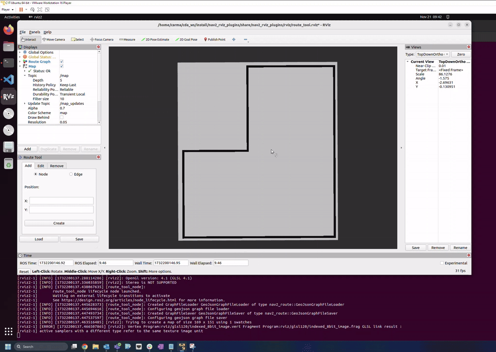
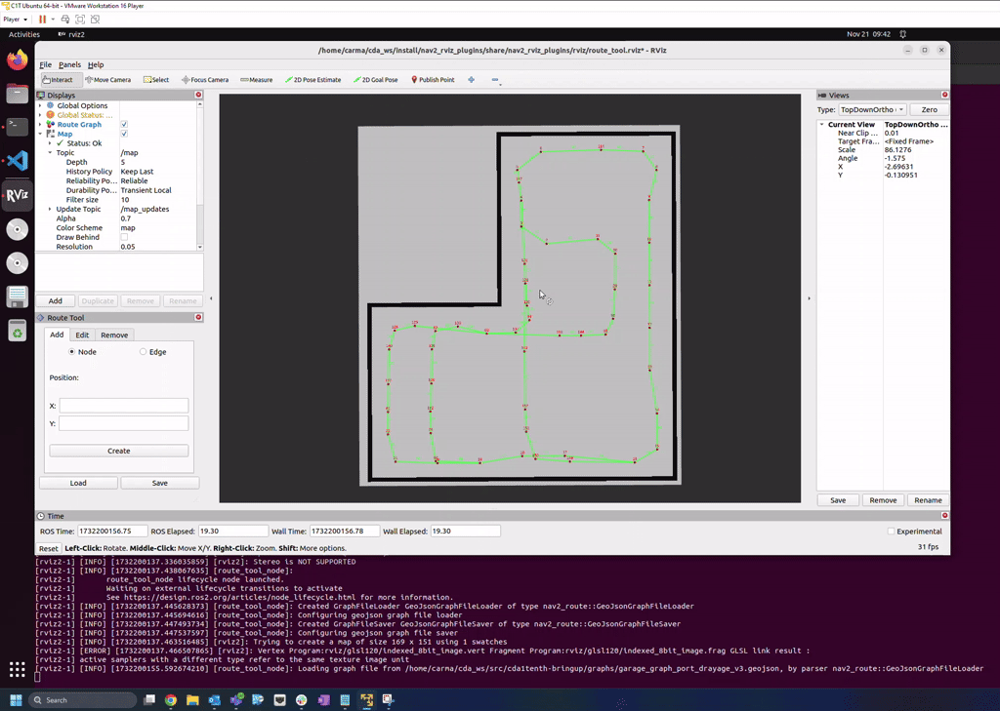
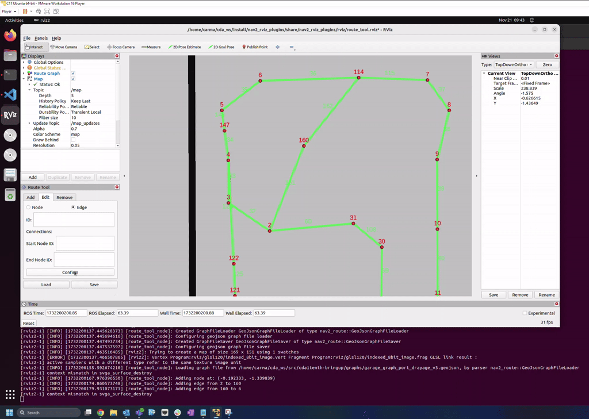

.. _navigation2_route_tool:

Using the Nav2 Route Tool
*************************

- `Overview`_
- `Prerequisites`_
- `Tutorial Steps`_

.. image:: images/Navigation2_route_tool/route_tool_demo.gif
    :width: 90%
    :align: center

Overview
========

The Nav2 route tool is an Rviz panel designed to ease the process of creating and editing the route graphs used by the Nav2 Route Server.
Supported operations include loading in existing route graphs, adding new nodes/edges, editing existing nodes/edges, removing nodes/edges, and saving changes to a new file.

Prerequisites
============

Prior to using the route tool, you will need to create an occupancy grid map using the slam_toolbox package. 
Follow [this tutorial](https://roboticsbackend.com/ros2-nav2-generate-a-map-with-slam_toolbox/) for instructions on how to generate and save an occupancy grid map.

Tutorial Steps
==============

To start the route tool, open a terminal and run the command: 

.. code-block:: bash

    ros2 launch nav2_rviz_plugins route_tool.launch.py yaml_filename:=/path/to/map.yaml

This should open Rviz with the route tool panel on the left side and your occupancy grid map displayed in the center.

Loading a Route Graph
---------------------

To load in an existing route graph, click on the load button on the bottom left of the route tool panel.
This will open up a file explorer so you can navigate to the existing geojson file you would like to load.
After clicking open, you should see the route graph overlayed with your occupancy grid map.

Adding Nodes and Edges
----------------------

To add nodes and edges to your route graph, select the "Add" tab of the route tool panel.
You can then add nodes by selecting the "Node" option and specifying coordinates for the new node.
Coordinates can be specified manually or by using the "Publish Point" feature in Rviz.
Once you have coordinates selected, click the "Create" button to add the node to your route graph.
For edges, follow the same process with the "Edge" option selected and specifying the ID for the starting and ending node you wish to connect.

Editing Nodes and Edges
-----------------------

.. image:: images/Navigation2_route_tool/route_edit.gif
    :width: 90%
    :align: center

To edit an existing node or edge, select the "Edit" tab of the route tool panel.
You can edit an existing node by selecting the "Node" option, entering the ID of the node you wish to edit, and specifying the new coordinates for the node.
Similar to adding in a node, you can enter these coordinates manually or using the "Publish Point" feature.
After clicking the "Confirm" button, you should see the location of the node move.
If the node has any edges connecting to it, those will be adjusted as well.
Existing edges can be edited by selecting the "Edge" option, entering the ID of the edge you wish to edit, and specifying the IDs for the new starting and ending nodes.

Removing Nodes and Edges
------------------------

To remove an existing node or edge, select the "Remove" tab of the route tool panel.
Select the "Node" option if you would like to remove a node and the "Edge" option if you would like to remove an edge.
Then enter the ID of the graph element you wish to remove and click the "Delete" button to remove it from the route graph.
If you remove a node that has edges attached to it, those edges will be removed as well.
You may need to toggle the visibility of the route graph in Rviz to see the change take effect.

Saving a Route Graph
--------------------

.. image:: images/Navigation2_route_tool/route_save.gif
    :width: 90%
    :align: center

Once you are ready to save your route graph, click the "Save" button at the bottom right of the panel.
This will then open a file explorer so you can specify where you would like to save your graph as a geojson file.
After entering in a filepath and clicking "Save", your route graph should be ready for use with the Nav2 route server!