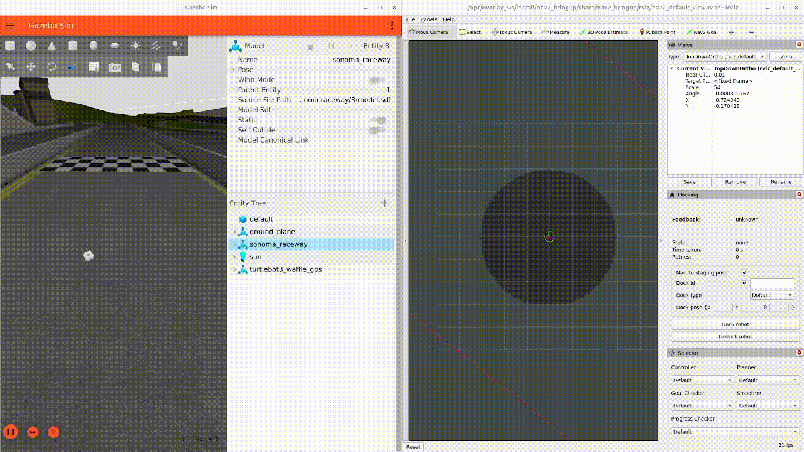

.. _navigation2-with-gps:

Navigating Using GPS Localization
*********************************

- `Overview`_
- `Requirements`_
- `GPS Localization Overview`_
- `Tutorial Steps`_
- `Conclusion`_

.. raw:: html

    <h1 align="center">
      

        <iframe width="708" height="400" src="https://www.youtube.com/embed/R_5HW1TUDQk?autoplay=1&mute=1" frameborder="1" allowfullscreen></iframe>
      

    </h1>

Overview
========

This tutorial shows how to set up a localization system using a GPS sensor(s) as the source of global positioning, robot_localization (RL) for sensor fusion, and how to use Nav2 to follow GPS waypoints. It was written by Pedro Gonzalez at `Kiwibot <https://www.kiwibot.com/>`_.

Requirements
============

It is assumed ROS2 and Nav2 dependent packages are installed or built locally. Additionally you will have to install robot_localization and mapviz: 

   .. code-block:: bash

      source /opt/ros/<ros2-distro>/setup.bash
      sudo apt install ros-$ROS_DISTRO-robot-localization
      sudo apt install ros-$ROS_DISTRO-mapviz
      sudo apt install ros-$ROS_DISTRO-mapviz-plugins
      sudo apt install ros-$ROS_DISTRO-tile-map
    
The code for this tutorial is hosted on `nav2_gps_waypoint_follower_demo <https://github.com/ros-planning/navigation2_tutorials/tree/master/nav2_gps_waypoint_follower_demo>`_. Though we will go through the most important steps of the setup, it's highly recommended that you clone and build the package when setting up your dev environment.

You may also need to install gazebo and turtlebot3 simulation if you have not executed previous tutorials or Nav2 demos. See Nav2's Getting Started page for more information.

GPS Localization Overview
=========================

GPS (Global Positioning System) or more broadly GNSS (Global Navigation Satellite System) is a technology that relies on satellites to provide receivers with an estimate of where they are located on the earth. These satellites are in orbit at altitudes around 20.000km and use radio frequency to continuously broadcast time signals, these are picked up by receivers when satellites are along their line of sight, they use trilateration to estimate their latitude, longitude and altitude.

Commonly GPS devices calculate their position using the `WGS84 standard <https://en.wikipedia.org/wiki/World_Geodetic_System>`_, which defines a cartesian system with its origin on the earth's center of mass, the ``z`` axis pointing north and the ``x`` axis pointing to the first meridian as the image below shows.

.. image:: images/Gps_Navigation/WGS_84_reference_frame.svg
    :width: 562px
    :align: center
    :alt: WGS84 reference frame

However, this reference system is impractical for describing the motion and representing the environment around objects in or close to the earth's surface: Imagine your robot is located on a soccer field and you want it to move from one end to the other, your navigation task would look something like:

  "go from X=4789.413km, Y=177.511km z=4194.292km to X=4789.475km, Y=177.553km z=4194.22km"

Addinally, if your robot has for instance a 2D lidar, you would have to transform its data to this reference system as well. It would make much more sense to create a local reference system where you could tell your robot "go 100 meters forward" and your sensor data could populate your environment representation accordingly, right?

To cope with this, geodesy proposes several planar projection systems for localization with respect to the surface of the earth. One of them is the `UTM coordinate system <https://en.wikipedia.org/wiki/Universal_Transverse_Mercator_coordinate_system>`_, which assumes earth is an ellipsoid and divides it in 60 zones, each of them spanning across 6 longitude degrees. A zone represents the projection of the ellipsoid's surface over a secant cylinder parallel to its central meridian; each of them is then split into 20 latitude bands that span across 8 latitude degrees, which create local grid zones where positions are expressed using planar coordinates from the origin of the zone. The image below shows the grid zones spanning across South America.

`robot_localization <http://docs.ros.org/en/noetic/api/robot_localization/html/index.html>`_ uses this projection system to transform GPS measurements in the WGS84 reference system to a cartesian system, which centered on the origin of the grid zone where the GPS is at. This is achieved through the `navsat_transform node <http://docs.ros.org/en/jade/api/robot_localization/html/navsat_transform_node.html>`_. This node complies with the ENU convention in `REP 103 <https://www.ros.org/reps/rep-0103.html>`_, meaning that the ``+x`` axis of the ``utm`` coordinate system faces east, the ``+y`` faces north and the ``+z`` axis points up.

In the real world GPS sensors can be noisy: With standalone GPSs you should expect accuracies of 1-2 meters under excellent conditions and up to 10 meters, and frequent jumps in the position as the GPS sensor picks up less or more satellites, which can degrade the quality of navigation significantly. Several positioning augmentation technologies exists to reduce the error of GPS measurements, one of the most common ones is called `RTK <https://en.wikipedia.org/wiki/Real-time_kinematic_positioning>`_ (Real Time Kinematic Positioning), which can bring the accuracy of receivers down to 1cm. If accuracy matters in your application this technology is highly recommended; though this requires the deployment of a second fixed GPS called base, most of the US and Europe are already covered with public free to use bases that you can connect to. You can read more about RTK and how to get started `here <https://learn.sparkfun.com/tutorials/setting-up-a-rover-base-rtk-system>`_. In this tutorial we assume the robot's GPS produces an accurate and smooth estimation of the robot's position.

Additionally, to fully describe a robot's localization we need to know its heading as well, however standalone GPS sensors do not provide orientation measurements, only position measurements. In this tutorial we will refer to 'absolute heading' as a yaw measurement which is given w.r.t. a cardinal direction (e.g, the east), in contrast to relative heading, which is given w.r.t. the angle the robot is turned on or any other reference that cannot be directly mapped  to a cardinal direction.

When using robot_localization with GPS, measuring absolute orientation is mandatory. There are several strategies for getting absolute orientation data, like IMUs with magnetometers, dual GPS systems or matching techniques over a known map; in this tutorial we assume the robot is equipped with an IMU that can accurately measure absolute orientation following the ENU convention, meaning it will output zero yaw when facing east and +90 degrees when facing north. 

Despite the above assumption, in the real world commercial grade IMU's mounted in actual robots will often not produce accurate absolute heading measurements because: 

1. They may not have a magnetometer.

2. They are hard to calibrate: outdoors robots are often big and heavy: imagine doing an eight figure in the air with an autonomous tractor.

3. Robots can be a huge source of electromagnetic noise for magnetometers: Electric motors are full of permanent magnets and can draw several amps, producing significant disturbances to the sensor.

Thus, for a particular application you should consider the behavior and localization quality you require when making decisions about how to estimate your absolute heading. When using IMU's without relative headings to a cardinal direction, the robot may need to move around for a bit in an 'initialization dance' to converge to the right heading using the filter. Using dual-GPS or 3D mapping system overlay, the initial heading is quite good. 

For the purposes of this tutorial, we model a well-built system using an IMU that has absolute orientation already, but that may be augmented or replaced on a practical system using one of the techniques above (or others).

Tutorial Steps
==============

0- Setup Gazebo World
---------------------

To navigate using GPS we first need to create an outdoors Gazebo world with a robot having a GPS sensor to setup for navigation. For this tutorial we will be using the `Sonoma Raceway <https://docs.px4.io/v1.12/en/simulation/gazebo_worlds.html#sonoma-raceway>`_ because its aligned with the real location. A sample world has been setup `here <https://github.com/ros-planning/navigation2_tutorials/tree/master/nav2_gps_waypoint_follower_demo/worlds/sonoma_raceway.world>`_ using gazebo's spherical coordinates plugin, which creates a local tangent plane centered in the set geographic origin and provides latitude, longitude and altitude coordinates for each point in the world:

.. code-block:: xml

  <spherical_coordinates>
    <!-- currently gazebo has a bug: instead of outputting lat, long, altitude in ENU
    (x = East, y = North and z = Up) as the default configurations, it's outputting (-E)(-N)U,
    therefore we rotate the default frame 180 so that it would go back to ENU 
    see: https://github.com/osrf/gazebo/issues/2022 --> 
    <surface_model>EARTH_WGS84</surface_model>
    <latitude_deg>38.161479</latitude_deg>
    <longitude_deg>-122.454630</longitude_deg>
    <elevation>488.0</elevation>
    <heading_deg>180</heading_deg>
  </spherical_coordinates>

To get GPS readings from Gazebo we need to create a robot model with a GPS sensor. An updated Turtlebot model with such sensor is provided in the `tutorial repo <https://github.com/ros-planning/navigation2_tutorials/tree/master/nav2_gps_waypoint_follower_demo/models/turtlebot_waffle_gps>`_, it outputs ``NavSatFix`` messages on the topic ``/gps/fix``:

.. code-block:: xml

  <sensor name="tb3_gps" type="gps">
    <always_on>true</always_on>
    <update_rate>1</update_rate>
    <pose>0 0 0 0 0 0</pose>
    <gps>
      <position_sensing>
        <horizontal>
          <noise type="gaussian">
            <mean>0.0</mean>
            <stddev>0.01</stddev>
          </noise>
        </horizontal>
        <vertical>
          <noise type="gaussian">
            <mean>0.0</mean>
            <stddev>0.01</stddev>
          </noise>
        </vertical>
      </position_sensing>
    </gps>
    <plugin name="my_gps_plugin" filename="libgazebo_ros_gps_sensor.so">
      <ros>
        <remapping>~/out:=/gps/fix</remapping>
      </ros>
    </plugin>
  </sensor>

Additionally, since we added a new GPS sensor in the ``gps_link`` we need to add a joint for this link that publishes a static transform w.r.t. ``base_link``

.. code-block:: xml

  <joint name="base_joint" type="fixed">
    <parent link="base_link"/>
    <child link="base_footprint" />
    <origin xyz="0 0 -0.010" rpy="0 0 0"/>
  </joint>

Build the ``nav2_gps_waypoint_follower_demo`` package, source your workspace and test your gazebo world is properly set up by launching: 

.. code-block:: bash

  ros2 launch nav2_gps_waypoint_follower_demo gazebo_gps_world.launch.py

A Turtlebot waffle should appear in the Sonoma Raceway world. You may also echo the topic ``/gps/fix`` to verify the robot is indeed producing GPS measurements 

.. image:: images/Gps_Navigation/gazebo_sonoma_raceway.png
    :width: 700px
    :align: center
    :alt: Turtlebot in the sonoma raceway
 
1- Setup GPS Localization system
--------------------------------

Once you have your simulation (or real robot) up and running, it's time to set up your localization system. Remember that Nav2 uses a ``tf`` chain with the structure ``map`` -> ``odom`` -> ``base_link`` -> ``[sensor frames]``; global localization (``map`` -> ``odom``) is usually provided by ``amcl``, while ``odom`` -> ``base_link`` is usually provided by the user's odometry system (wheel odometry, visual odometry, etc).

In this tutorial, the GPS sensor on the robot will replace ``amcl`` in providing global localization. Though you may build a custom module that takes in the ``NavSatFix`` and ``Imu`` messages of your GPS and imu, and outputs a ``tf`` between your ``map`` and ``odom`` frames using a planar projection, Nav2's GPS waypoint follower currently uses robot_localization for converting GPS goals to cartesian goals, and thus at a `navsat_transform_node <http://docs.ros.org/en/jade/api/robot_localization/html/navsat_transform_node.html>`_ should be active. Additionally, ``robot_localization`` features reconfigurable state estimation nodes that use Kalman Filters to fuse multiple sources of data, which is yet another reason to use it.

We will setup one Extended Kalman Filter for local odometry, fusing wheel odometry and IMU data; a second one for global localization, fusing the local cartesian converted GPS coordinates, the wheel odometry and the IMU data; and a navsat_transform node to output cartesian odometry messages from GPS data. This is a common setup on robot_localization when using GPS data and more details around its configuration can be found in `RL's docs <http://docs.ros.org/en/jade/api/robot_localization/html/integrating_gps.html>`_. 

A `configuration file <https://github.com/ros-planning/navigation2_tutorials/tree/master/nav2_gps_waypoint_follower_demo/config/dual_ekf_navsat_params.yaml>`_ and a `launch file <https://github.com/ros-planning/navigation2_tutorials/tree/master/nav2_gps_waypoint_follower_demo/launch/dual_ekf_navsat.launch.py>`_ are provided for this purpose. You may take a while before continuing to understand these two files and what they configure. Let's walk through the most relevant setting of each node.

Local Odometry
^^^^^^^^^^^^^^

The local odometry is provided by the ``ekf_filter_node_odom``, which publishes the transform between ``odom`` and ``base_footprint``, the base frame of the turtlebot's diff drive plugin in gazebo. The robot state publisher provides a static transform between ``base_footprint`` and ``base_link``, however make sure to set the base frame properly in RL according to your configuration. Note that the EKFs are set to work in 2D mode, this is because nav2's costmap environment representation is 2-Dimensional, and several layers rely on the ``base_link`` frame being on the same plane as their global frame for the height related parameters to make sense. This is encoded in the following parameters:

.. code-block:: yaml

  ekf_filter_node_odom:
    ros__parameters:
      two_d_mode: true
      publish_tf: true

      base_link_frame: base_footprint
      world_frame: odom

Since per `REP 105 <https://www.ros.org/reps/rep-0105.html>`_ the position of the robot in the ``odom`` frame has to be continuous over time, in this filter we just want to fuse the robot's speed measured by its wheels published ``/odom``, and the imu heading published on ``/imu``:

.. code-block:: yaml

  odom0: odom
  odom0_config: [false, false, false,
                false, false, false,
                true,  true,  true,
                false, false, true,
                false, false, false]

  imu0: imu
  imu0_config: [false, false, false,
                false,  false,  true,
                false, false, false,
                false,  false,  false,
                false,  false,  false]

Global Odometry
^^^^^^^^^^^^^^^

The global odometry is provided by the ``ekf_filter_node_map``, which publishes the transform between ``map`` and ``base_footprint``. This EKF is set to work in 2D mode as well. In addition to the IMU and wheel odometry data, this filter takes in the odometry output of the gps, published by the ``navsat_transform`` node on ``/odometry/gps`` as an odometry message:

.. code-block:: yaml

  ekf_filter_node_map:
    ros__parameters:
      two_d_mode: true
      publish_tf: true

      base_link_frame: base_footprint
      world_frame: map

      odom1: odometry/gps
      odom1_config: [true,  true,  false,
                    false, false, false,
                    false, false, false,
                    false, false, false,
                    false, false, false]

Navsat Transform
^^^^^^^^^^^^^^^^

The navsat transform produces an odometry output with the position of the GPS in the ``map`` frame, which is ingested by the global EKF as said above. It exposes the ``datum`` parameter to set the GPS coordinates and heading of the origin of ``map``; if left undeclared it will be set automatically to the coordinates of the first valid ``NavSatFix`` message it gets, and it may be changed in runtime as well calling the ``/datum`` service. 

In this tutorial we will go with the automatic ``datum`` initialization because there is no information about the environment stored in cartesian coordinates (a static map, semantic navigation waypoints, a 3D pointcloud map, etc), however if that's the case in your application you may fix the ``datum`` so a given pair of coordinates produced by the GPS always correspond to the same cartesian coordinates in your reference system.

The node also exposes the ``yaw_offset`` parameter to compensate for known errors that the IMU absolute yaw measurement may have with respect to the east. Since Gazebo's IMU follows the ENU convention this is set to ``0`` in the tutorial, but you may want to change it if you know beforehand there's a fixed offset in your data.

Here's the full configuration for the ``navsat_transform`` node:

.. code-block:: yaml

  navsat_transform:
    ros__parameters:
      frequency: 30.0
      delay: 3.0
      magnetic_declination_radians: 0.0
      yaw_offset: 0.0
      zero_altitude: true
      broadcast_utm_transform: true
      publish_filtered_gps: true
      use_odometry_yaw: true
      wait_for_datum: false
      # datum: [38.161491, -122.4546443, 0.0] # pre-set datum if needed, [lat, lon, yaw]

Localization Testing
^^^^^^^^^^^^^^^^^^^^

As a sanity check that everything is working correctly, launch RL's launch file while Gazebo is still running: 

.. code-block:: bash

  ros2 launch nav2_gps_waypoint_follower_demo dual_ekf_navsat.launch.py

On a different terminal launch mapviz using the pre-built `config file <https://github.com/ros-planning/navigation2_tutorials/tree/master/nav2_gps_waypoint_follower_demo/config/gps_wpf_demo.mvc>`_ in the repo. `Get a bing maps API key <https://www.microsoft.com/en-us/maps/create-a-bing-maps-key>`_ and use it to display satellite pictures.

.. code-block:: bash

  ros2 launch nav2_gps_waypoint_follower_demo mapviz.launch.py

You should see the window below after properly setting the API key:

Finally run the teleop twist keyboard node to teleoperate the simulated Turtlebot: 

.. code-block:: bash

  ros2 run teleop_twist_keyboard teleop_twist_keyboard

When you have everything up and running, start teleoperating the Turtlebot and check that:

1. When the robot faces east (default initial heading) and you move it forward, the ``base_link`` frame (green arrow) moves east consistently with the raw GPS measurements (blue dot).

2. Movement is consistent overall not only when facing east, meaning that the GPS measurements are consistent with the robot heading and movement direction, and that they are consistent with the position of the robot in the world (for instance, when the robot moves towards the finish line, GPS measurements in mapviz do as well).

The gif below shows what you should see:

.. image:: images/Gps_Navigation/localization_check.gif
  :width: 600px
  :align: center

Sensors in a real robot may be less accurate than Gazebo's, especially GPSs and absolute heading measurements from IMUs. To mitigate this you can leverage robot_localization's EKFs to complement sensor's capabilities:

1. If your IMU does not provide absolute yaw measurements accurately, consider setting the ``differential`` parameter of its input to RL to ``true``. This way the filter will only fuse changes in the orientation and derive the absolute value from its motion model internally, differentiating changes in the position to estimate where the robot was heading (e.g. If the robot had a speed of 1m/s forward according to the wheel odometry and moved 1 meter north according to the GPS, that means it should be facing north). Note that if that's the case, you won't have an accurate absolute heading until your robot moves around a bit and the filter can estimate it from that movement; if this is not possible in your application consider adding another sensor that can measure absolute heading accurately, like a dual GPS system.

2. If your GPS is noisy but you have another trustworthy odometry source (ex: wheel odometry, visual odometry), consider tuning the sensors and process noise covariances to make the filter "trust" more or less one data source or its own internal state estimate. A properly tuned filter should be able to reject wrong GPS measurements to some degree.

2- Setup Navigation system
--------------------------

Once you have your localization system up and running it's time to set up Nav2. Since RL is already providing the ``tf`` tree we don't need to launch ``amcl``, thus we can remove its parameters from the params file and not launch Nav2's localization launch file.

There are three main possible setups for the global costmap:

1. **Rolling** (Used in the tutorial): Outdoors environments can get quite big, to a degree that it may not be practical to represent them on a single costmap. For that reason in this tutorial we use a rolling global costmap that is big enough for fitting successive pairs of waypoints. In this case you may or may not choose to use a static layer, however if you do make sure to fix the ``datum`` of the navsat_transform so GPS coordinates always have the same cartesian representation on your map.

.. code-block:: yaml

  global_costmap:
    global_costmap:
      ros__parameters:
        ...
        rolling_window: True
        width: 50
        height: 50

2. **Size and position from static map**: You may also choose to keep Nav2 default setup and have the global costmap be sized and positioned according to a pre-built map by adding a static layer and using ``map_server``. In this case you also need to make sure there's consistency in your ``datum`` and the origin of the map.

.. code-block:: yaml

  global_costmap:
    global_costmap:
      ros__parameters:
        ...
        plugins: ["static_layer", "obstacle_layer", "inflation_layer"]

3. **Static position and size**: Finally, depending on your application you may still choose to use a fixed global costmap if you have a restricted operating environment you know beforehand, just remember to make it fit all the potential locations the robot may visit. In this case you need to set the size and origin position in the parameters:

.. code-block:: yaml

  global_costmap:
    global_costmap:
      ros__parameters:
        ...
        width: 50
        height: 50
        origin_x: 25.0
        origin_y: 25.0

We provide a `Nav2 params file <https://github.com/ros-planning/navigation2_tutorials/tree/master/nav2_gps_waypoint_follower_demo/config/nav2_no_map_params.yaml>`_ with the rolling costmap setup and a `launch file <https://github.com/ros-planning/navigation2_tutorials/tree/master/nav2_gps_waypoint_follower_demo/gps_waypoint_follower.launch.py>`_ to put it all together. Remember that the GPS setup of robot_localization was just a means for setting up the global localization system, however Nav2 is still a cartesian navigation stack and you may still use all its cartesian tools. To confirm that everything is working, launch the provided file (this launches gazebo and RL as well so close them if you have them running from the previous steps) and use rviz to send a goal to the robot:

.. code-block:: bash

  ros2 launch nav2_gps_waypoint_follower_demo gps_waypoint_follower.launch.py use_rviz:=True

The gif below shows what you should see Nav2 navigating the robot autonomously!

3-  Interactive GPS Waypoint Follower
-------------------------------------

Now that we have performed our complete system setup, let's leverage Nav2 GPS waypoint follower capabilities to navigate to goals that are expressed directly in GPS coordinates. For this demo we want to build an interactive interface similar to rviz's, that allows us to click over a map to make the robot navigate to the clicked location. For that we will use mapviz's point click publisher on the ``wgs84`` reference frame, which will publish a ``PointStamped`` message with the GPS coordinates of the point clicked over the satellite image. This is a great way to get started in your custom GPS navigation setup!

For this purpose we provide the `interactive_waypoint_follower <https://github.com/ros-planning/navigation2_tutorials/tree/master/nav2_gps_waypoint_follower_demo/nav2_gps_waypoint_follower_demo/interactive_waypoint_follower.py>`_ python node, which subscribes to mapviz's topic and calls the ``/follow_gps_waypoints`` action server with the clicked point as goal using the ``BasicNavigator`` in ``nav2_simple_commander``. To run it source your workspace and with the rest of the system running type:

.. code-block:: bash

  ros2 run nav2_gps_waypoint_follower_demo interactive_waypoint_follower

You can now click on the mapviz map the pose you want the robot to go. The gif below shows the robot navigating to the finish line going through some obstacles:

.. image:: images/Gps_Navigation/interactive_wpf.gif
  :width: 600px
  :align: center

4-  Logged GPS Waypoint Follower & Waypoint Logging
---------------------------------------------------

Finally let's make a robot go through a set of predefined GPS waypoints. We provide a `waypoint logging tool <https://github.com/ros-planning/navigation2_tutorials/tree/master/nav2_gps_waypoint_follower_demo/nav2_gps_waypoint_follower_demo/gps_waypoint_logger.py>`_ that subscribes to the robot's GPS and IMU and offers a simple GUI to save the robot coordinates and heading on demand to a ``yaml`` file with the format:

.. code-block:: yaml

  waypoints:
  - latitude: 38.161491054181276
    longitude: -122.45464431092836
    yaw: 0.0
  - latitude: 38.161587576524845
    longitude: -122.4547994038464
    yaw: 1.57

Let's log some waypoints for the robot to follow. Source your workspace and with the rest of the system running type:

.. code-block:: bash

  ros2 run nav2_gps_waypoint_follower_demo gps_waypoint_logger </path/to/yaml/file.yaml>

If you don't provide a path to save your waypoints, they will be saved in your ``home`` folder by default with the name ``gps_waypoints.yaml``. Once the node launches you should see a small GUI with a button to log waypoints, you may now move the robot around and click that button to record its position as the gif below shows:

.. image:: images/Gps_Navigation/waypoint_logging.gif
  :width: 800px
  :align: center

After that you should get a ``yaml`` file in the location you specified with the format shown above; let's now make the robot follow the logged waypoints. For this purpose we provide the `logged_waypoint_follower <https://github.com/ros-planning/navigation2_tutorials/tree/master/nav2_gps_waypoint_follower_demo/nav2_gps_waypoint_follower_demo/logged_waypoint_follower.py>`_ node, which takes in the path to the waypoints file as an argument and uses the ``BasicNavigator`` in ``nav2_simple_commander`` to send the logged goals to the ``/follow_gps_waypoints`` action server. If not provided, the node uses the `default waypoints <https://github.com/ros-planning/navigation2_tutorials/tree/master/nav2_gps_waypoint_follower_demo/config/demo_waypoints.yaml>`_ in the ``nav2_gps_waypoint_follower_demo`` package.

To run this node source your workspace and with the rest of the system running type:

.. code-block:: bash

  ros2 run nav2_gps_waypoint_follower_demo logged_waypoint_follower </path/to/yaml/file.yaml>

You should now see the robot following the waypoints you previously logged: 

.. image:: images/Gps_Navigation/logged_waypoint_follower.gif
  :width: 800px
  :align: center

Conclusion
==========

This tutorial discussed the usage of a GPS sensor for global localization using RL and the ``navsat_transform`` node, covering the setup of a gazebo simulation with a GPS equipped robot as well. It also went through the configuration changes in Nav2 for navigating with GPS localization, emphasizing on some different possibilities for setting up the global costmap. Finally it showcased the capabilities of Nav2's GPS waypoint follower as a demonstration on how to use the stack in outdoors environments.

The tutorial should be a good starting point for setting up autonomous navigation using Nav2 on an outdoors robot, however users should keep in mind that GPS is just a means for providing global localization to the stack, and that all cartesian tools in Nav2 are still available for going past the GPS waypoint follower and building custom autonomy applications according to each use case.

Happy outdoors navigating!
