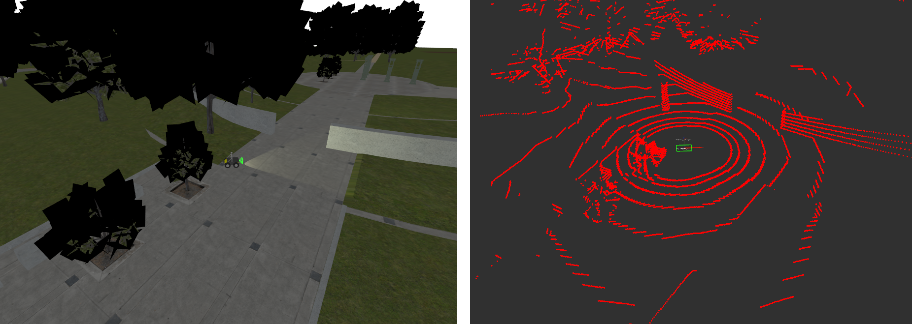
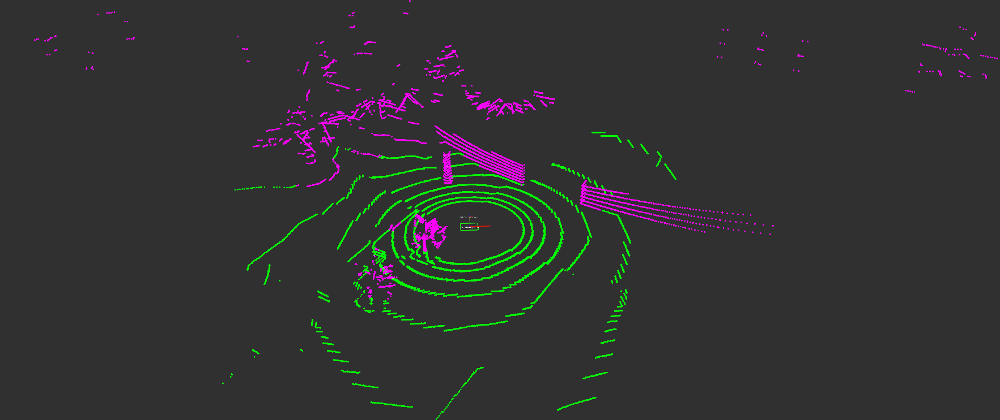
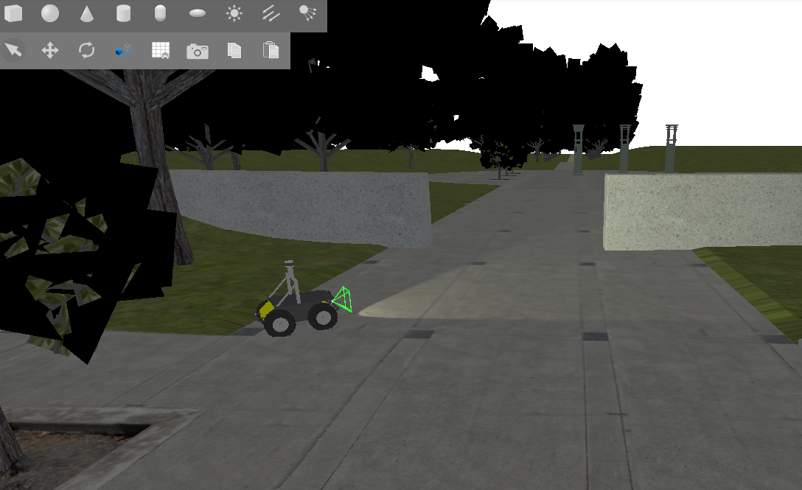
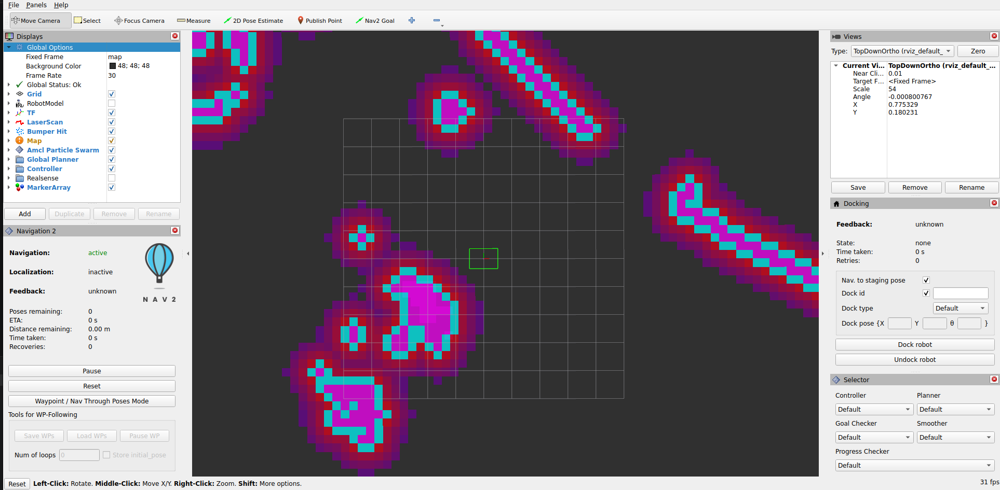
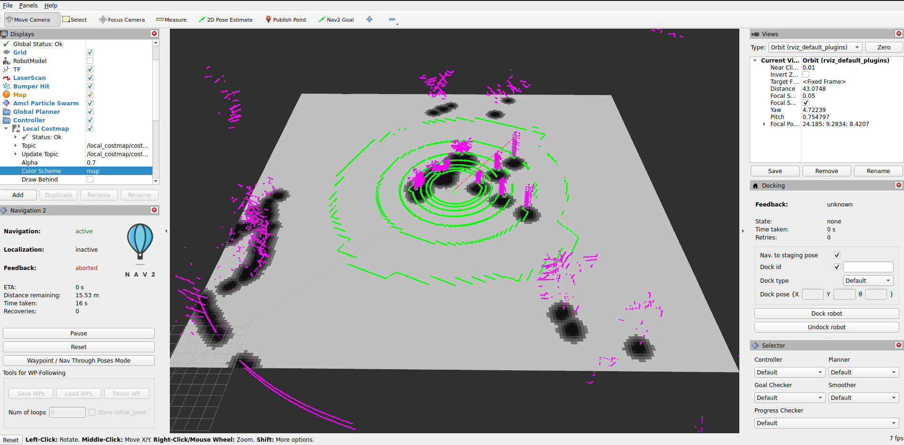

.. _navigation2_with_ground_consistency_layer:

Ground Terrain Segmentation using 3D Lidar
******************************************

- `Overview`_
- `Requirements`_
- `Ground Segmentation Overview`_
- `Ground Consistency Layer`_
- `Nav2 Integration`_
- `Tuning Guide`_
- `Use Cases`_
- `Conclusion`_
- `Practical Example`_
- `Extended Topics`_

Overview
========

In this tutorial, we demonstrate a terrain-aware costmap layer for Nav2 which uses 3D lidar ground segmentation. The
`ground consistency costmap layer <https://github.com/dfki-ric/nav2_ground_consistency_costmap_plugin>`_ allows users
to classify terrain into traversable ground and obstacles for intelligent outdoor
navigation in non-planar environments, creating smarter and safer costmaps.

.. image:: images/Navigation2_with_Ground_Consistency/ground_consistency_layer.gif
   :alt: Ground Consistency Layer Demo

*Ground Consistency Layer in action: Green points are ground, magenta points are obstacles overlaid on the costmap*

Requirements
============

Install ROS 2, Nav2, and Ground Segmentation
--------------------------------------------

This tutorial requires ROS 2 Jazzy and Nav2. Follow the official setup guides:

- **ROS 2 Jazzy Installation**: https://docs.ros.org/en/jazzy/Installation.html
- **Nav2 Setup Guide**: https://docs.nav2.org/getting_started/index.html#installation
- **Ground Segmentation**: There are many well-established ground segmentation methods; in this tutorial, we use the `ground_segmentation_ros2 <https://github.com/dfki-ric/ground_segmentation_ros2>`_ package developed by `DFKI Robotics Innovation Center <https://robotik.dfki-bremen.de/en/startpage>`_. You will find the installation instructions `here <https://github.com/dfki-ric/ground_segmentation_ros2#prerequisite>`_

Installation Steps
==================

It is assumed that ROS 2, Nav2, and a ground segmentation package are built locally. In case you want to skip to the practical example, you can follow the
instructions in the `Practical Example`_ section below, which will set up everything for you.

Next, you will also need to compile the `nav2_ground_consistency_costmap_plugin <https://github.com/dfki-ric/nav2_ground_consistency_costmap_plugin>`_ package. To do so, clone the repository to your ROS 2 workspace and build the package:

Note: currently only ROS 2 Jazzy (main branch) is supported, but branches for humble and rolling will be added soon.

.. code-block:: bash

   cd <your workspace path>/src
   git clone https://github.com/dfki-ric/nav2_ground_consistency_costmap_plugin.git
   cd <your workspace path>
   colcon build --symlink-install # on your workspace path

Ground Segmentation Overview
============================

Ground segmentation in point cloud data is the
process of separating ground points from obstacle points.
This task is fundamental for perception in mobile robotics, where safety and reliable operation depend on the
precise detection of obstacles and navigable surfaces. A single LiDAR scan
can contain over a million points, capturing both ground and
obstacle surfaces within the region of interest. However,
not all points are equally relevant for downstream perception
tasks. For example, object and obstacle detection algorithms often
misclassify ground points as obstacles, leading to false positives that can compromise safety and increase computational
load. Accurate ground segmentation is essential for reliable perception, traversability analysis, navigation, and map
generation in autonomous systems. By effectively distinguishing between ground and obstacle points, we can create more
accurate costmaps that allow the robot to navigate safely and efficiently in complex environments.

**Benefits of Ground Segmentation:**

- **Reduced false positives**: Eliminates misclassified ground points that would otherwise block navigation
- **Improved computational efficiency**: Filters irrelevant points before processing, reducing memory and CPU usage
- **Enhanced traversability analysis**: Accurately identifies traversable terrain for safe navigation planning
- **Better obstacle detection**: Focuses processing on actual obstacles rather than terrain variations
- **Robust slope handling**: Distinguishes between navigable slopes and actual blocking obstacles
- **Underground/tunnel navigation**: Enables navigation in challenging environments where traditional costmaps fail

*Raw Input Point Cloud*

*Segmented Ground (Green) and Obstacle Points (Magenta) based on* `GSeg3D <https://github.com/dfki-ric/ground_segmentation_ros2>`_

While ground segmentation is traditionally used to filter out ground points from costmaps, we can instead use ground points in our decision-making process to implement an
evidence accumulation and height-based classification system. This approach creates more accurate and stable costmaps in outdoor challenging environments.

Ground Consistency Layer
========================

Ground Consistency is a costmap layer that leverages ground segmentation to create more reliable occupancy estimates for navigation in
challenging outdoor environments.

**Key Features:**

- **Evidence-Based Probabilistic Approach**: Maintains accumulated evidence of ground and obstacle points across multiple sensor observations, rather than making binary decisions on individual measurements
- **Evidence Competition**: Ground and obstacle points compete to determine the true occupancy status of each costmap cell, reducing false positives and false negatives
- **Height-Based Classification**: Distinguishes between actual obstacles and terrain variations (e.g., slopes, small bumps) by evaluating obstacle height relative to local ground level
- **Temporal Stability**: Evidence accumulates and decays over time, creating smooth transitions between free and occupied states while maintaining responsiveness to environmental changes
- **Noise Resilience**: Protects against isolated sensor noise by requiring sustained evidence before marking a cell as occupied

Let's look at the core mechanisms in more detail:

1. Evidence Accumulation and Competition System
-----------------------------------------------

Each grid cell in the layer maintains two types of evidence: ground and obstacle. As new sensor data arrives, these
scores are updated and compared to estimate how likely the cell is occupied. Evidence weights for ground and obstacle points can be adjusted independently (e.g., obstacle evidence may
be weighted more heavily than ground evidence) to create a safety bias.

A cell is marked as an obstacle only when there is both:

- enough evidence of obstacle points, and
- high confidence that the evidence of obstacle is stronger than the evidence of ground.

This approach prevents isolated sensor noise from affecting navigation. For example, a single false positive obstacle
point will not mark a cell as occupied if there is strong ground evidence.

2. Height-Based Occupancy Classification
----------------------------------------

Not all detected obstacles actually block the robot. The layer evaluates obstacle height relative to the
local ground height. Based on the robot's height:

- Very high objects are treated as overhead (safe to pass under)
- Very low objects are treated as terrain variation
- Only objects within the robot’s collision range are considered blocking

At times, the terrain is such that no local ground height can be reliably determined. In this case, the
layer can be configured to use neighboring cells to estimate local ground height (see the ``ground_neighbor_search_cells`` parameter), or treat all such obstacles
without ground below them as blocking. For example, if the robot is navigating through a tunnel and the ground
segmentation fails to detect any ground points, then as a backup plan, a ``maximum_height_filter`` (see `Tuning Guide`_) can be applied to incoming obstacle points.
This allows the robot to navigate through tunnels and under bridges without being blocked by misclassified ground points.

3. Temporal Stability Through Evidence Decay
--------------------------------------------

Evidence is decayed over time to allow the costmap to adapt to changing environments. Cells transition gradually between free and
occupied states as evidence builds or fades. The rate of
decay can be tuned separately for ground and obstacle evidence, creating temporal hysteresis, which allows for more stable and
responsive terrain adaptation (faster ground decay) while maintaining stable obstacle marking (slower obstacle decay).

Nav2 Integration
================

Configure Nav2 to use the ground consistency layer in its local costmap. It is recommended to use the layer in the local costmap
since it relies on real-time sensor data and is designed for short-term occupancy estimation. For safety, use the layer
together with the inflation layer to create a buffer around detected obstacles.

Here is an example configuration for the local costmap:

.. code-block:: yaml

   local_costmap:
     local_costmap:
       ros__parameters:
         # ... other costmap settings ...
         plugins: ["ground_consistency", "inflation_layer"]

         ground_consistency:
           plugin: "nav2_ground_consistency_costmap_plugin::GroundConsistencyLayer"
           ground_points_topic: /ground_segmentation/ground_points
           nonground_points_topic: /ground_segmentation/obstacle_points
           tf_timeout: 0.1
           min_clearance: 0.1
           robot_height: 0.92
           maximum_height_filter: 2.0
           ground_inc: 1.0
           nonground_inc: 1.5
           nonground_decay: 0.93
           ground_decay: 0.80
           max_score: 5000.0
           nonground_occ_thresh: 6.0
           nonground_prob_thresh: 0.75
           enable_kpi_logging: false
           discretize_costs: true
           max_data_range: 50.0
           ground_neighbor_search_cells: 0

         inflation_layer:
           plugin: "nav2_costmap_2d::InflationLayer"
           cost_scaling_factor: 3.0
           inflation_radius: 0.7

Parameters Reference
--------------------
.. list-table::
   :header-rows: 1

   * - Name
     - Type
     - Default
     - Description
   * - ``ground_points_topic``
     - string
     - /ground_points
     - Topic providing ground points (PointCloud2)
   * - ``nonground_points_topic``
     - string
     - /nonground_points
     - Topic providing obstacle points (PointCloud2)
   * - ``robot_height``
     - double
     - 1.2
     - Robot height in meters (used for height filtering)
   * - ``tf_timeout``
     - double
     - 0.1
     - Timeout for TF lookups (seconds)
   * - ``ground_inc``
     - double
     - 1.0
     - Evidence added per ground point
   * - ``nonground_inc``
     - double
     - 1.5
     - Evidence added per obstacle point (typically higher than ``ground_inc``)
   * - ``max_score``
     - double
     - 5000.0
     - Maximum accumulated evidence per cell
   * - ``ground_decay``
     - double
     - 0.80
     - Ground evidence decay factor (faster forgetting)
   * - ``nonground_decay``
     - double
     - 0.93
     - Obstacle evidence decay factor (slower forgetting)
   * - ``min_clearance``
     - double
     - 0.1
     - Minimum height to consider an obstacle blocking
   * - ``maximum_height_filter``
     - double
     - 2.0
     - Obstacle points above this height are ignored. The threshold is applied in the coordinate frame of the topic ``nonground_points_topic``, not the global frame.
   * - ``ground_neighbor_search_cells``
     - int
     - 0
     - Neighbor radius for ground height estimation (0 = disabled)
   * - ``nonground_occ_thresh``
     - double
     - 6.0
     - Minimum obstacle evidence required before occupancy is considered
   * - ``nonground_prob_thresh``
     - double
     - 0.75
     - Probability threshold for marking a cell as occupied
   * - ``discretize_costs``
     - bool
     - true
     - Convert cost values to binary (LETHAL or FREE) instead of continuous costs
   * - ``max_data_range``
     - double
     - 50.0
     - Maximum sensor range used. All cells beyond this distance are erased to prevent stale data from far away.
   * - ``enable_kpi_logging``
     - bool
     - false
     - Enable KPI logging of layer performance metrics (for development/debugging)

Tuning Guide
============

The layer's behavior depends on your specific use case (terrain type, robot size, sensor characteristics). Here's how to tune key parameters:

**Robot Height** (``robot_height``)
   - Set to your robot's actual height
   - The layer uses this to classify obstacles as blocking or non-blocking based on their height relative to the ground.
   - Example: Husky robot = 0.92m

**Evidence Accumulation** (``ground_inc``, ``nonground_inc``)
   - Higher increments = faster response to observations
   - Keep ``nonground_inc > ground_inc`` because we want nonground evidence to accumulate faster than ground evidence. This creates a bias towards safety.
   - Typical ratio: 1.0 ground, 1.5 nonground

**Evidence Decay** (``ground_decay``, ``nonground_decay``)
   - **Ground decay** (lower value): We decay ground evidence faster to allow the costmap to adapt quickly to changes in terrain (e.g., moving onto a slope).
     Use 0.80-0.85 for responsive terrain adaptation.
   - **Nonground decay** (higher value): We want obstacles to persist longer to prevent flickering due to sensor noise. Use 0.90-0.95 for stable obstacle marking.
   - Difference creates temporal hysteresis: obstacles are believed longer than ground evidence.

**Height Filtering** (``min_clearance``, ``maximum_height_filter``)
   - ``min_clearance``: Minimum bump your robot can detect. Too low = sensitive to noise; too high = misses small obstacles.
   - ``maximum_height_filter``: Overhead canopy/ceiling height. Objects above this are ignored.
   - At times, ground segmentation may classify ground points as obstacle (e.g., due to sensor noise or very uneven terrain).
     Setting a reasonable ``min_clearance`` can prevent these misclassifications from blocking navigation.

**Neighbor Search** (``ground_neighbor_search_cells``)
   - 0 = Use only ground points in current cell for height estimation
   - 1-3 = Average ground height from neighboring cells (more stable but slower response)
   - Use on very uneven terrain where cells might lack ground points or when low resolution lidar data causes sparse ground points.

**Decision Thresholds** (``nonground_occ_thresh``, ``nonground_prob_thresh``)
   These two thresholds work together in a two-stage filter:

   - ``nonground_occ_thresh``: **Minimum score (accumulated evidence) required**. With default ``nonground_inc: 1.5``, a value of 6.0 means you need ~4 obstacle point observations before considering a cell for LETHAL marking. This is the primary defense against stray sensor noise.
   - ``nonground_prob_thresh``: **Probability confidence required** (after score passes). Even with enough accumulated evidence, the observations must agree with high confidence (default 75%) to actually mark as LETHAL.

   **Why both?** Alone, ``nonground_prob_thresh`` would fire on a single high-confidence false positive point. Together, they require **both**: sustained evidence (multiple observations) **and** high agreement (high confidence). This combination prevents isolated false positives from blocking navigation.

   - **For aggressive navigation** (narrow spaces): Decrease ``nonground_occ_thresh`` to 4-5, increase ``nonground_prob_thresh`` to 0.85 (requires stronger evidence per point)
   - **For conservative navigation** (safety-critical): Increase ``nonground_occ_thresh`` to 8-10, decrease ``nonground_prob_thresh`` to 0.5 (generous with evidence accumulation)

External Parameters
-------------------

**Ground Segmentation Parameters**
- You may also need to tune ground segmentation algorithm parameters for your robot (e.g., slope threshold, sensor distance to ground) to ensure proper classification of ground and obstacle points, as this directly affects the layer's performance. Refer to the `GSeg3D parameters <https://github.com/dfki-ric/ground_segmentation_ros2#parameters-key>`__ documentation.

Use Cases
=========

.. list-table::
   :header-rows: 1
   :widths: 20 25 30 25

   * - **Use Case**
     - **Problem**
     - **Solution**
     - **Tuning**
   * - Outdoor Navigation on Uneven Terrain
     - Standard costmaps mark slopes as obstacles
     - Ground consistency ignores traversable slopes while detecting real blocking obstacles
     - Lower decay values to respond quickly to terrain changes
   * - Navigation Under Structures (Bridges, Overpasses)
     - Standard costmaps block navigation under overhead structures
     - Layer marks overhead structures as non-blocking
     - Set ``maximum_height_filter`` to the maximum obstacle height you want the layer to evaluate; objects above this are treated as overhead/non-blocking
   * - Forest/Cluttered Navigation
     - Branches, leaves, and small debris create false obstacles
     - Only actual blocking-height obstacles are marked
     - Adjust ``min_clearance`` to filter out debris below robot height
   * - Temporal Stability in Dynamic Environments
     - Sensor noise creates flickering obstacles
     - Evidence accumulation and decay smooth the costmap over time
     - Increase decay values to smooth out noise, decrease to respond faster to changes
   * - Varied Terrain with Elevation Changes
     - Traditional costmaps use fixed height thresholds in the global frame, failing on slopes and inclines where ground elevation varies significantly
     - Ground Consistency uses terrain-relative heights, adapting to local ground level rather than absolute global thresholds
     - Set appropriate ``min_clearance`` and ``maximum_height_filter`` values. Ensure ``robot_height`` is accurately set—only obstacles taller than ``robot_height`` relative to ground are considered blocking

Conclusion
==========

The Ground Consistency costmap layer enables terrain-aware navigation by:

1. **Understanding terrain geometry** - Distinguishes traversable slopes from blocking obstacles
2. **Height-aware filtering** - Marks only obstacles that actually block the robot
3. **Temporal smoothing** - Uses evidence accumulation to create stable, responsive costmaps
4. **Flexible integration** - Works with any ground segmentation algorithm

You can integrate the layer into any Nav2-based robot by:

1. Installing the plugin
2. Providing ground/obstacle point clouds (from your choice of sensor/algorithm)
3. Configuring the parameters for your robot dimensions and terrain
4. Adding it to your costmap configuration

The layer's behavior is highly tunable, so start with the provided defaults, then adjust based on your specific terrain and robot characteristics.

Practical Example
=================

To help you get started, we have prepared a practical example demonstrating the Ground Consistency layer in action. It is highly recommended to follow along with the example to see how the layer
works in a simulated navigation scenario.

Install Required Tools
----------------------

This tutorial uses ``vcstool`` to manage repository dependencies. Install it using apt:

.. code-block:: bash

   sudo apt-get install python3-vcstool

Setup Tutorial Package and Dependencies
---------------------------------------

Create and prepare a workspace:

.. code-block:: bash

   # Create workspace
   mkdir -p ~/nav2_ws/src
   cd ~/nav2_ws/src

   # Clone navigation2_tutorials repository
   git clone -b jazzy https://github.com/ros-navigation/navigation2_tutorials.git

Now, install all dependencies:

.. code-block:: bash

   cd ~/nav2_ws

   # Import all demo dependencies (KISS-ICP, ground segmentation, etc.) from the .repos file
   vcs import src < src/navigation2_tutorials/nav2_ground_consistency_demo/dependencies.repos

   # Install ROS package dependencies
   source /opt/ros/jazzy/setup.bash
   rosdep install --from-paths src --ignore-src --rosdistro jazzy -y

1. Setup Simulation Environment
-------------------------------

For this tutorial, we will use the Baylands outdoor world in Gazebo with a Husky robot.

.. code-block:: bash

   cd ~/nav2_ws
   source /opt/ros/jazzy/setup.bash
   colcon build --symlink-install --packages-up-to nav2_ground_consistency_demo --cmake-args -DCMAKE_BUILD_TYPE=RELEASE
   source install/setup.bash

Test that the simulation launches correctly:

Note: The ``grep -v "SampleConsensus"`` is used to filter out expected warnings from the ground segmentation algorithm
that do not affect the demo. You can omit it if you want to see all output.

.. code-block:: bash

   ros2 launch nav2_ground_consistency_demo full_stack.launch.py 2>&1 | grep -v "SampleConsensus"

You should see Gazebo launch with Husky in Baylands world.

2. Observe Ground Consistency Layer in Action
---------------------------------------------

An RViz2 window will also open showing the costmap layers.

**Visualizing Ground Segmentation Points (Optional)**

Add the following PointCloud2 topics to your RViz2 display to visualize ground and obstacle classification:

- ``/ground_segmentation/ground_points``
- ``/ground_segmentation/obstacle_points``

**Important**: Set RViz2 target frame rate to **~8 Hz** to match the LiDAR sensor publish rate from Gazebo. If set higher, point clouds will display intermittently.

You should now see the ground points and obstacle points from the segmentation algorithm overlaid on the costmap with the ground consistency layer applied.

**Testing Navigation**

Use the ``Nav2 Goal`` tool in RViz2 to set navigation goals for the robot. Try setting goals in different areas of the map, such as on slopes, under the tree canopies, and through the uneven terrain. Observe how the ground consistency
layer allows the robot to navigate through these challenging terrains by correctly classifying obstacles and traversable ground.

Extended Topics
===============

Troubleshooting
---------------

**Layer not being used in costmap**
   - Verify the plugin is installed: ``ros2 pkg list | grep ground_consistency``
   - Check that the layer name matches in your configuration (``ground_consistency``)
   - Ensure the plugin name is fully qualified: ``nav2_ground_consistency_costmap_plugin::GroundConsistencyLayer``

**No cells marked as obstacles**
   - Verify ground and obstacle point topics are being published
   - Check that point cloud data is arriving: ``ros2 topic hz /ground_segmentation/obstacle_points``
   - If no points arrive, the segmentation algorithm may not be running or publishing to wrong topics
   - Verify ``nonground_occ_thresh`` isn't too high

**Costmap too conservative (marks too many obstacles)**
   - Decrease ``nonground_inc`` (evidence accumulates slower)
   - Increase ``ground_decay`` (ground evidence fades faster)
   - Increase ``nonground_occ_thresh`` (higher evidence needed to mark as occupied)
   - Verify ``robot_height`` is correct

**Costmap too aggressive (misses obstacles)**
   - Increase ``nonground_inc`` (evidence accumulates faster)
   - Decrease ``nonground_decay`` (obstacles persist longer)
   - Decrease ``nonground_occ_thresh`` (lower evidence to mark as occupied)
   - Verify point cloud data quality from segmentation algorithm

**Overhead structures blocking navigation**
   - Increase ``maximum_height_filter`` to the height of your structures
   - Verify that overhead points are actually coming through in the point cloud
   - Check that ``robot_height`` is correctly set

**Performance Issues**
   - Reduce ``max_data_range`` if using only nearby points
   - Disable ``enable_kpi_logging`` in production
   - Verify that ``ground_neighbor_search_cells`` is set appropriately (0 is fastest)

Funding
=======

Developed at the Robotics Innovation Center (DFKI), Bremen. Supported by Robdekon2 (50RA1406), German Federal Ministry for Research and Technology.
