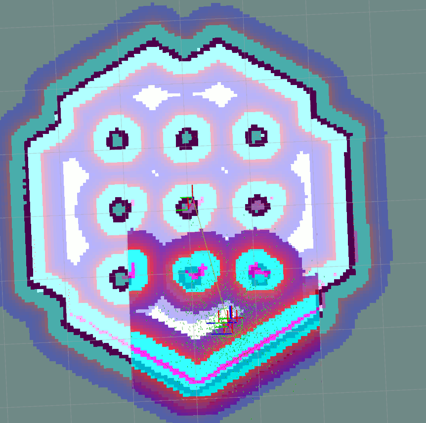

.. _navigation2_with_keepout_filter:

Navigating with Keepout Zones
*****************************

- `Overview`_
- `Requirements`_
- `Tutorial Steps`_

.. raw:: html

    <h1 align="center">
      

        <iframe width="700" height="450" src="https://www.youtube.com/embed/jeMyOWH9HHA?autoplay=1" frameborder="1" allow="accelerometer; autoplay; encrypted-media; gyroscope; picture-in-picture" allowfullscreen></iframe>
      

    </h1>

Overview
========

This tutorial shows how to simply utilize keep-out/safety zones where robots can't enter and preferred lanes for robots moving in industrial environments and warehouses. All this functionality is being covered by ``KeepoutFilter`` costmap filter plugin which will be enabled and used in this document.

Requirements
============

It is assumed that ROS 2, Gazebo and TurtleBot3 packages are installed or built locally. Please make sure that Navigation2 project is also built locally as it was made in :ref:`build-instructions`.

Tutorial Steps
==============

1. Prepare filter mask
----------------------

As was written in :ref:`concepts`, any Costmap Filter (including Keepout Filter) are reading the data marked in a filter mask file. Filter mask is the usual OccupancyGrid map distributed through PGM, PNG or BMP raster file with its metadata containing in a YAML file. The following steps help to understand how to make a new filter mask:

Create a new image with a PGM/PNG/BMP format: copy `turtlebot3_world.pgm <https://github.com/ros-planning/navigation2/blob/main/nav2_bringup/bringup/maps/turtlebot3_world.pgm>`_ main map which will be used in a world simulation from a ``navigation2`` repository to a new ``keepout_mask.pgm`` file.

Open ``keepout_mask.pgm`` in your favourite raster graphics editor. Each pixel there means an encoded information for the specific costmap filter you are going to use. For Keepout Filter pixel color intensity is proportional to the passibility of area corresponting to this pixel: darker colors means more impassable areas. Black color covers keep-out zones where robot will never enter or pass through. Fill the areas with black color you are going to mark as a keep-out zones:

.. image:: images/Navigation2_with_Keepout_Filter/drawing_keepout_mask.png
    :width: 500px

Keepout Filter also covers preferred lanes case, where robots should moving only on pre-defined lanes and permitted areas e.g. in warehouses. To use this feaure you need to prepare the mask image where the lanes and permitted areas will be marked with "white" color while all other areas will be "black". TIP: typically, amount of pixels belonging to lanes are much less than pixels covering other areas. In this case initially all lanes data might be drawn with a black pencil over white background and then (just before saving a file as PGM) "color inversion" tool in a image raster editor might be used.

After all keepout areas will be filled save the ``keepout_mask.pgm`` image.

Like all other maps, filter mask should have its own YAML metadata file. Copy `turtlebot3_world.yaml <https://github.com/ros-planning/navigation2/blob/main/nav2_bringup/bringup/maps/turtlebot3_world.yaml>`_ to ``keepout_mask.yaml``. Open ``keepout_mask.yaml`` and correct ``image`` field to a newly made PGM mask:

.. code-block:: text

  image: turtlebot3_world.pgm
  ->
  image: keepout_mask.pgm

Since filter mask image was created as a copy of main map, other fields of YAML-file do not need to be changed. Save ``keepout_mask.yaml`` and new filter mask is ready to use.

.. note::

  World map itself and filter mask could have different sizes, origin and resolution which might be useful e.g. for cases when filter mask is covering smaller areas on maps or when one filter mask is used repeatedly many times (like annotating a keepout zone for same shape rooms in the hotel). For this case, you need to correct ``resolution`` and ``origin`` fields in YAML as well so that the filter mask is correctly laid on top of the original map.

.. note::

  Another important note is that since Costmap2D does not support orientation, the last third "yaw" component of the ``origin`` vector should be equal to zero. For example: ``origin: [1.25, -5.18, 0.0]``.

2. Configure Costmap Filter Info Publisher Server
-------------------------------------------------

According to the feature design, filter mask is being published along with costmap filter info messages of ``nav2_msgs/CostmapFilterInfo`` type. These messages are being published by `Costmap Filter Info Publisher Server <https://github.com/ros-planning/navigation2/tree/main/nav2_map_server/src/costmap_filter_info>`_. The server is running as a lifecycle node. According to the `design document <https://github.com/ros-planning/navigation2/blob/main/doc/design/CostmapFilters_design.pdf>`_, ``nav2_msgs/CostmapFilterInfo`` messages are going in a pair with ``OccupancyGrid`` filter mask topic. Therefore, along with Costmap Filter Info Publisher Server there should be enabled a new instance of Map Server configured to publish filter mask.

In order to enable Keepout Filter in your configuration, both servers should be enabled as a lifecycle nodes in Python launch-file. For example, this might look as follows:

.. code-block:: python

    lifecycle_nodes = ['filter_mask_server', 'costmap_filter_info_server']
    params_file = '/path/to/your/params_file.yaml'

    start_lifecycle_manager_cmd = Node(
            package='nav2_lifecycle_manager',
            executable='lifecycle_manager',
            name='lifecycle_manager_costmap_filters',
            output='screen',
            parameters=[{'use_sim_time': True},
                        {'autostart': True},
                        {'node_names': lifecycle_nodes}])

    start_map_server_cmd = Node(
            package='nav2_map_server',
            executable='map_server',
            name='filter_mask_server',
            output='screen',
            parameters=[params_file])

    start_costmap_filter_info_server_cmd = Node(
            package='nav2_map_server',
            executable='costmap_filter_info_server',
            name='costmap_filter_info_server',
            output='screen',
            parameters=[params_file])

    ...

    ld = LaunchDescription()
    ld.add_action(start_lifecycle_manager_cmd)
    ld.add_action(start_map_server_cmd)
    ld.add_action(start_costmap_filter_info_server_cmd)

where the ``params_file`` variable should be set to a YAML-file having ROS parameters for Costmap Filter Info Publisher Server and Map Server nodes. These parameters and their meaning are listed at :ref:`configuring_map_server` page. Please, refer to it for more information. The example of ``params_file`` could be found below:

.. code-block:: yaml

  costmap_filter_info_server:
    ros__parameters:
      use_sim_time: true
      type: 0
      filter_info_topic: "/costmap_filter_info"
      mask_topic: "/filter_mask"
      base: 0.0
      multiplier: 1.0
  filter_mask_server:
    ros__parameters:
      use_sim_time: true
      frame_id: "map"
      topic_name: "/filter_mask"
      yaml_filename: "keepout_mask.yaml"

Note, that:

 - For Keepout Filter the ``type`` of costmap filter should be set to ``0``
 - Filter mask topic name should be the equal for ``mask_topic`` parameter of Costmap Filter Info Publisher Server and ``topic_name`` parameter of Map Server
 - For Keepout Filter ``base`` and ``multiplier`` parameters should be set to ``0.0`` and ``1.0`` accordingly

Ready-to-go standalone Python launch-script, YAML-file with ROS parameters and filter mask example for Keepout Filter could be found in a `costmap_filters <https://github.com/ros-planning/navigation2_tutorials/tree/master/costmap_filters>`_ directory of ``navigation2_tutorials`` repository. To simply run Filter Info Publisher Server and Map Server tuned on Turtlebot3 standard simulation written at :ref:`getting_started`, go into this directory and run the following:

.. code-block:: bash

  $ ros2 launch launch/costmap_filter_info.launch.py params_file:=params/keepout_params.yaml mask:=maps/keepout_mask.yaml

3. Enable Keepout Filter
------------------------

Costmap Filters are Costamp2D plugins. You can enable the ``KeepoutFilter`` plugin in Costmap2D by adding ``keepout_filter`` to the ``plugins`` parameter in ``nav2_params.yaml``. You can place it in the ``global_costmap`` for planning with keepouts and ``local_costmap`` to make sure the robot won't attempt to drive through a keepout zone. The KeepoutFilter plugin should have the following parameters defined:

- ``plugin``: type of plugin. In our case ``nav2_costmap_2d::KeepoutFilter``.
- ``filter_info_topic``: filter info topic name. This need to be equal to ``filter_info_topic`` parameter of Costmap Filter Info Publisher Server from the chapter above.

It is important to note that enabling ``KeepoutFilter`` for ``global_costmap`` only will cause the path planner to build plans bypassing keepout zones. Enabling ``KeepoutFilter`` for ``local_costmap`` only will cause the robot to not enter keepout zones, but the path may still go through them. So, the best practice is to enable ``KeepoutFilter`` for global and local costmaps simultaneously by adding it both in ``global_costmap`` and ``local_costmap`` in ``nav2_params.yaml`` as follows below:

.. code-block:: text

  global_costmap:
    global_costmap:
      ros__parameters:
        ...
        plugins: ["static_layer", "obstacle_layer", "inflation_layer", "keepout_filter"]
        ...
        keepout_filter:
          plugin: "nav2_costmap_2d::KeepoutFilter"
          enabled: True
          filter_info_topic: "/costmap_filter_info"
  ...
  local_costmap:
    local_costmap:
      ros__parameters:
        ...
        plugins: ["voxel_layer", "inflation_layer", "keepout_filter"]
        ...
        keepout_filter:
          plugin: "nav2_costmap_2d::KeepoutFilter"
          enabled: True
          filter_info_topic: "/costmap_filter_info"

4. Run Navigation2 stack
------------------------

After Costmap Filter Info Publisher Server and Map Server were launched and Keepout Filter was enabled for global/local costmaps, run navigation2 stack as written in :ref:`getting_started`:

.. code-block:: bash

  ros2 launch nav2_bringup tb3_simulation_launch.py

And check that filter is working properly as in the pictures below (on left side keepout filter enabled for the global costmap, on right - for the local):

.. image:: images/Navigation2_with_Keepout_Filter/keepout_global.gif
    :width: 400px
    :align: left
    :alt: Animated gif with KeepoutFilter enabled for global costmaps

