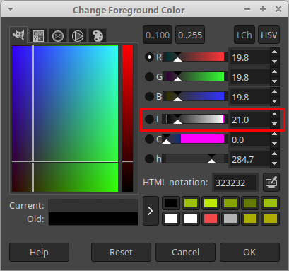
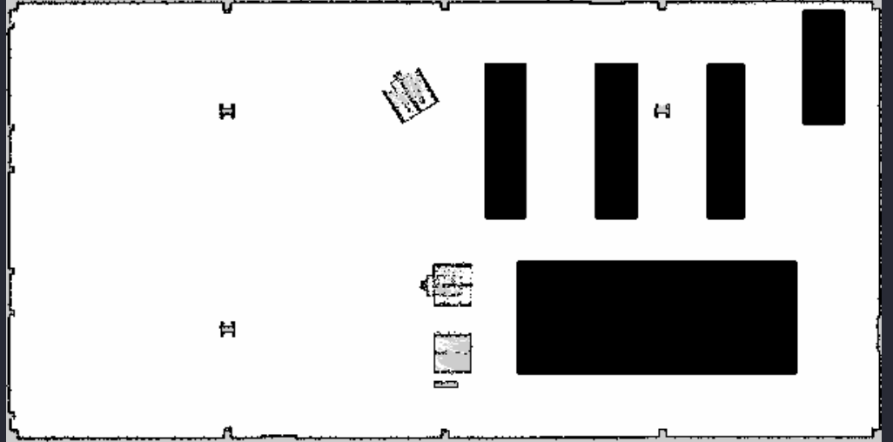

.. _navigation2_with_keepout_filter:

Navigating with Keepout Zones
*****************************

- `Overview`_
- `Requirements`_
- `Tutorial Steps`_

.. raw:: html

    <h1 align="center">
      

        <iframe width="600" height="480" src="https://www.youtube.com/embed/iVteYQR5IYQ?autoplay=1" frameborder="1" allow="accelerometer; autoplay; encrypted-media; gyroscope; picture-in-picture" allowfullscreen></iframe>
      

    </h1>

Overview
========

This tutorial shows how to simply utilize keep-out/safety zones where robots can't enter and preferred lanes for robots moving in industrial environments and warehouses. All this functionality is being covered by ``KeepoutFilter`` costmap filter plugin which will be enabled and used in this document.

Requirements
============

It is assumed that ROS 2, Gazebo and TurtleBot3 packages are installed or built locally. Please make sure that Nav2 project is also built locally as it was made in :ref:`build-instructions`.

Tutorial Steps
==============

1. Prepare filter mask
----------------------

As was written in :ref:`concepts`, any Costmap Filter (including Keepout Filter) are reading the data marked in a filter mask file. Filter mask - is the usual Nav2 2D-map distributed through PGM, PNG or BMP raster file with its metadata containing in a YAML file. The following steps help to understand how to make a new filter mask:

Create a new image with a PGM/PNG/BMP format: copy `turtlebot3_world.pgm <https://github.com/ros-planning/navigation2/blob/main/nav2_bringup/bringup/maps/turtlebot3_world.pgm>`_ main map which will be used in a world simulation from a ``Nav2`` repository to a new ``keepout_mask.pgm`` file.

Open ``keepout_mask.pgm`` in your favourite raster graphics editor (as an example could be taken GIMP editor). The lightness of each pixel on the mask means an encoded information for the specific costmap filter you are going to use. Color lightness of each pixel belongs to the ``[0..255]`` range (or ``[0..100]`` in percent scale), where ``0`` means black color and ``255`` - white. Another term "darkness" will be understood as the exact opposite of lightness. In other words ``color_darkness = 100% - color_lightness``.

In the GIMP lightness is expressed through color components value (e.g. ``R`` in percent scale) and might be set by moving ``L`` slider in color changing tool:

The incoming mask file is being read by the Map Server and converted into ``OccupancyGrid`` values from ``[0..100]`` range (where ``0`` means free cell, ``100`` - occupied, anything in between - less or more occupied cells on map) or be equal to ``-1`` for unknown value. In Nav2 stack each map has ``mode`` attribute which could be ``trinary``, ``scale`` or ``raw``. Depending on ``mode`` selected, the color lightness of PGM/PNG/BMP is being converted to ``OccupancyGrid`` by one of the following principles:

- ``trinary`` (default mode): Darkness >= ``occupied_thresh`` means that map occupied (``100``). Darkness <= ``free_thresh`` - map free (``0``). Anything in between - unknown status on map (``-1``).
- ``scale``: Alpha < ``1.0`` - unknown. Darkness >= ``occupied_thresh`` means that map occupied (``100``). Darkness <= ``free_thresh`` - map free (``0``). Anything in between - linearly interpolate to nearest integer from ``[0..100]`` range.
- ``raw``: Lightness = ``0`` (dark color) means that map is free (``0``). Lightness = ``100`` (in absolute value)  - map is occupied (``100``). Anything in between - ``OccupancyGrid`` value = lightness. Lightness >= ``101`` - unknown (``-1``).

where ``free_thresh`` and ``occupied_thresh`` thresholds are expressed in percentage of maximum lightness/darkness level (``255``). Map mode and thresholds are placed in YAML metadata file (see below) as ``mode``, ``free_thresh`` and ``occupied_thresh`` fields.

.. note::

  There is another parameter in a YAML metadata file called ``negate``. By default it is set to ``false``. When it is set to ``true``, blacker pixels will be considered as free, whiter pixels - as occupied. In this case we should count color lightness instead of darkness for ``trinary`` and ``scale`` modes. ``negate`` has no effect on ``raw`` mode.

For Keepout Filter ``OccupancyGrid`` value is proportional to the passibility of area corresponting to this cell: higher values means more impassable areas. Cells with occupied values covers keep-out zones where robot will never enter or pass through. ``KeepoutFilter`` can also act as a "weighted areas layer" by setting the ``OccupancyGrid`` to something between ``[1-99]`` non-occupied values. Robot is allowed to move in these areas, however its presence there would be "undesirable" there (the higher the value, the sooner planners will try to get the robot out of this area).

Keepout Filter also covers preferred lanes case, where robots should moving only on pre-defined lanes and permitted areas e.g. in warehouses. To use this feaure you need to prepare the mask image where the lanes and permitted areas will be marked with free values while all other areas will be occupied. TIP for drawing the mask in a ``trinary`` or ``scale`` mode: typically, amount of pixels belonging to lanes are much less than pixels covering other areas. In this case initially all lanes data might be drawn with a black pencil over white background and then (just before saving a PGM) "color inversion" tool in a image raster editor might be used.

For simplicity, in the example fill the areas with black color (in ``trinary`` mode this means occupied map) that you are going to mark as a keep-out zones:

After all keepout areas will be filled save the ``keepout_mask.pgm`` image.

Like all other maps, filter mask should have its own YAML metadata file. Copy `turtlebot3_world.yaml <https://github.com/ros-planning/navigation2/blob/main/nav2_bringup/bringup/maps/turtlebot3_world.yaml>`_ to ``keepout_mask.yaml``. Open ``keepout_mask.yaml`` and correct ``image`` field to a newly made PGM mask:

.. code-block:: text

  image: turtlebot3_world.pgm
  ->
  image: keepout_mask.pgm

Since filter mask image was created as a copy of main map, other fields of YAML-file do not need to be changed. Save ``keepout_mask.yaml`` and new filter mask is ready to use.

.. note::

  World map itself and filter mask could have different sizes, origin and resolution which might be useful e.g. for cases when filter mask is covering smaller areas on maps or when one filter mask is used repeatedly many times (like annotating a keepout zone for same shape rooms in the hotel). For this case, you need to correct ``resolution`` and ``origin`` fields in YAML as well so that the filter mask is correctly laid on top of the original map.

.. note::

  Another important note is that since Costmap2D does not support orientation, the last third "yaw" component of the ``origin`` vector should be equal to zero. For example: ``origin: [1.25, -5.18, 0.0]``.

2. Configure Costmap Filter Info Publisher Server
-------------------------------------------------

Each costmap filter reads incoming meta-information (such as filter type or data conversion coefficients) in a messages of ``nav2_msgs/CostmapFilterInfo`` type. These messages are being published by `Costmap Filter Info Publisher Server <https://github.com/ros-planning/navigation2/tree/main/nav2_map_server/src/costmap_filter_info>`_. The server is running as a lifecycle node. According to the `design document <https://github.com/ros-planning/navigation2/blob/main/doc/design/CostmapFilters_design.pdf>`_, ``nav2_msgs/CostmapFilterInfo`` messages are going in a pair with ``OccupancyGrid`` filter mask topic. Therefore, along with Costmap Filter Info Publisher Server there should be enabled a new instance of Map Server configured to publish filter mask.

In order to enable Keepout Filter in your configuration, both servers should be enabled as a lifecycle nodes in Python launch-file. For example, this might look as follows:

.. code-block:: python

  import os

  from ament_index_python.packages import get_package_share_directory

  from launch import LaunchDescription
  from launch.actions import DeclareLaunchArgument
  from launch.substitutions import LaunchConfiguration
  from launch_ros.actions import Node
  from nav2_common.launch import RewrittenYaml

  def generate_launch_description():
      # Get the launch directory
      costmap_filters_demo_dir = get_package_share_directory('nav2_costmap_filters_demo')

      # Create our own temporary YAML files that include substitutions
      lifecycle_nodes = ['filter_mask_server', 'costmap_filter_info_server']

      # Parameters
      namespace = LaunchConfiguration('namespace')
      use_sim_time = LaunchConfiguration('use_sim_time')
      autostart = LaunchConfiguration('autostart')
      params_file = LaunchConfiguration('params_file')
      mask_yaml_file = LaunchConfiguration('mask')

      # Declare the launch arguments
      declare_namespace_cmd = DeclareLaunchArgument(
          'namespace',
          default_value='',
          description='Top-level namespace')

      declare_use_sim_time_cmd = DeclareLaunchArgument(
          'use_sim_time',
          default_value='true',
          description='Use simulation (Gazebo) clock if true')

      declare_autostart_cmd = DeclareLaunchArgument(
          'autostart', default_value='true',
          description='Automatically startup the nav2 stack')

      declare_params_file_cmd = DeclareLaunchArgument(
              'params_file',
              default_value=os.path.join(costmap_filters_demo_dir, 'params', 'keepout_params.yaml'),
              description='Full path to the ROS 2 parameters file to use')

      declare_mask_yaml_file_cmd = DeclareLaunchArgument(
              'mask',
              default_value=os.path.join(costmap_filters_demo_dir, 'maps', 'keepout_mask.yaml'),
              description='Full path to filter mask yaml file to load')

      # Make re-written yaml
      param_substitutions = {
          'use_sim_time': use_sim_time,
          'yaml_filename': mask_yaml_file}

      configured_params = RewrittenYaml(
          source_file=params_file,
          root_key=namespace,
          param_rewrites=param_substitutions,
          convert_types=True)

      # Nodes launching commands
      start_lifecycle_manager_cmd = Node(
              package='nav2_lifecycle_manager',
              executable='lifecycle_manager',
              name='lifecycle_manager_costmap_filters',
              namespace=namespace,
              output='screen',
              emulate_tty=True,  # https://github.com/ros2/launch/issues/188
              parameters=[{'use_sim_time': use_sim_time},
                          {'autostart': autostart},
                          {'node_names': lifecycle_nodes}])

      start_map_server_cmd = Node(
              package='nav2_map_server',
              executable='map_server',
              name='filter_mask_server',
              namespace=namespace,
              output='screen',
              emulate_tty=True,  # https://github.com/ros2/launch/issues/188
              parameters=[configured_params])

      start_costmap_filter_info_server_cmd = Node(
              package='nav2_map_server',
              executable='costmap_filter_info_server',
              name='costmap_filter_info_server',
              namespace=namespace,
              output='screen',
              emulate_tty=True,  # https://github.com/ros2/launch/issues/188
              parameters=[configured_params])

      ld = LaunchDescription()

      ld.add_action(declare_namespace_cmd)
      ld.add_action(declare_use_sim_time_cmd)
      ld.add_action(declare_autostart_cmd)
      ld.add_action(declare_params_file_cmd)
      ld.add_action(declare_mask_yaml_file_cmd)

      ld.add_action(start_lifecycle_manager_cmd)
      ld.add_action(start_map_server_cmd)
      ld.add_action(start_costmap_filter_info_server_cmd)

      return ld

where the ``params_file`` variable should be set to a YAML-file having ROS parameters for Costmap Filter Info Publisher Server and Map Server nodes. These parameters and their meaning are listed at :ref:`configuring_map_server` page. Please, refer to it for more information. The example of ``params_file`` could be found below:

.. code-block:: yaml

  costmap_filter_info_server:
    ros__parameters:
      use_sim_time: true
      type: 0
      filter_info_topic: "/costmap_filter_info"
      mask_topic: "/keepout_filter_mask"
      base: 0.0
      multiplier: 1.0
  filter_mask_server:
    ros__parameters:
      use_sim_time: true
      frame_id: "map"
      topic_name: "/keepout_filter_mask"
      yaml_filename: "keepout_mask.yaml"

Note, that:

 - For Keepout Filter the ``type`` of costmap filter should be set to ``0``.
 - Filter mask topic name should be the equal for ``mask_topic`` parameter of Costmap Filter Info Publisher Server and ``topic_name`` parameter of Map Server.
 - According to the Costmap Filters design, ``OccupancyGrid`` values are being linearly transformed into feature map in a filter space. For a Keepout Filter these values are directly passed as a filter space values without a linear conversion. Even though ``base`` and ``multiplier`` coefficients are not used in Keepout Filter, they should be set to ``0.0`` and ``1.0`` accordingly in order to explicitly show that we have one-to-one conversion from ``OccupancyGrid`` values -> to a filter value space.

Ready-to-go standalone Python launch-script, YAML-file with ROS parameters and filter mask example for Keepout Filter could be found in a `nav2_costmap_filters_demo <https://github.com/ros-planning/navigation2_tutorials/tree/master/nav2_costmap_filters_demo>`_ directory of ``navigation2_tutorials`` repository. To simply run Filter Info Publisher Server and Map Server tuned on Turtlebot3 standard simulation written at :ref:`getting_started`, build the demo and launch ``costmap_filter_info.launch.py`` as follows:

.. code-block:: bash

  $ mkdir -p ~/tutorials_ws/src
  $ cd ~/tutorials_ws/src
  $ git clone https://github.com/ros-planning/navigation2_tutorials.git
  $ cd ~/tutorials_ws
  $ colcon build --symlink-install --packages-select nav2_costmap_filters_demo
  $ source ~/tutorials_ws/install/setup.bash
  $ ros2 launch nav2_costmap_filters_demo costmap_filter_info.launch.py params_file:=src/navigation2_tutorials/nav2_costmap_filters_demo/params/keepout_params.yaml mask:=src/navigation2_tutorials/nav2_costmap_filters_demo/maps/keepout_mask.yaml

3. Enable Keepout Filter
------------------------

Costmap Filters are Costamp2D plugins. You can enable the ``KeepoutFilter`` plugin in Costmap2D by adding ``keepout_filter`` to the ``plugins`` parameter in ``nav2_params.yaml``. You can place it in the ``global_costmap`` for planning with keepouts and ``local_costmap`` to make sure the robot won't attempt to drive through a keepout zone. The KeepoutFilter plugin should have the following parameters defined:

- ``plugin``: type of plugin. In our case ``nav2_costmap_2d::KeepoutFilter``.
- ``filter_info_topic``: filter info topic name. This need to be equal to ``filter_info_topic`` parameter of Costmap Filter Info Publisher Server from the chapter above.

Full list of parameters supported by ``KeepoutFilter`` are listed at :ref:`keepout_filter` page.

It is important to note that enabling ``KeepoutFilter`` for ``global_costmap`` only will cause the path planner to build plans bypassing keepout zones. Enabling ``KeepoutFilter`` for ``local_costmap`` only will cause the robot to not enter keepout zones, but the path may still go through them. So, the best practice is to enable ``KeepoutFilter`` for global and local costmaps simultaneously by adding it both in ``global_costmap`` and ``local_costmap`` in ``nav2_params.yaml``. However it does not always have to be true. In some cases keepout zones don't have to be the same for global and local costmaps, e.g. if the robot doesn't allowed to intentionally go inside keepout zones, but if its there, the robot can drive in and out really quick if it clips an edge or corner. For this case, there is not need to use extra resources of the local costmap copy.

To enable ``KeepoutFilter`` with same mask for both global and local costmaps, use the following configuration:

.. code-block:: text

  global_costmap:
    global_costmap:
      ros__parameters:
        ...
        plugins: ["static_layer", "obstacle_layer", "inflation_layer"]
        filters: ["keepout_filter"]
        ...
        keepout_filter:
          plugin: "nav2_costmap_2d::KeepoutFilter"
          enabled: True
          filter_info_topic: "/costmap_filter_info"
  ...
  local_costmap:
    local_costmap:
      ros__parameters:
        ...
        plugins: ["voxel_layer", "inflation_layer"]
        filters: ["keepout_filter"]
        ...
        keepout_filter:
          plugin: "nav2_costmap_2d::KeepoutFilter"
          enabled: True
          filter_info_topic: "/costmap_filter_info"

.. note::

  All costmap filters should be enabled through a ``filters`` parameter -- though it is technically possible to include in the layered costmap itself. This is separated from the layer plugins to prevent interference in the layers, particularly the  inflation layer.

4. Run Nav2 stack
-----------------

After Costmap Filter Info Publisher Server and Map Server were launched and Keepout Filter was enabled for global/local costmaps, run Nav2 stack as written in :ref:`getting_started`:

.. code-block:: bash

  ros2 launch nav2_bringup tb3_simulation_launch.py

And check that filter is working properly as in the pictures below (first picture shows keepout filter enabled for the global costmap, second - differently-sized ``keepout_mask.pgm`` filter mask):

.. image:: images/Navigation2_with_Keepout_Filter/keepout_global.gif
    :height: 400px

