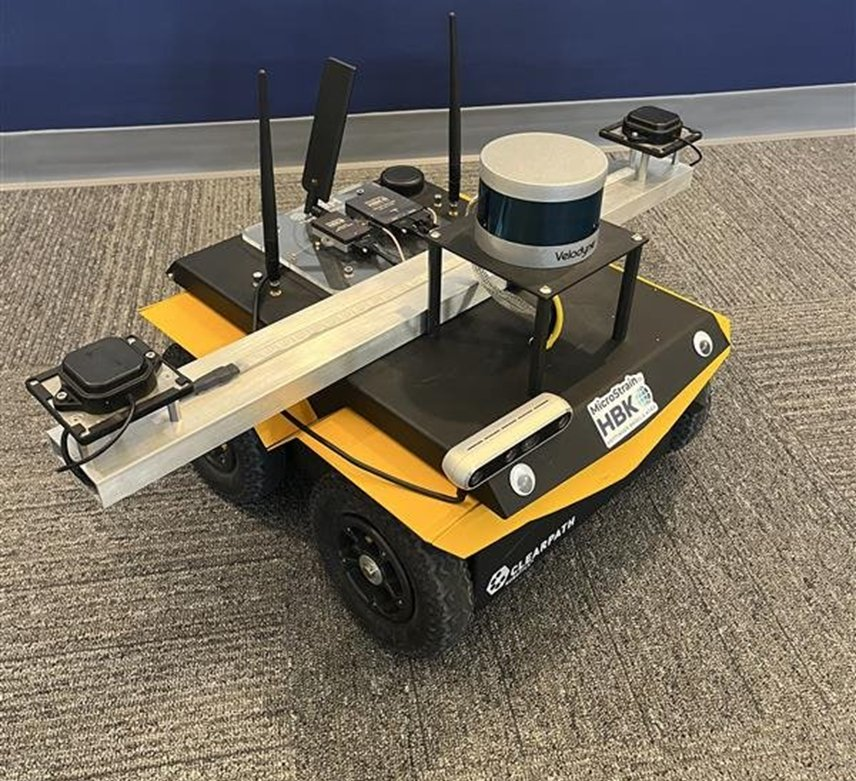
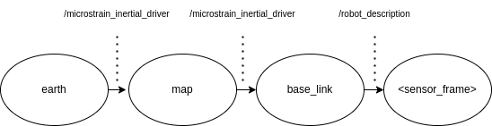
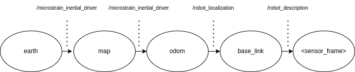
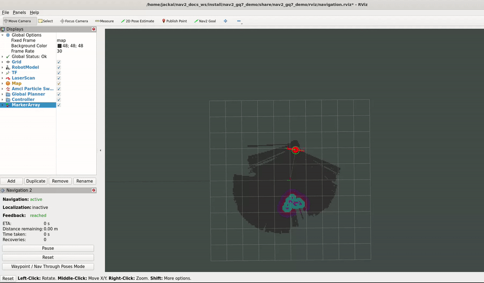

.. _navigation2-with-gps:

Navigating Using a MicroStrain 3DM-GQ7-GNSS-INS
***********************************************

Animation at the top

- `Overview`_
- `What is a GQ7`_
- `Requirements`_
- `Coordinate Frames`_
- `Tutorial Steps`_
- `Conclusion`_

.. figure:: images/Navigation2_with_MicroStrain_GQ7/nav2_with_gq7.gif
    :width: 70%
    :align: center
    :alt: Navigating using GQ7 and rviz

    Autonomous operation of Clearpath Jackal robot using Nav2 and a GQ7

Overview
========

This tutorial shows how to set up a `3DM-GQ7 <https://www.microstrain.com/inertial-sensors/3dm-gq7>`_ as the source for global positioning without needing an additional ``robot_localization`` node, and how to use Nav2 to follow GPS waypoints. It was written by Rob Fisher at `MicroStrain by HBK <https://www.microstrain.com/>`_.

What is a GQ7
=============

The `3DM-GQ7 <https://www.microstrain.com/inertial-sensors/3dm-gq7>`_ (or GQ7) is an all-in-one, GNSS capable inertial navigation system that can provide centimeter-level positioning accuracy with RTK, dual antenna heading with up to 0.2 degree heading accuracy, and 0.05 degree roll/pitch accuracy.

The device contains two GNSS receivers, an IMU, a magnetometer, a pressure sensor, and an onboard Extended Kalman Filter for sensor fusion.

In this example, the GQ7 will take on the role of providing a global odometry solution, as well as populating several transforms. This can be thought of as a replacement to the `Integrating GPS Data <https://docs.ros.org/en/melodic/api/robot_localization/html/integrating_gps.html>`_ guide provided by ``robot_localization``.

Requirements
============

Install required packages
--------------------------

It is assumed ROS2 and Nav2 dependent packages are installed or built locally. Additionally you will have to install the ``microstrain_inertial_driver`` and ``microstrain_inertial_description`` packages:

   .. code-block:: bash

      source /opt/ros/<ros2-distro>/setup.bash
      sudo apt install ros-$ROS_DISTRO-microstrain-inertial-driver
      sudo apt install ros-$ROS_DISTRO-microstrain-inertial-description

Robot platform
--------------

This example requires a real robot for operation and does not provide a simulation configuration.

For this tutorial, we are using a skid-steer ground robot. Specifically, we use the `Clearpath Robotics Jackal <https://clearpathrobotics.com/jackal-small-unmanned-ground-vehicle/>`_, but assuming that you modify the Nav2 parameters properly, this should work for most ground robots.

    Clearpath Jackal robot with a 3DM-GQ7

Test location
-------------

    The GQ7 is a GNSS/INS and relies on GNSS for navigation. In order for it to initialize and successfully navigate, it needs to operate outside with a clear view of the sky.

RTK corrections (optional)
--------------------------

    If you want RTK level precision, you will need to either have a `3DM-RTK <https://www.microstrain.com/inertial-sensors/3dm-rtk>`_, or internet access from your robot and a subscription to an NTRIP network.

    If you have internet access from your robot, and wish to get corrections from an NTRIP network, you will also need to install the ``ntrip_client`` package:

    .. code-block:: bash

      source /opt/ros/<ros2-distro>/setup.bash
      sudo apt install ros-$ROS_DISTRO-ntrip-client

Obstacle detection (optional)
-----------------------------

    If you want obstacle avoidance, you will need some form of obstacle detecting sensor to accomplish this such as lidar or a depth camera. For this tutorial, we used a `VLP-16 <https://ouster.com/products/hardware/vlp-16>`_ lidar.

.. _coordinate_frames:

Coordinate Frames
=================

For the purposes of this example, we need to define several frames. Many of these are defined in `REP 105 <https://www.ros.org/reps/rep-0105.html>`_.

  .. list-table:: Frames
    :widths: 25 100
    :header-rows: 1

    * - frame_id
      - Description
    
    * - earth
      - `ECEF <https://en.wikipedia.org/wiki/Earth-centered,_Earth-fixed_coordinate_system>`_ frame
    
    * - map
      - Coordinate frame representing a global tangent plane with it's origin at the first valid fix received by the GQ7.
    
    * - odom
      - Not used directly in this tutorial, but if it was used, this frame would be the starting position of the robot as determined by ``robot_localization``
    
    * - base_link
      - Coordinate frame representing the robot

    * - gq7_link
      - Coordinate frame representing the GQ7

In this example, we will use the ``microstrain_inertial_driver`` and ``robot_description`` to create the following transform tree where ``<sensor_frame>`` is ``gq7_link``

The above transform tree does not contain an ``odom`` frame and is the simplest configuration for global navigation.

However, if you had some form of local odometry, such as the odometry solution from ``robot_localization``, the ``microstrain_inertial_driver`` could also be setup to create the following transform tree:

We will not go over how to setup local odometry in this tutorial, but we will discuss how you could integrate the GQ7 with a local odometry solution if you had one setup.

In both the above setups, the transforms provided by the ``microstrain_inertial_driver`` allow users to provide waypoints in the ``earth`` and ``map`` frame, which is useful for accurate and repeatable global navigation.

Tutorial Steps
==============

0- Setup Robot Description
--------------------------

In order for the GQ7 to initialize and navigate successfully, it requires an accurate measurement of the location of it's GNSS antennas. The easiest and most accurate way to accomplish this is to add the GQ7 and both antennas to your robot description.

For the purposes of this tutorial we will create a simple "robot" in a .urdf.xacro file to show how one could add a GQ7 and antennas to their robot description. Unless your robot is a perfect cylinder, you should replace this with a more comprehensive description of your robot.

The following XML shows the most simple version of adding a GQ7 to your robot, along with an antenna bar and appropriately spaced antennas.

.. code-block:: xml

  <?xml version="1.0"?>
  <robot xmlns:xacro="http://www.ros.org/wiki/xacro" name="test">
    <!-- Materials to make the antennas stand out from the robot and antenna bar -->
    <material name="black">
      <color rgba="0.0 0.0 0.0 1.0" />
    </material>

    <!-- Include the GQ7 xacro file to make it easier to place -->
    <xacro:include filename="$(find microstrain_inertial_description)/urdf/gq7.urdf.xacro" />

    <!-- Pretend robot (just a cylinder) -->
    <link name="base_link" >
      <visual>
        <origin xyz="0 0 0.25" rpy="0 0 0" />
        <geometry>
          <cylinder length="0.5" radius="0.2" />
        </geometry>
      </visual>
    </link> 

    <!-- Antenna bar. Your antenna bar should be between 0.3 and 5.0 meters. 1 to 2 meters is typical -->
    <link name="antenna_bar_link" >
      <visual>
        <geometry>
          <box size="0.1 1.1 0.03" />
        </geometry>
      </visual>
    </link>
    <joint name="base_to_antenna_bar" type="fixed">
      <parent link="base_link" />
      <child link="antenna_bar_link" />
      <origin xyz="0 0 0.515" />
    </joint>

    <!-- Antennas offset from the end of the antenna bar by 5 cm -->
    <link name="right_antenna_link">
      <visual>
        <geometry>
          <cylinder length="0.01" radius="0.02" />
        </geometry>
        <material name="black" />
      </visual>
    </link>
    <link name="left_antenna_link">
      <visual>
        <geometry>
          <cylinder length="0.01" radius="0.02" />
        </geometry>
        <material name="black" />
      </visual>
    </link>
    <joint name="antenna_bar_to_right_antenna" type="fixed">
      <parent link="antenna_bar_link" />
      <child link="right_antenna_link" />
      <origin xyz="0 -0.5 0.02" />
    </joint>
    <joint name="antenna_bar_to_left_antenna" type="fixed">
      <parent link="antenna_bar_link" />
      <child link="left_antenna_link" />
      <origin xyz="0 0.5 0.02" />
    </joint>

    <!-- GQ7 mounted in the center of the antenna bar -->
    <xacro:gq7 parent="antenna_bar_link" name="gq7_link">
      <origin xyz="0 0 0.02" rpy="0 0 0" />
    </xacro:gq7>
  </robot>

1- Mount your GQ7
-----------------

An in-depth installation guide can be found in the `GQ7 manual <https://files.microstrain.com/GQ7+User+Manual/user_manual_content/installation/Installation.htm>`_, but we will provide a trimmed down guide for this tutorial.

First, mount the GQ7 and antennas, ensuring that the antennas are not obstructed and have a clear view of the sky.
Second, measure the antenna offsets relative to the GQ7 and update the .urdf.xacro file with the measured values.

**Note:** The GQ7 has axes printed on the case. However, these axes correspond to the standard NED navigation convention, with Z down and gravity up. This tutorial is configured to use the `ROS standard body frame convention <https://www.ros.org/reps/rep-0103.html#coordinate-frame-conventions>`_, so those axes should be ignored in favor of the ROS convention. For more details on the coordinate system, see `our ROS wiki <http://wiki.ros.org/microstrain_inertial_driver/use_enu_frame#ROS_Vehicle_Frame>`_.

2- Configure your GQ7
---------------------

Now that the GQ7 is mounted, you will need to start the ``microstrain_inertial_driver`` node with the appropriate parameters. We will create a new YAML file for the GQ7 to run with, and it will start with the following contents:

.. code-block:: yaml

  /gq7/microstrain_inertial_driver:
    ros__parameters:
      # We will fill in parameters here

**Note:** The following sections will talk about each parameter we used to configure the GQ7. If you just want to get things up running, skip to :ref:`combine_configuration`

2.1- Configure the main port
~~~~~~~~~~~~~~~~~~~~~~~~~~~~

The GQ7 has two ports that can be connected to your robot using either a USB or serial connection. For more information on the ports available on the GQ7, see the `Main/Aux <https://files.microstrain.com/GQ7+User+Manual/user_manual_content/specifications/Main_Aux.htm>`_ page of the manual.

If using USB, you have the luxury of using the UDEV rules installed by the ``microstrain_inertial_driver``, and can simply configure the following key:

.. code-block:: yaml

  port: /dev/microstrain_main  # Assuming you only have one GQ7 plugged in, this should point to the GQ7, if you have multiple microstrain devices, change this to /dev/microstrain_main_<serial_number>

If using serial, you will need to know which serial port the device is connected to, and decide what baudrate you want to use. For this tutorial, you will want a minimum of 115200 baud, but 912600 is recommended

.. code-block:: yaml

  port: /dev/ttyS0  # Change this to the serial port your device is connected on
  baudrate: 921600  # This is the ideal baudrate for this application, but can be reduced to 115200 if absolutely necessary
  set_baud: True  # this will ensure that the device has the same baudrate as the baudrate you configured

2.2- Configure the aux port (optional)
~~~~~~~~~~~~~~~~~~~~~~~~~~~~~~~~~~~~~~

**Note:** This section is only relevant if using the ``ntrip_client``.

Again, if using USB, this is as simple as adding the following key:

.. code-block:: yaml

  aux_port: /dev/microstrain_aux  # Assuming you only have one GQ7 plugged in, this should point to the GQ7 aux port, if you have multiple GQ7s, change this to /dev/microstrain_aux_<serial_number>

If you are using serial, you will need to know the serial port of the aux port, and then configure it like so:

.. code-block:: yaml

  aux_port: /dev/ttyS1  # Change this to the serial port your aux port is connected on
  aux_baudrate: 115200  # The baudrate required for the aux port is much lower. 115200 should be more than enough, and this could be reduced even more if need be

Once you have configured the aux port, you will need to enable the NTRIP interface in order to communicate with the ``ntrip_client``:

.. code-block:: yaml

  ntrip_interface_enable : True  # Will cause the driver to open the aux port, publish the NMEA sentences it produces to the ROS network, and accept RTCM messages from the network.

2.3- Configure the EKF
~~~~~~~~~~~~~~~~~~~~~~~~~

In order to get the most out of the GQ7, you will need to properly configure the EKF. Most of these settings are defaulted to the same values in the ``microstrain_inertial_driver``, but we will review them here

2.3.1- Antenna offsets
^^^^^^^^^^^^^^^^^^^^^^

The most important configuration step for navigation performance is to make sure that your antenna offsets are properly configured. If these are incorrect, the GQ7 EKF may never converge and navigation performance will suffer.

Luckily, we have them setup in the robot description, so we just need to tell the driver to look them up from the TF tree. To further refine the antenna lever arm offset estimates, we also want to enable antenna lever arm auto-calibration with a max error of 10cm.

.. code-block:: yaml

  gnss1_frame_id       : "right_antenna_link"  # Tells us which frame_id we should look for in the tf tree for the GNSS1 antenna. This should match the frame ID configured in your robot description
  gnss2_frame_id       : "left_antenna_link"  # Tells us which frame_id we should look for in the tf tree for the GNSS2 antenna. This should match the frame ID configured in your robot description
  gnss1_antenna_source : 2  # Tells the driver to look for the GNSS1 antenna offsets in the tf tree
  gnss2_antenna_source : 2  # Tells the driver to look for the GNSS2 antenna offsets in the tf tree

  filter_enable_gnss_antenna_cal     : True  # Tells the GQ7 to correct for errors in the configured antenna offsets
  filter_gnss_antenna_cal_max_offset : 0.1  # Tells the GQ7 that it should only correct for errors up to 10cm

2.3.2- Aiding measurements
^^^^^^^^^^^^^^^^^^^^^^^^^^

For our use case, we want the GQ7 to use GNSS for it's main aiding measurement. To do that, we need to enable the GNSS aiding sources.
Additionally, we will configure the GQ7 to accept RTCM corrections. Even if you do not plan to use RTCM corrections, it is okay to use these parameters as is.

.. code-block:: yaml

  rtk_dongle_enable: True  # Tells the GQ7 to produce NMEA sentences on the aux port, and receive RTCM on the aux port

  filter_enable_gnss_pos_vel_aiding     : True  # Use GNSS for position and velocity aiding
  filter_enable_gnss_heading_aiding     : True  # Use GNSS for heading aiding
  filter_enable_altimeter_aiding        : False  # Disable altimeter for this use-case
  filter_enable_odometer_aiding         : False  # Disable odometer as we do not have one connected
  filter_enable_magnetometer_aiding     : False  # Disable magnetometer as dual antenna heading is more accurate and reliable in this use-case
  filter_enable_external_heading_aiding : False  # Disable external heading as we will be using heading computed on the GQ7

2.3.3- EKF Initialization
^^^^^^^^^^^^^^^^^^^^^^^^^^^^

To simplify the initialization process and maximize navigation performance, we'll configure the GQ7 to fully auto-initialize using GNSS for position, velocity, and heading and inertial data for pitch and roll.

.. code-block:: yaml

  filter_init_condition_src              : 0  # Setting this to 0 means auto position, velocity and attitude
  filter_auto_heading_alignment_selector : 1  # Tells the GQ7 to use dual antenna heading to align it's heading startup
  filter_init_reference_frame            : 2  # Not used in this example, but this would determine the frame of the following keys (1 - WGS84 ECEF, 2 - WGS84 LLH)
  filter_init_position : [0.0, 0.0, 0.0]  # Not used in this example, but if filter_init_condition_src was 3, this would determine the starting position for the filter.
  filter_init_velocity : [0.0, 0.0, 0.0]  # Not used in this example, but if filter_init_condition_src was 3, this would determine the starting velocity for the filter.
  filter_init_attitude : [0.0, 0.0, 0.0]  # Not used in this example, but if filter_init_condition_src was 1, the third component would determine the starting heading, and if filter_condition_src was 2, this would determine the starting roll, pitch, and heading for the filter.

  filter_auto_init : True  # Tells the GQ7 to auto initialize the GQ7, and not wait for us to manually initialize it later

  filter_reset_after_config : True  # Tells the driver to reset the filter after configuring. Most of the time this is desired to make sure all changes to filter config get a chance to have an affect at the same time.

  filter_pps_source : 1  # Tells the GQ7 to get it's PPS from GNSS antenna 1

2.4- Configure Frame IDs and transforms
~~~~~~~~~~~~~~~~~~~~~~~~~~~~~~~~~~~~~~~

In this example, the GQ7 will handle publishing the transforms from ``earth -> map`` and ``map -> base_link``. The ``microstrain_inertial_driver`` can be configured to do all of this out of the box.

2.4.1- Configure frames and transforms
^^^^^^^^^^^^^^^^^^^^^^^^^^^^^^^^^^^^^^

We need to tell the ``microstrain_inertial_driver`` which frames we are going to publish and how to publish them. The driver can operate in a couple different modes as mentioned in :ref:`coordinate_frames`.
For this example, we want to operate entirely in the ``map`` frame.

.. code-block:: yaml

  use_enu_frame : True  # This will cause the node to convert any NED measurements to ENU
                        # This will also cause the node to convert any vehicle frame measurements to the ROS definition of a vehicle frame

  frame_id          : 'gq7_link'                 # Frame ID of all of the filter messages. Represents the location of the GQ7 in the tf tree. This should match up with the name we gave the GQ7 in the urdf.xacro file
  map_frame_id      : "map"                      # Frame ID of the local tangent plane.
  earth_frame_id    : "earth"                    # Frame ID of the global (ECEF) frame
  target_frame_id   : "base_link"                # Frame ID that we will publish a transform to. For this example, we will go directly to base_link, if you were running robot_localization, you could change this to odom
                                                 # Note that there MUST be a path of transforms between target_frame_id and frame_id

  publish_mount_to_frame_id_transform : False  # Disable the transform from the mount_frame_id to frame_id as we have configured it in our test robot description

  tf_mode: 2  # This tells the driver to publish the earth_frame_id -> map_frame_id and map_frame_id to target_frame_id transforms.

2.4.2- Configure global tangent plane
^^^^^^^^^^^^^^^^^^^^^^^^^^^^^^^^^^^^^

Now that the transforms are configured to be published and the Frame IDs are properly configured, we need to setup the origin of the global tangent plane, which corresponds to the ``map`` frame.

.. code-block:: yaml

  filter_relative_position_config : True  # Tell the driver to setup the local tangent plane
  filter_relative_position_source : 2  # The local tangent plane will be placed at the first position after the GQ7 enters full nav
  filter_relative_position_frame  : 2  # Not used in this example, this will determine the frame that filter_relative_position_ref is in. (1 - WGS84 ECEF, 2 - WGS84 LLH)
  filter_relative_position_ref    : [0.0, 0.0, 0.01]  # Not used in this example, this will determine the starting location of the local tangent plane. Useful if you want to send waypoints in the map frame and have your robot travel to the same location.

2.4.3- Configure data rates
^^^^^^^^^^^^^^^^^^^^^^^^^^^

Finally, we need to setup the data rates of each of the publishers.

.. code-block:: yaml

  imu_data_rate : 0  # The driver wants to publish raw IMU data by default, but we don't need it for our use-case. If you do decide to use robot_localization though, this can help the performance of robot_localization

  # The default is to publish LLH position and velocity from both receivers, but nav2 and rviz can't consume those, so we will turn them off.
  # Additionally, this data comes directly from the GNSS receivers and does not benefit from the EKF running on the GQ7
  gnss1_llh_position_data_rate   : 0
  gnss1_velocity_data_rate       : 0
  gnss1_odometry_earth_data_rate : 0
  gnss2_llh_position_data_rate   : 0
  gnss2_velocity_data_rate       : 0
  gnss2_odometry_earth_data_rate : 0

  filter_human_readable_status_data_rate : 1  # This human readable status message is a useful topic to view on the command line to view the overall status of the GQ7

  filter_odometry_map_data_rate : 100  # This data rate will determine the speed at which we publish the odometry message in the map frame as well as the transform from map_frame_id -> target_frame_id

.. _combine_configuration:

2.6- Combine configuration
~~~~~~~~~~~~~~~~~~~~~~~~~~

Having configured everything individually, we can now combine all of the parameters into our config file. For the purpose of this tutorial, we will call this config file ``gq7.yml``, and it should now look like 
`this <https://github.com/robbiefish/navigation2_tutorials/blob/master/nav2_gq7_demo/config/gq7.yml>`_. Note that this file does not contain any aux port configuration.

3- Configure Nav2
-----------------

Now that the GQ7 parameters are configured and the robot description is defined, the TF tree should be fully setup to work with Nav2. Now we need to configure Nav2 to work with the transform tree and odometry provided by the GQ7.

We will not review the entire Nav2 configuration file. Instead, we will start from the `nav2_params.yaml <https://github.com/ros-navigation/navigation2/blob/humble/nav2_bringup/params/nav2_params.yaml>`_ and modify specific sections.

Since the ``microstrain_inertial_driver`` and ``robot_description`` are already providing the full transform tree, we do not need to launch Nav2's localization launch file, nor do we need amcl configuration, so that can be removed from the params file.

``bt_navigator``, ``controller_server``, and ``velocity_smoother`` need to be configured to receive the odometry message from the GQ7 like so:

.. code-block:: yaml

  bt_navigator:
    ros__parameters:
      global_frame: map
      robot_base_frame: base_link
      odom_topic: gq7/ekf/odometry_map
      ...

  controller_server:
    ros__parameters:
      use_sim_time: True
      odom_topic: /gq7/ekf/odometry_map
      ...

  velocity_smoother:
    ros__parameters:
      odom_topic: "gq7/ekf/odometry_map"
      odom_duration: 0.01

We also need to configure the ``local_costmap`` to point to the correct frames. The way we do this is a bit strange since most of the time the ``local_costmap`` operates in the ``odom`` frame, but for our purposes, the global frame will be the ``map`` frame.
If you were to run the ``microstrain_inertial_driver`` alongside ``robot_localization`` you would change ``global_frame`` to ``odom`` here.
If you have a lidar installed on your robot, this is one of the points where you would want to make sure that you have the appropriate ``obstacle_layer`` and ``inflation_layer`` setup

.. code-block:: yaml

  local_costmap:
    local_costmap:
      ros__parameters:
        global_frame: map  # If running alongside robot_localization, change this to odom
        robot_base_frame: base_link
        ...

The ``global_costmap`` setup will look mostly identical to the ``local_costmap`` configuration in terms of our changes, but we will also increase the size of the costmap to 50x50 and make it a rolling window.
For the rest of the parameters you may configure on the ``global_costmap`` it depends on what other sensors you have available. For our testing, we chose to remove the static layer, and use observations from a lidar sensor mounted on the robot.

.. code-block:: yaml

  global_costmap:
    global_costmap:
      ros__parameters:
        global_frame: map
        robot_base_frame: base_link
        rolling_window: true
        width: 50
        height: 50

Once all the modifications have been made, your configuration should look similar to `this nav2.yaml <https://github.com/robbiefish/navigation2_tutorials/blob/master/nav2_gq7_demo/config/nav2.yaml>`_.

4- Navigate using Nav2
----------------------

Now that we have our configuration setup, we can start navigating.

4.1- Start nodes
~~~~~~~~~~~~~~~~

For convenience, the configuration files above have been checked into the `nav2_gq7_demo <https://github.com/robbiefish/navigation2_tutorials/tree/master/nav2_gq7_demo>`_ package.
You can launch both the ``microstrain_inertial_driver`` and Nav2 by running

.. code-block:: bash

  ros2 launch nav2_gq7_demo gq7_demo.launch.py

Now that everything is running, the GQ7 will take some time to acquire a fix. Assuming your antenna offsets are accurate and you have good sky view where you are testing, it should happen within a few minutes.
If it doesn't enter full navigation within 3 minutes, see `this FAQ <https://files.microstrain.com/GQ7+User+Manual/user_manual_content/FAQ/FAQ.htm#Why>`_.

A simple indication that the GQ7 has entered full navigation can be determined by looking at the `LED <https://files.microstrain.com/GQ7+User+Manual/user_manual_content/additional_features/LED%20States.htm>`_.
If you are using RTK, you want the LED to be blue with a flash of white every second. If you are not using RTK, you want the LED to be green with a flash of white every second.

For more in-depth information about the state of the EKF, you can subscribe to ``/gq7/ekf/status``. Ideally, you want to see the following in the message:

.. code-block:: yaml

  header:
    frame_id: gq7_link
  device_info:
    firmware_version: 1.1.04
    model_name: 3DM-GQ7
    model_number: 6284-4220
    serial_number: '6284.000000'
    lot_number: ''
    device_options: 8g,300dps
  gnss_state: RTK Fixed  # This is what you want to see if you are providing RTK corrections. If you are not providing RTK corrections, "3D Fix" or "SBAS" are also good statuses here
  dual_antenna_fix_type: Dual Antenna Fixed
  filter_state: Full Nav
  status_flags:
  - Stable
  continuous_bit_flags: []

4.2- Send waypoints to Nav2
~~~~~~~~~~~~~~~~~~~~~~~~~~~~

With the TF tree setup, there are now a couple different ways to send waypoints.

4.2.1- Earth Frame
^^^^^^^^^^^^^^^^^^

Since we have a valid transform from ``earth -> base_link`` we can send goals in the ``earth`` frame. This is useful if you want to navigate to waypoints in a fixed global frame.
GUI tools like RViz don't work that well with these types of waypoints, but you can publish them from the command line or programmatically very easily. A simple example of navigating to a waypoint in the ``earth`` frame from the command line can be seen here:

.. code-block:: bash

  ros2 action send_goal /navigate_to_pose nav2_msgs/action/NavigateToPose "
    pose:
      header:
        frame_id: 'earth'
      pose:
        position:
          x: 1325.626
          y: -4364.86
          z: 4443.04
        orientation:
          x: 0.0
          y: 0.0
          z: 0.0
          w: 1.0
    behavior_tree: ''
  "

4.2.2- Map Frame
^^^^^^^^^^^^^^^^

We also have a valid transform from ``map -> base_link``, so we can send goals in the ``map`` frame.  Although the ``map`` frame is not a truly fixed, absolute frame like the ``earth`` frame, it is much more convenient to input goal poses in a local level frame rather
than the ECEF frame.

To send a waypoint in the map frame, we can use RViz. Launch the `rviz.launch.py <https://github.com/robbiefish/navigation2_tutorials/blob/master/nav2_gq7_demo/launch/rviz.launch.py>`_ included in the ``navigation2_tutorials`` package

.. code-block:: bash

  ros2 launch nav2_gq7_demo rviz.launch.py

Then send waypoints using the **Nav2 Goal** button at the top of the application like so:

Conclusion
==========

This tutorial discussed how to configure, mount, and use a `3DM-GQ7 <https://www.microstrain.com/inertial-sensors/3dm-gq7>`_ to provide a global navigation solution. It also covered how to configure Nav2 to work with the navigation solution either by itself or alongside a local ``robot_localization`` node.
Finally it showed how to send waypoints in multiple different frames to show the flexibility this solution allows.

This tutorial should be a good starting point for users who wish to use a `3DM-GQ7 <https://www.microstrain.com/inertial-sensors/3dm-gq7>`_ to provide a global navigation solution and use Nav2 to navigate.

For further support on the ``microstrain_inertial_driver``, you can open an issue on `GitHub <https://github.com/LORD-MicroStrain/microstrain_inertial/issues>`_. For support on the GQ7 itself, you can open a ticket on the `MicroStrain Support Portal <https://sensor.support.microstrain.com/servicedesk/customer/portals>`_.

Happy navigating!
