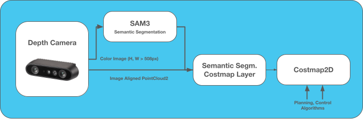
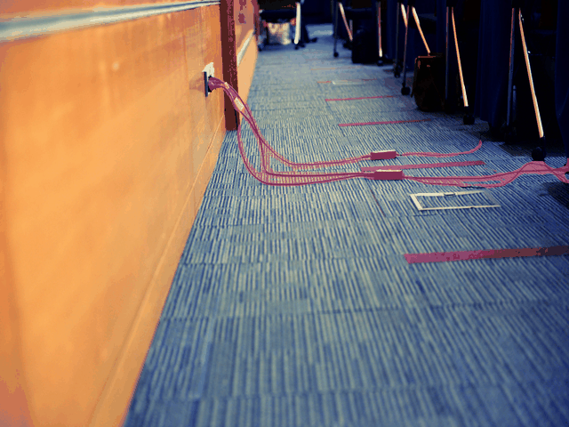

.. _sam3_navigation_on_amd_strix_halo:

Navigating with Semantic Segmentation (SAM3, AMD Strix Halo)
************************************************************

- `Overview`_
- `Why SAM3 + Why Strix Halo`_
- `Requirements`_
- `Architecture Overview`_
- `Tutorial Steps`_
- `Real-World Demonstrations`_

Overview
========

This tutorial walks through running a live, text-promptable semantic segmentation costmap for `Nav2 <https://docs.nav2.org/>`_ on the edge, using Meta's `SAM3 <https://ai.meta.com/sam3>`_ foundation model on an `AMD Strix Halo <https://www.amd.com/en/blogs/2025/amd-ryzen-ai-max-personal-ai-supercomputing-guide.html>`_. By the end you will have:

- The SAM3 inference node running on the Strix Halo's GPU and publishing high resolution per-pixel class masks at 5-10 Hz.
- A Nav2 stack configured to consume those masks through the `semantic_segmentation_layer <https://github.com/kiwicampus/semantic_segmentation_layer>`_ costmap plugin to set costs based on the terrain and/or obstacle types.
- The ability to plan and control based on semantics like terrain, small hard to see obstacles, dynamic agents, and more.

SAM3 is *text-promptable*: you tell it what to find ("person", "pallet", "wet floor sign", "curb", "mud", "ceiling", ...) and it returns masks for each class.
There is no per-class training step.
The same model handles indoor floors, outdoor terrain, bike lanes, and arbitrary obstacles, so the costmap can be re-aimed at a new environment by editing a list of strings.

.. raw:: html

   

     <iframe width="640" height="360" src="https://www.youtube.com/embed/a4E9vwTxbZE" title="YouTube video player" frameborder="0" allow="accelerometer; autoplay; clipboard-write; encrypted-media; gyroscope; picture-in-picture" allowfullscreen></iframe>
   

Why SAM3 + Why Strix Halo
=========================

Traditional perception for navigation tells you *where* obstacles are (from a depth camera or lidar), but not *what* they are or how the robot should treat them.
It also struggles with thin or low-profile objects (cables, curbs, debris, spills) and with anything beyond the effective range of the depth sensor.
Semantic segmentation fills that gap by labeling every pixel in the color image, even where depth is noisy or missing.

What's new with SAM3 is the *text prompt*.
Older segmentation networks had a fixed class list baked in at training time.
If you wanted to add a new object, you collected data and retrained.
SAM3 instead takes arbitrary string(s) describing what to segment which can also be entire sentences or phrases.
The "class list" is whatever you typed in the launch parameter, and you can change it at runtime via the ``~/change_prompt`` service.
That is a key property that makes a single model useful across warehouses, sidewalks, farms, and construction sites without retraining possible.

This turns a camera stream into a live, locally-run text/image-based segmentation of the robot's environment that Nav2 can reason about for **terrain-aware navigation**, detection of **small or otherwise hard-to-see obstacles**, **changing situational context**, and handling of **dynamic obstacles**, and much more.

* Make trade-offs in planning and control about navigating via certain surfaces over others. For example, prefer sidewalks over grass (while strictly avoiding street), prefer wide open areas over confined aisles, avoid spills or puddles where possible, etc.
* Detect small objects on the ground (i.e. cables, debris) or far away objects difficult to pick up on depth cameras or lidars important to an application, in a generalized way without having to know every possible object you may encounter
* Make decisions about the nature of the situation the robot is currently in to adjust its behavior or algorithms. For example if in confined vs open space, in an area approaching another robot/human/vehicle, or treating particular objects differently. Might be useful in behavior trees ;-)
* Find common dynamic objects without training on each specific type to remove from the static scene for dynamic tracking and/or localization improvements.
* The list goes on! If you can imagine it, it can be integrated into a behavior tree, navigation algorithm, or costmap layer. Doubly so for application-specific tasks.

Running a server-class foundation model at 5-10 Hz on a robot is the other half of the story.
The AMD Strix Halo (Ryzen AI Max+ 395) pairs an NPU and a Radeon GPU with 32 x86 cores and unified memory in a single package, so SAM3 fits and runs on the edge without an external accelerator.
That same compute is available for everything else a modern robot might want to run locally (i.e. detectors, VLMs, VLAs, LLMs, planners) without needing another GPU-forwar device.
The Strix Halo has as much CPU power as a high-end AMD laptop and as much GPU as a Jetson, married together to enable this.

Requirements
============

This tutorial assumes you already have:

- AMD Strix Halo running Ubuntu. We use the `GMKtec EVO-X2 AI Mini PC <https://www.gmktec.com/products/amd-ryzen%E2%84%A2-ai-max-395-evo-x2-ai-mini-pc>`_
- ROS 2 Jazzy or newer installed
- A robot platform with a depth or stereo camera. We use an Orbbec Gemini 355 and Intel RealSense families, but larger FOV and disparities are beneficial.
- ``conda`` / ``miniforge`` for the Python environment SAM3 runs in. Install instructions: `miniforge <https://github.com/conda-forge/miniforge>`_.

.. image:: images/semantic_strix_halo/opennav_amd_robot.png
    :width: 90%
    :align: center
    :alt: AMD Strix Halo robot platform used for semantic navigation

Architecture Overview
=====================

The pipeline takes in synchronized and aligned RGB image and pointcloud from the camera and runs SAM3 interence to produce a label mask of classes.
Then, the ``label_mask`` is resized to a lower resolution with the pointcloud to pass onto the costmap layer for processing.
It is not required to resize the label mask, but it is a common practice to reduce the computational load on the costmap layer.
There is little benefit to using a 504x504 or 1008x1008 mask in the costmap layer with ~2-5cm resolution cells for a local 3-10m horizon.
In the range or below ~400x200 is sufficient.
Finally, planning and control uses the semantically annotated costmap cells and their associated costs to impact navigation behavior to prevent navigating over certain spaces, prefer some surfaces over others, or treat particular objects uniquely.

If your sensor does not produce registered RGB + depth, ``sensor_processing_pipeline.launch.py`` can decimate and align them for you.
The SAM3 node itself only requires a color image topic as input; the costmap layer is where the registered pointcloud comes in.

The SAM3 node subscribes to the color image topic, runs detection and an optional tracker between full detections, and then publishes:

- ``~/label_mask`` (``sensor_msgs/Image``, ``mono8``) pixel value = class ID, 0 means "no detection".
- ``~/label_info`` (``vision_msgs/LabelInfo``) class ID to class name mapping for downstream consumers.
- ``~/segmentation_mask`` (``sensor_msgs/Image``, ``rgb8``) a per-class-tinted overlay of the source frame, for debugging and demos.

The semantic costmap layer takes those three pieces: the mask, the labels, and the registered pointcloud.
It projects each labeled mask pixel into 3D using the pointcloud and accumulating observations per costmap tile to set its class type.
Internally, the ``semantic_segmentation_layer`` maintains a *tile map* to store these observations over a sliding window used to populate the costmap.

Tutorial Steps
==============

0 - Clone the repository
------------------------

.. code-block:: bash

   cd <your_ros2_ws>/src
   git clone --recursive https://github.com/open-navigation/opennav_amd_semantic_navigation.git

If you already cloned without ``--recursive`` (to get the costmap layer submodule):

.. code-block:: bash

   cd opennav_amd_semantic_navigation
   git submodule update --init --recursive

1 - Install ROCm and Python dependencies
----------------------------------------

The ``opennav_sam3_inference`` package ships a one-shot setup script that installs the pinned ROCm 7.2 stack, a patched MIGraphX 2.15, an ``opennav-sam3-inference`` conda environment with ROCm-nightly PyTorch + ``onnxruntime-migraphx``, and (optionally) the model weights
That sounds like a bunch, but basically it sets up the right versions of AMD's software, AI optimization libraries, and PyTorch so that everyone plays nicely and there is no dependency hell.
You can review the setup script easily yourself to see exactly what happens.

.. code-block:: bash

   cd <your_ros2_ws>/src/opennav_amd_semantic_navigation/opennav_sam3_inference
   ./setup.sh

2 - Get the SAM3 weights
------------------------

SAM3's weights (~3.3 GB) are not redistributed with the repo and must be obtained from Hugging Face.
If you haven't already, make an account, then go to https://huggingface.co/facebook/sam3 and accept the license.
It may take a few minutes before your account permissions propagate and you can download.
Create a ``HF_TOKEN`` at https://huggingface.co/settings/tokens and login with ``hf auth login``.
Its generally advised to export this token as an environment variable to use in the future.
Finally:

   .. code-block:: bash

      hf download facebook/sam3 model.safetensors --local-dir model/sam3

3 - Build the SAM3 inference artifacts
--------------------------------------

The SAM3 model has to be compiled into ONNX/MIGraphX artifacts for the GPU.
This runs once per resolution and takes ~18 minutes for the default 504-pixel input.
You may use the full 1008 resolution, but this takes more inference time with little to no improvement in the quality of masks.

.. code-block:: bash

   conda activate opennav-sam3-inference
   cd <your_ros2_ws>/src/opennav_amd_semantic_navigation/opennav_sam3_inference

   # Single resolution (~18 min @ 504 px)
   python scripts/export/build.py --pipeline text --imgsz 504 # 1008 also optional

You will see an ``onnx_files_504/`` directory in the working directory containing the build artifacts.

Move ``model/sam3/`` and the ``onnx_files_504/`` directory to a stable location on the machine (for example ``/opt/opennav/sam3/`` or ``~/opennav-sam3-models/``).

4 - Configuration
-----------------

Edit ``opennav_sam3_inference/config/sam3_inference.yaml`` so the node knows where the weights and artifacts live:

.. code-block:: yaml

   sam3_inference:
     ros__parameters:
       checkpoint: /absolute/path/to/model/sam3              # contains the model
       onnx_dir:   /absolute/path/to/onnx_files_504          # contains the optimized ONNX files
       prompts:    ["floor", "wall"]
       class_ids:  [1, 2]
       device:     cuda                                      # correct on ROCm - PyTorch reuses CUDA names for HIP
       score_threshold:        0.5
       max_objects_per_prompt: 5
       redetect_interval_ms:   0.0
       queue_depth:            5
       start_enabled:          true

A few notes on the parameters you will tune most often:

- ``prompts`` / ``class_ids`` Each prompt becomes a class with the matching ID written into ``~/label_mask`` at every detected pixel. IDs must be in ``[1, 255]`` and unique (0 is reserved for "no detection").
- ``score_threshold`` / ``mask_threshold`` - confidence thresholds for whole detections and for per-pixel binarization.
- ``redetect_interval_ms`` - run full SAM3 detection every N milliseconds; track-only on the rest. ``0`` redetects every frame; larger values cut compute at the cost of catching new objects more slowly.
- ``max_objects_per_prompt`` - cap on simultaneously tracked instances per prompt. Excess (lowest score) are evicted so the tracker stops propagating them.

Services are exposed to enable/disable or change the prompts and class IDs at run-time.

A few prompt-design lessons worth keeping in mind:

Prompts can be long phrases that group multiple physical objects under one ID - for example ``"car, bus, plane, or motorcycle"`` is *one* prompt.
Fewer prompts run faster as SAM3 will do processing over each prompt given. Try to consolidate as much as possible or use liberal use of the prompt change service.

5 - Build the ROS 2 workspace
-----------------------------

Build the SAM3 inference package inside the conda environment so the SAM3 node picks up the right Python.
After built, you do not need to activate the conda environment again - launching the node will automatically handle the environment correctly!

.. code-block:: bash

   conda activate opennav-sam3-inference
   source /opt/ros/jazzy/setup.bash
   cd <your_ros2_ws>
   colcon build --packages-select \
       opennav_sam3_inference
   conda deactivate

You can then proceed to build the rest of the package in or out of the conda environment.
In general, I think folks would prefer not to.

.. code-block:: bash

   cd <your_ros2_ws>
   colcon build --packages-skip \
       opennav_sam3_inference

Once built, source the workspace.

.. code-block:: bash

   source <your_ros2_ws>/install/setup.bash

6 - Launch the SAM3 inference node
----------------------------------

.. code-block:: bash

   ros2 launch opennav_sam3_inference sam3_inference.launch.py \
       image_topic:=<your image topic>

Within a few seconds you should see the three topics published.
It useful to visualize the segmentation mask topic to visualize the detection overlay to see it working!

.. image:: images/semantic_strix_halo/bike_lane_camera.gif
    :width: 90%
    :align: center
    :alt: SAM3 semantic segmentation overlay on bike lane camera feed

How that we have that working, we can focus on the costmap integration to use this information.

7 - Configure Nav2 to use the layer
-----------------------------------

The ``opennav_sam3_nav_demo`` package ships a Nav2 parameter file pre-wired for the SAM3 inference node for demonstration purposes.
The interesting parts are the costmap ``plugins`` lists and the ``semantic_segmentation_layer`` blocks.

.. code-block:: yaml

   local_costmap:
     local_costmap:
       ros__parameters:
         plugins: ["semantic_segmentation_layer", "inflation_layer"]
         semantic_segmentation_layer:
           plugin: "semantic_segmentation_layer::SemanticSegmentationLayer"
           enabled: True
           observation_sources: camera
           camera:
             segmentation_topic: "/sam3_inference/resized/label_mask"
             labels_topic:       "/sam3_inference/label_info"
             pointcloud_topic:   "/sensors/camera_0/points_registered"
             observation_persistence: 0.0
             expected_update_rate:    0.0
             visualize_tile_map:      True
             use_cost_selection:      True
             max_obstacle_distance:   3.5
             min_obstacle_distance:   0.3
             tile_map_decay_time:     1.5
             class_types: ["traversable", "avoid"]
             traversable:
               classes: ["floor"]
               base_cost: 15
               max_cost:  30
               mark_confidence:     0
               samples_to_max_cost: 20
               dominant_priority:   False
             avoid:
               classes: ["wall", "large static objects like furniture, columns, carts, boxes, or trash cans", "person, dog, or cat"]
               base_cost: 150
               max_cost:  254
               mark_confidence:     0
               samples_to_max_cost: 20
               dominant_priority:   False

The global costmap uses the same layer with a slightly longer ``tile_map_decay_time`` (3.0 s) so the map persists over the larger 40x40 m window.
The demo also keeps ``visualize_tile_map: True`` so you can see the underlying tile observations in RViz.

We say that floor is some non-zero low cost for demonstration purposes, so you can see that its correctly detected and functioning properly.
The obstacle classes are then set high as potential collisions to force the planner and controller to route around them.

This demonstration intentionally disables any lidar or depth based costmap layers such as the obstacle or voxel layers to showcase vision, semantic ONLY navigation.
This is probably not optimal for a production application where semantics are useful augmentations but still want to properly avoid collisions with detectable obstacles.

8 - Launch Nav2
---------------

With the SAM3 inference node from step 6 still running in one terminal, start Nav2 in another:

.. code-block:: bash

   ros2 launch opennav_sam3_nav_demo nav2.launch.py

Open RViz, set the fixed frame, and send a Nav2Goal. With the default prompt set, you should see:

- The robot's floor tiles colored low-cost (traversable).
- Walls colored high-cost (avoid), with the planner routing around them.

.. raw:: html

   

     <iframe width="640" height="360" src="https://www.youtube.com/embed/UQdmIIM90WI" title="YouTube video player" frameborder="0" allow="accelerometer; autoplay; clipboard-write; encrypted-media; gyroscope; picture-in-picture" allowfullscreen></iframe>
   

Real-World Demonstrations
=========================

The same setup, with three different prompt configurations, applied to three classes of environment.
See the github repository for more details on the prompts and configurations used for each.
Note that these demos reveal something interesting: a technique like this can be used to effectively annotate a space during mapping to have global semantic data!

Indoor Terrain
--------------

These demos showcase detecting indoor environment navigable surfaces to know where is safe to drive

These demonstrations segments the floor simply using `"floor"` in an office environment.
It does a perfect job, essentially even mapping the freespace of the room without any fine-tuning or even sophisticated prompt engineering.
Even for outdoor uses, simply `"sidewalk cement or pavement"` covered all walkable, even if irregular surfaces without an issue.

You can do more than just two classes though to get really nice semantic information about the environment.
For example, the second demonstration segments out the `["floor", "wall", "desk", "chair", "shelf or cabinet"]` to give a much richer understanding of the environment for navigation and behavior decisions.

.. raw:: html

   

     <iframe width="640" height="360" src="https://www.youtube.com/embed/UQdmIIM90WI" title="YouTube video player" frameborder="0" allow="accelerometer; autoplay; clipboard-write; encrypted-media; gyroscope; picture-in-picture" allowfullscreen></iframe>
   

   

     <iframe width="640" height="360" src="https://www.youtube.com/embed/jL1m8J5KgRs" title="YouTube video player" frameborder="0" allow="accelerometer; autoplay; clipboard-write; encrypted-media; gyroscope; picture-in-picture" allowfullscreen></iframe>
   

Outdoor Terrain
---------------

These demos showcase detecting outdoor drivable ground surfaces (cement, pavement, sidewalk) while avoiding the street, grass and other non-navigable surfaces.
We segment human-created surfaces using ``"sidewalk, cement, or pavement"`` in a park & street-side sidewalk environment & label ``"grass or plants"`` as illegal cost to avoid.
It does well on sidewalks, blacktop, concrete pavement, and even gravel paths.

.. raw:: html

   

     <iframe width="640" height="360" src="https://www.youtube.com/embed/6vNGW-jOVkI" title="YouTube video player" frameborder="0" allow="accelerometer; autoplay; clipboard-write; encrypted-media; gyroscope; picture-in-picture" allowfullscreen></iframe>
   

   

     <iframe width="640" height="360" src="https://www.youtube.com/embed/9JsDWNHVmWg" title="YouTube video player" frameborder="0" allow="accelerometer; autoplay; clipboard-write; encrypted-media; gyroscope; picture-in-picture" allowfullscreen></iframe>
   

SAM3 does an amazing job with no fine-tuning across a huge variety of terrain types and environments, which is a game-changer for navigation in unstructured environments.
The accuracy, sharpness, and consistency of the masks is a huge step up from traditional semantic segmentation models, and the text promptability means you can segment out whatever classes are relevant to your application on Day 1!

Difficult Small Obstacles
-------------------------

The previous demos showcase terrain.
The other side of foundation-model perception is that you can ask SAM3 about specific things like cables on the floor, a puddle, a piece of debris, a low-profile pallet without training a detector for each one.
I hope these provide some motivational examples of use-cases of SAM3 to detect and avoid obstacles (or adjust robot behavior) in situations that have been traditionally difficult for robots :-)

Happy segmenting!
