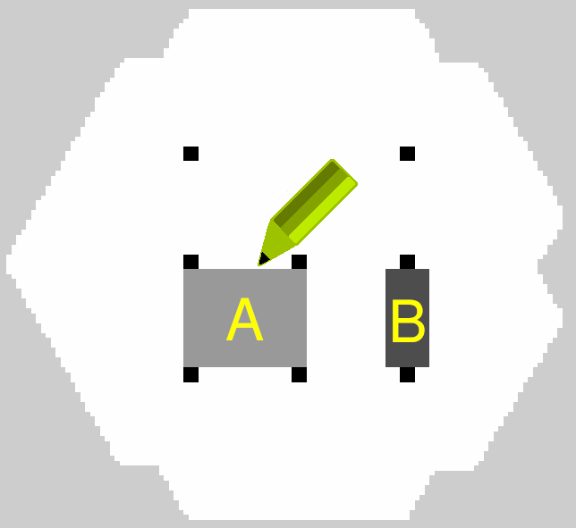
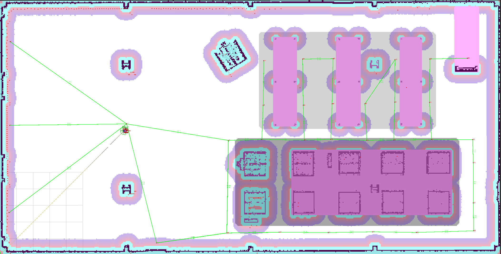

.. _navigation2_with_speed_filter:

Navigating with Speed Limits
****************************

- `Overview`_
- `Requirements`_
- `Tutorial Steps`_

.. raw:: html

    <h1 align="center">
      

        <iframe width="600" height="480" src="https://www.youtube.com/embed/gKDsBsbIem4?autoplay=1" frameborder="1" allow="accelerometer; autoplay; encrypted-media; gyroscope; picture-in-picture" allowfullscreen></iframe>
      

    </h1>

Overview
========

This tutorial shows how to simply utilize Speed Filter which is designed to limit the maximum speed of robots in speed restriction areas marked on a map. This functionality is being covered by ``SpeedFilter`` costmap filter plugin which will be enabled and used in this document.

Requirements
============

It is assumed that ROS 2, Gazebo and TurtleBot4 packages are installed or built locally. Please make sure that the Nav2 project is also built locally as it was made in :ref:`build-instructions`.

Tutorial Steps
==============

1. Prepare filter mask
----------------------

As was written in :ref:`concepts`, any Costmap Filter (including Speed Filter) is reading the data marked in a filter mask file. All information about filter masks, their types, detailed structure and how to make a new one is written in a :ref:`navigation2_with_keepout_filter` tutorial at ``1. Prepare filter masks`` chapter. The principal of drawing the filter mask for Speed Filter is the same as for Keepout Filter (to annotate a map with the requested zones), except that ``OccupancyGrid`` mask values have another meaning: these values are encoded speed limits for the areas corresponding to the cell on map.

Let's look, how it is being decoded. As we know, ``OccupancyGrid`` values are belonging to the ``[0..100]`` range. For Speed Filter ``0`` value means no speed limit in the area corresponding zero-cell on mask. Values from ``[1..100]`` range are being linearly converted into a speed limit value by the following formula:

.. code-block:: c++

  speed_limit = filter_mask_data * multiplier + base;

where:

 - ``filter_mask_data`` - is an ``OccupancyGrid`` value of the corresponding cell on mask where maximum speed should be restricted.
 - ``base`` and ``multiplier`` are coefficients taken from ``nav2_msgs/CostmapFilterInfo`` messages published by Costmap Filter Info Server (see in next chapter below).

The decoded ``speed_limit`` value may have one of two meanings:

 - Speed limit expressed in a percent from maximum robot speed.
 - Speed limit expressed in absolute values (e.g. in ``m/s``).

The meaning used by Speed Filter is being read from ``nav2_msgs/CostmapFilterInfo`` messages.
In this tutorial we will use the first type of speed restriction expressed in a percent from maximum robot speed.

.. note::

  For speed restriction expressed in a percent, ``speed_limit`` will be used exactly as a percent belonging to ``[0..100]`` range, not ``[0.0..1.0]`` range.

Create a new image with a PGM/PNG/BMP format: copy `depot.pgm <https://github.com/ros-navigation/navigation2/blob/main/nav2_bringup/maps/depot.pgm>`_ main map which will be used in a world simulation from a Nav2 repository to a new ``depot_speed.pgm`` file. Open ``depot_speed.pgm`` in your favourite raster graphics editor and fill speed restricted areas with grey colors. In our example darker colors will indicate areas with higher speed restriction:

Area "A" is filled with ``25%`` gray color, area "B" - with ``50%`` gray, that means that speed restriction will take ``100% - 25% = 75%`` in area "A" and ``100% - 50% = 50%`` in area "B" from maximum speed value allowed for this robot.
We will use ``scale`` map mode with no thresholds. In this mode darker colors will have higher ``OccupancyGrid`` values. E.g. for area "B" with ``50%`` of gray ``OccupancyGrid`` data will be equal to ``50``. So in order to hit the target, we need to choose ``base = 100.0`` and ``multiplier = -1.0``. This will reverse the scale ``OccupancyGrid`` values to a desired one. No thresholds (``free_thresh`` ``occupied_thresh``) were chosen for the convenience in the ``yaml``  file: to have 1:1 full range conversion of lightness value from filter mask -> to speed restriction percent.

.. note::

  It is typical but not a mandatory selection of ``base`` and ``multiplier``. For example, you can choose map mode to be ``raw``. In this case color lightness is being directly converted into ``OccupancyGrid`` values. For masks saved in a ``raw`` mode, ``base`` and ``multiplier`` will be equal to ``0.0`` and ``1.0`` accordingly.

  Another important thing is that it is not necessary to use the whole ``[0..100]`` percent scale. ``base`` and ``multiplier`` coefficients could be chosen so that the speed restriction values would belong to somewhere in the middle of percent range. E.g. ``base = 40.0``, ``multiplier = 0.1`` will give speed restrictions from ``[40.0%..50.0%]`` range with a step of ``0.1%``. This might be useful for fine tuning.

After all speed restriction areas will be filled, save the ``depot_speed.pgm`` image.

Like all other maps, the filter mask should have its own YAML metadata file. Copy `depot.yaml <https://github.com/ros-navigation/navigation2/blob/main/nav2_bringup/maps/tb3_sandbox.yaml>`_ to ``speed_mask.yaml``. Open ``speed_mask.yaml`` and update the fields as shown below (as mentioned before for the ``scale`` mode to use whole color lightness range there should be no thresholds: ``free_thresh = 0.0`` and ``occupied_thresh = 1.0``):

.. code-block:: yaml

  image: depot.pgm
  ->
  image: depot_speed.pgm

  mode: trinary
  ->
  mode: scale

  occupied_thresh: 0.65
  free_thresh: 0.25
  ->
  occupied_thresh: 1.0
  free_thresh: 0.0

Since Costmap2D does not support orientation, the last third "yaw" component of the ``origin`` vector should be equal to zero (for example: ``origin: [1.25, -5.18, 0.0]``). Save ``speed_mask.yaml`` and the new filter mask is ready to use.

.. note::

  World map itself and filter mask could have different sizes, origin and resolution which might be useful (e.g. for cases when filter mask is covering smaller areas on maps or when one filter mask is used repeatedly many times, like annotating a speed restricted area for same shape rooms in the hotel). For this case, you need to correct ``resolution`` and ``origin`` fields in YAML as well so that the filter mask is correctly laid on top of the original map. This example shows using the main map as a base, but that is not required.

2. Configure Costmap Filter Info Publisher Server
-------------------------------------------------

Each costmap filter reads incoming meta-information (such as filter type or data conversion coefficients) in messages of ``nav2_msgs/CostmapFilterInfo`` type. These messages are being published by `Costmap Filter Info Publisher Server <https://github.com/ros-navigation/navigation2/tree/main/nav2_map_server/src/costmap_filter_info>`_. The server is running as a lifecycle node. According to the `design document <https://github.com/ros-navigation/navigation2/blob/main/doc/design/CostmapFilters_design.pdf>`_, ``nav2_msgs/CostmapFilterInfo`` messages are going in a pair with ``OccupancyGrid`` filter mask topic. Therefore, along with Costmap Filter Info Publisher Server there should be enabled a new instance of Map Server configured to publish filter masks.

In order to enable Speed Filter in your configuration, both servers should be enabled as lifecycle nodes in Python launch-file. For example, this might look as follows, though adding them as Composition Nodes to your Navigation Component Container is also possible:

.. code-block:: python

  import os

  from ament_index_python.packages import get_package_share_directory
  from launch import LaunchDescription
  from launch.actions import DeclareLaunchArgument, GroupAction, SetEnvironmentVariable
  from launch.conditions import IfCondition
  from launch.substitutions import LaunchConfiguration, PythonExpression
  from launch_ros.actions import LoadComposableNodes, Node, PushROSNamespace, SetParameter
  from launch_ros.descriptions import ComposableNode, ParameterFile
  from nav2_common.launch import LaunchConfigAsBool, RewrittenYaml

  def generate_launch_description() -> LaunchDescription:
      # Get the launch directory
      bringup_dir = get_package_share_directory('nav2_bringup')

      namespace = LaunchConfiguration('namespace')
      speed_mask_yaml_file = LaunchConfiguration('speed_mask')
      use_sim_time = LaunchConfigAsBool('use_sim_time')
      autostart = LaunchConfigAsBool('autostart')
      params_file = LaunchConfiguration('params_file')
      use_composition = LaunchConfigAsBool('use_composition')
      container_name = LaunchConfiguration('container_name')
      container_name_full = (namespace, '/', container_name)
      use_respawn = LaunchConfigAsBool('use_respawn')
      use_speed_zones = LaunchConfigAsBool('use_speed_zones')
      log_level = LaunchConfiguration('log_level')

      lifecycle_nodes = ['speed_filter_mask_server', 'speed_costmap_filter_info_server']

      # Map fully qualified names to relative ones so the node's namespace can be prepended.
      remappings = [('/tf', 'tf'), ('/tf_static', 'tf_static')]

      yaml_substitutions = {
          'SPEED_ZONE_ENABLED': use_speed_zones,
      }

      configured_params = ParameterFile(
          RewrittenYaml(
              source_file=params_file,
              root_key=namespace,
              param_rewrites={},
              value_rewrites=yaml_substitutions,
              convert_types=True,
          ),
          allow_substs=True,
      )

      stdout_linebuf_envvar = SetEnvironmentVariable(
          'RCUTILS_LOGGING_BUFFERED_STREAM', '1'
      )

      declare_namespace_cmd = DeclareLaunchArgument(
          'namespace', default_value='', description='Top-level namespace'
      )

      declare_speed_mask_yaml_cmd = DeclareLaunchArgument(
          'speed_mask',
          default_value='',
          description='Full path to speed mask yaml file to load',
      )

      declare_use_sim_time_cmd = DeclareLaunchArgument(
          'use_sim_time',
          default_value='false',
          description='Use simulation (Gazebo) clock if true',
      )

      declare_params_file_cmd = DeclareLaunchArgument(
          'params_file',
          default_value=os.path.join(bringup_dir, 'params', 'nav2_params.yaml'),
          description='Full path to the ROS2 parameters file to use for all launched nodes',
      )

      declare_use_composition_cmd = DeclareLaunchArgument(
          'use_composition',
          default_value='False',
          description='Use composed bringup if True',
      )

      declare_container_name_cmd = DeclareLaunchArgument(
          'container_name',
          default_value='nav2_container',
          description='the name of container that nodes will load in if use composition',
      )

      declare_use_respawn_cmd = DeclareLaunchArgument(
          'use_respawn',
          default_value='False',
          description='Whether to respawn if a node crashes. Applied when composition is disabled.',
      )

      declare_use_speed_zones_cmd = DeclareLaunchArgument(
          'use_speed_zones', default_value='True',
          description='Whether to enable speed zones or not'
      )

      declare_log_level_cmd = DeclareLaunchArgument(
          'log_level', default_value='info', description='log level'
      )

      load_nodes = GroupAction(
          condition=IfCondition(PythonExpression(['not ', use_composition])),
          actions=[
              PushROSNamespace(namespace),
              SetParameter('use_sim_time', use_sim_time),
              Node(
                  condition=IfCondition(use_speed_zones),
                  package='nav2_map_server',
                  executable='map_server',
                  name='speed_filter_mask_server',
                  output='screen',
                  respawn=use_respawn,
                  respawn_delay=2.0,
                  parameters=[configured_params, {'yaml_filename': speed_mask_yaml_file}],
                  arguments=['--ros-args', '--log-level', log_level],
                  remappings=remappings,
              ),
              Node(
                  condition=IfCondition(use_speed_zones),
                  package='nav2_map_server',
                  executable='costmap_filter_info_server',
                  name='speed_costmap_filter_info_server',
                  output='screen',
                  respawn=use_respawn,
                  respawn_delay=2.0,
                  parameters=[configured_params],
                  arguments=['--ros-args', '--log-level', log_level],
                  remappings=remappings,
              ),
              Node(
                  package='nav2_lifecycle_manager',
                  executable='lifecycle_manager',
                  name='lifecycle_manager_speed_zone',
                  output='screen',
                  arguments=['--ros-args', '--log-level', log_level],
                  parameters=[{'autostart': autostart}, {'node_names': lifecycle_nodes}],
              ),
          ],
      )
      # LoadComposableNode for map server twice depending if we should use the
      # value of map from a CLI or launch default or user defined value in the
      # yaml configuration file. They are separated since the conditions
      # currently only work on the LoadComposableNodes commands and not on the
      # ComposableNode node function itself
      load_composable_nodes = GroupAction(
          condition=IfCondition(use_composition),
          actions=[
              PushROSNamespace(namespace),
              SetParameter('use_sim_time', use_sim_time),
              LoadComposableNodes(
                  target_container=container_name_full,
                  condition=IfCondition(use_speed_zones),
                  composable_node_descriptions=[
                      ComposableNode(
                          package='nav2_map_server',
                          plugin='nav2_map_server::MapServer',
                          name='speed_filter_mask_server',
                          parameters=[
                              configured_params,
                              {'yaml_filename': speed_mask_yaml_file}
                          ],
                          remappings=remappings,
                      ),
                      ComposableNode(
                          package='nav2_map_server',
                          plugin='nav2_map_server::CostmapFilterInfoServer',
                          name='speed_costmap_filter_info_server',
                          parameters=[configured_params],
                          remappings=remappings,
                      ),
                  ],
              ),

              LoadComposableNodes(
                  target_container=container_name_full,
                  composable_node_descriptions=[
                      ComposableNode(
                          package='nav2_lifecycle_manager',
                          plugin='nav2_lifecycle_manager::LifecycleManager',
                          name='lifecycle_manager_speed_zone',
                          parameters=[
                              {'autostart': autostart, 'node_names': lifecycle_nodes}
                          ],
                      ),
                  ],
              ),
          ],
      )

      # Create the launch description and populate
      ld = LaunchDescription()

      # Set environment variables
      ld.add_action(stdout_linebuf_envvar)

      # Declare the launch options
      ld.add_action(declare_namespace_cmd)
      ld.add_action(declare_speed_mask_yaml_cmd)
      ld.add_action(declare_use_sim_time_cmd)
      ld.add_action(declare_params_file_cmd)
      ld.add_action(declare_use_composition_cmd)
      ld.add_action(declare_container_name_cmd)
      ld.add_action(declare_use_respawn_cmd)
      ld.add_action(declare_use_speed_zones_cmd)
      ld.add_action(declare_log_level_cmd)

      # Add the actions to launch all of the map modifier nodes
      ld.add_action(load_nodes)
      ld.add_action(load_composable_nodes)

      return ld

where the ``params_file`` variable should be set to a YAML-file having ROS parameters for Costmap Filter Info Publisher Server and Map Server nodes. These parameters and their meaning are listed at :ref:`configuring_map_server` page. Please, refer to it for more information. The example of ``params_file`` could be found below:

.. code-block:: yaml

  speed_filter_mask_server:
    ros__parameters:
      topic_name: "speed_filter_mask"
      # yaml_filename: ""

  speed_costmap_filter_info_server:
    ros__parameters:
      type: 1
      filter_info_topic: "speed_costmap_filter_info"
      mask_topic: "speed_filter_mask"
      base: 100.0
      multiplier: -1.0

Note, that:

 - For Speed Filter setting speed restrictions in a percent from maximum speed, the ``type`` of costmap filter should be set to ``1``. All possible costmap filter types could be found at :ref:`configuring_map_server` page.
 - Filter mask topic name should be the equal for ``mask_topic`` parameter of Costmap Filter Info Publisher Server and ``topic_name`` parameter of Map Server.
 - As was described in a previous chapter, ``base`` and ``multiplier`` should be set to ``100.0`` and ``-1.0`` accordingly for the purposes of this tutorial example.

3. Enable Speed Filter
----------------------

Costmap Filters are Costmap2D plugins. You can enable the ``SpeedFilter`` plugin in Costmap2D by adding ``speed_filter`` to the ``plugins`` parameter in ``nav2_params.yaml``. The Speed Filter plugin should have the following parameters defined:

- ``plugin``: type of plugin. In our case ``nav2_costmap_2d::SpeedFilter``.
- ``filter_info_topic``: filter info topic name. This needs to be equal to ``filter_info_topic`` parameter of Costmap Filter Info Publisher Server from the chapter above.
- ``speed_limit_topic``: name of topic to publish speed limit to.

Full list of parameters supported by ``SpeedFilter`` are listed at the :ref:`speed_filter` page.

You can place the plugin either in the ``global_costmap`` section in ``nav2_params.yaml`` to have speed restriction mask applied to global costmap or in the ``local_costmap`` to apply speed mask to the local costmap. However, ``SpeedFilter`` plugin should never be enabled simultaneously for global and local costmaps. Otherwise, it can lead to unwanted multiple "speed restriction" - "no restriction" message chains on speed restriction boundaries, that will cause jerking of the robot or another unpredictable behaviour.

In this tutorial, we will enable Speed Filter for the global costmap. For this use the following configuration:

.. code-block:: yaml

  global_costmap:
    global_costmap:
      ros__parameters:
        ...
        plugins: ["static_layer", "obstacle_layer", "inflation_layer"]
        filters: ["speed_filter"]
        ...
        speed_filter:
          plugin: "nav2_costmap_2d::SpeedFilter"
          enabled: True
          filter_info_topic: "speed_costmap_filter_info"
          speed_limit_topic: "speed_limit"

As stated in the `design <https://github.com/ros-navigation/navigation2/blob/main/doc/design/CostmapFilters_design.pdf>`_, Speed Filter publishes speed restricting `messages <https://github.com/ros-navigation/navigation2/blob/main/nav2_msgs/msg/SpeedLimit.msg>`_ targeted for a Controller Server so that it could restrict maximum speed of the robot when it needed. Controller Server has a ``speed_limit_topic`` ROS parameter for that, which should be set to the same as in ``speed_filter`` plugin value. This topic in the map server could also be used to any number of other speed-restricted applications beyond the speed limiting zones, such as dynamically adjusting maximum speed by payload mass.

Set ``speed_limit_topic`` parameter of a Controller Server to the same value as it set for ``speed_filter`` plugin:

.. code-block:: yaml

  controller_server:
    ros__parameters:
      ...
      speed_limit_topic: "speed_limit"

4. Run Nav2 stack
-----------------

Ready-to-go standalone Python launch-script, YAML-file with ROS parameters and filter mask example for Speed Filter could be found in `nav2_bringup <https://github.com/ros-navigation/navigation2/tree/main/nav2_bringup>`_ directory. To run the demo, simply launch as follows:

.. code-block:: bash

  ros2 launch nav2_bringup tb4_simulation_launch.py

For better visualization of speed filter mask, in RViz in the left ``Displays`` pane unfold ``Map`` and change ``Topic`` from ``/map`` -> to ``/speed_filter_mask``.
Set the goal behind the speed restriction areas and check that the filter is working properly: robot should slow down when going through a speed restricting areas. Below is how it might look:

