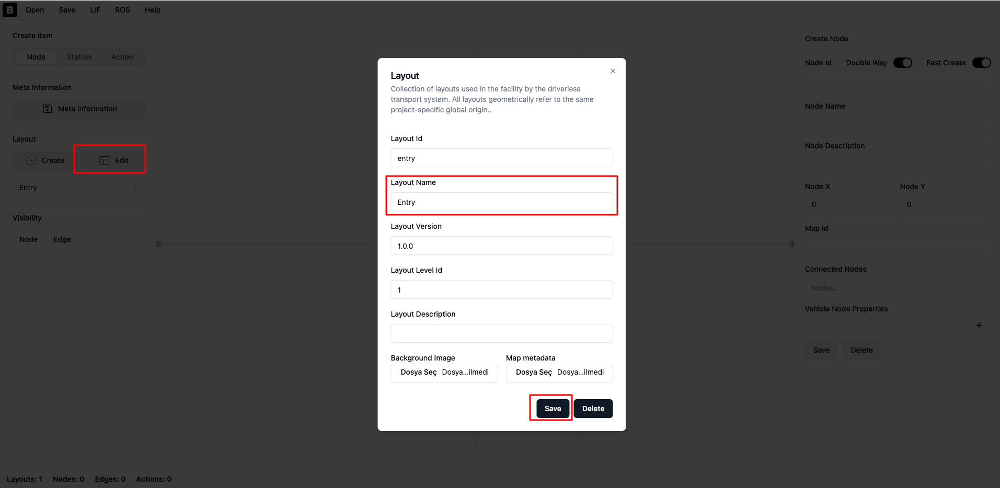
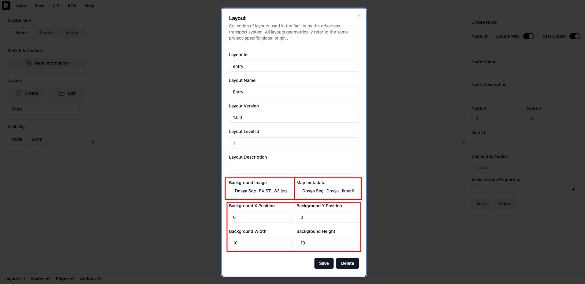
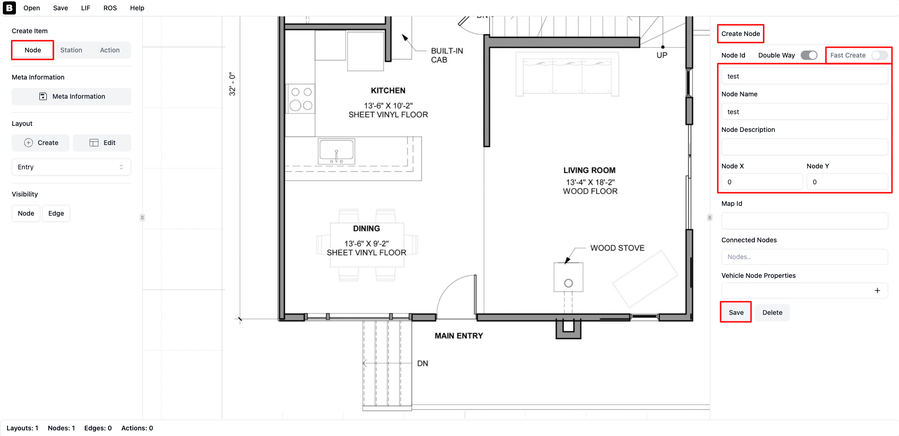
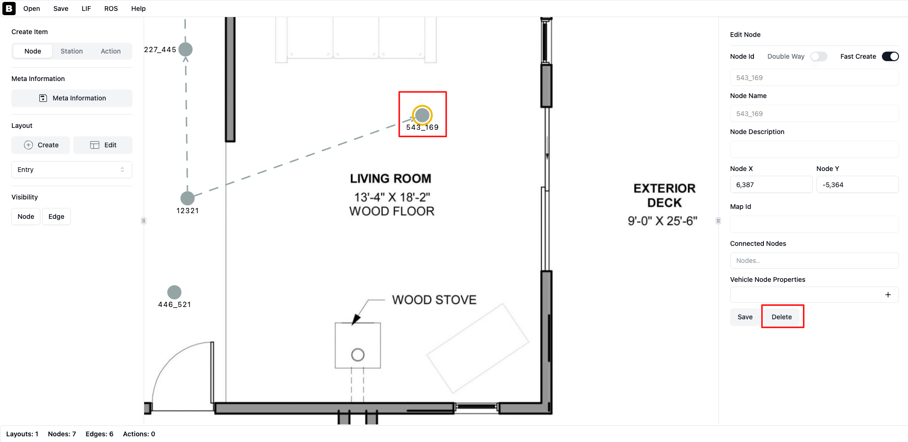
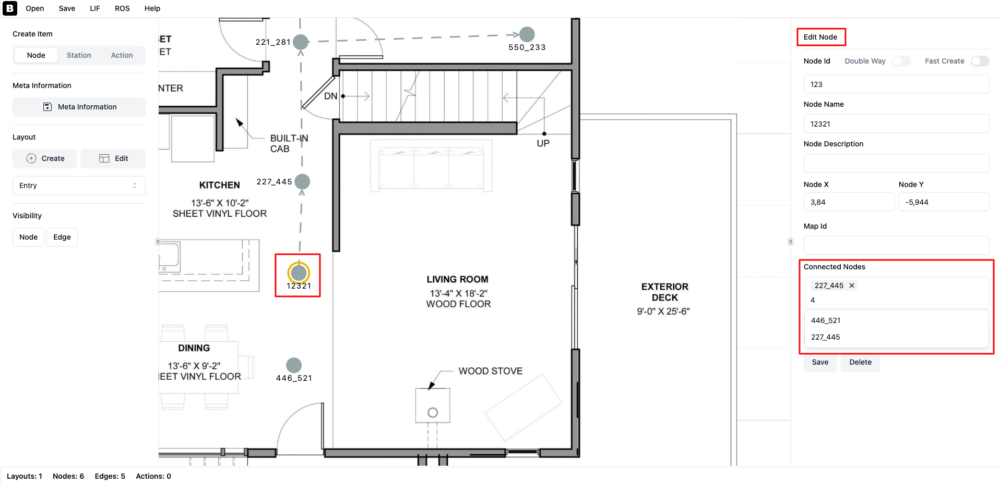
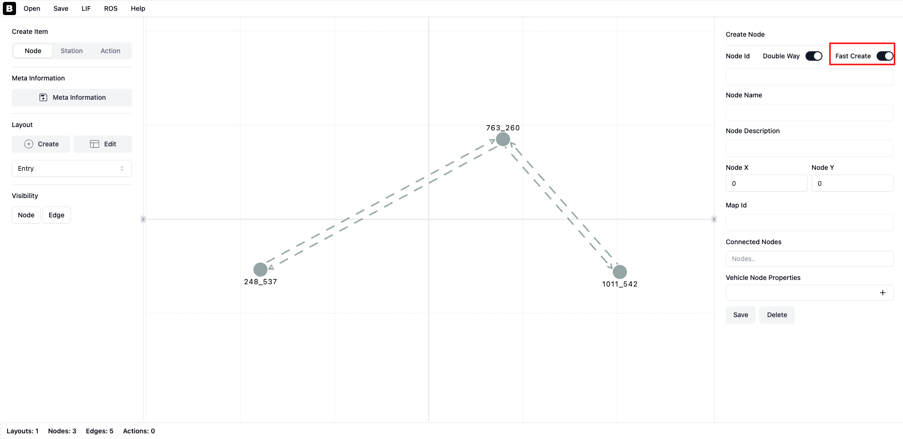
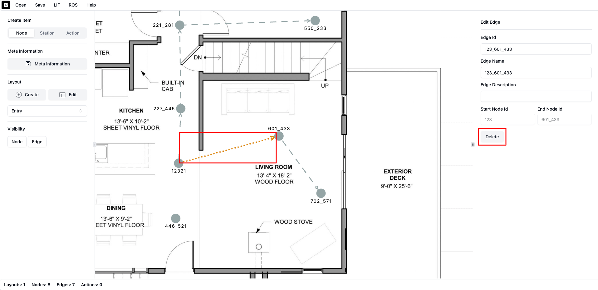
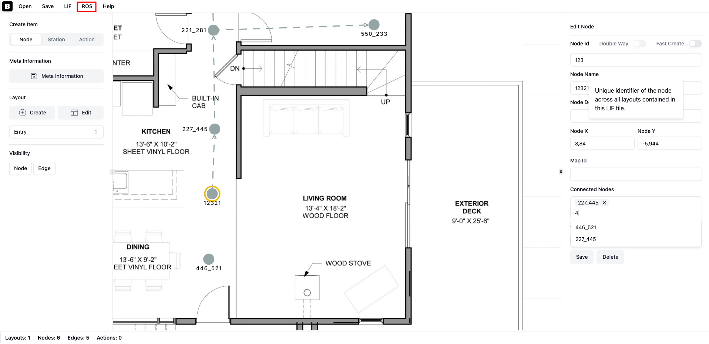
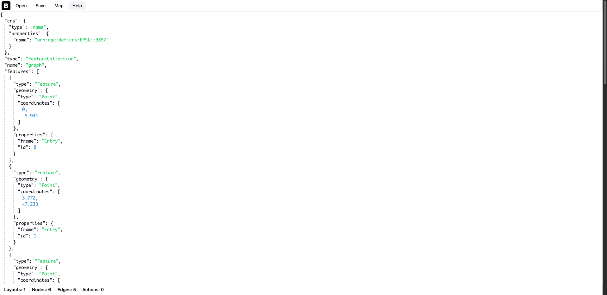
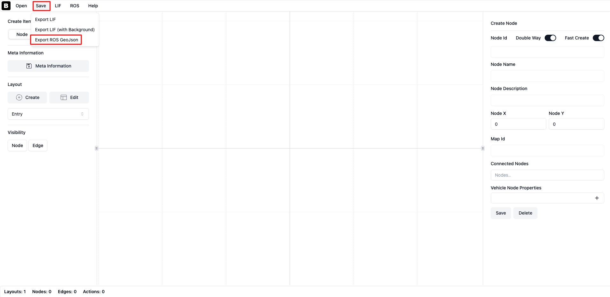

.. route_graph_generation_lif_editor_lif_editor:

Route Graph Generation LIF Editor
*********************************

- `Overview`_
- `Requirements`_
- `Tutorial Steps`_

Overview
========
A route can also be created using the **VDA LIF Editor**, a web-based open-source tool. This project was developed to present floor plans in a standardized format defined by the VDA. With the VDA LIF Editor, you can generate both GeoJSON and LIF formats simultaneously.

Website: https://vda5050-lif-editor.vercel.app/

Requirements
============
This is an online web-based tool, so no installation is required. You can use it directly in your browser.
For local installation, you can use the following link: https://github.com/bekirbostanci/vda5050_lif_editor

Tutorial Steps
==============

1. Edit Frame
-------------

Click the **'Edit'** button under the **'Layout'** section in the left sidebar. This will open a new popup where you can edit the layout name. Click the **'Save'** button to save it.

.. note::
    You can also change the layout name after creating the layout.

|

|

2. Set Up Coordinate System
---------------------------

Click the **'Edit'** button under the **'Layout'** section in the left sidebar. In the popup, upload your floor plan image using the **'Background Image'** section.
After uploading the image, four input fields will appear. Set the image width and height in meters, and specify the origin coordinates (X, Y).
The origin is the bottom-left corner of the image.
Click the **'Save'** button to save and close the popup.

.. note::
    If you don't see the image, zoom out the map and check the origin position of your image.

|

|

3. Node Operations
------------------

Add Node
~~~~~~~~
Now you can add nodes to the map. There are two ways to do this:
1. Click directly on the map to add a node. This will create a node automatically. If you want to change its properties, click on the node and edit its information in the right sidebar.
2. Click the **'Node'** button under the **'Create Item'** section in the left sidebar. This will display the **'Create Node'** section in the right sidebar. Fill in the node details and click **'Save'** to create the node.

.. note::
    If the **'Fast Create'** toggle is on, you cannot create nodes using the right sidebar (method 2). You must turn the toggle off first.

|

|

Delete Node
~~~~~~~~~~~
To delete a node, click on it (a glowing orange border will appear around the selected node), then click the **'Delete'** button in the right sidebar.

|

|

4. Edge Operations
------------------

Add Edge
~~~~~~~~
Now we can add edges to the map. There are two ways to create edges:
1. Select a node, enter the target node ID in the **'Connected Nodes'** input in the right sidebar, and select the node from the list. This will create an edge between the selected node and the target node.

|

|

2. If the **'Fast Create'** toggle is on, clicking on the map will automatically connect the new node to the previously selected node.

|

|

Delete Edge
~~~~~~~~~~~
To delete an edge, click on it (the edge color will change to orange), then click the **'Delete'** button in the right sidebar.

|

|

5. Check GeoJSON
----------------
Click the **'ROS'** menu button on the top bar to view the generated GeoJSON.

|

|

|

6. Export to GeoJSON
--------------------
You are now ready to export the node and edge layers as GeoJSON files. Click the **'Save'** button on the top bar and then select **'Export ROS GeoJSON'**.

|

|

7. Congratulations
------------------
Your graph is now ready to be used by the Nav2 route! If you want to edit the graph later, you should also export the LIF file.
Click the **'Save'** button on the top bar and select **'Export LIF'**.
To edit, reopen the LIF file in the VDA LIF Editor and make your changes. You can also re-export the LIF file as GeoJSON.

**Happy Routing!**
