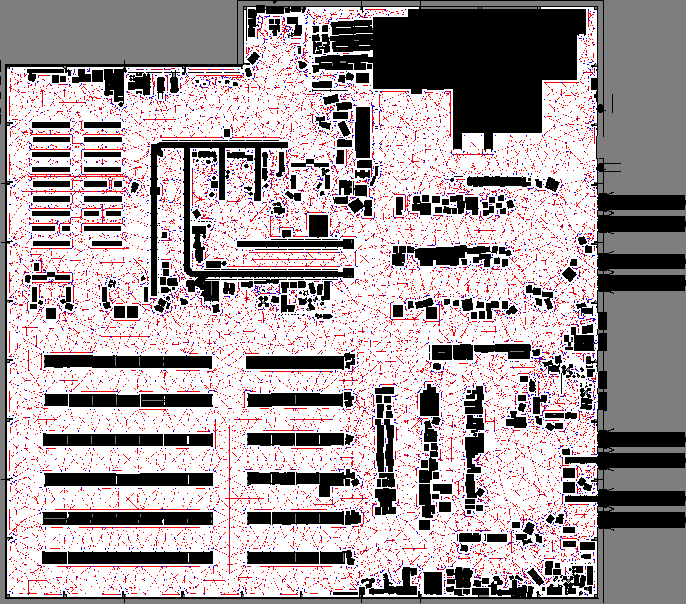

.. _route_graph_generation_swagger:

Route Graph Generation
**********************

- `Overview`_
- `Requirements`_
- `Tutorial Steps`_

Overview
========
This tutorial walks a user through generating a graph for the nav2 route server using `NVIDIA's SWAGGER  <https://github.com/nvidia-isaac/SWAGGER>`_.

Requirements
============
Follow https://github.com/nvidia-isaac/SWAGGER/ to install SWAGGER using the installation instructions in the README.

Tutorial Steps
==============

1- Generate SWAGGER Graph
-------------------------

The first step is to generate a swagger graph from a raster image of the map.
This can be done by running the ``generate_graph.py`` script located in the ``scripts``.
This will output two files, a ``graph.gml`` which contains the graph structure and a ``graph.png`` which shows a visualization of the graph overlaid on the rasted image.

.. code-block::

    python scripts/generate_graph.py \
        --map-path <path_to_map.png> \
        --resolution <meters_per_pixel> \
        --safety-distance <meters> \
        --output-dir <output_directory>

The resolution should be set as the same as in your SLAM generation of the occupancy grid map.
The safety distance is the minimum distance away from any obstacle that the graph will be generated.
When completed, the output should look similar to the following:

This process is performed by:

* Convolving the rastered image by the safety distance to create a safety mask.
* Skeletonizing the safety mask to create a skeleton of the map.
* Adding boundary nodes around the convolved obstacles.
* Placing nodes in the center areas of the map to fill space.
* Connecting edges to skeleton, center, and boundary nodes and pruning those which do not add value.

2- Convert to GeoJSON
---------------------

To work with this graph in Nav2 Route, we need to convert this to a format the Nav2 Route Server can interpret.
The SWAGGER graph format is a GML file, which is not directly usable by Nav2 Route.
Rather than creating new specialized parser plugins for Route Server, we will convert the GML file to GeoJSON format using a conversion script.
This script is located within the ``integrations/nav2/tools`` directory of SWAGGER.
It can be run as follows:

.. code-block:: python

    python integrations/nav2/tools/gml_to_geojson.py <path_to_graph.gml>

The output will be a ``graph.geojson`` file in the same directory as the input GML file.
This conversion populates the GeoJSON with the key information about the graph and ensures that each edge are bidirectional for navigation purposes.

3- Use with Nav2 Route!
-----------------------

At this point, this file is now ready to use with the Nav2 Route Server.
This can be passed onto your application using the ``nav2_bringup``'s ``graph`` CLI parameter or found by your custom launch or Nav2 configuration files.

4- Example Demonstration
------------------------

For demonstration, we're going to use the Large Warehouse map provided by SWAGGER.
This map can be found in the ``maps`` directory of the SWAGGER repository.
You can run the following command to generate the graph and convert it to GeoJSON:

.. code-block::

    python scripts/generate_graph.py \
        --map-path maps/large_warehouse.png \
        --resolution 0.05 \
        --safety-distance 0.2 \
        --output-dir graphs

    python integrations/nav2/tools/gml_to_geojson.py graphs/graph.gml

Then, we'll create a ``large_warehouse.yaml`` for the map so that we can load it into the map server:

.. code-block:: yaml

    image: large_warehouse.png
    mode: trinary
    resolution: 0.05
    origin: [0.0, 0.0, 0]
    negate: 0
    occupied_thresh: 0.65
    free_thresh: 0.25

Update the BT Navigator parameters in your Nav2 params to use a graph-based navigator for this demonstration:

.. code-block:: yaml

    bt_navigator:
      ...
      default_nav_to_pose_bt_xml: $(find-pkg-share nav2_bt_navigator)/behavior_trees/navigate_on_route_graph_w_recovery.xml
      ...

Finally, launch Nav2's Loopback simulator bringup, which uses a simple backend kinematic simulator for R&D and high level testing purposes, to avoid having to create a custom Gazebo or Isaac Sim simulation for this map:

.. code-block::

    ros2 launch nav2_bringup tb4_loopback_simulation_launch.py map:=/path/to/your/map.yaml graph:=/path/to/your/graph.geojson

.. raw:: html

  <video width="700" controls>
    <source src="../images/route_graph_generation_swagger/swagger_nav2.mp4" type="video/mp4">
    Your browser does not support the video tag.
  </video>

Happy Routing!
